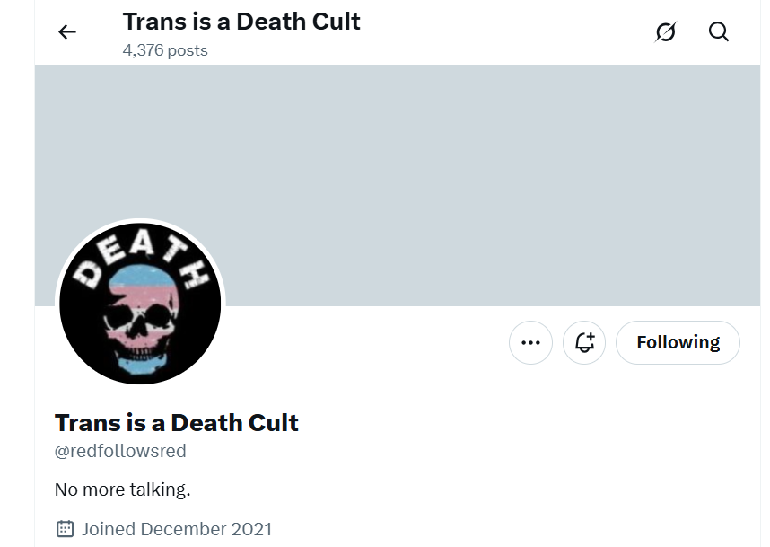

# Cyber-stalking

## Twitter and other social networks

- Accounts can be renamed, both name and account name.
- Accounts can be stripped of all content, and remade in a different way.
- One account can be duplicated into another.
- Fake accounts are available at the click of a button.
- I think there must be the following sorts of algorithms available:
    - Track {example-account} and follow with {example-sentiment} where example-account = whoever they're stalking/tracking/honey trapping, and example-sentiment can be romance, sex, fear, violence, etc.
- For honey trappers, there must be search algorithms for vulnerable accounts and you can see some of that in posts.

### Helpful notifications

- In amongst the bombardment of porn and evil intentions, someone was giving me information.
- I believe it may have been [trumpet teacher number one](../crimes/protagonists/vidal-sastre.md#the-older-slimmer-greyer-man).
- It's possible he betrayed them after [a significant event between us](../timeline/2023/march.md#dreaming-of-the-trumpet-teacher), and then they all started betraying each other.
- Certainly, they were *all* grassing each other up, and telling me everything, which was a bit silly of them, but of course they assumed I would be completely destroyed, like *all the others*, so why not.
- Anyway, fake accounts like this one had helpful info:

- I saw this account just after I [went public on X](../timeline/2023/september.md#going-public-on-twitter) and was followed by thousands of accounts of night.
- *Red follows red* in Spanish/English means *network follows network*, and I took that to mean that criminal networks on X follow each other, keeping tabs on what the competition is up to.

## Terror in Dénia

- One comes across things like this while searching online: https://www.jazznblues.es/2017/09/un-buen-blues-gambas-de-denia-y-porno.html?m=1 and wonders if all women in Dénia are under attack from the porn gangs/cyber stalkers there.
- The page is down now but here's a summary of what you could read there, apparently written by a local woman.

- It seems reasonable to assume the whole town must be being controlled and terrorized by hackers with an obvious porn obsession through threats to themselves or their children, daughters especially.
- Is this why it is so easy to drum up the significant resources required to target a lone foreign woman as I have been.
