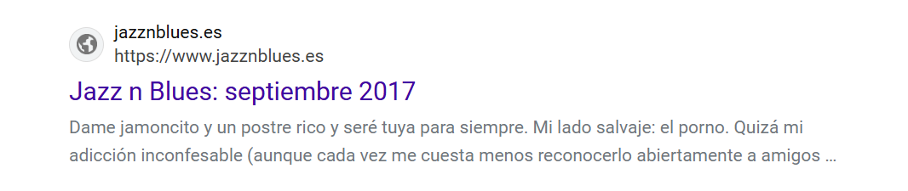

## Twitter and other social networks

- Accounts can be renamed, both name and account name.
- Accounts can be stripped of all content, and remade in a different way.
- One account can be duplicated into another.
- Fake accounts are available at the click of a button.
- I think there must be the following sorts of algorithms available:
    - Track {example-account} and follow with {example-sentiment} where example-account = whoever they're stalking/tracking/honey trapping, and example-sentiment can be romance, sex, fear, violence, etc.
- For honey trappers, there must be search algorithms for vulnerable accounts and you can see some of that in posts.

## Terror in Dénia

- One comes across things like this while searching online: https://www.jazznblues.es/2017/09/un-buen-blues-gambas-de-denia-y-porno.html?m=1 and wonders if all women in Dénia are under attack from the porn gangs/cyber stalkers there.
- The page is down now but here's a summary of what you could read there, apparently written by a local woman.

- It seems reasonable to assume the whole town must be being controlled and terrorized by hackers with an obvious porn obsession through threats to themselves or their children, daughters especially.
- Is this why it is so easy to drum up the significant resources required to target a lone foreign woman as I have been.
