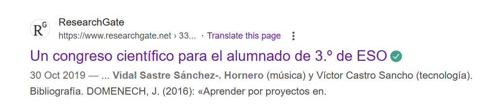

# Protagonists

This page lists the main players in the violent three-year attack on my physical, emotional, sexual, and psychological wellbeing. 

It includes teachers and staff from the conservatory of Dénia, and others.

The people involved were seasoned professionals in the gang-stalking game, and sexual grooming online and in person. Therefore, the chances of me being the only victim is *zero*. 

The chances of me being the oldest victim, at least in the conservatory system, is very high.

## Vidal Sastre Sanchez Hornero

### WIP investigation

- This is the name given to the trumpet teacher who turned up to teach class very sporadically starting at the [end of November 2022](../timeline/2022/november.md#the-trumpet-teacher).
- The bait.
- I found it hard to believe that this man's name is Vidal Sastre Sanchez Hornero, unless these criminal gangs are so arrogant and protected, they don't bother hiding themselves.
- This is the name registered in the Generalitat Valenciana systems, even today. 
- Curiously a government official told me no record of the person could be found at the same time I was looking at his name on official Generalitat government lists.

- He is apparently the director of a [band in Valencia](https://www.lamistatquart.com/) and this fits with his original story.
- There are a bunch of references for the name online, including references which come from the Generalitat's formal lists of teachers.

- It's hard to believe there's no reference for him. He may have been working unofficially with the conservatory of Dénia, but they gave him a pension while doing so.
- Online references include a number of pictures of the man who turned up to teach classes.

- It's not clear if the man below is the same man as in the previous pictures, but I recognize him too.

- The pictures show the man who taught the class on Monday evenings that I attended. At least, I look at all these pictures and remember them as being the "trumpet teacher" who turned up to class sporadically on Mondays.
- But there are another bunch of pictures of this person who look like someone completely different to the men above.

- I recognize this man too as being the "trumpet teacher" that took classes on a Monday evening.
- While I'm writing out my statement, I realize with horror there is more than one trumpet teacher.
- Another picture I recognized as him was from [the video of another girls "funeral"](../content/images/youtube-video.png) I had found in June 2023, in Dublin, when I was severely traumatized after the events of [12th June 2023](../timeline/2023/june.md#monday-12th-june-2023).
- However, on looking at these pictures, I believe I remember another man, who looked dissimilar again. 
- If this is true, seemingly I became confused about these people being the same person, probably because I was [on drugs without my knowledge](../timeline/2023/january.md#serious-poisoning-at-chamber-music-class), and probably because the online NLP/hypnosis hypno-tech was set up with that intention.
- Curiously, online face comparison tools say that none of the above pictures are of the same person.

!!! tip "What?"
    - I know, this sounds crazy, but it's possible.
    - Imagine you have control of a person by giving them psychoactive and mood altering substances over long periods and they are unaware of it.
    - Now you can set up a situation in which you have two, or more, people swapping the same role from time to time, so as to confuse the person into relating multiple people as the same one person.
    - Add to this, root access to the target's online activity, with the ability to flash whatever images you like up for subliminal stimulation.
    - I believe this happened to me, as the men in the pictures above are extremely dissimilar to each other, *and* to another man I remember taking the class from time to time.
    - And now, I'm wondering if all the pictures of Vidal Sastre Sanchez Hornero that I personally recognize are of a number of different people.
    - If a group of men wanted to groom unwitting young girls, and get away with it, how better than to never be the same person the young girls see twice.
    - Even better if there is intimate activity with the target without her knowledge. The body, and mind under sedation, always remembers something.
    - Anyone making a complaint would be easily dismissed, not least because everyone else is aware there is a target and what's happening to her, and that this is protected by the highest authority of the land.
    - And if they really wanted to make sure she was confused about what she was seeing, they might try to blind her, perhaps with low-level continuous methanol doses direct into the water supply at her apartment, or if she's really feisty why not just spray all her clothes and belongings in high dose pesticides.

- Did Pablo ask the trumpet teacher when he turned up [where the other guy was](../timeline/2023/january.md#chamber-music-classes-continue)?
- One of my suspicions now is that this name probably relates to a group of criminals who control women by drugging them whilst having full root access to their online devices and using some sort of social media hacking app which can change the timeline or the UI with ease. 
- It's not such an advanced piece of software, actually, and would just mean having some AI tool ready to rewrite the HTML on a target's machine with specific messages or pictures.
- In the past, sexually coercive behavior like this would usually be undertaken by pimps and perverts with the end goal of enticing and trapping women in the sex "industry" and this is certainly in keeping with the content the gangs shared with me online, such as [the pictures of the lady who went from innocent girl to hardcore porn activity](../timeline/2024/august.md#photos-of-abused-women-and-girls).
- In the past, this bait-and-switch activity would have been undertaken directly in physical settings, clubs and societies, bars, etc., and of course still is.
- However, the sexual coercion techniques used in Dénia and the region has taken a new and extremely troubling turn.
- Criminals and other bad actors are now able to access a person's private home network and devices in a remarkably easy way. From there, malicious actors can monitor and control all online activity, paying close attention to finances and anything incriminating.

!!! danger "Would anyone want to live here if they knew how much danger the wealthy, elderly, women and children are in?"
    - Visitors to the region should be warned that it is highly likely their online activity will be monitored very closely by locals.
    - Visitors should expect that to happen and act accordingly.
    - Even 4g/5g mobile networks, without access to wifi routers, are vulnerable.

- With such access, criminals can manipulate and intimidate a woman or child via their social media and other online activity.
- Is this how children are being coerced online into sending sexually explicit pictures of themselves for a pedophile porn market?
- If a target is physically present, and being drugged as well, like perhaps the [flautist in this video](../timeline/2023/june.md#youtube), then it is highly likely they will eventually suffer a sedated sexual assault, or be manipulated into something apparently consensual, and then be put on porn networks without their consent.
- Here's another reference to a "funeral" or "sale" of a groomed young woman from the band in Valencia.

- "Se la rifaron" means, they sold her off.
- Notice at a certain point in the performance, the trumpet player plays in a very sexually suggestive manner, *stripper style*.
- These people are not hiding, but I believe they are drugging and sedating women and girls, and not just here, probably all over the region wherever adult men have unrestricted access to women, teenage girls, and younger.
- Wherever VSSH has been listed as teaching in the Generalitat Valenciana region, could a young girl or woman be in danger?
- I have seen this name listed in Castellon, Bunol, Alicante, amongst other places.
- I thought maybe that *Vidal Sastre Sanchez Hornero* was the name of one, and only one, of the gang. Now I'm thinking that, perhaps, it is a collection of four of the gang's surnames.
- There will be some sick reason for the choice of name.
- It was not the name of the man, or men, who came to teach class to me and Pablo; one of whom I am led to believe is called Antonio Ruiz.
- Could Antonio have been simply used as bait for a sinister sex gang operating and controlling the region's conservatories?
- Were his children in danger of kidnap, as he suggested online to me at one point?
- Whoever these people are, they are proud of their behavior, and arrogant enough to showcase their "controlling young girls" activity on [YouTube](https://www.youtube.com/@saxofonator/search?query=vidal%20sanchez%20sastre%20horneros).
- It appears that all attacks, or "funerals" of women are videoed and shared, and certainly my "funeral" on [12th June 2023](../timeline/2023/june.md#monday-12th-june-2023), was excitedly recorded on the mobile phones of all present, including teachers, staff, and students.

!!! danger "Shocking"
    - If I'm right about this, then the children of the conservatory would also have to be somewhat complicit in the deception and targeting of female students by countless adult males and their female assistants.
    - This is a somewhat horrific thing to consider and I do hope it is not true but given statistics like all 11-year-old boys have seen pedophile gang rape porn and worse, usually in school on their mates' phones, then nothing would surprise me anymore.

- Is it possible that what is a well-known and much loved Spanish tradition of destroying single women or girls for fun now a countrywide porn business making millions for porn distribution gangs; each girl delivered up at the appropriate time?
- Given the whole town of Dénia knows of pedophile rape-gang porn I was in from 1989, and doesn't seem to think that is a crime worth reporting, is it possible they know the details of 1000s of crimes against women and girls?

### A second opinion

- Another version of events is that if this person, having the name Vidal SSH, *is* one of the men in the pictures above, he may have been set up to be the fall-guy if anything went wrong in the original plan.
- His attendance at the conservatory could have been a cover for the other man, a known criminal from the local area.
- In this scenario, and following a recent tip from a reliable anonymous source, I was informed that one of the men in the pictures above was under investigation for sexual grooming at the time he visited the conservatory in 2022/23.
- If this is true, and the [pictures and videos](../timeline/2023/june.md#youtube) made very public do seem to suggest he was involved in some sort of grooming gang scenario, then could the criminal porn gangs have needed someone to play a part to hide the fact that real pimps and pornographers were entering the conservatory freely to do whatever they liked?
- And who better than someone already under suspicion for similar crimes?
- What a hell these poor people are living in!

## The *other* trumpet teacher

- The man in any of the pictures above is only half (or a quarter) of the man I remember.
- While I was still being drugged, in late Autumn of 2023, I thought he had a [twin brother](../timeline/2023/december.md#the-trumpet-teacher-has-a-brother) called Malachi. I mentioned this in an earlier draft (commit) of this document. I said "the brother made himself known to me one evening when I walked through the tunnel during the intensive gang stalking."
- He had been set up to walk past the tunnel entrance at the road just as I was walking out so that I would see him.
- I did see him and I ran up behind him before crossing the road. And he flinched.
- He looked exactly like the trumpet teacher, but different. So I called him a twin brother. I was certain he was the twin brother and by that time I was so used to this constant torment, every day there was some nasty little set up "event" designed to terrorize and upset me, that it seemed a reasonable thing for them to do.
- I now wonder about this apparent "twin" and whether this particular incident was set up to continue to remind me of what the man in the pictures above looked like because I had not behaved as expected, I had continued to attend classes at the conservatory so the trick had to continue.
- I had assumed the man was a twin because he was *NOT AT ALL* like the man I had seen a number of times, such as the man who [turned up at the airport](../timeline/2023/june.md#sunday-18th-june-alicante-airport), or the man who had also [attended classes at the conservatory](../timeline/2023/february.md#observations-on-the-trumpet-teacher), or the man who had me pointed out to him by Patricia in [Benijembla](../timeline/2022/november.md#walking-in-benijembla-with-the-english-ladies) and who had been at [the first chamber music class](../timeline/2022/december.md#chamber-music-classes) the following week. This first man was the one I [mostly dreamt about](poisoning.md#dreams-and-visions).
- Had both these men been at that first class?
- As I write this section and think of these two men, the initial man that Patricia pointed me out to, and the deep set, older-looking twin, are indeed very very different in appearance.
- Had they wheeled out this original person from Valencia just to keep his face in my head (although by that time, some of the trick had worn off, i.e. I had forgotten him mostly and thought he was a twin brother instead of the real thing).
- Patricia, when I asked her how she knew Vidal, said "who"? But it's clear she knows who, at least one of these other men is, but perhaps not the man I thought was the brother or any of the men in the pictures above.
- During more recent stalking events when I was still clearly under the influence of mind-altering substances, and even though I had been away from Dénia for a while (which begs the question as to how anyone was managing to drug me or whether I carried it with me from home in my toiletries), the trumpet teacher posing as a hacker suggested to me there was a brother and a sister and sent [pictures](../timeline/2024/august.md#the-trumpet-teacher-pics). 
- I was convinced the brother was called Andrew, a clearly younger brother with blond hair, but I couldn't understand why none of the pictures looked like there were twins and in fact the older brother, and the younger man which at the time of writing is still rendering on my Google searches, look like no-one I have seen before! At least not consciously.
- In any case, serious investigators will know immediately who all of these people are, as will the whole town know who the main players are.
- Here is one of the VSSH team playing the trumpet.

- And here is an AI mix of one of the above and Gloria the receptionist.

- Symbols and memes related to the trumpet teacher during the cyber stalking are horses, Trump, and more. I'll add these to the [memes section](../memes-triggers/memes.md) at some point as I go through all the material.

## The hacker

- Clearly, I have been targeted by industrial-scale criminal hacking expertise that includes men local to Dénia.
- Initially I thought it was just one person who was close to the trumpet teacher and speaking for him.
- I did find a reference to someone who might be of interest.

- His twitter is here: https://x.com/viccassan82.
- He looks a lot like this guy too: https://x.com/csonnyb/photo an account the stalked me from October 2024.
- I believe there's a team probably working on numerous porn targets at any one time. 
- My situation just spilled out into public because I refused to give into them. 

## Domingo Lopez Cano

- Domingo Lopez Cano was my piano teacher in [2014](../timeline/early-years/2014.md).
- I met him first at the [conservatory audition](../timeline/early-years/2014.md#conservatory-audition).
- Here he is in the summer of 2016, just after I left Dénia as I started to suffer from depression related to [going to the police about my experience in 1989 of sexual abuse by rape gangs in North London](../timeline/early-years/2015.md#statement-to-the-metropolitan-police).

- I wonder if the older woman to his right is his mother?
- And I wonder who the young woman he is with is? Could she be another target?
- Is this article from the [local online newspaper](https://www.denia.com/ramon-garcia-soler-hace-vibrar-la-plaza-del-consell-en-el-concierto-de-musica-festera-de-la-banda-de-denia/26-concierto-agrupacio-artistica-musical-denia-moros-y-cristianos-2016-escuadras-en-el-publico) actually an advertisement where the young lady is the product on sale?
- The name "Cano" relates to all things canine and "Lopez" to all things wolverine. While I was being stalked and terrorized online, there were a lot of references to these animals, and particularly when the stalking took a more seriously threatening or abusive turn.
- Indeed, dogs featured constantly in the online harassment and threats.
- Here's a fake X account pic that communicated with me during the [March 2024 intensive online psychological abuse](../timeline/2024/march.md#a-serious-attack-on-my-wellbeing-from-piano-teachers-at-denia-conservatory) of him as an older person.

{width=35%}

### Carmen Lopez Cano

- Carmen is Domingo's sister.
- I believe she ran many of the fake accounts that terrorized me, along with Hazel and Sandra Smith.
- A picture of her was posted on my Google searches which I screen shot in April.

- It's not clear who was passing me this information.
- I have never met Carmen Cano but it's obvious that the picture of this woman has been merged with the face of Domingo the piano teacher.
- I have another picture of her from a body cam I was wearing on 5th October 2024. I went out without my mobile phone to go for a walk along Las Rota in Dénia. I didn't want to be followed and tracked, but I wanted to still have means to call the police, so I brought my [analogue phone that I had bought in April](../timeline/2024/april.md#i-get-an-orange-sim). As I approached the restaurant Sendra, a woman cycles up behind me, then in front of me; she stops, smiles, and cycles off. I believe it was Carmen Cano and I would recognize her again. She looked a lot like the pics I have just posted and possibly a blond woman who plays in the L'Amistat band. 

!!! info
    - It appears even 2g/3g phones are trackable by these people.

- On 1st November, the same woman is leaving my apartment building with another dark haired lady; a woman I have often seen going in and out of apartment number 18 next door to me since I got back to Dénia from France at the end of September 2024. It could have been the older woman in the picture above from 2016, except with darker hair.

## Accomplices

### Paqui Fornet Pastor

### Gloria the receptionist

### Ana Requena 

### Other teachers and students to a greater or lesser degree

- Maria Hontanilla, my piano teacher during year 3 of professional piano.

- Esteve the chamber music teacher in year 4. 

- Alfonso the harmony teacher in year 4.

!!! info 
    - Placeholder for more.

## Hazel and Sandra Smith

- Mentioned in [early days content](../timeline/early-years/2007.md#hazel-smith).

    !!! info
        - Details of the Channel 4 documentary featuring these two coming up soon.

- We must ask the question that, given the UK police must have known who and what these two are capable of, and where they went, why were they permitted to freely take control of a small area of Spain without any sort of restraint?

## Twitter accounts of note

- `@jctot19`: I believe this must be the trumpet teacher's account although could be being controlled/managed by others too.
- `@sinremite`: I believe this is Carmen Cano's account.

## Everyone else functioning as introduction agents of some sort

- Members of the Javea Computer Club.
- Members of expat walking groups.
- Klara Sarkadi singing teacher and leader of the Orfeo de Denia choir.
- Old (apparent) friends in Dénia.
- The whole town of Dénia who were clearly lied to about why I had been targeted and so felt justified in joining in the fun. 
- The only other option is that the town of Dénia is controlled by pure evil.
