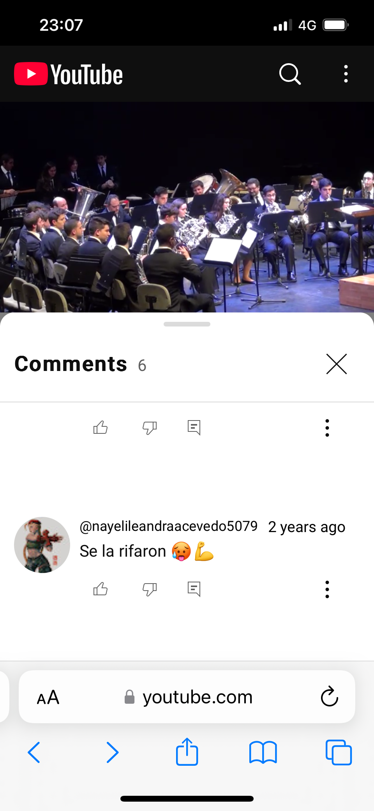
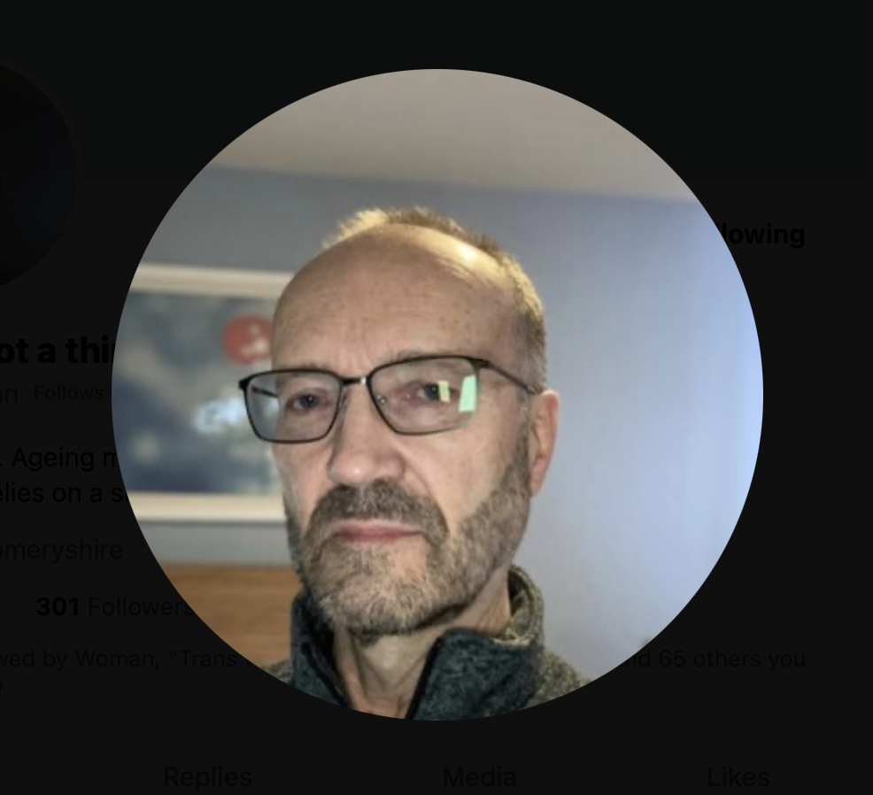

This page lists the main players in the violent attack on my physical, emotional, and psychological wellbeing. 

It includes teachers and staff from the conservatory of Dénia, and others.

The people involved were seasoned professionals in the gang-stalking game, and the chances of me being the only victim is *zero*. 

The chances of me being the oldest victim, at least in the conservatory system, is very high.

## Vidal Sastre Sanchez Hornero

- This is the name given to the trumpet teacher who turned up to teach class very sporadically starting at the [end of November 2022](../timeline/2022/november.md#the-trumpet-teacher).
- I have not found it believable that this man's name is Vidal Sastre Sanchez Hornero, unless these criminal gangs are so arrogant and protected, they don't bother hiding themselves.
- This is the name registered in the Generalitat Valenciana systems.
- He is apparently the director of a [band in Valencia](https://www.lamistatquart.com/) and this fits with his original story.
- There are a bunch of references for this name online, including references which come from the Generalitat's formal lists of teachers.

- The references include a number of pictures of the man who turned up to teach classes.

- This is, indeed, the man who taught the class on Monday evenings that I attended.
- However, I remember another man who looked dissimilar but seemingly I became confused about them being the same person, probably because I was [on drugs without my knowledge](../timeline/2023/january.md#poisoning), and probably because the situation was set up with that intention.

!!! tip "What?"
    - I know, this is crazy, but it's possible.
    - Imagine if you have control of a person by giving them psycho-and-mood altering substances and they are unaware of it.
    - Now you can set up a situation in which you have two people swapping the same role from time to time, so as to confuse the person into relating the two people as the same one person.
    - I believe this happened to me, as the man in the pictures above is very dissimilar to another man I remember taking the class from time to time.

- One of my suspicions now is that this name probably relates to a group of criminals who control women by drugging them whilst having full root access to their social media activity.
- In the past, sexually coercive behavior like this would usually be undertaken by pimps and perverts with the end goal of enticing and trapping women in the sex "industry" and this is certainly in keeping with the content the gangs shared with me online, such as [the pictures of the lady who went from innocent girl to hardcore porn activity](../timeline/2024/august.md#photos-of-abused-women-and-girls).
- In the past, this would have been undertaken directly in physical settings, clubs and societies, bars, etc., and still is.
- However, the sexual coercion techniques used in Dénia and the region has taken a new and extremely troubling turn.
- Criminals and other bad actors are now able to access to a person's private home network and devices in a remarkably easy way. From there, malicious actors can monitor all their online activity, paying close attention to finances and anything incriminating.

!!! danger "Would anyone want to live here if they knew how much danger the wealthy, elderly, women and children are in?"
    - Visitors to the region should be warned that it is highly likely their online activity will be monitored very closely by locals.
    - Visitors should expect that to happen and act accordingly.
    - Even 4g/5g mobile networks, without access to wifi routers, are vulnerable.

- With such access, criminals can manipulate and intimidate a woman or child via their social media and other online activity.
- If they are being drugged as well, like perhaps the [flautist in this video](../timeline/2023/june.md#youtube), then it is highly likely the target will eventually suffer a physical sexual, or be manipulated into something apparently consensual, and then be put on porn networks without their consent.
- Here's another reference to a "funeral" or "sale" of a groomed young woman from the band in Valencia.

- "Se la rifaron" means, they sold her off.
- I do not believe Vidal Sastre Sanchez Hornero is the trumpet teacher's name under these circumstances, although it is possible he is part of this group.
- Whoever these people are, they are proud of their behavior, and arrogant enough to showcase their "controlling young girls" activity on [YouTube](https://www.youtube.com/@saxofonator/search?query=vidal%20sanchez%20sastre%20horneros).
- It appears that all attacks, or "funerals" of women are videoed and shared, and certainly my "funeral" on 12th June 2023, was excitedly recorded on the mobile phones of all present.

### A second opinion

- Another version of events is that this person, having the name Vidal SSH, *is* the man in the pictures above, and he was set up to be the fall-guy if anything went wrong in the original plan.
- His attendance at the conservatory could have been a cover for the other man, a known criminal from the area.
- In this scenario, and following a recent tip from a reliable anonymous source, I was informed that the man in the pictures above was under investigation for grooming at the time he visited the conservatory in 2022/23.
- If this is true, and the [pictures and videos](../timeline/2023/june.md#youtube) made very public do seem to suggest he was involved in some sort of grooming gang scenario, then could the criminal porn gangs have simply needed someone to play a part to hide the fact that real pimps and pornographers were entering the conservatory freely to do whatever they liked.
- And who better than someone already under suspicion for similar crimes?

## The *other* trumpet teacher

- The man in the pictures above is only half the man I remember.
- While I was still being drugged, I thought he had a [twin brother](../timeline/2023/december.md#the-trumpet-teacher-has-a-brother) called Malachi. I mentioned this in an earlier draft (commit) of this document. I said "the brother made himself known to me one evening when I walked through the tunnel during the intensive gang stalking in December 2023."
- He had been set up to walk past the tunnel entrance at the road just as I was walking out so that I would see him.
- I did see him and I ran up behind him before crossing the road. And he flinched.
- He looked exactly like the trumpet teacher, but different. So I called him a twin brother. I was certain he was the twin brother and by that time I was so used to this constant torment, every day there was some nasty set up "event" for me, that it seemed a reasonable thing for them to do.
- I now wonder about this apparent "twin" and whether this particular incident was a set up to continue to remind me of what the man in the pictures above looked like because I had not behaved as expected and the trick had to continue.
- I had assumed the man was a twin because he was *NOT AT ALL* like the man I had seen a number of times, such as the man who [turned up at the airport](../timeline/2023/june.md#sunday-18th-june-alicante-airport), or the man who had also [attended classes at the conservatory](../timeline/2023/february.md#observations-on-the-trumpet-teacher), or the man who had me pointed out to him by Patricia in [Benijembla](../timeline/2022/november.md#walking-in-benijembla-with-the-english-ladies) and who had been at [the first chamber music class](../timeline/2022/december.md#chamber-music-classes) the following week.
- Had both these men been at that first class?
- Patricia, when I asked her how she knew Vidal, said "who"? But it's clear she knows who this other man is, but perhaps not the man I thought was his brother or the man in the pictures above. Or maybe she said "who" because it's not his name?
- During other aspects of the stalking, the trumpet teacher posing as a hacker suggested to me there was a brother and sent pictures. I was convinced the brother was called Andrew but couldn't understand why the pictures didn't look like a twin!
- In any case, serious investigators will know immediately who this person is as does the whole town.
- Here he is playing the trumpet, except now I wonder about this and whether this was a fairly close likeness to the other guy.

- And here is an AI mix of him and Gloria the receptionist.

- Symbols and memes related to him during the cyber stalking are horses, Trump, and more. I'll add these to the [memes section](../memes-triggers/memes.md) at some point.

## Domingo Lopez Cano

- Domingo Lopez Cano was my piano teacher in [2014](../timeline/early-years/2014.md).
- I met him first at the [conservatory audition](../timeline/early-years/2014.md#conservatory-audition).
- Here he is in the summer of 2016, just after I left Dénia as I started to suffer from depression related to [going to the police about my experience in 1989 of sexual abuse by rape gangs in North London](../timeline/early-years/2015.md#statement-to-the-metropolitan-police).

- I wonder if the older woman to his right is his mother?
- And I wonder who the young woman he is with is? Could she be another target?
- Is this article from the [local paper](https://www.denia.com/ramon-garcia-soler-hace-vibrar-la-plaza-del-consell-en-el-concierto-de-musica-festera-de-la-banda-de-denia/26-concierto-agrupacio-artistica-musical-denia-moros-y-cristianos-2016-escuadras-en-el-publico) actually an advertisement where the young lady is the product on sale?
- The name "Cano" relates to all things canine and "Lopez" to all things wolverine. While I was being stalked and terrorized online, there were a lot of references to these animals, and particularly when the stalking took a more serious threatening or abusive turn.
- Indeed, dogs featured constantly in the online harassment and threats.
- Here's a fake X account pic that communicated with me during the [March 2024 intensive online psychological abuse](../timeline/2024/march.md#a-serious-attack-on-my-wellbeing-from-piano-teachers-at-denia-conservatory) of him as an older person.

{width=35%}

### Carmen Lopez Cano

- Carmen is Domingo's sister.
- I believe she ran many of the fake accounts that terrorized me, along with Hazel and Sandra Smith.
- A picture of her was posted on my Google searches which I screen shot in April.

- It's not clear who was passing me this information.
- I have never met Carmen Cano but it's obvious that the picture of this woman has been merged with the face of Domingo the piano teacher.
- I have another picture of her from a body cam I was wearing on 5th October. I went out without my mobile phone to go for a walk along Las Rota in Denia. I didn't want to be followed and tracked, but I wanted to still have means to call the police, so I brought my [analogue phone that I had bought in April](../timeline/2024/april.md#i-get-an-orange-sim). As I approached the restaurant Sendra, a woman cycles up behind me, then in front of me, she stops, smiles, and cycles off. It was Carmen Cano for sure. She looked a lot like the pics I have just posted. 

!!! info
    - It seems like even 2g phones are trackable by these people.

- On 1st November, the same woman is leaving my apartment building with another dark haired lady; a woman I have often seen going in and out of apartment number 18 next door to me since I got back to Denia from France at the end of April. It could have been the older woman in the picture above from 2016, except with darker hair.

## Paqui Fornet Pastor

## Gloria the receptionist

## Ana Requena 

## Other teachers to a greater or lesser degree

## Hazel and Sandra Smith

!!! info
    - Details of the Channel 4 documentary featuring these two coming up soon.

## Twitter accounts of note

- `@jctot19`: I believe this must be the trumpet teacher's account although could be being controlled/managed by others too.
- `@sinremite`: I believe this is Carmen Cano's account.

## Everyone else

- Members of the Javea Computer Club.
- Members of expat walking groups.
- Old (apparent) friends in Denia.
- The whole town of Denia who were lied to about why I had been targeted and so felt justified in joining in the fun.
