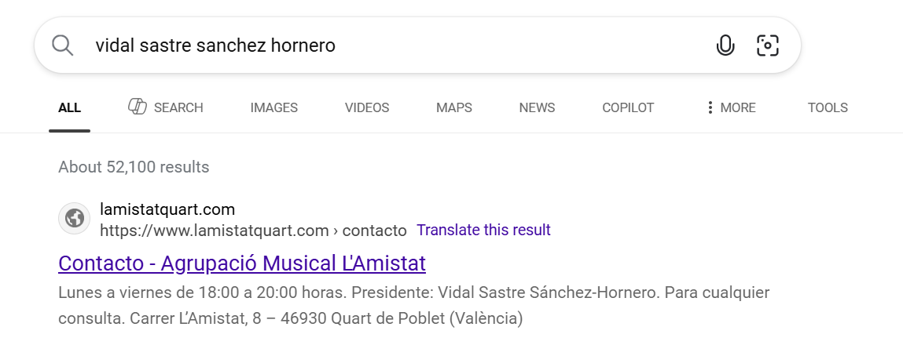
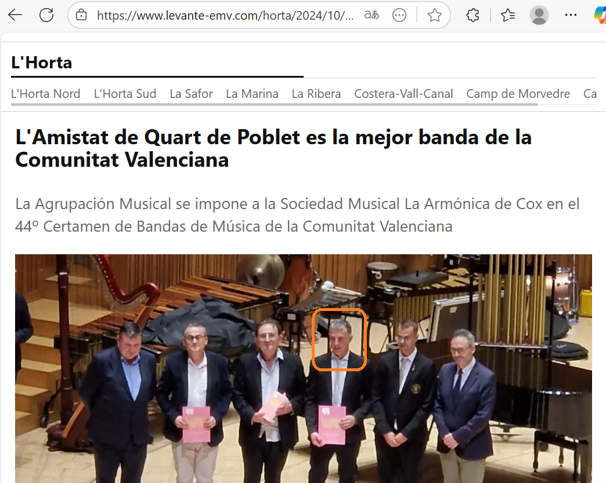
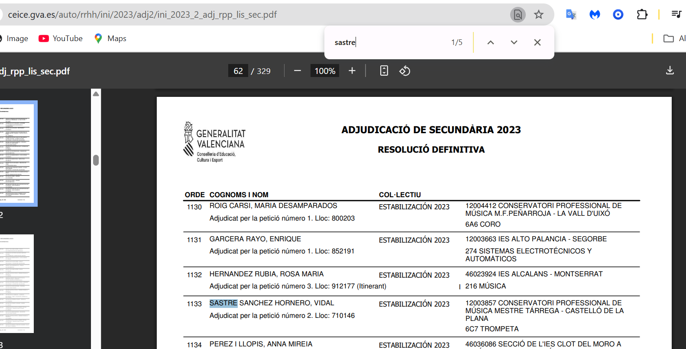
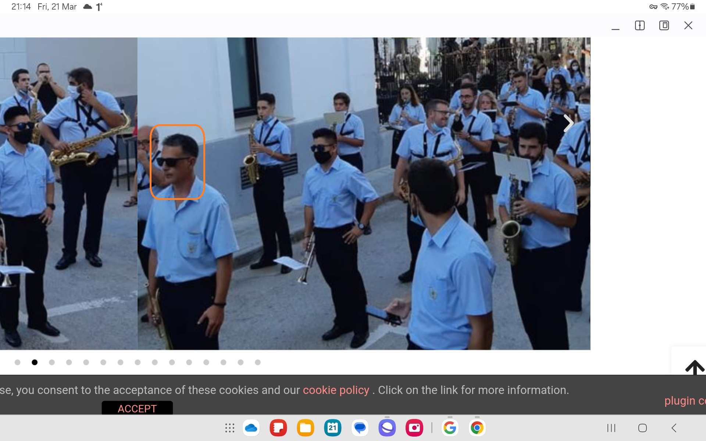
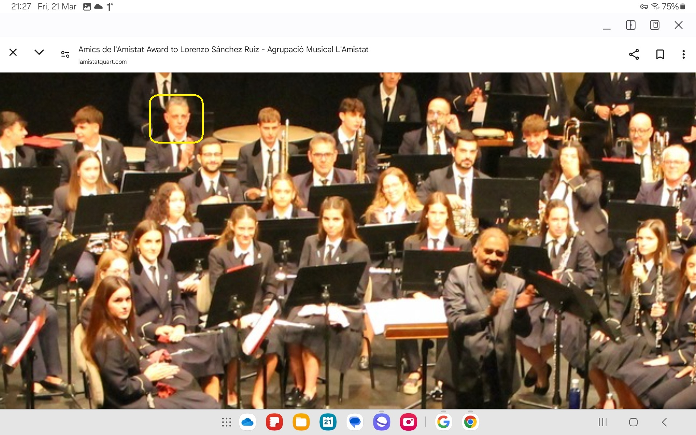

# Protagonists

This page lists the main players in the violent three-year attack on my physical, emotional, sexual, and psychological wellbeing. 

It includes teachers and staff from the conservatory of Dénia, and others.

The people involved were seasoned professionals in the gang-stalking game, and sexual grooming online and in person. Therefore, the chances of me being the only victim is *zero*. 

The chances of me being the oldest victim, at least in the conservatory system, is high.

## Vidal Sastre Sanchez Hornero

### Four distinct men 

- As my mind clears and my heart heals from decades of abuse at the hands of the Canos, the Smiths, and their associates in Dénia, France, and North London, clearer memories of what happened to me and by whom are returning.
- I realize now that the *trumpet teacher* was made up of (minimum) four distinct men who came to the conservatory of Dénia under the role of teacher and using the name Vidal Sastre Sanchez Hornero.
- As I suspected, the fact that there were so few chamber music classes that year must have been due to the unavailability of some or all of the men on certain nights, while it was *essential* they all turned up at my apartment after class while I was sedated.

### The older, slimmer, greyer man

- He may have been the first of these men I saw at class before a switch took place.
- I never stopped having an extremely good feeling about this man.
- I only have four solid memories of him where I'm not confusing him with someone else:

    - The time we sat together in class and [I believed he was fundamentally on my side and conspiring with me against Domingo](../timeline/2023/february.md#plot-awareness). My words on that evening upset him; he understood what I was doing and the way I rewrote the nature of the conspiracy felt right to him.
    - The time not long after when I remember waking up in my bed at home and he was [crying in my arms](../timeline/2023/march.md#dreaming-of-the-trumpet-teacher).
    - There was another time I saw him in class for a minute or two, and I was delighted to see him again - now I understand it was unexpectedly - and I smiled and he ignored me, looking sad and downwards, as I said goodbye and left for the evening.
    - Then, when the attraction-trick stopped working so well, I guess, and they decided to [wheel him out again](../timeline/2023/december.md#the-trumpet-teacher-has-a-brother) so I could be re-triggered, and I thought it was the trumpet teacher's twin brother!

- This is the man I was convinced I loved and who loved me back. 

    

- This is an old picture, the man is about 10 years older now. However, this younger picture demonstrates the likeness between him and the [next bloke I mention](#the-brother-or-mark-from-english-class-in-2013) who must be a family relation of some sort.
- I wonder if the gypsies made sure that one of the men would be someone I was strongly attracted to in order for the trick to work?
- Did they examine our astrological charts or consult a witch?
- Did they use and abuse Saint Valentine in evil rituals designed for controlling women and girls?
- It would not surprise me, at all.
- Regardless, the fact is that without these extremely good feelings I had for this man, and still do, and these short moments in time, we probably wouldn't be where we are today which is becoming something rather marvelous in my view.
- It is my view that this man made a mistake being involved with these criminals and is innocent. Perhaps he doesn't feel this way. That would be normal.

### The brother, or Mark from English class in 2013

- Another man reminded me of [Mark from English class in 2013](../timeline/early-years/2008.md#working-for-lorraine-blackbourn).
- He was the larger, taller, darker, more lumbering man that looked enough like the [older, slimmer man](#the-older-slimmer-greyer-man) for me to mistake them after what I assume had been some sort of [sedated psychological mistaking-people training](#sedated-training-for-recognizing-faces).
- He was someone I had [found attractive when I met him in 2013](../timeline/early-years/2008.md#working-for-lorraine-blackbourn) in my English class when I worked for Lorraine Blackbourn.
- It's likely this man is related to Lorraine Blackbourn's ex-husband and indeed was of the same size and shape, and facial features.
- He was the man I saw most often at the conservatory, and I was always anxious around him.
- I remember seeing this man numerous times, including but not limited to the following examples:

    - He was the man [Patricia Penny *introduced* me to in Benijembla](../timeline/2022/november.md#walking-in-benijembla-with-the-english-ladies) the week before he turned up at class.
    - He was the man that [stalked me at Lourdes](../timeline/2021/july.md#the-portuguese-man-next-door).
    - At the first class in [November 2022](../timeline/2022/november.md#the-trumpet-teacher) there he was hovering over Ana Requena after timing a meeting at the toilet.
    - He was the man involved in [poisoning me by overdose](../timeline/2023/january.md#serious-poisoning-at-chamber-music-class) with the doctor who had a class scheduled before ours, but only came twice.
    - He was the man who brought the music sheets from Gloria and [handed me his phone](../timeline/2023/march.md#the-trumpet-teacher-hands-me-his-phone).
    - The man who [was angry at me](../timeline/2023/april.md#back-in-chamber-music-class) after I followed the `@jctot19` account.
    - The man who switched with [the other large man](#an-unknown-man-i-may-have-a-picture-of) right at the end of the [May 2023 concert](../timeline/2023/may.md#chamber-music-concert).
    - The man who led my *funeral* on [12th June 2023](../timeline/2023/june.md#monday-12th-june-2023).

- I don't have a picture of this man but would recognize him immediately.
- Its possible there's still two men in this section. One man who looked a lot like the first man and could have been his younger brother, and another who looked more like the darker, meaner-looking Mark character I mention here.

### An unknown man I may have a picture of

- There was a similarly tall but even larger lumbering man that I remember seeing a few times.
- He was the man who organized and managed the [chamber music concert](../timeline/2023/may.md#chamber-music-concert) with Carmen Cano in attendance (masquerading or not) as Pablo's mum.
- He had a soft pleasant voice and he was the man who left messages on my phone.
- He was the man I spoke to who [mentioned a *double session* in a perverted way](../timeline/2023/may.md#teb-with-robin) the night before I saw possible evidence of being anally raped.
- He did look like an older version of the young man in the middle of this picture with his arms around two siblings (I assume).

- The younger brother in the pic looks like the man who came out of the tunnel and [blew at me in the face in March 2024](../timeline/2024/march.md#wednesday-13th-march) right before I became convinced I was going to be murdered.
- I'm not sure I have any more solid memories of this man at the conservatory.
- The girl in this picture is very familiar, I don't know why.
- I'm guessing everyone in Dénia and the Marina Alta region knows this man.

### Dark thick-curly-haired deep-set man

- There was another man I have a few memories of which I have already documented.
- I don't remember him ever being at the conservatory.
- I remember him [in my bed calling my name](../timeline/2023/april.md#dreaming-of-the-trumpet-teacher).
- He was the man I saw in the banged up Peugeot on the 11th June 2023, [the day before my *funeral*](../timeline/2023/june.md#sunday-11th-june) and [driving past me at the beach with the doctor in the passenger seat](../timeline/2023/june.md#the-trumpet-teacher-and-the-doctor-joan-drive-past-me), and [driving Ana Requena's blue car slowly past me](../timeline/2023/october.md#the-trumpet-teacher-drives-past-me-in-his-car).
- He was also reminiscent of [Patricia Penny's husband](../timeline/2021/december.md#christmas) and the [man who came out to terrorize me on Halloween](../timeline/2023/october.md#halloween) but not exactly the same - those two men could well be the same man.
- This trumpet player, at the *funeral* of the young girl behind him, looks like him. 

- You'll notice Carmen Cano was in attendance here too. She gets around doesn't she.

- I'm pretty sure these films they're so happy and safe to publish are the porn-genre adverts.
- Could this be him as a young man?

- Although I did think I saw the grown-up version of this person on the beach on [6th October 2024](../timeline/2024/october.md#sunday-6th-october) and have a body cam image of that man who was very different looking, short and quite ugly. Perhaps they're related.
- I believe this is also the man who [interviewed me for a tech job where I'd be looking at genitals all day](../timeline/early-years/2016.md#march) in 2016; a man I saw online and in-person.
- They are certainly the man depicted on the [book cover](../index.md).
- I'm guessing everyone in Dénia knows this man.

### The L'Amistat Quart band

- When you do an online search for *Vidal Sastre Sanchez Hornero*, the first result that comes up is for a band  called the [Musical Group of Friendship](https://www.lamistatquart.com/), a band located in Quart de Poblets, an area of Valencia city.

- Interestingly, the URL and the name of the band plus the location suggest **four friends**, a reference not lost on me now.
- Vidal Sastre Sanchez Hornero is listed as the director of the band.
- The band is supported by numerous government organizations - at least the website says so - including the Generalitat.
- This is the band where we see [a young girl's *funeral* taking place](../timeline/2023/june.md#youtube), just like [mine](../timeline/2023/june.md#monday-12th-june-2023) and, just like me, the experience will have been utterly life changing and not in a good way.
- There are other significant creepy videos of this band performing, some of which I have already mentioned in this statement.
- When I read the website text previously, I noticed a statement about the female members of the band that made me shudder a little. It said something like, "and we have the unconditional support of all the girls".

#### The best band in the Valencian region

- Further down the list, we see a newspaper article dated 21st October 2024; just as I was about to return home from Fatima and be [severely poisoned in my apartment](../timeline/2024/october.md#serious-poisoning-with-intent-to-harm-or-kill).
- The article states the band is the best in the region.
- We wonder, best at what?
- [Trumpet teacher number one](#the-older-slimmer-greyer-man) stands proudly amongst the men receiving their awards at the prestigious Palau de Arts.

.

- He is also given a special mention of honor!
- Perhaps we are seeing here what happens when the leaders of a culture completely lost to porn and violence against women and children start feeling a little nervous, or is it just ironic timing.
- I do wonder if the Vidal Sastre Sanchez Hornero character is one of the other men.
- If not, I wonder what this poor man I loved so intensely is thinking at this moment.
- Surely the stress must be excruciating.

#### Email address

- The website has a contact email address.
- My guess is this is used to communicate with targeted women.
- I used it a few times, long after they hoped I would I expect.
- I wonder how many other women and girls have tried to contact someone they thought they were in love with in this way?
- You can read [my emails here](../content/images/hornero/mail-to-vssh.pdf).
- In October 2025, I find it fascinating to follow the trail of my mind's emergence into clarity and see exactly how effective the attack was on me while it was in full operation while I rented my lovely home in Dénia.

### Sedated training for recognizing faces

- The question is, of course, how did I manage to mistake four separate men for a single person?
- Let's examine that.
- I was living alone and had no social life.
- I was being drugged continually with substances that blurred my vision and made my thoughts extremely unclear.
- I was being sedated and likely sexually assaulted, except … 
- Is it possible that the four of them treated me very nicely, sweetly, intimately but non-sexually, while I was sedated at home prior to 12th June 2023, with the intention of sexual abuse happening on that night as a kind of *grand finale*?
- Was the enormous and exaggerated anxiety I felt after the attack on the 12th June 2023 in fact (and it makes much more sense to be) due to the grand rape-gang finale having occurred at my house that night?
- Could part of the mind training and manipulation (*rehearsals* he called it at class) have included staring at me full in the face while I was sedated and my eyes were open and I was looking straight at them so I would recognize their faces in real life?
- If they had assaulted me prior to June 12th 2023, I would have found them frightening in real life, and I didn’t, although they gave me a bad feeling that made me anxious and recoil… apart from the first older man who I never stopped having an extremely good feeling about.
- From 12th June 2023, I *did* find him frightening, and ran away when [I saw one of them at Alicante airport](../timeline/2023/june.md#sunday-18th-june-alicante-airport); I believe this one was the [unknown man that led the chamber music class](#an-unknown-man-i-may-have-a-picture-of) so it is likely sedated rape had begun.
- This whole process is so professional, so finely-tuned; none of them felt they were taking *any risk at all*. They must have done the same to hundreds, perhaps thousands of women and girls.

## The Truwoman Show or Please Turn My Wife into a Porn Star

- I’m guessing this is a porn genre and many millions of men and porn addicts internationally know about it, particularly in Spain.
- A great deal of police will be subscribers.
- They will live stream the whole thing most likely, as a kind of porn-reality show.
- The series probably includes a live-streamed gang-rape as  grander-grand finale in which the target is not sedated and recognizes all the men that have been *training* her.
- They must charge exorbitant fees for this.
- I wouldn't be surprised if this has killed women and girls outright with the shock; something the pornographers hope for probably as it makes a lot more money.
- Women like [Rocio Vidal](../timeline/2023/october.md#rocio-vidal) and the sports woman I mentioned in [my handwritten letters](../timeline/2024/august.md#the-letters) are likely viable targets requested by paying viewers and maybe blackmailed into participating rather than sedated (especially if they're famous).
- It must be common knowledge across the world, and that’s fundamentally why all my complaints are ignored.
- The perverts have certainly evolved over the years from targeting wealthy women with body-cams to setting up a kind of Truwoman Show in people's homes… just another sickly-inventive way men have found to delight and get boners at the destruction of women and now children too.
- This is the *only explanation* for the enormous resources spent on terrorizing me. They were earning far more for doing so than not.

### Is this why the McCann case continues to falter?

- The sedating MO is exactly like the McCann case.
- Could this be why the case stalled so badly in the beginning, and why they're trying to pin an extremely professional kidnap job onto an obvious opportunist?
- You only have to look up spy cam porn online to see millions of people unaware they’re being filmed and my guess is a lot of this is coming from Spain and Portugal.

### Sedating porn is normal now

- We were all horrified at the Gisele Pelicot case; but perhaps this is considered completely acceptable by pornographers and billions of porn viewers.
- I guess the paying viewers feel like they've not quite reached the vileness of child or baby rape but at least they're still getting a sexual hit off something equally abhorrent towards women and girls.
- I wonder if the audiences can request the gangs target their wives or girlfriends, or colleagues maybe, a sort of evolved *reader's-wives*.
- Is this what happened to [Mrs Lara](../evidence/maybes.md#alice-lara), and Lorraine found out somehow… and reported… and was ignored... and was then targeted online and manipulated into killing herself?
- Was Mike Wenham manipulated into everything he did too? If so, for what purpose.
- Is this the backdrop to many of my professional experiences, especially [Polygon](../timeline/2023/november.md#polygon)?

## My role

- And running through all this evil and vileness is my journey through it.
- I must have been judged just another *silly little girl*, ready for targeting.
- When they found out I was already a child rape victim, with the films to prove it, they must have thought me non-human and from there it was very easy for everyone to justify my assured demise.
- They must have thought me an easy target with no friends or family, completely isolated, and yet something was going on that no one could have imagined and, once the divine trap was operational - set in motion decades before - there was no escape, and even as the bear teeth tightened down on the conspiring fools, they still had so little respect for women, girls, children, and babies, they didn’t feel until it snapped shut.
- Miracles.

## Future optimisms 

- The Rape Gang Inquiry has suggested that they might be able to get the police to re-investigate my original Tottenham rape gang case from 1989.
- Except, now, they cannot possibly investigate those crimes without casting an eye on the decades long international conspiracy against me.
- How exciting!
- Some amazing investigatory team will be winning official awards for their career-case work ensnaring the nastiest, vilest, pedo-porn gang and serial-killing international online community of perverts and homicidal maniacs the world has ever known.
- May it be very very soon.
- And I myself will buy them all a non-toxic pint.

### WIP investigation

- This is the name given to the trumpet teacher who turned up to teach class very sporadically starting at the [end of November 2022](../timeline/2022/november.md#the-trumpet-teacher).
- The bait.
- I found it hard to believe that this man's name is Vidal Sastre Sanchez Hornero, unless these criminal gangs are so arrogant and protected, they don't bother hiding themselves.
- This is the name registered in the Generalitat Valenciana systems, even today. 
- Curiously a government official told me no record of the person could be found at the same time I was looking at his name on official Generalitat government lists.

- He is apparently the director of a [band in Valencia](https://www.lamistatquart.com/) and this fits with his original story.
- There are a bunch of references for the name online, including references which come from the Generalitat's formal lists of teachers.

- It's hard to believe there's no reference for him. He may have been working unofficially with the conservatory of Dénia, but they gave him a pension while doing so.
- Online references include a number of pictures of the man who turned up to teach classes.

- It's not clear if the man below is the same man as in the previous pictures, but I recognize him too.

- The pictures show the man who taught the class on Monday evenings that I attended. At least, I look at all these pictures and remember them as being the "trumpet teacher" who turned up to class sporadically on Mondays.
- But there are another bunch of pictures of this person who look like someone completely different to the men above.

- I recognize this man too as being the "trumpet teacher" that took classes on a Monday evening.
- While I'm writing out my statement, I realize with horror there is more than one trumpet teacher.
- Another picture I recognized as him was from [the video of another girls "funeral"](../content/images/youtube-video.png) I had found in June 2023, in Dublin, when I was severely traumatized after the events of [12th June 2023](../timeline/2023/june.md#monday-12th-june-2023).
- However, on looking at these pictures, I believe I remember another man, who looked dissimilar again. 
- If this is true, seemingly I became confused about these people being the same person, probably because I was [on drugs without my knowledge](../timeline/2023/january.md#serious-poisoning-at-chamber-music-class), and probably because the online NLP/hypnosis hypno-tech was set up with that intention.
- Curiously, online face comparison tools say that none of the above pictures are of the same person.

!!! tip "What?"
    - I know, this sounds crazy, but it's possible.
    - Imagine you have control of a person by giving them psychoactive and mood altering substances over long periods and they are unaware of it.
    - Now you can set up a situation in which you have two, or more, people swapping the same role from time to time, so as to confuse the person into relating multiple people as the same one person.
    - Add to this, root access to the target's online activity, with the ability to flash whatever images you like up for subliminal stimulation.
    - I believe this happened to me, as the men in the pictures above are extremely dissimilar to each other, *and* to another man I remember taking the class from time to time.
    - And now, I'm wondering if all the pictures of Vidal Sastre Sanchez Hornero that I personally recognize are of a number of different people.
    - If a group of men wanted to groom unwitting young girls, and get away with it, how better than to never be the same person the young girls see twice.
    - Even better if there is intimate activity with the target without her knowledge. The body, and mind under sedation, always remembers something.
    - Anyone making a complaint would be easily dismissed, not least because everyone else is aware there is a target and what's happening to her, and that this is protected by the highest authority of the land.
    - And if they really wanted to make sure she was confused about what she was seeing, they might try to blind her, perhaps with low-level continuous methanol doses direct into the water supply at her apartment, or if she's really feisty why not just spray all her clothes and belongings in high dose pesticides.

- Did Pablo ask the trumpet teacher when he turned up [where the other guy was](../timeline/2023/january.md#chamber-music-classes-continue)?
- One of my suspicions now is that this name probably relates to a group of criminals who control women by drugging them whilst having full root access to their online devices and using some sort of social media hacking app which can change the timeline or the UI with ease. 
- It's not such an advanced piece of software, actually, and would just mean having some AI tool ready to rewrite the HTML on a target's machine with specific messages or pictures.
- In the past, sexually coercive behavior like this would usually be undertaken by pimps and perverts with the end goal of enticing and trapping women in the sex "industry" and this is certainly in keeping with the content the gangs shared with me online, such as [the pictures of the lady who went from innocent girl to hardcore porn activity](../timeline/2024/august.md#photos-of-abused-women-and-girls).
- In the past, this bait-and-switch activity would have been undertaken directly in physical settings, clubs and societies, bars, etc., and of course still is.
- However, the sexual coercion techniques used in Dénia and the region has taken a new and extremely troubling turn.
- Criminals and other bad actors are now able to access a person's private home network and devices in a remarkably easy way. From there, malicious actors can monitor and control all online activity, paying close attention to finances and anything incriminating.

!!! danger "Would anyone want to live here if they knew how much danger the wealthy, elderly, women and children are in?"
    - Visitors to the region should be warned that it is highly likely their online activity will be monitored very closely by locals.
    - Visitors should expect that to happen and act accordingly.
    - Even 4g/5g mobile networks, without access to wifi routers, are vulnerable.

- With such access, criminals can manipulate and intimidate a woman or child via their social media and other online activity.
- Is this how children are being coerced online into sending sexually explicit pictures of themselves for a pedophile porn market?
- If a target is physically present, and being drugged as well, like perhaps the [flautist in this video](../timeline/2023/june.md#youtube), then it is highly likely they will eventually suffer a sedated sexual assault, or be manipulated into something apparently consensual, and then be put on porn networks without their consent.
- Here's another reference to a "funeral" or "sale" of a groomed young woman from the band in Valencia.

- "Se la rifaron" means, they sold her off.
- Notice at a certain point in the performance, the trumpet player plays in a very sexually suggestive manner, *stripper style*.
- These people are not hiding, but I believe they are drugging and sedating women and girls, and not just here, probably all over the region wherever adult men have unrestricted access to women, teenage girls, and younger.
- Wherever VSSH has been listed as teaching in the Generalitat Valenciana region, could a young girl or woman be in danger?
- I have seen this name listed in Castellon, Bunol, Alicante, amongst other places.
- I thought maybe that *Vidal Sastre Sanchez Hornero* was the name of one, and only one, of the gang. Now I'm thinking that, perhaps, it is a collection of four of the gang's surnames.
- There will be some sick reason for the choice of name.
- It was not the name of the man, or men, who came to teach class to me and Pablo; one of whom I am led to believe is called Antonio Ruiz.
- Could Antonio have been simply used as bait for a sinister sex gang operating and controlling the region's conservatories?
- Were his children in danger of kidnap, as he suggested online to me at one point?
- Whoever these people are, they are proud of their behavior, and arrogant enough to showcase their "controlling young girls" activity on [YouTube](https://www.youtube.com/@saxofonator/search?query=vidal%20sanchez%20sastre%20horneros).
- It appears that all attacks, or "funerals" of women are videoed and shared, and certainly my "funeral" on [12th June 2023](../timeline/2023/june.md#monday-12th-june-2023), was excitedly recorded on the mobile phones of all present, including teachers, staff, and students.

!!! danger "Shocking"
    - If I'm right about this, then the children of the conservatory would also have to be somewhat complicit in the deception and targeting of female students by countless adult males and their female assistants.
    - This is a somewhat horrific thing to consider and I do hope it is not true but given statistics like all 11-year-old boys have seen pedophile gang rape porn and worse, usually in school on their mates' phones, then nothing would surprise me anymore.

- Is it possible that what is a well-known and much loved Spanish tradition of destroying single women or girls for fun now a countrywide porn business making millions for porn distribution gangs; each girl delivered up at the appropriate time?
- Given the whole town of Dénia knows of pedophile rape-gang porn I was in from 1989, and doesn't seem to think that is a crime worth reporting, is it possible they know the details of 1000s of crimes against women and girls?

### A second opinion

- Another version of events is that if this person, having the name Vidal SSH, *is* one of the men in the pictures above, he may have been set up to be the fall-guy if anything went wrong in the original plan.
- His attendance at the conservatory could have been a cover for the other man, a known criminal from the local area.
- In this scenario, and following a recent tip from a reliable anonymous source, I was informed that one of the men in the pictures above was under investigation for sexual grooming at the time he visited the conservatory in 2022/23.
- If this is true, and the [pictures and videos](../timeline/2023/june.md#youtube) made very public do seem to suggest he was involved in some sort of grooming gang scenario, then could the criminal porn gangs have needed someone to play a part to hide the fact that real pimps and pornographers were entering the conservatory freely to do whatever they liked?
- And who better than someone already under suspicion for similar crimes?
- What a hell these poor people are living in!

## The *other* trumpet teacher

- The man in any of the pictures above is only half (or a quarter) of the man I remember.
- While I was still being drugged, in late Autumn of 2023, I thought he had a [twin brother](../timeline/2023/december.md#the-trumpet-teacher-has-a-brother) called Malachi. I mentioned this in an earlier draft (commit) of this document. I said "the brother made himself known to me one evening when I walked through the tunnel during the intensive gang stalking."
- He had been set up to walk past the tunnel entrance at the road just as I was walking out so that I would see him.
- I did see him and I ran up behind him before crossing the road. And he flinched.
- He looked exactly like the trumpet teacher, but different. So I called him a twin brother. I was certain he was the twin brother and by that time I was so used to this constant torment, every day there was some nasty little set up "event" designed to terrorize and upset me, that it seemed a reasonable thing for them to do.
- I now wonder about this apparent "twin" and whether this particular incident was set up to continue to remind me of what the man in the pictures above looked like because I had not behaved as expected, I had continued to attend classes at the conservatory so the trick had to continue.
- I had assumed the man was a twin because he was *NOT AT ALL* like the man I had seen a number of times, such as the man who [turned up at the airport](../timeline/2023/june.md#sunday-18th-june-alicante-airport), or the man who had also [attended classes at the conservatory](../timeline/2023/february.md#observations-on-the-trumpet-teacher), or the man who had me pointed out to him by Patricia in [Benijembla](../timeline/2022/november.md#walking-in-benijembla-with-the-english-ladies) and who had been at [the first chamber music class](../timeline/2022/december.md#chamber-music-classes) the following week. This first man was the one I [mostly dreamt about](poisoning.md#dreams-and-visions).
- Had both these men been at that first class?
- As I write this section and think of these two men, the initial man that Patricia pointed me out to, and the deep set, older-looking twin, are indeed very very different in appearance.
- Had they wheeled out this original person from Valencia just to keep his face in my head (although by that time, some of the trick had worn off, i.e. I had forgotten him mostly and thought he was a twin brother instead of the real thing).
- Patricia, when I asked her how she knew Vidal, said "who"? But it's clear she knows who, at least one of these other men is, but perhaps not the man I thought was the brother or any of the men in the pictures above.
- During more recent stalking events when I was still clearly under the influence of mind-altering substances, and even though I had been away from Dénia for a while (which begs the question as to how anyone was managing to drug me or whether I carried it with me from home in my toiletries), the trumpet teacher posing as a hacker suggested to me there was a brother and a sister and sent [pictures](../timeline/2024/august.md#the-trumpet-teacher-pics). 
- I was convinced the brother was called Andrew, a clearly younger brother with blond hair, but I couldn't understand why none of the pictures looked like there were twins and in fact the older brother, and the younger man which at the time of writing is still rendering on my Google searches, look like no-one I have seen before! At least not consciously.
- In any case, serious investigators will know immediately who all of these people are, as will the whole town know who the main players are.
- Here is one of the VSSH team playing the trumpet.

- And here is an AI mix of one of the above and Gloria the receptionist.

- Symbols and memes related to the trumpet teacher during the cyber stalking are horses, Trump, and more. I'll add these to the [memes section](../memes-triggers/memes.md) at some point as I go through all the material.

## The hacker

- Clearly, I have been targeted by industrial-scale criminal hacking expertise that includes men local to Dénia.
- Initially I thought it was just one person who was close to the trumpet teacher and speaking for him.
- I did find a reference to someone who might be of interest.

- His twitter is here: https://x.com/viccassan82.
- He looks a lot like this guy too: https://x.com/csonnyb/photo an account the stalked me from October 2024.
- I believe there's a team probably working on numerous porn targets at any one time. 
- My situation just spilled out into public because I refused to give into them. 

## Domingo Lopez Cano

- Domingo Lopez Cano was my piano teacher in [2014](../timeline/early-years/2014.md).
- I met him first at the [conservatory audition](../timeline/early-years/2014.md#conservatory-audition).
- Here he is in the summer of 2016, just after I left Dénia as I started to suffer from depression related to [going to the police about my experience in 1989 of sexual abuse by rape gangs in North London](../timeline/early-years/2015.md#statement-to-the-metropolitan-police).

- I wonder if the older woman to his right is his mother?
- And I wonder who the young woman he is with is? Could she be another target?
- Is this article from the [local online newspaper](https://www.denia.com/ramon-garcia-soler-hace-vibrar-la-plaza-del-consell-en-el-concierto-de-musica-festera-de-la-banda-de-denia/26-concierto-agrupacio-artistica-musical-denia-moros-y-cristianos-2016-escuadras-en-el-publico) actually an advertisement where the young lady is the product on sale?
- The name "Cano" relates to all things canine and "Lopez" to all things wolverine. While I was being stalked and terrorized online, there were a lot of references to these animals, and particularly when the stalking took a more seriously threatening or abusive turn.
- Indeed, dogs featured constantly in the online harassment and threats.
- Here's a fake X account pic that communicated with me during the [March 2024 intensive online psychological abuse](../timeline/2024/march.md#a-serious-attack-on-my-wellbeing-from-piano-teachers-at-denia-conservatory) of him as an older person.

{width=35%}

### Carmen Lopez Cano

- Carmen is Domingo's sister.
- I believe she ran many of the fake accounts that terrorized me, along with Hazel and Sandra Smith.
- A picture of her was posted on my Google searches which I screen shot in April.

- It's not clear who was passing me this information.
- I have never met Carmen Cano but it's obvious that the picture of this woman has been merged with the face of Domingo the piano teacher.
- I have another picture of her from a body cam I was wearing on 5th October 2024. I went out without my mobile phone to go for a walk along Las Rota in Dénia. I didn't want to be followed and tracked, but I wanted to still have means to call the police, so I brought my [analogue phone that I had bought in April](../timeline/2024/april.md#i-get-an-orange-sim). As I approached the restaurant Sendra, a woman cycles up behind me, then in front of me; she stops, smiles, and cycles off. I believe it was Carmen Cano and I would recognize her again. She looked a lot like the pics I have just posted and possibly a blond woman who plays in the L'Amistat band. 

!!! info
    - It appears even 2g/3g phones are trackable by these people.

- On 1st November, the same woman is leaving my apartment building with another dark haired lady; a woman I have often seen going in and out of apartment number 18 next door to me since I got back to Dénia from France at the end of September 2024. It could have been the older woman in the picture above from 2016, except with darker hair.

## Accomplices

### Paqui Fornet Pastor

### Gloria the receptionist

### Ana Requena 

### Other teachers and students to a greater or lesser degree

- Maria Hontanilla, my piano teacher during year 3 of professional piano.

- Esteve the chamber music teacher in year 4. 

- Alfonso the harmony teacher in year 4.

!!! info 
    - Placeholder for more.

## Hazel and Sandra Smith

- Mentioned in [early days content](../timeline/early-years/2007.md#hazel-smith).

    !!! info
        - Details of the Channel 4 documentary featuring these two coming up soon.

- We must ask the question that, given the UK police must have known who and what these two are capable of, and where they went, why were they permitted to freely take control of a small area of Spain without any sort of restraint?

## Twitter accounts of note

- `@jctot19`: I believe this must be the trumpet teacher's account although could be being controlled/managed by others too.
- `@sinremite`: I believe this is Carmen Cano's account.

## Everyone else functioning as introduction agents of some sort

- Members of the Javea Computer Club.
- Members of expat walking groups.
- Klara Sarkadi singing teacher and leader of the Orfeo de Denia choir.
- Old (apparent) friends in Dénia.
- The whole town of Dénia who were clearly lied to about why I had been targeted and so felt justified in joining in the fun. 
- The only other option is that the town of Dénia is controlled by pure evil.
