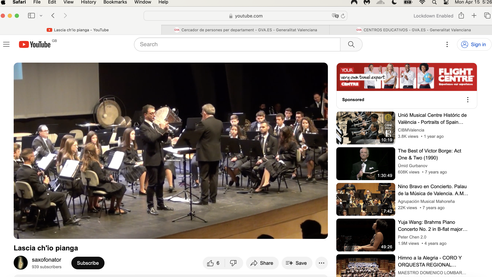

!!! tip
    - See the [list of teachers here](../timeline/early-years/2015.md#first-class-of-january) and their twitter (fake) account pics.

## Vidal Sastre Sanchez Hornero

- This name probably relates to a group of criminals who control women by drugging them whilst having full root access to their social media activity.
- In the past, sexually coercive behavior like this would usually be undertaken by pimps and perverts with the end goal of enticing and trapping women in the sex "industry". In the past, this would have been undertaken directly in physical settings, clubs and societies, bars, etc., and still is.
- The sexual coercion in Denia and the region has taken a new and extremely troubling turn.
- Criminals and other bad actors are able to gain access to a person's private home network and devices in a remarkably easy way. From there, malicious actors can monitor all their online activity, paying close attention to finances and anything incriminating.

!!! danger "Would anyone want to live here if they knew how much danger women and children are in?"
    - Visitors to the region should be warned that it is highly likely their online activity will be monitored very closely by locals.
    - Visitors should expect that to happen and act accordingly.
    - Even 4/5g mobile networks are vulnerable.

- From here, criminals can manipulate a woman or child via their social media activity and otherwise extremely easily.
- If they are being drugged as well, like perhaps the [flautist in this video](../timeline/2023/june.md#youtube), then it is highly likely the target will eventually suffer a physical sexual, or be manipulated into something apparently consensual, and then be put on porn networks without their consent.
- Vidal Sastre Sanchez Hornero is not the trumpet teacher's name, although it is possible he is part of this group.
- Whoever these people are, they are proud of their behavior, and arrogant enough to showcase their "controlling young girls" activity on [YouTube](https://www.youtube.com/@saxofonator/search?query=vidal%20sanchez%20sastre%20horneros).
- All attacks "funerals" on women are videod and shared.

## The trumpet teacher

- I do not believe this man's name is Vidal Sastre Sanchez Hornero, unless, of course, these criminal gangs are so arrogant and protected, they don't bother hiding themselves.
- Symbols and memes related to him are horses, Trump.
- He has a brother who may be a twin as they look nearly identical: the brother "made himself known to me" one evening when I walked through the tunnel during the intensive gang stalking in October 2023.
- Patricia, when I asked her how she knew Vidal, said "who"? But it's clear she knows who this man is, and his brother.
- Investigators will know immediately who he is.
- The whole town of Denia and beyond knows who he is.
- Here he is playing the trumpet.

- And here is an AI mix of him and Gloria the receptionist.

## Dominic Lopez Cano

- Domingo Lopez Cano was my piano teacher in [2014](../timeline/early-years/2014.md).
- I met him first at the [conservatory audition](../timeline/early-years/2014.md#conservatory-audition).
- Here he is in the summer of 2016, just after I left Dénia as I started to suffer from depression related to [going to the police about my experience in 1989 of sexual abuse by rape gangs in North London](../timeline/early-years/2015.md#statement-to-the-metropolitan-police).

- I wonder if the older woman to his right is his mother?
- And I wonder who the young woman he is with is? Could she be another target?
- Is this article from the [local paper](https://www.denia.com/ramon-garcia-soler-hace-vibrar-la-plaza-del-consell-en-el-concierto-de-musica-festera-de-la-banda-de-denia/26-concierto-agrupacio-artistica-musical-denia-moros-y-cristianos-2016-escuadras-en-el-publico) actually an advertisement where the young lady is the product on sale?
- The name "Cano" relates to all things canine and "Lopez" to all things wolverine. While I was being stalked and terrorized online, there were a lot of references to these animals, and particularly when the stalking took a more serious threatening or abusive turn.
- Indeed, dogs featured constantly in the online harassment and threats.
- Here's a fake X account pic that communicated with me during the [March 2024 intensive online psychological abuse](../timeline/2024/march.md#a-serious-attack-on-my-wellbeing-from-piano-teachers-at-denia-conservatory) of him as an older person.

{width=35%}

### Carmen Lopez Cano

- Carmen is Domingo's sister.
- I believe she ran many of the fake accounts that terrorized me, along with Hazel and Sandra Smith.
- A picture of her was posted on my Google searches which I screen shot in April.

- It's not clear who was passing me this information.
- I have never met Carmen Cano but it's obvious that the picture of this woman has been merged with the face of Dominic the piano teacher.
- I have another picture of her from a body cam I was wearing on 5th October. I went out without my mobile phone to go for a walk along Las Rota in Denia. I didn't want to be followed and tracked, but I wanted to still have means to call the police, so I brought my [analogue phone that I had bought in April](../timeline/2024/april.md#i-get-an-orange-sim). As I approached the restaurant Sendra, a woman cycles up behind me, then in front of me, she stops, smiles, and cycles off. It was Carmen Cano for sure. She looked a lot like the pics I have just posted. 

!!! info
    - It seems like even 2g phones are trackable by these people.

- On 1st November, the same woman is leaving my apartment building with another dark haired lady; a woman I have often seen going in and out of apartment number 18 next door to me since I got back to Denia from France at the end of April. It could have been the older woman in the picture above from 2016, except with darker hair.

## Paqui Fornet Pastor

## Gloria the receptionist

## Ana Requena 

## Other teachers to a greater or lesser degree

## Twitter accounts of note

- `@jctot19`: I believe this must be the trumpet teacher's account although could be being controlled/managed by others too.
- `@sinremite`: I believe this is Carmen Cano's account.

## Everyone else

- Members of the Javea Computer Club.
- Members of expat walking groups.
- Old (apparent) friends in Denia.
- The whole town of Denia who were lied to about why I had been targeted and so felt justified in joining in the fun.
