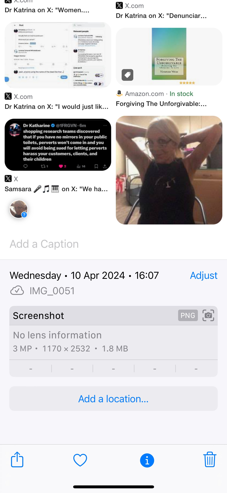
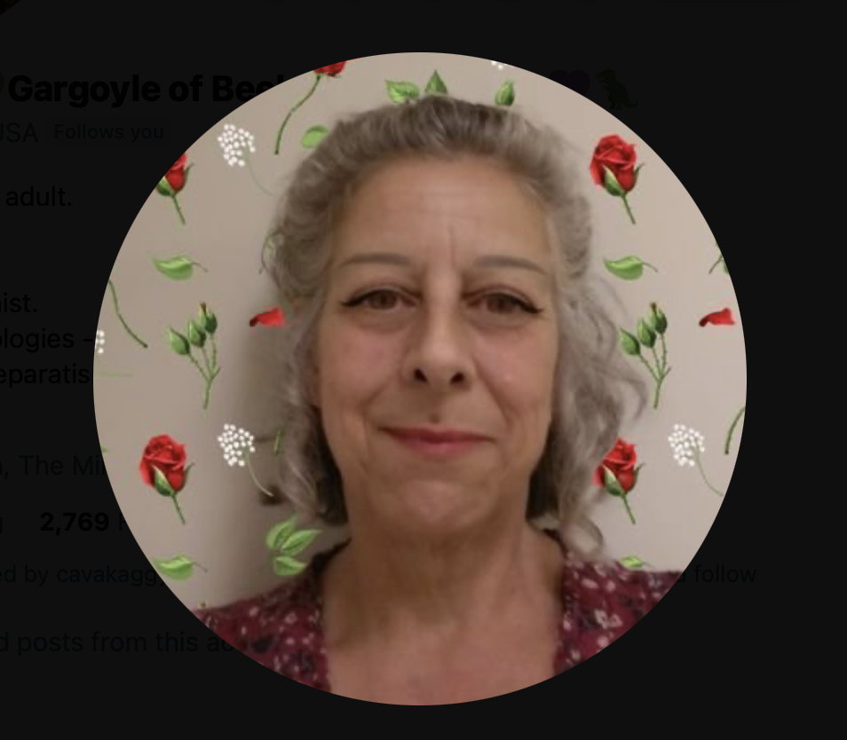

# Teachers and staff at the conservatory

## Domingo Lopez Cano

- Domingo Lopez Cano was my piano teacher in [2014](../../timeline/early-years/2014.md).
- I met him first at the [conservatory audition](../../timeline/early-years/2014.md#conservatory-audition).
- Here he is in the summer of 2016, just after I left Dénia as I started to suffer from depression related to [going to the police about my experience in 1989 of sexual abuse by rape gangs in North London](../../timeline/early-years/2015.md#statement-to-the-metropolitan-police).

- I wonder if the older woman to his right is his mother?
- And I wonder who the young woman he is with is? Could she be another target? I have to say, I have very strong feelings about her not being alive. Please could someone confirm.
- The woman on the far left ends up [stalking me in person in July 2025 at my hotel in Lourdes](../../timeline/2025/july.md#lourdes).
- Is this article from the [local online newspaper](https://www.denia.com/ramon-garcia-soler-hace-vibrar-la-plaza-del-consell-en-el-concierto-de-musica-festera-de-la-banda-de-denia/26-concierto-agrupacio-artistica-musical-denia-moros-y-cristianos-2016-escuadras-en-el-publico) actually an advertisement where the young lady is the product on sale?
- Is this the first obvious admission that the *whole town* is aware of what these people are doing, and to whom?
- I bet there are a million more evidential-snippets, just like this one.
- The name "Cano" relates to all things canine and "Lopez" to all things wolverine. While I was being stalked and terrorized online, there were a lot of references to these animals, and particularly when the stalking took a more seriously threatening or abusive turn.
- Indeed, dogs featured constantly in the online harassment and threats.
- Here's a fake X account pic that communicated with me during the [March 2024 intensive online psychological abuse](../../timeline/2024/march/1-12.md#a-serious-attack-on-my-wellbeing-from-piano-teachers-at-denia-conservatory) of him as an older person.

{width=35%}

## Carmen Lopez Cano

- Carmen is Domingo's sister.
- I believe she ran many of the fake accounts that terrorized me, along with Hazel and Sandra Smith.
- A picture of her was posted on my Google searches which I screen shot in April.

- It's not clear who was passing me this information.
- I have never met Carmen Cano but it's obvious that the picture of this woman has been merged with the face of Domingo the piano teacher.
- I have another picture of her from a body cam I was wearing on 5th October 2024. I went out without my mobile phone to go for a walk along Las Rota in Dénia. I didn't want to be followed and tracked, but I wanted to still have means to call the police, so I brought my [analogue phone that I had bought in April](../../timeline/2024/april.md#i-buy-an-orange-sim). As I approached the restaurant Sendra, a woman cycles up behind me, then in front of me; she stops, smiles, and cycles off. I believe it was Carmen Cano and I would recognize her again. She looked a lot like the pics I have just posted and possibly a blond woman who plays in [the L'Amistat band](./vidal-sastre.md#the-lamistat-quart-band). 

!!! info
    - It appears even 2g/3g phones are trackable by these people.

- On 1st November, the same woman is leaving my apartment building with another dark haired lady; a woman I have often seen going in and out of apartment number 18 next door to me since I got back to Dénia from France at the end of September 2024. It could have been the older woman in the picture above from 2016, except with darker hair.
- I believe she also starred in the [switcheroo (pre-)porn special episode chamber music concert](../../timeline/2023/may.md#chamber-music-concert) filmed live from the conservatory with [number three trumpet teacher](./vidal-sastre.md#an-unknown-man-i-may-have-a-picture-of) in the lead role until the end when he switched with [the second trumpet teacher I remember](./vidal-sastre.md#the-brother-or-mark-from-english-class-in-2013).

## Accomplices

### Paqui Fornet Pastor

### Gloria the school receptionist

- Possibly a close relation to the [third man of the conservatory's switcheroo porn-gang](vidal-sastre.md#an-unknown-man-i-may-have-a-picture-of); school receptionist an ideal job.

### Ana Requena 

### Other teachers and students to a greater or lesser degree

- Maria Hontanilla, my piano teacher during year 3 of professional piano.

- Esteve the chamber music teacher in year 4. 

- Alfonso the harmony teacher in year 4.

!!! info 
    - Placeholder for more.

## Hazel and Sandra Smith

- Mentioned in [early days content](../../timeline/early-years/2007.md#hazel-smith).

    !!! info
        - Details of the Channel 4 documentary featuring these two coming up soon.

- We must ask the question that, given the UK police must have known who and what these two are capable of, and where they went, why were they permitted to freely take control of a small area of Spain without any sort of restraint?

## Twitter accounts of note

- `@jctot19`: I believe this must be the trumpet teacher's account although could be being controlled/managed by others too.
- `@sinremite`: I believe this is Carmen Cano's account.

## Everyone else functioning as introduction agents of some sort

- Members of the Javea Computer Club.
- Members of expat walking groups.
- Klara Sarkadi singing teacher and leader of the Orfeo de Denia choir.
- Old (apparent) friends in Dénia.
- The whole town of Dénia who were clearly lied to about why I had been targeted and so felt justified in joining in the fun. 
- The only other option is that the town of Dénia is controlled by pure evil.
