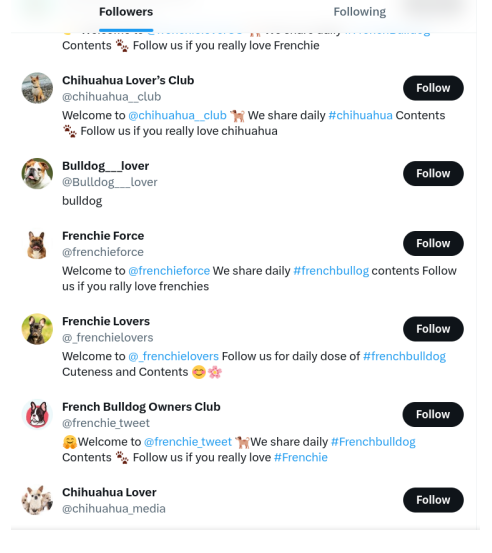
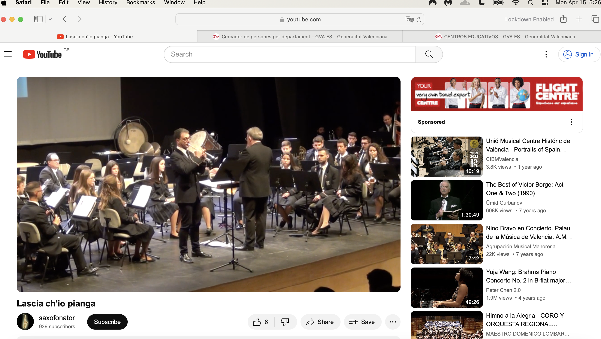
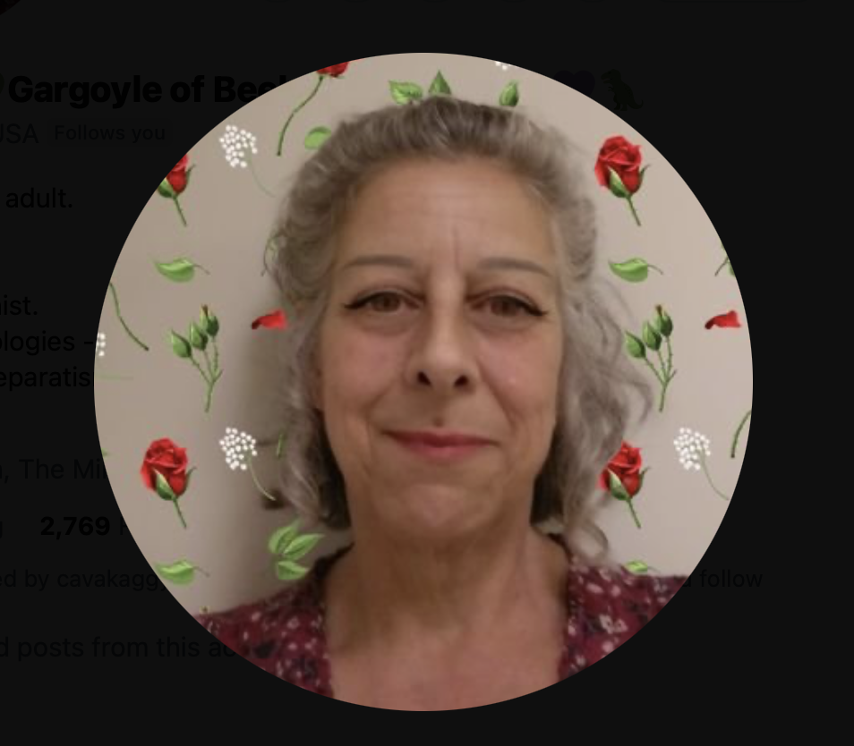

# Teachers and staff at the conservatory

## Domingo Lopez Cano

- Domingo Lopez Cano was my piano teacher in 2014.
- I met him first at the [conservatory audition](../../timeline/early-years/2014.md#conservatory-audition).
- Here he is in the summer of 2016, just after I left Dénia as I started to suffer from severe depression.

- I wonder if the older woman to his right is his mother? They're very alike.
- And I wonder who the young woman he is with is? Could she be another target? I have to say, I have very strong feelings about her not being alive. You can't imagine the horrific images I'm getting of this woman and how my foot pain might be related to seeing her. Is her name Sara? Is she Czech? I wonder if missing-persons in Czechoslovakia has her?
- Is this article from the [local online newspaper](https://www.denia.com/ramon-garcia-soler-hace-vibrar-la-plaza-del-consell-en-el-concierto-de-musica-festera-de-la-banda-de-denia/26-concierto-agrupacio-artistica-musical-denia-moros-y-cristianos-2016-escuadras-en-el-publico) actually an advertisement where the young lady is the product on sale?
- Or is the article featured on [Denia.com](https://www.denia.com/) a declaration from the *whole town* that they are aware of what these people are doing, and to whom?
- (The fact they removed the article suggests the town's complicity.)
- I bet there are a million more evidential-snippets, just like this one, aren't there.
- The woman on the far left, Taya, ends up [very obviously stalking me in July 2025 at my hotel in Lourdes](../../timeline/2025/july.md#lourdes).
- She added poison to my toiletries, food, and water, and very much expected me to die.
- I got a little unwell for a few days - blurry vision, headache, aching kidneys, mental confusion, and physical weakness - but I didn't die.
- ⬆️🫵

### Depression in 2016 

- I had related the intense and growing depression that forced me to leave Dénia in 2016 to [going to the police about my experience in 1989 of sexual abuse by rape gangs in North London](../../timeline/early-years/2015.md#statement-to-the-metropolitan-police).
- It didn't occur to me that this wasn't really enough to explain the intensity of my feelings and I had not experienced the same in [2006 when I reported](../../timeline/2001-to-2010/2006.md#reporting-child-sexual-abuse-to-the-metropolitan-police).
- It turns out, my depression was related entirely to being regularly sedated-and-raped by multiple men at my flat in Joan Fuster.
- And indeed, my renewed interest in my North London rape-gang experiences in 1989 was due to traumatic body-memories, triggered by what was happening to me in my apartment without my knowledge.
- After [my father took part in a session of this in June 2015](../../timeline/early-years/2015.md#inexplicable-anal-fissure), my depression became suicidal in nature.
- I suspect this, and intense anxiety episodes, are common outcomes for victims of sedated rape; most especially when participants are (apparently) loved ones.
- Knowing this, the porn-gangs will take unprecedented steps to "create" a scenario which may serve to explain psychological outcomes such as these; such as [the endless fear and loathing performances I witnessed by teachers and staff at the conservatory](../../index.md); those events I have catalogued in [this statement's timeline](../../timeline/2001-to-2010/2001.md).

### Online-stalker memes related to Domingo

- The name "Cano" relates to dogs, and "Lopez" to wolves. 
- While I was being stalked and terrorized online after the [switcheroo porn scandal at the conservatory](vidal-sastre.md#at-least-four) had ended and I had not behaved as expected (as victims usually do), I saw multiple online memes and references to these animals, and particularly when the stalking took a more seriously threatening or abusive turn.
- Indeed, dogs featured constantly in the online harassment and threats.
- Hackers reveal their close connection to Domingo Lopez Cano in August 2023 just as I'm about to return to my home in Dénia.

- Indeed, I thought I was talking directly to Domingo online in this manner.
- Here's a fake X account profile photo that communicated with me during the [March 2024 intensive online psychological abuse](../../timeline/2024/march/1-12.md#a-serious-attack-on-my-wellbeing-from-piano-teachers-at-denia-conservatory).
- It thought it was an AI of Domingo as an older person; but maybe it's an actual family member.

{width=35%}

### Carmen Lopez Cano

- Carmen is Domingo's sister.
- Domingo told me about her when we were friends in 2014.
- He said she lived in Valencia, played the flute, and worked for a call centre.
- Like all questionable relationships with Spanish men, Domingo never introduced me to his family, even though he spent a weekend at my family home in London.
- I sensed a reluctance to talk about Carmen when I asked him politely about her.
- This made me think Domingo might be embarrassed by his family.
- I believe Carmen ran many of the fake accounts that terrorized me; along with teachers and staff at the conservatory, Hazel and Sandra Smith, and most of North London's criminal finest by all accounts.
- Was this her job in a euphemistic *call centre*?
- I started to wonder about Carmen Cano while being stalked by [an account with the name *Carmen*](../../timeline/2023/july.md#carmen) after my [12th June 2023 *funeral*](../../timeline/2023/june.md#monday-12th-june-2023) at the conservatory and consequent unexpected fearlessness.
- Someone posted a picture of her on my Google searches sometimes in late 2023/early 2024 while the online and in-person terror was fever-pitched.

- Even though I had never met Carmen Cano in person, it was obvious to me that the picture of the woman was merged with the face of Domingo.
- It was not clear who was passing me information.
- I nevertheless felt I was being warned about her.
- I even saw her name fly by on fake accounts.

- Given how she smiled at me as she and another woman applied deadly poisons to my water, food, and consumable belongings, I think she felt assured of total protection and this made her arrogant, and maybe get a taste for murder just like Hazel.
- I do have a picture of her from a body cam [I was wearing on 5th October 2024](../../timeline/2024/october.md#saturday-5th-october) after she followed me while I was on an afternoon walk. 
- I believe Carmen Cano is the flute-playing blond woman who we see below while [the L'Amistat band](./vidal-sastre.md#the-lamistat-quart-band) performs at the "funeral" of another female student. 

- She was also the woman who attended the [chamber music concert](../../timeline/2023/may.md#chamber-music-concert) in May 2023, led by [the trumpet teachers I've highlighted as a brother and a local man Mark](vidal-sastre.md#three-more) and [Gloria's brother](vidal-sastre.md#a-man-possibly-called-bruno-with-at-least-one-son-called-bruno).
- She came to the concert in the guise of Pablo's mum - the boy student who attended the class along with me.
- On 1st November 2024, I see her leaving my apartment building with another older dark-haired lady; the woman with the monstrous voice who I often saw going [in and out of apartment number 18](../../timeline/2024/october.md#activity-in-the-nextdoor-apartment-number-18) next door after I returned to Dénia from France at the end of September 2024.
- The older woman could even have been the woman in [the picture above sitting on the right of Domingo](#domingo-lopez-cano) from 2016.
- The Cano Lopez family appears to be made up of a nest of poisoning vipers that can do whatever they like to innocents in the Marina Alta region.
- And I heard they were partnering up with another family, the Toledo's, to wreak switcheroo and child-porn havoc nationally with the support of the government school board in its entirety.

## Accomplices

### Paqui Fornet Pastor

### Gloria the school receptionist

- Possibly a close relation to the [third man of the conservatory's switcheroo porn-gang](vidal-sastre.md#a-man-possibly-called-bruno-with-at-least-one-son-called-bruno); school receptionist an ideal job.

### Ana Requena 

### Other teachers and students to a greater or lesser degree

- Maria Hontanilla, my piano teacher during year 3 of professional piano.

- Esteve the chamber music teacher in year 4. 

- Alfonso the harmony teacher in year 4.

!!! info 
    - Placeholder for more.

## Hazel and Sandra Smith

- Mentioned in [early days content](../../timeline/2001-to-2010/2007.md#hazel-smith).

    !!! info
        - Details of the Channel 4 documentary featuring these two coming up soon.

- We must ask the question that, given the UK police must have known who and what these two are capable of, and where they went, why were they permitted to freely take control of a small area of Spain without any sort of restraint?

## Twitter accounts of note

- `@jctot19`: I believe this must be the trumpet teacher's account although could be being controlled/managed by others too.
- `@sinremite`: I believe this is Carmen Cano's account.

## Everyone else functioning as introduction agents of some sort

- Members of the Javea Computer Club.
- Members of expat walking groups.
- Klara Sarkadi singing teacher and leader of the Orfeo de Denia choir.
- Old (apparent) friends in Dénia.
- The whole town of Dénia who were clearly lied to about why I had been targeted and so felt justified in joining in the fun. 
- The only other option is that the town of Dénia is controlled by pure evil.
