# Protagonists

The pages in this section list the main players in the violent three-year attack on my physical, emotional, sexual and psychological wellbeing, and life. 

It includes teachers and staff from the conservatory of Dénia, known criminals, and others from the Valencian region.

The people involved were seasoned professionals in spy-cam technology, sedated-rape, clandestine poisoning and drugging, gang-stalking, cyber-stalking, and sexual grooming. 

The chances of me being the only victim is *zero*. 

The chances of me being one of the eldest victims in the conservatory system (the government-run public music schools of Spain) is high.

## Vidal Sastre Sanchez Hornero

- The *main* porn genre created from November 2022 to June 2023 with the support of teachers and staff (Spanish civil servants) at the conservatory, and at my apartment, and while attending [a work function in Bali with crypto-giant Polygon](../../timeline/2024/may.md#bali) in May 2024 is called *switcheroo*.
- From research, I understand that "switcheroo-porn" commonly means a blindfolded target for multiple men, and this is well known.
- In my case, the "blindfold" at conservatory classes was decades of poisoning through the mains water to my apartments in Spain which gave me a stroke-like symptom whereby I struggle to recognize objects, especially people, out of context.
- On top of this, intense drugging and poisoning made my mind confused and my vision extremely blurred.
- In [Bali with Polygon](../../timeline/2024/may.md#bali), the "blindfold" was five days of sedation while probably hundreds of men - including my managers and colleagues, and even CEOs of well known companies - took their turn raping me while the cameras rolled.
- *Vidal Sastre Sanchez Hornero* was the name that the group of eight men pretending to be one single trumpet-teacher working at the conservatory of Dénia used, and the name is registered in the Generalitat's systems.
- The name is also known in [other professional settings](#the-best-band-in-the-valencian-region) which always connect back to the Generalitat, the government body which manages schools, hospitals, and more in the Valencian region.
- Intricately choreographed scenarios at the conservatory, in which these [multiple men would literally switch to play the role of trumpet teacher taking a class](#seven-devils-and-one-angel), were acted out while I was completely ignorant of what was actually happening at the music school.
- It appears that all the teachers and staff, and many of the parents and children are aware of what goes on at the music school and how it doubles as a criminal porn studio.
- I believe the school classrooms are wired up with spy-cams that livestream sex-attacks on sedated students onto multiple porn networks, and [the switcheroo-porn special filmed in class with me starring](../../timeline/2023/may.md#conservatory-choir-concert) proves it.

##### What switcheroo-porn really requires

- Interestingly, if criminal porn-production companies spend time and money to get a victim to a state of brain-damage whereby she's ready to star in some sort of switcheroo-porn special, then the men involved *must* be viewable by the porn audience.
- If not, there's no switcheroo! Right?
- Of course, the men have to switcheroo in public, face-and-body visible - on camera and amongst the other teachers, staff, and children at the conservatory - as the porn-special was filmed in classes and the men involved were pretending to be "teachers".
- So they had to be fully seen and easy to recognize.
- Back at my sedated-rape spy-cam apartment, they may have put masks on or somehow hid their appearance... but perhaps not even then.
- They've already been seen in public, unmasked, with a semi-conscious drugged victim, so why bother hiding later on?
- Their intention was that I would be semi-conscious at home too - consciously consenting as it were - but that didn't work out for them.
- Nevertheless, they've done this to so many women, the criminals must be visible in other switcheroo porn specials with other victims in school classrooms, or at work events, or in their homes.
- Clearly, these men are above and beyond the law so maybe they've been boldly showing themselves without fear of reprisals for decades; the heroes and legends of porn!
- They'll be easy to jail, therefore.

##### Switcheroo is the preliminary to the horse-porn

- Even though it has been common knowledge for decades, now those who can do something about the evil might like to officially verify who makes the switcheroo and horse porn, and where, and send them and the multiple deviants supporting them to jail.
- In doing so, they'll be putting an end to an industrial-scale baby-rape operation.
- Every British police officer has seen the horse porn, or heard about it, and giggled; as if the drugged, brain-damaged, and soon to be murdered humans starring in it don't exist.
- My view is that North London criminal gangs have made sure that police forces are shown this sort of content, keeping the police complicit and the gangs safe, and creating monsters of some policemen at the same time.
- Victims might even start off in consenting porn before they're moved onto the brain-damage programs which require access to the water supply in their homes to apply poisons and intense drugging.
- It takes a good few years before the switcheroo brain-damage is sufficiently applied, which means the gangs will have multiple victims in preparation at any one time, even today.
- If a target has a viable business/trade which brings more porn-fodder to the region, they'll let them live after they've finished the switcheroo (see [Natalia, recruited by the gangs in North London and lured to Dénia](../../timeline/2011-to-2020/2015.md#nati-de-prati-yoga-teacher-and-porn-gang-target-just-like-me)).
- If a target has money, the gangs may set up a fake relationship or marriage while training for the horse-porn begins.
- My guess is even poverty won't save you in the region. I believe the gangs appetite for destroying women and children is insatiable and I suspect the poorer you are, the more likely you'll end up dead.
- When the brain is sufficiently damaged, training for the horse porn consists in ramping up the drug and poisoning doses plus the usual manipulation, in-person and online, and at some moment they simply add a new member to the switcheroo group, which happens to be a horse.
- They commonly set this training session up, I was told, at a car window at night.
- The target is in the passenger seat of the car with another person in the driver's seat.
- The driver, although complicit, is not part of the main-man (trumpet-teacher) group and could be anyone from the town.
- The car is parked somewhere rural.
- A horse is cued to pop his head close to the driver's open window and, at the same time, the main man speaks.
- A scripted vignette is already in place - part of the violence training no doubt, as we are that far along now and there will be regular filmed and always worsening sexual violence happening to the target - that causes her (I believe it is always a her for the horse porn, correct me if I'm wrong) to turn away from the horse in fear.
- Targets are trained to look at switcheroo protagonists in short glances so that the gangs can switch a face without a severely drugged person realizing.
- By this time, a target's brain is in an even worse state than a stroke survivor, they're permanently and exaggeratedly high too, and so a neural link between the visual (horse) and the audio (main-man) voice is patterned.
- This process is repeated until the grand finale taking place in a muddy field with a short wall around it and thin wire fencing to stop the audience breaking in.
- It's not clear how the gangs set up intense and overwhelming sexual desire in targets that is part of manipulating them to run after a horse in a field thinking it was a human they're sexually attracted to. Are they able to train a fully sedated person to act this way? TBC.
- Many of the men in the region, and their special guests, are invited to the show which is filmed and then distributed around the world by North London's finest.
- There is no doubt this was the end goal for me as [training had already begun online with reference to horses](../../evidence/memes-and-triggers.md#horses).
- I have to wonder if my dad and brother knew about this; and I wonder less and less as the days go on and we find out more about the hopelessly deteriorated state of *apparently normal* men in the world.

### Eight distinct men posing as trumpet teacher

#### Seven devils and one angel

- As my mind clears and my heart heals from decades of abuse at the hands of the Canos, the Smiths, and their associates in Dénia, France, and North London, clearer memories of what happened to me and by whom are returning.
- I realize now that the *trumpet teacher* was made up of eight distinct men who came to the conservatory of Dénia under the role of teacher and using the name Vidal Sastre Sanchez Hornero.
- I suspect only two or three of these men could actually play the trumpet.
- As I suspected, the fact that there were so few chamber music classes that year must have been due to the unavailability of some or all of the men on certain nights, while it was *essential* they all turned up at my apartment after class while I was sedated.
- You cannot imagine how shocking it is for me to learn that I mistook all these men, of extremely different shapes and sizes, for one single man.
- It is even more disturbing to me that most of the town of Dénia and beyond, including many children, and even some of my tech-colleagues at work, knew what was going on; and thought it was something to laugh and jeer about.
- But the most appalling truth about the *switcheroo* porn being created by the teachers and staff at a Spanish public school, full of hundreds of children of all ages, was that everyone who *did* know what was going on would have been wholly expecting my death or severe maiming as the inevitable end result for me and multiple other victims like me.
- And they didn't care.
- Is this what we should expect to happen everywhere in the world as normal men hopelessly deteriorate through porn consumption?

### The older, slimmer, shorter, greyer man - the angel

- This man is an angel and he has undoubtedly saved my life.
- To this day, I have never stopped having extremely good feelings about this man.
- This is the man the porn-gangs used to make me believe I was in love and that I was loved back; the instigator of the *main man* psychological meme, an essential part of the switcheroo scam.
- Is this a sexual trick while sedated, making a vulnerable person feel loved through sex, the same thing they do to trick women into prostitution?
- It's unclear to me except, I don't think I could be tricked like this, so intensely, for so long.
- Certainly the gangs must have thought the trick had worked or they wouldn't have bothered putting so much effort into trying to [get me into bed with the mountain guide](../../timeline/2023/august.md#climbing-the-viscos); a failure which proves, in my mind, the scam hadn't really worked.
- It's possible I'm wrong about this being a trick and instead we genuinely love each other, or perhaps what was supposed to be, and looked like *trick* became something real.
- My body felt safe with this man and my body is rarely wrong about visceral safety.
- The scam meant that visually I thought seven other men were this man, confusing form endlessly, but my body never felt safe with anyone else but this man so I was able to distinguish who was unsafe or irrelevant without objective consciousness, and act accordingly.
- I only have four solid memories of this man during the switcheroo scam events:

    - The time we sat together in class and [I believed he was fundamentally on my side and conspiring with me against Domingo](../../timeline/2023/february.md#plot-awareness). My words on that evening upset him; he understood what I was doing and I could tell that the way I rewrote the nature of the conspiracy felt right to him (could he have already been conspiring with me without me being aware of it, did I pick up on his truth at that moment?).
    - He looked over at me, saw something, and had to leave the room. I wonder what he saw. I was wondering if it was Jesus. I bet it was Jesus.
    - The time not long after, maybe that night, when I remembered waking up in my bed at home and he was [sobbing uncontrollably in my arms](../../timeline/2023/march.md#dreaming-of-the-trumpet-teacher).
    - There was another time I saw him in class for a few seconds at the end of class - he'd switched at the last moment - and I was delighted to see him again and I smiled and he ignored me, looking sad and downwards, as I said goodbye and left for the evening. Did the gangs stop his involvement with the scam because of the tears? Was this a goodbye?
    - Later, when I foiled the gangs and they started to panic, and the attraction-trick had stopped working so well because of his absence, I guess, they [wheeled him out again](../../timeline/2023/december.md#the-trumpet-teacher-has-a-brother) so I could be re-triggered, and I thought it was the trumpet teacher's twin brother!

- This is the man I was convinced I loved and who loved me back. Truth be known, I still feel this way although the confusion about what happened has been intense, for years, and I have had to lock down my emotions and feelings at times to save myself from the excruciating pain of not knowing the truth. 

    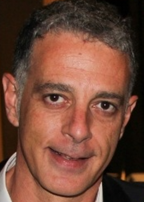

- But I know who he is now, so everything has changed rather marvelously again.
- My belief is that, for the switcheroo scam to work effectively, there has to be a genuine attraction to one of the men - in the same way a woman is tricked into prostitution by a pimp who she "loves" - and this man supplied that role.
- I believe this man is [Daniel who attended Elke's workshop in 2013](../../timeline/2011-to-2020/2013.md#daniel) and I believe he was given the role of sedated-victim's "caretaker" over the years 2013-2016 while I was being sedated and raped in my homes, and it's possible something inexplicable and miraculous happened between us at that time of which I have no conscious awareness.
- Certainly I was planning a curiously onomatopoeic new novel, *Grunt Work*, where the protagonist, a woman, falls in love with a ridiculously smart caretaker; I wrote a lot of notes about it online.
- Perhaps the caretaker role is kind and gentle, and undresses and dresses a sedated victim and cleans her up and puts her to bed safely after being sexually brutalized.
- Perhaps he sits with her or guides her around if she has to walk.
- Perhaps only one man can do this effectively over long periods because switching this role would cause excessive anxiety in a target.
- I believe this man made me feel safe - albeit unconsciously - in an extremely unsafe environment and that this had unusual repercussions no-one was expecting.
- Did I reach for his hand and hold it?
- Did they pick him for switcheroo main-man because of the tenderness between 2013-2016?
- Was he able to bring me to orgasm while sedated?
- I suspect after many hundreds if not thousands of years of switcheroo and it's concomitants on women and children, they found that without a "caretaker", as it were, the whole thing was over much sooner due to the devastating psycho-emotional effects of sexual trauma.
- Yet something unexpected happened between myself and this man early on.
- I thought the tears were when he changed his mind about his grim purpose, but now I believe it was much earlier than that.
- Perhaps such a change of mind, clearly a *holy instant*, leaves men sane and desperate to escape porn-hell.
- Since he changed his mind, whenever that was, he has been helping me silently - mostly without my conscious awareness but more recently with more direct communication online and by drip feeding me information about murder victims and switcheroo rape-gang identities.
- Interestingly, the gangs were never able to effect their switcheroo-scam on me fully because "feeling/felt sense" is the way I understand the world, and so I never mistook any of the brutes for anything else but brutes.
- But since probably around March 2023 (the *holy instant* that we shared but I was not fully conscious of!!, amazing, I'll leave it in for now), there was something other than brute in my experiences; something very tender, very difficult to describe or comprehend, something very loving and perfect, and I believe this is what cured me completely of depression.
- I believe today that God speaks through me directly to this man; through my books, and my notes, and my ideas, and my online rants, and maybe even through my body movements as he watched me in my homes, and he paid attention. 
- Perhaps there were even Instructions.
- This man is [`@KingForg`](../../timeline/2025/april.md#deso).

### Seven devils

- Seven men made up the rest of the trumpet teacher gang.
- The first three ([1.](#1-mark), [2.](#2-a-dashing-good-looking-bit-thick-younger-man-with-more-hair-than-the-rest-of-them), and [3.](#3-the-brother-of-the-woman-working-at-mercadona) seemed to be closely related to the [man now working for me](#the-older-slimmer-shorter-greyer-man-the-angel)).
- And I would put money on all these men being closely related to Lorraine's ex-husband, implicated in the horror-rape-porn that led to her death by suicide.
- A further three men making up the gang also seemed to be closely related, but with significantly different family characteristics: ([5.](#5-dark-thick-curly-haired-deep-set-man), [6.](#6-viktor-the-man-that-interviewed-me-for-a-job-in-2016), and [7.](#7-the-pangolin)). 
- These three did not turn up to classes at the conservatory but undoubtedly entered my apartment after I'd gone to bed and been sedated. I wonder if Lorraine's ex turned up too. It seems likely, something kept reminding me of her.
- One of the men, Bruno - Gloria the school receptionist's brother - looked nothing like any of the others ([4.](#4-bruno)) and probably had no genuine Spanish ancestry. He was the first one they offered up too.
- Due to brain-damage, animal-training while sedated, extreme online manipulation, and intense drugging at classes, I mistook all these men for one single man in conscious awareness.
- I never saw number [7.](#7-the-pangolin) in conscious awareness in Spain, but when I did eventually see him, years later, I experienced the same feelings I had done whenever I saw the others, and my mind at some level knew him as *trumpet teacher*.

#### 1. Mark

- This was the man I saw most often at the conservatory, and I was always anxious around him.
- Tall, muscular, bad-tempered, and always dressed in black; I would recognize this man immediately if I saw him again.
- He was the man [Patricia Penny *introduced* me to in Benijembla](../../timeline/2022/november.md#walking-in-benijembla-with-the-english-ladies) the week before he turned up at class - after swapping with the [good-looking one who had just set up the love-triangle trick with Ana](../../timeline/2022/november.md#the-trumpet-teacher).
- He was the man that [stalked me at Lourdes](../../timeline/2021/march.md#the-portuguese-man-next-door) in 2020, perhaps also setting up sedated-rape events in my studio there.
- I remember him [driving Auggie](../../timeline/2001-to-2010/2001.md#amsterdam) in 2001 in Amsterdam, along with [the man who set up a fake job interview with me in 2016](#6-viktor-the-man-that-interviewed-me-for-a-job-in-2016). They were both in the bar the night before.
- He was also [a student in an English class I gave in 2013](../../timeline/2001-to-2010/2008.md#lorraine-blackbourn). 
- He called himself Mark and I believe that is his name.
- I [found him attractive](../../timeline/2001-to-2010/2008.md#lorraine-blackbourn), sitting right in front of my desk. He was flirting very gently with me.
- I was working for Lorraine Blackbourn at the time, and this Mark looked a lot like her husband who she hadn't yet left.
- I remember seeing this man numerous times at the conservatory during the switcheroo scam, including but not limited to the following examples:

    - He was the man involved in [poisoning me by overdose](../../timeline/2023/january.md#serious-poisoning-at-chamber-music-class) with the doctor who had a class scheduled before ours, but only came twice. Numbers [2.](#2-a-dashing-good-looking-bit-thick-younger-man-with-more-hair-than-the-rest-of-them) and [3.](#3-the-brother-of-the-woman-working-at-mercadona) were also at this class.
    - He was the man who returned with copied music sheets from Gloria every class, right after number [2.](#2-a-dashing-good-looking-bit-thick-younger-man-with-more-hair-than-the-rest-of-them) or [3.](#3-the-brother-of-the-woman-working-at-mercadona) had left the classroom to do the copying initially.
    - He [handed me his phone](../../timeline/2023/march.md#the-trumpet-teacher-hands-me-his-phone) in a weird manner..
    - He was the man who [was angry at me](../../timeline/2023/april.md#back-in-chamber-music-class) after I followed the `@jctot19` account, and could not look me in the eye when I stared at him.
    - He presided, along with [Bruno](#4-bruno) and [number 3.](#3-the-brother-of-the-woman-working-at-mercadona), at the [May 2023 concert](../../timeline/2023/may.md#chamber-music-concert) along with the three children in attendance.
    - He was the man who led my *funeral* on [12th June 2023](../../timeline/2023/june.md#monday-12th-june-2023).

#### 2. A dashing, good-looking, bit thick younger man with more hair than the rest of them

- My guess is they get the very good-looking man in to do the initial meet and greet, and maybe bring him back from time to time, but not too often cos he's no good at lying.
- This was the man who [set up the love-triangle trick with Ana](../../timeline/2022/november.md#the-trumpet-teacher) at the first class, but was faffing around a lot with the timing of it.
- He also introduced himself at that class, poorly, as *Vidal*. Meaning, I didn't really believe him but this awareness was far away while out-of-my-mind on hallucinogens or whatever.
- This was the man who did a terrible job at [attempting to arrange in-person *dates* with me](../../timeline/2023/february.md#ptsd). His attempt induced in me a massive panic attack.
- Tall, muscular, perhaps better-tempered than the others - I made him laugh once uproariously, as I remember - larger in stature than [Mark](#1-mark); this man is probably in his mid-to-late forties, and he had a lot more hair than the rest of them.
- I have a strange sensation he wore purple of some variety but I'm not sure. He may have had bright green sneakers.
- I don't think he turned up all that much for conservatory classes.
- This was the man they put on [the *Vidal Sastre Sanchez Hornero* Facebook profile](../../timeline/2022/december.md#chamber-music-classes) I looked up in December 2022. He was standing windswept with two teenage girls - I assumed his daughters - and all three of them looked a bit embarrassed.
- He may well be the handsome man preening himself second to the right among three other brutes who appeared to all be brothers; a pic on numerous fake accounts I was shown repeatedly on X, but I never screenshot for some strange reason. Thinking about it, it may be that his picture was so out of context in these photos I was unable to make a solid mental connection.
- Was he the next one they were prepared to sacrifice after Bruno?
- I would recognize this man immediately if I saw him again.

#### 3. The brother of the woman working at Mercadona

- This man was slimmer than the first two but of the same height.
- He looks exactly like his sister who works for Mercadona on the Avenida Miguel Hernandez - they could be twins - and not much like Mark or the good-looking one.
- Significantly, he [swapped places with my co-conspirator](../../timeline/2023/february.md#plot-awareness) when he had to leave the room, and the man had to bend down because he was so much taller than the one who just left, and it would have been really obvious.
- He seemed frightened at times, as if he was suffering stage fright.
- Once when I tried to talk to him about music, he sort of clammed up.
- I don't think this man plays the trumpet. He didn't seem to know much about music.
- He may have been scared of Gloria; he certainly looked scared of her one evening when she came into the classroom unable to control her laughter as I was trying to talk to him about something.
- The Mercadona connection is interesting given how [the staff there terrorized me](../../timeline/2024/october.md#mercadona) the week the Lopez Cano's were trying to murder me through the water supply to the property.

#### 4. Bruno

- As tall as [1.](#1-mark), [2.](#2-a-dashing-good-looking-bit-thick-younger-man-with-more-hair-than-the-rest-of-them), and [3.](#3-the-brother-of-the-woman-working-at-mercadona); a larger, portly even, older, and lumbering man with bad skin was a key member of the switcheroo trumpet-teacher team.
- He didn't turn up immediately - I assume because he looks so different to the others - and I may have seen him first in conscious awareness as late as April 2023.
- He was one of the men starring with me in the [chamber music concert](../../timeline/2023/may.md#chamber-music-concert) with Carmen Lopez Cano in attendance (masquerading or not) as Pablo's mum.
- He may have even sexually assaulted me at the concert, in the classroom, while I was sedated - filmed and live-streamed.
- He had a soft pleasant voice and I believe he was the man who left messages on my phone.
- He was the man I spoke to on the phone who [mentioned a *double session* in a perverted way](../../timeline/2023/may.md#teb-with-robin) the night before I saw evidence of anal rape.
- He was [the man waiting for me at Alicante airport on 18th June 2023](../../timeline/2023/june.md#sunday-18th-june-alicante-airport) when I flew back from Dublin after TT training. I expect his intentions was to begin a sexual relationship with me leading to marriage, an automatic will change, and my swift demise.
- I believe this is an old picture of him, his family, and siblings.

- I've had a copy of this photo since August 2024 which came in the usual way on X fake account profile pics.
- In October 2025, [I realized this man looked completely different to the other trumpet teachers](../../timeline/2025/october.md#thunderbolt-clarity), and was therefore just one of a group of men pretending to be the same manipulated love interest; proof I had been severely brain-damaged with deadly poisons over many years. 
- I'm not sure I have many more solid memories of this man at the conservatory apart from him [standing outside the conservatory as I walked towards it](../../timeline/2023/april.md#disclosing-child-sexual-abuse) for the chamber music class after I posted on X - I wonder if this was a sole occasion when [the pangolin](#7-the-pangolin) made a brief appearance on the stairs going in before multiple switches happened as I went up the stairs and into class where Bruno resumed the main-man role and was obviously waiting for me to speak to him further about my child abuse disclosure on X in the classroom, and my body said clearly, *don't do that*.
- The younger brother in the photo looks like the man who came out of the tunnel and [blew at me in the face in March 2024](../../timeline/2024/march/13-end.md#wednesday-13th-march) right before [I became convinced I was going to be murdered](../../timeline/2024/march/13-end.md#the-pillow-game).
- I think the girl in the photo is Gloria the conservatory school receptionist as a teenager.
- I'm guessing everyone in Dénia and the Marina Alta region knows these people.
- I remember Samuel telling me about Gloria's brother Ivan, and how *terrible* he was.
- I guess Ivan is a nickname, due to him being monstrous to women, children... pregnant women and babies.
- I'm reliably informed by solid international sources that this man's name is Bruno.
- He also appears to be the father of [Natalia's son](../../timeline/2011-to-2020/2015.md#nati-de-prati-yoga-teacher-and-porn-gang-target-just-like-me); who is also called Bruno.
- I suspect he could also be the father of the [gloomy yoga teacher](../../timeline/2011-to-2020/2015.md#nati-de-prati-yoga-teacher-and-porn-gang-target-just-like-me); npc from Natalia's terror team back in 2015. Is her name Brunhilda?
- He also appears to be the father of the daughter of [the innocent woman groomed into porn](../../timeline/2024/august.md#grooming-an-innocent-girl-into-porn-101) that I saw tons of photos of.
- Bruno is a curiously Germanic name and I therefore wonder if he could be a descendent of Nazi war criminals who found safe-haven in Dénia and the surrounds after the second world war; a very open secret.

#### 5. Dark thick-curly-haired deep-set man

- I don't remember this man ever being at the conservatory but I do remember him being in my bed at home one Monday night after chamber music class.
- He was [in my bed calling my name](../../timeline/2023/april.md#dreaming-of-the-trumpet-teacher) which I thought must be a dream at the time, now not.
- My view is that this trumpet teacher was testing to see my reaction to him after the spectacular events between myself and [my new friend](#the-older-slimmer-shorter-greyer-man-the-angel). I expect they thought our connection was anomalous, and were double checking to make sure.
- It wasn't. I was horrified to see him there and turned my back on him immediately.
- Perhaps that's what got the angel fired.
- In Ireland in June 2023, just before [Bruno attempts his claim on me](../../timeline/2023/june.md#sunday-18th-june-alicante-airport), someone sends me links to this man performing at a concert in which it looks like what they did to me is happening to another woman.
- We see him playing a solo at [the *funeral* of the young drugged-and-groomed girl behind him](../../timeline/2023/june.md#another-young-girls-funeral).
- When I first saw this video, I recognized this man immediately as the trumpet teacher who had come to the conservatory to teach classes, except I have no recollection of this man ever being in the conservatory building.

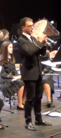

- You'll notice Carmen Lopez Cano was in attendance here playing the flute.
- This man looks to be quite short, and I wonder if that's the main reason he didn't turn up to classes.

- Notice the soloist's name is given as *Vidal Sastre Sanchez Hornero*.
- I found lots more videos of concerts around Spain with trumpet soloists, or musical directors, having the same name, and all of them looked like different men, most of whom I had no recollection of at all!
- Due to the age of the numerous YouTube films I found, I'm pretty sure they function as *music-student-porn-genre* international adverts which means the danger to children in the conservatory system in Spain is very well known - and it's likely my Belgian friend was aware of it as far back as 2011.
- No-one had any idea about how tough I really was when I first saw this video, so I don't think it was an attempt at throwing this man under the bus; rather, perhaps, someone was trying to help me by showing me solid images of another member of the team, knowing that [Bruno](#4-bruno) was about to make his move and no woman, child, or baby has ever survived his advances.

#### 6. Viktor, the man that interviewed me for a job in 2016

- This is another man I have no recollection of seeing inside the conservatory building, and I wonder if this is because he is an extremely well known sex offender in the region.
- I do have numerous memories of seeing this man since 2001.
- He was the man I saw in the banged up Peugeot driving on my road on the 11th June 2023, [the day before my *funeral*](../../timeline/2023/june.md#sunday-11th-june).
- I had also seen him [driving past my building](#) as I was going to class one morning in May. This was the day that the conservatory teachers were having a big meeting so I assumed he had to leave early to get back to Valencia and his job at the secondary school!
- I also saw this man in the same Peugeot in a [drive-by at the beach, with the doctor in the passenger seat](../../timeline/2023/june.md#the-trumpet-teacher-and-the-doctor-joan-drive-past-me); a solid link to the chamber music classes at the conservatory.
- In the Autumn of 2023, I saw him [driving Ana Requena's (trumpet teacher girlfriend) blue car slowly past me](../../timeline/2023/october.md#the-trumpet-teacher-drives-past-me-in-his-car) close to my apartment.
- He knew I'd recognize him as *trumpet teacher*.
- My view today is that whenever he did this, he was about to enter, or just had been in my apartment while I was sedated. A few times I saw men that looked just like him in cars outside my apartment, but I never mistook any of them for the trumpet teacher. I knew they were relations though. Some of them were driving flash cars. I expect these men had been in my home too. I'd remember them as well as this man.
- He was one of the men in the bar with [Brian in Amsterdam in 2001](../../timeline/2001-to-2010/2001.md#amsterdam) and in one of the cars the next morning. I may have told him he was greasy before going unconscious in the bar and being led back to our room.
- This man also [interviewed me online for a job where I would be looking at genitals all day](../../timeline/2011-to-2020/2016.md#march) in 2016, and I saw him in the town not long after.
- At the time, he told me his name was Viktor, but I suspect his name is Dani for some reason.
- This man, and the previous one, are the man (men) I gave [the nickname Vigas](../../timeline/2024/august.md#interview-with-the-hacker) to when nothing made any sense.
- I suspect he ran the [Beams grooming account](../../timeline/2024/may.md#beams) which connected with me just after [intense drugging and sexual-training](../../timeline/2024/april.md#drugged-in-the-street-by-denia-gypsies) right before I left for Madrid on my way to attending the [Bali work event with my employer Polygon Labs](../../timeline/2024/may.md#bali).
- He is the man that [prayed the rosary with me while I was sedated](../../timeline/2024/may.md#madrid) in my hotel room at the Princesa Plaza, Madrid, at that time.
- He is the man depicted as *monster* on this [police statement's front cover](../../index.md) on the right sitting beside a good likeness of Domingo Cano Lopez.

#### 7. The pangolin

- There was another man I never saw at the conservatory, or in the street, or anywhere consciously until recently.
- (It is possible he revealed himself for [a few seconds on the conservatory entrance steps](../../timeline/2023/april.md#disclosing-child-sexual-abuse) in April 2023.)
- He must have been in my apartment on a regular basis, however, and certainly during sedated training sessions as I remembered his face the moment I saw it as being that of a "trumpet teacher", and not in a good way.
- This man, I believe, is the man referred to in taunting X stalker accounts as the *pangolin* I would pay to cuddle.

- Thanks Carmen, there's most definitely a pangolin-likeness.

### Male family relations hovering around

- There were distinctly familial characters, relations to the above, popping up all over during this time.
- One of them was [Patricia Penny's husband](../../timeline/2021/december.md#christmas) who is probably the same [man who came out to terrorize me on Halloween](../../timeline/2023/october.md#halloween).
- [The man who stalked me at EthCC](../../timeline/2024/july.md#meeting-a-weird-guy), who said he was from Alicante, also looked like a relation of trumpet teachers.
- The photo of the boy that came up first on my Google search results for well over a year looked like none of the above but someone was trying to make me think he was included - and I did.

- I believe I saw this person, the grown-up version, on the beach on [6th October 2024](../../timeline/2024/october.md#possum-man-on-the-beach) and I have a body cam image of that man and a bunch of other middle-aged local gentlemen who came out specifically to terrorize me that afternoon.
- And of course, as mentioned, the numerous male relations I often saw driving past my apartment.

### AI mix of the trumpet teachers faces

- Everyone in Dénia knows who these men are; and their families and multiple assistants.
- They have been targeting, coercing into porn and prostitution, honey-trapping and extorting women and girls for decades.
- Their business has now evolved into procuring babies for porn and infiltrating the Spanish school system to set up porn studios in children's classrooms.
- They are 100% protected by Spanish authorities who prefer to wait for complainants to be murdered than do anything to protect the children these monsters have constant access to.
- Bold and confident, they even AI'ed their faces together, mixing the conservatory receptionist Gloria's face in too (as [the fourth man](#4-bruno) is likely her brother Ivan).
- They then tormented me endlessly with a fake AI-auto-posting account, `@Susan_E_J_USA`, that had this photo as a profile.
- The vile auto-posting misandry spouting from the account appears to be coming from prompted and process-heavy criminal AI systems and I suspect managed by Hazel and Sandra Smith. 

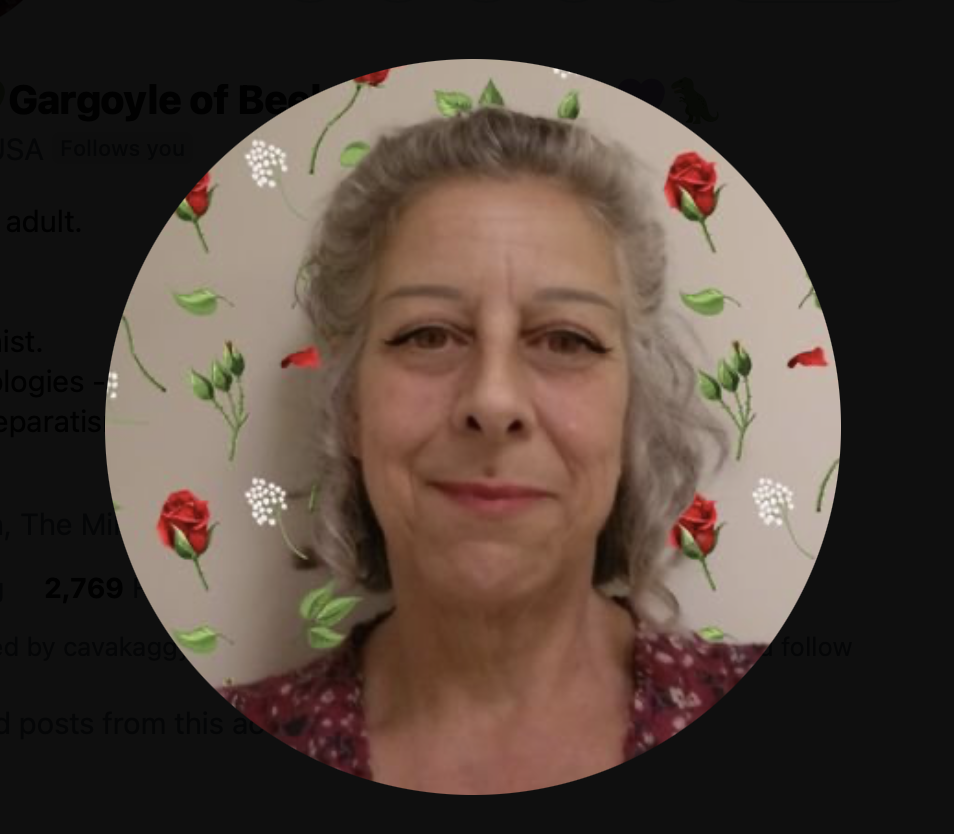

- Gloria's face, the music school receptionist, is the clearest image in this AI photo.
- The face of the [first man](#the-older-slimmer-shorter-greyer-man-the-angel) and the [second men](#seven-devils) are missing.
- The eyes are from [the deep-set monstrous man](#5-dark-thick-curly-haired-deep-set-man), and the overall face shape is the [fourth man](#4-bruno), probably Gloria's brother Bruno.
- The arrogance of the gang and their absolute certainty they will never be brought to justice is staggering.
- The account today in January 2026 has the back of someone's head as a profile pic and is posting the same wild and sexist content as before.

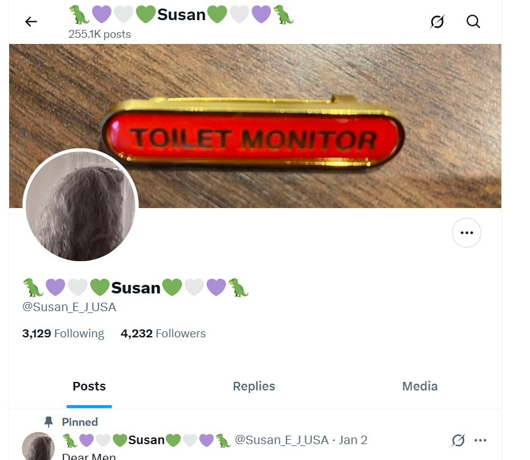

- This continuing account suggests to me that the porn-gangs are heavily involved in disrupting women's rights as the most significant threat to their criminal porn genres.
- I believe this is further evidence towards my suspicion regarding the porn-gangs of UK and Spain being heavily involved in the production and protection of the online self-harming and transing of children, mainly girls; another lucrative porn genre.

### The L'Amistat Quart band

- When you do an online search for *Vidal Sastre Sanchez Hornero*, the first result that comes up is for a band  called the [Musical Group of Friendship](https://www.lamistatquart.com/), a band located in Quart de Poblets, an area of Valencia city.

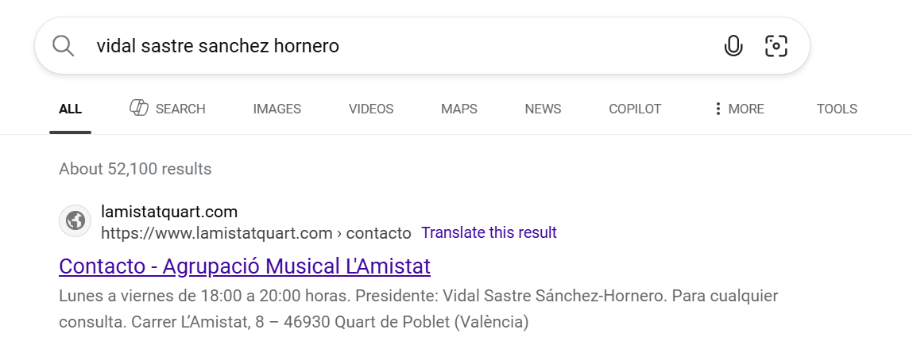

- Interestingly, the URL and the name of the band plus the location suggest **four friends**, a reference not lost on me now.
- Vidal Sastre Sanchez Hornero is listed as the director of the band.
- The band is supported by numerous government organizations - at least the website says so - including the Generalitat.
- This is the band where we see [a young girl's *funeral* taking place](../../timeline/2023/june.md#another-young-girls-funeral), just like [mine](../../timeline/2023/june.md#monday-12th-june-2023) and, just like me, the experience will have been utterly life changing and not in a good way.
- Remember; I use the word *funeral* as this is the word Domingo used.
- There are other significant creepy videos of this band performing.
- Here's another reference to a "funeral" or "sale" of a groomed young woman from the band in Valencia.

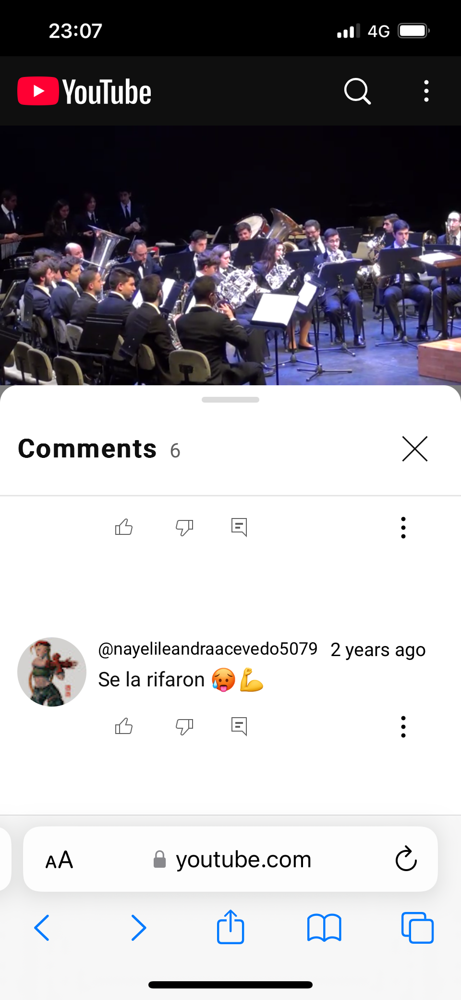

- "Se la rifaron" means, they sold her off.
- If you listen to the recording, at a certain point in the performance, the trumpet player plays in a very sexually suggestive manner, *stripper style*.
- Here's another person filming the event; I guess everyone wants their own copy.

- When I read the website text previously, I noticed a statement about the female members of the band that made me shudder a little. It said something like, "and we have the unconditional support of all the girls".

#### The best band in the Valencian region

- Further down the list, we see a [newspaper article dated 21st October 2024](https://www.levante-emv.com/horta/2024/10/21/amistat-quart-de-poblet-mejor-banda-comunitat-valenciana-109945426.html) reporting on an award ceremony that had taken place on the weekend of the 19th October.
- This at the same time I left for Fátima, and was just before my [home security system went dead](../../timeline/2024/october.md#the-router-malfunctions) for a week before I returned home and was [severely poisoned in my apartment](../../timeline/2024/october.md#serious-poisoning-with-intent-to-kill) over a few days.
- One wonders if this was *quite* the alibi for a murder everyone knew was going to happen? And then didn't happen.
- The [trumpet teacher](#the-older-slimmer-shorter-greyer-man-the-angel) stands three men in from the right; a slim and not so tall man - certainly not large, muscular, and lumbering like the other men I remember.
- Did the band know how bad things had got for me, and how I steadfastly refused to back down and leave the children of Dénia in peril, and how much everyone was implicated in their continued sacrifice?
- Did they know I was about to be fired from my job so as not to be witnessed by colleagues slowly dying online from poison coming from the water in my apartment?
- Is this what has happened before to so many women and girls, and beautiful boys, who just want to innocently play music?
- The article states the band is the best in the region.
- We wonder, best at what?
- [Trumpet teacher number one](#the-older-slimmer-shorter-greyer-man-the-angel) stands proudly amongst the men receiving their awards at the prestigious Palau de Arts; although he looks a little shattered to me.

[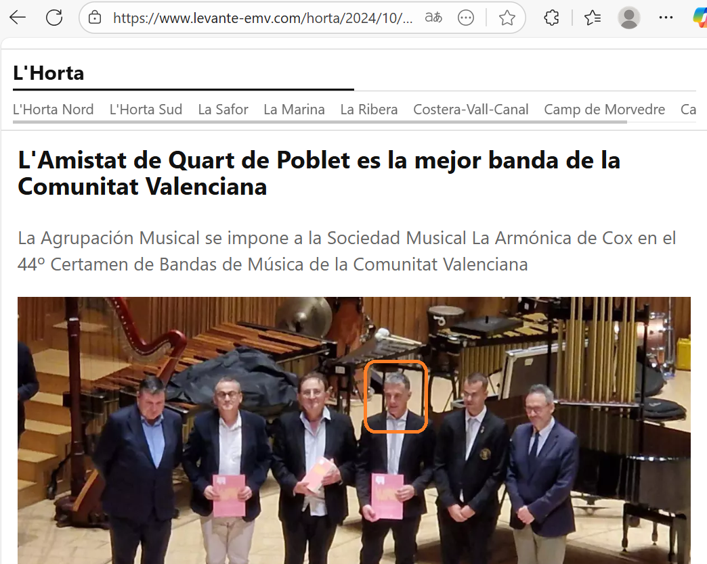](https://www.levante-emv.com/horta/2024/10/21/amistat-quart-de-poblet-mejor-banda-comunitat-valenciana-109945426.html)

- He is also given a special mention of honor!
- Perhaps we are seeing here what happens when the leaders of a culture completely lost to porn and violence against women and children start feeling a little nervous, or is it just ironic timing.
- I still wonder if the Vidal Sastre Sanchez Hornero character is in fact one of the *other* men in this picture.
- Regardless, I do wonder what this poor man I loved so intensely is thinking at this moment.
- Surely the stress must be excruciating.

#### Email address

- The website has a contact email address.
- My guess is this is used to lure targets into communicating with a man they think they're in love with.
- I used it a few times, two years after they hoped I would I expect.
- I wonder how many other women and girls have tried to contact someone they thought they were in love with in this way?
- You can read [my emails here](../../content/images/hornero/mail-to-vssh-new.pdf).
- In October 2025, I find it fascinating to follow the trail of my mind's emergence into clarity and see exactly how effective the attack was on me while it was in full operation while I rented my lovely home in Dénia.

### Sedated training for recognizing faces

- The question is, of course, how did I manage to mistake four separate men for a single person?
- Let's examine that.
- I was living alone and had no social life.
- I was being drugged continually with substances that blurred my vision and made my thoughts extremely unclear.
- I was being sedated and likely sexually assaulted, except … 
- Is it possible that the four of them treated me very nicely, sweetly, intimately but non-sexually, while I was sedated at home prior to 12th June 2023, with the intention of sexual abuse happening on that night as a kind of *grand finale*?
- Was the enormous and exaggerated anxiety I felt just after the attack on the 12th June 2023 in fact (and it makes much more sense to be) due to the grand rape-gang finale having occurred at my house that night?
- Could part of the mind training and manipulation (*rehearsals* he called it at class) have included staring at me full in the face while I was sedated and my eyes were open and I was looking straight at them so I would recognize their faces in real life?
- If they had assaulted me prior to June 12th 2023, I would have found them frightening in real life, and I didn’t, although they gave me a bad feeling that made me anxious and recoil… apart from the first older man who I never stopped having an extremely good feeling about.
- From 12th June 2023, I *did* find him frightening, and ran away when [I saw one of them at Alicante airport](../../timeline/2023/june.md#sunday-18th-june-alicante-airport); I believe this one was the [unknown man that led the chamber music class](#4-bruno) so it is likely sedated rape had begun.
- This whole process is so professional, so finely-tuned; none of them felt they were taking *any risk at all*. They must have done the same to hundreds, perhaps thousands of women and girls.

### The Truwoman Show or Please Turn My Wife into a Porn Star

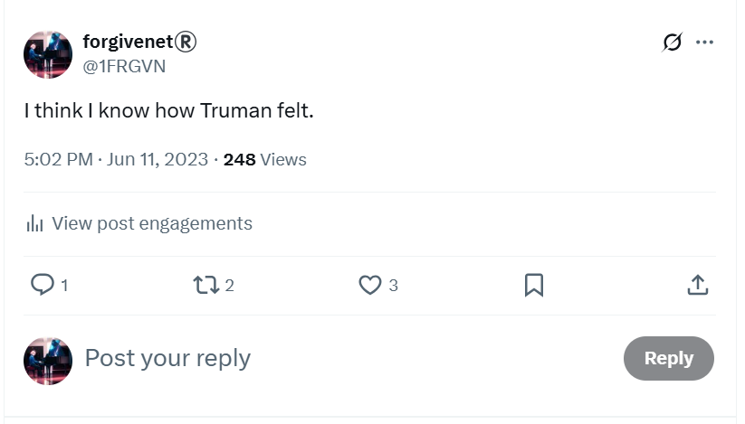

- I’m guessing this is a porn genre and many millions of men and porn addicts internationally know about it, particularly in Spain.
- A great deal of police will be subscribers.
- They will live stream the whole thing most likely, as a kind of porn-reality show.
- The series probably includes a live-streamed gang-rape as  grander-grand finale in which the target is not sedated and recognizes all the men that have been *training* her.
- They must charge exorbitant fees for this.
- I wouldn't be surprised if this has killed women and girls outright with the shock; something the pornographers hope for probably as the more horrible for the victim, the more money they make.
- Women like [Rocio Vidal](../../timeline/2023/october.md#rocio-vidal) and the sports woman I mentioned in [my handwritten letters](../../timeline/2024/august.md#the-handwritten-letters) are likely viable targets requested by paying viewers and maybe blackmailed into participating rather than sedated (especially if they're famous).
- It must be common knowledge across the world, and that’s fundamentally why all my complaints are ignored.
- The perverts have certainly evolved over the years from targeting wealthy women with body-cams to setting up a kind of Truwoman Show in people's homes… just another sickly-inventive way men have found to delight and get boners at the destruction of women and now children too.
- This is the *only explanation* for the enormous resources spent on terrorizing me. 

#### Is this why the McCann case continues to falter?

- The sedating MO is exactly like the McCann case.
- Could this be why the case stalled so badly in the beginning, and why they're trying to pin an extremely professional kidnap job onto an obvious opportunist?
- You only have to look up spy cam porn online to see millions of people unaware they’re being filmed and my guess is a lot of this is coming from Spain and Portugal.

#### Sedating porn is normal now

- We were all horrified at the Gisele Pelicot case; but perhaps this is considered completely acceptable by pornographers and billions of porn viewers.
- I guess the paying viewers feel like they've not quite reached the vileness of child or baby rape but at least they're still getting a sexual hit off something equally abhorrent towards women and girls.
- I wonder if the audiences can request the gangs target their wives or girlfriends, or colleagues maybe, a sort of evolved *reader's-wives*.
- Is this what happened to [Mrs Lara](../../evidence/maybes.md#alice-lara), and Lorraine found out somehow… and reported… and was ignored... and was then targeted online and manipulated into killing herself?
- Was Mike Wenham manipulated into everything he did too? If so, for what purpose.
- Is this the backdrop to many of my professional experiences, especially [Polygon](../../timeline/2023/november.md#polygon)?

### My role

- And running through all this evil and vileness is my journey through it.
- I must have been judged just another *silly little girl*, ready for targeting.
- When they found out I was already a child rape victim, with the films to prove it, they must have thought me non-human and from there it was very easy for everyone to justify my assured demise.
- They must have thought me an easy target with no friends or family, completely isolated, and yet something was going on that no one could have imagined and, once the divine trap was operational - set in motion decades before - there was no escape, and even as the bear teeth tightened down on the conspiring fools, they still had so little respect for women, girls, children, and babies, they didn’t feel until it snapped shut.
- Miracles.

### Future optimisms 

- The Rape Gang Inquiry has suggested that they might be able to get the police to re-investigate my original Tottenham rape gang case from 1989.
- Except, now, they cannot possibly investigate those crimes without casting an eye on the decades long international conspiracy against me.
- How exciting!
- Some amazing investigatory team will be winning official awards for their career-case work ensnaring the nastiest, vilest, pedo-porn gang and serial-killing international online community of perverts and homicidal maniacs the world has ever known.
- May it be very very soon.
- And I myself will buy them all a non-toxic pint.

## Notes on my investigation

- In this section I will post important points published in earlier commits.
- I believe that whoever [the original man](#the-best-band-in-the-valencian-region) is that I continue to have a good feeling about; his role was *bait*.
- I wonder why they chose him when I guess they could have picked anyone at all.
- I found the name Vidal Sastre Sanchez Hornero registered in the Generalitat Valenciana systems even though a [government official](../../timeline/2024/october.md#meeting-inma-and-paloma-the-spanish-official-in-madrid) told me no record of this person could be found.
- When she told me this, at exactly the same time, I was looking at his name on official Generalitat government lists.

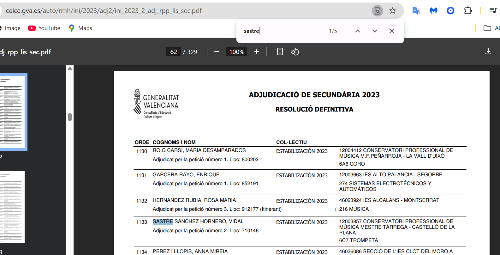

!!! tip "Curiosities"
    - I wonder if this another tampered-with online alibi. 
    - The listing states this person is stationed at the conservatory of Castellon and not in Dénia, 200kms away. 
    - Is this where he went at the beginning of the year academic year that started in 2023?
    - Why did he only turn up in November 2022 in Dénia? What kept him from starting the academic year at the beginning, like everyone else?
    - Indeed, could a person possibly do all this work, *and* work fulltime as a secondary school teacher in the Valencia region as he (one of the others pretending to be him) stated to me in class?
    - Or, is this a listing for the *real* Vidal Sastre Sanchez Hornero who is one of the other men from the L'Amistat Quart band; the solid alibi they teased me endlessly online about having?
    - Or, does this named person not exist at all, and instead the name is a useful alibi for perverted criminal practices perfected over many years?

- At the same time I was looking at references like these, his [prestigious award was being collected](#the-lamistat-quart-band) and reported on by the Spanish news media.
- I also had his Generalitat email address from conservatory teaching documentation from January 2023.
- One wonders how many people knew I was about to be severely poisoned just weeks after making [an online video](https://www.youtube.com/watch?v=VIYsj4OgiYA) explaining inexplicable and overwhelming sexual arousal in my apartment, and that I suspected it meant I was being filmed masturbating.
- It seems likely that everyone expected me to die, criminal and corrupt, and then the rape-porn-industry in Spain could carry on as normal and continue to pay for everyone's Ferrari's.
- There are a bunch more references for this name online, including references which come from the Generalitat's formal lists of teachers.

- Online references include a number of pictures I remembered as being the man who turned up to teach classes.

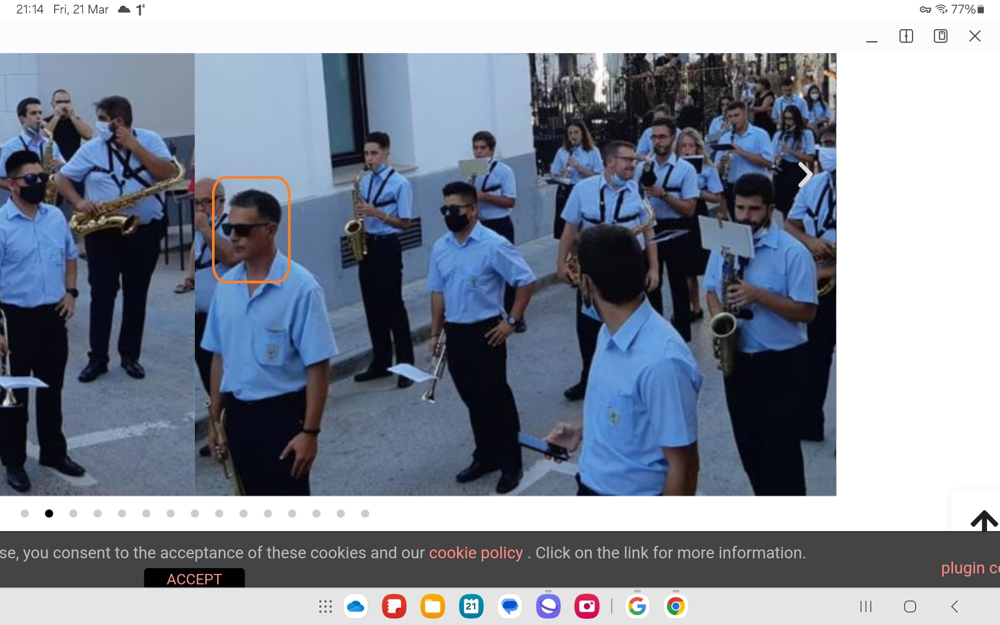
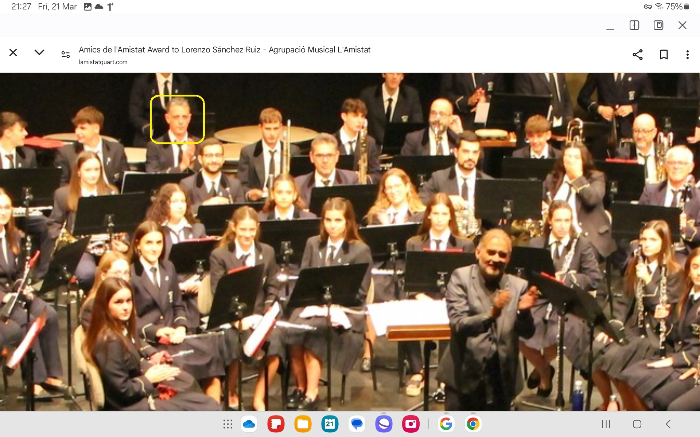
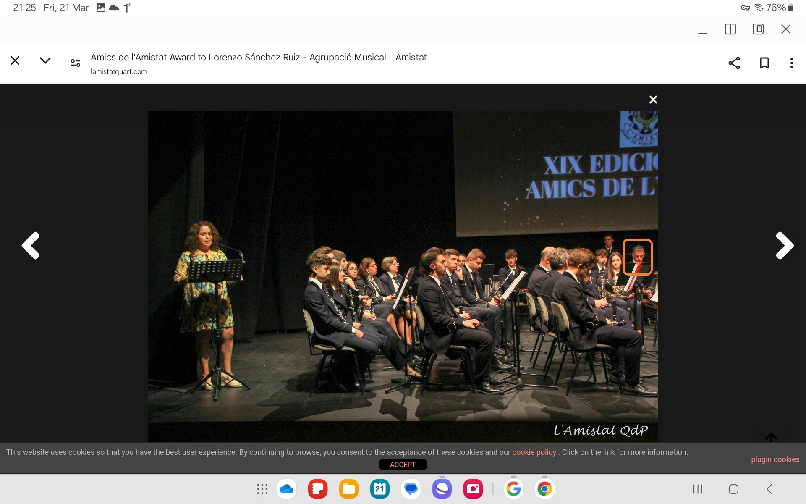
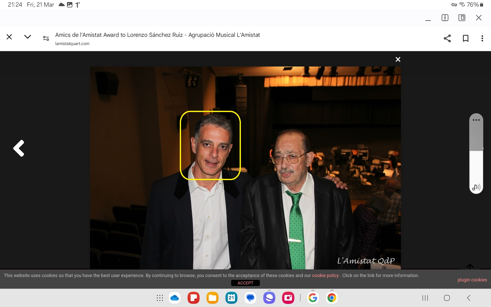
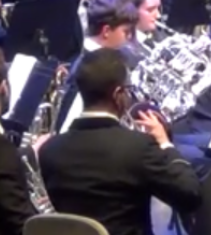

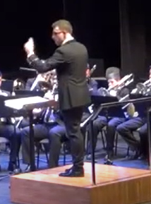

- Online references would shift and change whenever I checked online. I realized I was being *fed* information and kept from anything that might bring the truth to light.

### Truth emerging

- It was while I was preparing this statement, slowly laboriously and extremely unpleasantly, I realized with horror there was more than one trumpet teacher at classes!
- This puts the actions of teachers and staff at the conservatory in a completely different light.
- Everything they did was as an alibi for the real crimes.
- Whenever, eventually, my life was over - slavery, prostitution, porn actress, drug addiction, madness, suicide, murder, whatever - all I would have ever told anyone was that I was being bullied at the conservatory. 
- The big men could then, if necessary, put the women up to take all the blame, but they knew that this would never happen anyway due to how many *important* people have been involved in maintaining these sick practices.
- Because of this certainty, the events and their actors take a grotesque and evil form.
- I do have a small memory of Pablo asking the trumpet teacher one time [where the other guy was](../../timeline/2023/january.md#chamber-music-classes-continue), but amazingly now we know that even Pablo, a 14-year-old boy, was aware of what was going on and so these words were lines he was reading on instruction.
- Are the teenage boys and girls aware of everything that these men have been doing? Surely not!? 
- Although, people talk, and I expect everyone must know about how much danger the children are in.

!!! danger "Would anyone want to live here if they knew how much danger the wealthy, elderly, women and children are in?"
    - Visitors to the region should be warned that it is highly likely their online activity will be monitored very closely by local criminal gangs.
    - Visitors should expect that to happen and act accordingly.
    - Visitors should also be informed that many hotels, AirBnBs, rentals, and houses for sale may be fitted with spy-cam technology.
    - Even 4g/5g mobile networks, without access to wifi routers, are vulnerable as I have found out.

- These people are not hiding, but I believe they are drugging and sedating women and girls, and not just here, probably all over the region wherever adult men have unrestricted access to women, teenage girls, and younger.
- Wherever VSSH has been listed as teaching in the Generalitat Valenciana region, could there have been a young girl's *funeral*?
- I have seen this name listed in the Generalitat teacher lists for Castellon, Bunol, and Alicante, amongst other places.
- I thought maybe that *Vidal Sastre Sanchez Hornero* was the name of one, and only one, of the gang. Now I'm thinking that, perhaps, it is a collection of four of the gang's surnames.
- There will be some sick reason for the choice of name if it is not a real name.
- It was not the name of the man, or men, who came to teach class to me and Pablo; one of whom I am led to believe is called Antonio Ruiz.
- Could Antonio have been simply used as bait for a sinister sex gang operating and controlling the region's conservatories?
- Were his children in danger of kidnap, as he suggested online to me at one point?
- Whoever these people are, they are proud of their behavior, and arrogant enough to showcase their "controlling young girls" activity on [YouTube](https://www.youtube.com/@saxofonator/search?query=vidal%20sanchez%20sastre%20horneros), although a lot of the more sinister films seem to have been removed now.
- It appears that all attacks, or "funerals" of women are videoed and shared, and certainly my "funeral" on [12th June 2023](../../timeline/2023/june.md#monday-12th-june-2023), was excitedly recorded on the mobile phones of all present, including teachers, staff, and students.

!!! danger "Shocking"
    - If I'm right about this, then the children of the conservatory would also have to be somewhat complicit in the deception and targeting of female students by countless adult males and their female assistants.
    - This is a somewhat horrific thing to consider and I do hope it is not true but given statistics like all 11-year-olds in the UK have seen pedophile gang rape porn and worse, usually in school on their mates' phones, then nothing would surprise me anymore.

- Is it possible that what is a well-known and much loved Spanish tradition of destroying single women or girls for fun now a countrywide porn business making millions for porn distribution gangs; each girl delivered up at the appropriate time?
- Given the whole town of Dénia knows of pedophile rape-gang porn I was in from 1989, and doesn't seem to think that is a crime worth reporting, is it possible they also know the details of 1000s of crimes against women and girls and feel a similar disinterest?
- What a hell these poor people are living in!
- I have to say that without God supporting me the whole way through this hell I endured in Dénia, Alicante, Spain, I would not have had the strength to go on, or be here to tell the tale.
- I pray every day that the children will be safe once again.
