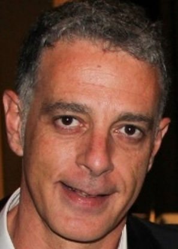
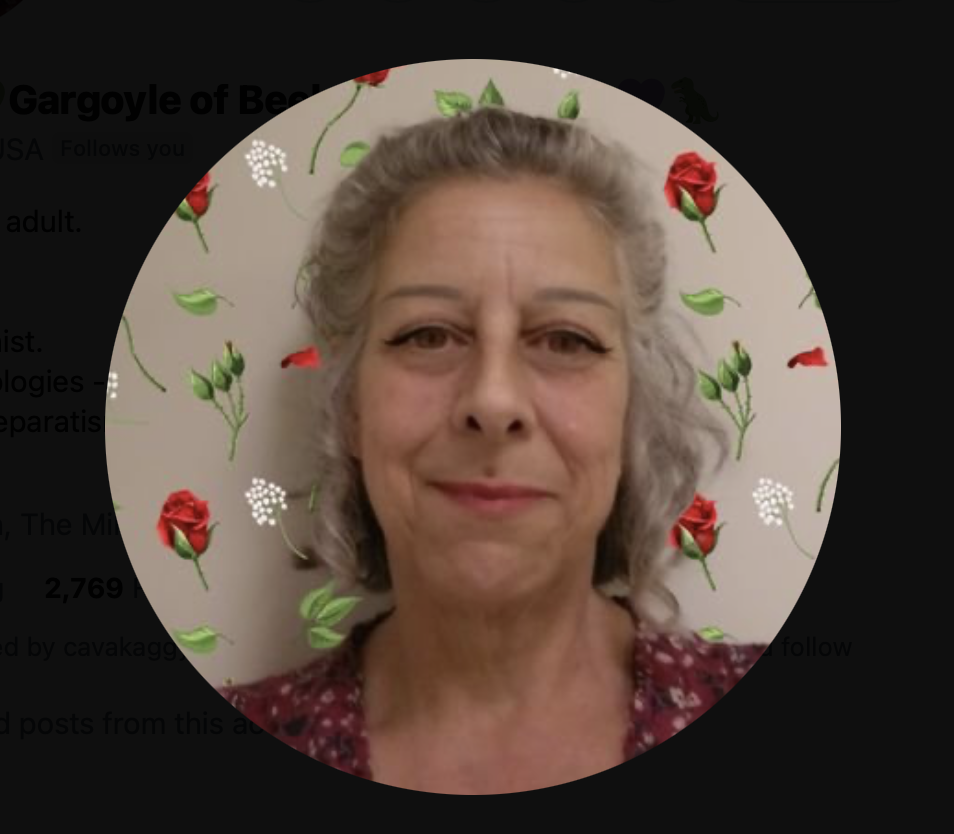

# Protagonists

The pages in this section list the main players in the violent three-year attack on my physical, emotional, sexual, and psychological wellbeing. 

It includes teachers and staff from the conservatory of Dénia, and others.

The people involved were seasoned professionals in the gang-stalking game, and sexual grooming online and in person. Therefore, the chances of me being the only victim is *zero*. 

The chances of me being the oldest victim, at least in the conservatory system, is high.

## Vidal Sastre Sanchez Hornero

- The *main* porn genre created throughout November 2022 to June 2023 in person with the support of teachers and staff at the conservatory, and then beyond at my apartment and perhaps even while traveling for work is called *switcheroo*.
- From research, I understand this commonly means a blindfolded target for multiple men.
- In my case, the blindfold was continuous drugging and poisoning which made my sight extremely blurred, and intricately choreographed scenarios at the conservatory in which the men would literally switch to play the role of the trumpet teacher with this name.
- This must mean, in my view, that the conservatory is wired up with spy-cams that also livestream onto porn networks.

### Four distinct men 

#### At least four

- As my mind clears and my heart heals from decades of abuse at the hands of the Canos, the Smiths, and their associates in Dénia, France, and North London, clearer memories of what happened to me and by whom are returning.
- I realize now that the *trumpet teacher* was made up of (minimum) four distinct men who came to the conservatory of Dénia under the role of teacher and using the name Vidal Sastre Sanchez Hornero.
- As I suspected, the fact that there were so few chamber music classes that year must have been due to the unavailability of some or all of the men on certain nights, while it was *essential* they all turned up at my apartment after class while I was sedated.

### The older, slimmer, greyer man

- He may have been the first of these men I saw at class before a switch took place.
- I never stopped having an extremely good feeling about this man.
- I only have four solid memories of him where I'm not confusing him with someone else:

    - The time we sat together in class and [I believed he was fundamentally on my side and conspiring with me against Domingo](../../timeline/2023/february.md#plot-awareness). My words on that evening upset him; he understood what I was doing and the way I rewrote the nature of the conspiracy felt right to him.
    - The time not long after when I remember waking up in my bed at home and he was [crying in my arms](../../timeline/2023/march.md#dreaming-of-the-trumpet-teacher).
    - There was another time I saw him in class for a minute or two, and I was delighted to see him again - now I understand it was unexpectedly - and I smiled and he ignored me, looking sad and downwards, as I said goodbye and left for the evening.
    - Then, when the attraction-trick stopped working so well, I guess, and they decided to [wheel him out again](../../timeline/2023/december.md#the-trumpet-teacher-has-a-brother) so I could be re-triggered, and I thought it was the trumpet teacher's twin brother!

- This is the man I was convinced I loved and who loved me back. 

    

- This is an old picture, the man is about 10 years older now. However, this younger picture demonstrates the likeness between him and the [next bloke I mention](#the-brother-or-mark-from-english-class-in-2013) who must be a family relation of some sort.
- I wonder if the gypsies made sure that one of the men would be someone I was strongly attracted to in order for the trick to work?
- Did they examine our astrological charts or consult a witch?
- Did they use and abuse Saint Valentine in evil rituals designed for controlling women and girls?
- It would not surprise me, at all.
- Regardless, the fact is that without these extremely good feelings I had for this man, and still do, and these short moments in time, we probably wouldn't be where we are today which is becoming something rather marvelous in my view.
- It is my view that this man made a mistake being involved with these criminals and is innocent. Perhaps he doesn't feel this way. That would be normal.

### The brother, or Mark from English class in 2013

- There could be two similar looking men making up these memories.
- They were taller, darker men that looked enough like the [older, slimmer man](#the-older-slimmer-greyer-man) for me to mistake them with him after what I assume had been some sort of [sedated psychological mistaking-people training](#sedated-training-for-recognizing-faces).

#### The younger brother of the first man

- He was the man [Patricia Penny *introduced* me to in Benijembla](../../timeline/2022/november.md#walking-in-benijembla-with-the-english-ladies) the week before he turned up at class.
- He was the man that [stalked me at Lourdes](../../timeline/2021/july.md#the-portuguese-man-next-door).
- I don't have a picture of this man but would recognize him immediately.

#### Mark from English class in 2013

- Another man reminded me of [a student from my English class in 2013](../../timeline/early-years/2008.md#working-for-lorraine-blackbourn) who may have been called Mark.
- He was someone I had [found attractive when I met him in 2013](../../timeline/early-years/2008.md#working-for-lorraine-blackbourn) when I worked for Lorraine Blackbourn.
- It's likely this man is related to Lorraine Blackbourn's ex-husband and indeed was of the same size and shape, and facial features.
- He was the man I saw most often at the conservatory, and I was always anxious around him.
- I remember seeing this man numerous times, including but not limited to the following examples:

    - At the first class in [November 2022](../../timeline/2022/november.md#the-trumpet-teacher) there he was hovering over Ana Requena after timing a meeting at the toilet.
    - He was the man involved in [poisoning me by overdose](../../timeline/2023/january.md#serious-poisoning-at-chamber-music-class) with the doctor who had a class scheduled before ours, but only came twice.
    - He was the man who brought the music sheets from Gloria and [handed me his phone](../../timeline/2023/march.md#the-trumpet-teacher-hands-me-his-phone).
    - The man who [was angry at me](../../timeline/2023/april.md#back-in-chamber-music-class) after I followed the `@jctot19` account.
    - The man who switched with [the other large man](#an-unknown-man-i-may-have-a-picture-of) right at the end of the [May 2023 concert](../../timeline/2023/may.md#chamber-music-concert).
    - The man who led my *funeral* on [12th June 2023](../../timeline/2023/june.md#monday-12th-june-2023).

- I don't have a picture of this man but would recognize him immediately.

### An unknown man I may have a picture of

- There was a similarly tall but even larger lumbering man that I remember seeing a few times.
- He was the man who organized and managed the [chamber music concert](../../timeline/2023/may.md#chamber-music-concert) with Carmen Cano in attendance (masquerading or not) as Pablo's mum.
- He had a soft pleasant voice and he was the man who left messages on my phone.
- He was the man I spoke to who [mentioned a *double session* in a perverted way](../../timeline/2023/may.md#teb-with-robin) the night before I saw possible evidence of being anally raped.
- He did look like an older version of the young man in the middle of this picture with his arms around two siblings (I assume).

- The younger brother in the pic looks like the man who came out of the tunnel and [blew at me in the face in March 2024](../../timeline/2024/march/13-end.md#wednesday-13th-march) right before I became convinced I was going to be murdered.
- I'm not sure I have any more solid memories of this man at the conservatory.
- The girl in this picture is very familiar, I don't know why yet.
- I'm guessing everyone in Dénia and the Marina Alta region knows this man.

### Dark thick-curly-haired deep-set man

- There was another man I have a few memories of which I have already documented.
- I don't remember him ever being at the conservatory.
- I remember him [in my bed calling my name](../../timeline/2023/april.md#dreaming-of-the-trumpet-teacher) which I now believe was not a dream.
- He was the man I saw in the banged up Peugeot on the 11th June 2023, [the day before my *funeral*](../../timeline/2023/june.md#sunday-11th-june) and [driving past me at the beach with the doctor in the passenger seat](../../timeline/2023/june.md#the-trumpet-teacher-and-the-doctor-joan-drive-past-me), and [driving Ana Requena's blue car slowly past me](../../timeline/2023/october.md#the-trumpet-teacher-drives-past-me-in-his-car).
- He was also reminiscent of [Patricia Penny's husband](../../timeline/2021/december.md#christmas) and the [man who came out to terrorize me on Halloween](../../timeline/2023/october.md#halloween) but not exactly the same - those two men could well be the same man.
- This trumpet player, at the *funeral* of the young girl behind him, looks like him. 

- You'll notice Carmen Cano was in attendance here too. She gets around doesn't she.

- I'm pretty sure these films they're so happy and safe to publish are the porn-genre adverts.
- Could this be him as a young man?

- Although I did think I saw the grown-up version of this person on the beach on [6th October 2024](../../timeline/2024/october.md#sunday-6th-october) and have a body cam image of that man who was very different looking, short and quite ugly. Perhaps they're related.
- I believe this is also the man who [interviewed me for a tech job where I'd be looking at genitals all day](../../timeline/early-years/2016.md#march) in 2016; a man I saw online and in-person.
- They are certainly the man depicted on the [book cover](../../index.md).
- I'm guessing everyone in Dénia knows this man.
- They even AI'ed his face and mixed it with Gloria the receptionists face and tormented me endlessly with a fake account having this profile pic.

- This pic could be a number of the trumpet teachers faces mixed with Gloria, the music school receptionist.
- However, the face of the [first man](#the-older-slimmer-greyer-man) is missing from here.
- The eyes are from this man, the face shape is the [third](#an-unknown-man-i-may-have-a-picture-of), I possibly don't see the [second man](#the-brother-or-mark-from-english-class-in-2013) in here either.
- Gloria's face, the school receptionist, stands out the most, of course.
- The arrogance of the gang and their certainty they will never be brought to justice is staggering.
- The posts and language coming from this account I suspect was generated by powerful and unfiltered AI software (there was an unusual repeated pattern to the posts) with Sandra Smith controlling.

### The L'Amistat Quart band

- When you do an online search for *Vidal Sastre Sanchez Hornero*, the first result that comes up is for a band  called the [Musical Group of Friendship](https://www.lamistatquart.com/), a band located in Quart de Poblets, an area of Valencia city.

- Interestingly, the URL and the name of the band plus the location suggest **four friends**, a reference not lost on me now.
- Vidal Sastre Sanchez Hornero is listed as the director of the band.
- The band is supported by numerous government organizations - at least the website says so - including the Generalitat.
- This is the band where we see [a young girl's *funeral* taking place](../../timeline/2023/june.md#youtube), just like [mine](../../timeline/2023/june.md#monday-12th-june-2023) and, just like me, the experience will have been utterly life changing and not in a good way.
- Remember; I use the word *funeral* as this is the word Domingo used.
- There are other significant creepy videos of this band performing.
- Here's another reference to a "funeral" or "sale" of a groomed young woman from the band in Valencia.

- "Se la rifaron" means, they sold her off.
- If you listen to the recording, at a certain point in the performance, the trumpet player plays in a very sexually suggestive manner, *stripper style*.
- Here's another person filming the event; I guess everyone wants their own copy.

- When I read the website text previously, I noticed a statement about the female members of the band that made me shudder a little. It said something like, "and we have the unconditional support of all the girls".

#### The best band in the Valencian region

- Further down the list, we see a [newspaper article dated 21st October 2024](https://www.levante-emv.com/horta/2024/10/21/amistat-quart-de-poblet-mejor-banda-comunitat-valenciana-109945426.html) reporting on an award ceremony that had taken place on the weekend of the 19th October.
- This at the same time I left for Fatima, and was just before my [home security system went dead](../../timeline/2024/october.md#the-router-malfunctions-while-im-in-fatima) for a week before I returned home and was [severely poisoned in my apartment](../../timeline/2024/october.md#serious-poisoning-with-intent-to-harm-or-kill) over a few days.
- One wonders if this was *quite* the alibi for a murder everyone knew was going to happen? And then didn't happen.
- The [trumpet teacher](#the-older-slimmer-greyer-man) stands three men in from the right; a slim and not so tall man - certainly not large, muscular, and lumbering like the other men I remember.
- Did the band know how bad things had got for me, and how I steadfastly refused to back down and leave the children of Dénia in peril, and how much everyone was implicated in their continued sacrifice?
- Did they know I was about to be fired from my job so as not to be witnessed by colleagues slowly dying online from poison coming from the water in my apartment?
- Is this what has happened before to so many women and girls, and beautiful boys, who just want to innocently play music?
- The article states the band is the best in the region.
- We wonder, best at what?
- [Trumpet teacher number one](#the-older-slimmer-greyer-man) stands proudly amongst the men receiving their awards at the prestigious Palau de Arts; although he looks a little shattered to me.

- He is also given a special mention of honor!
- Perhaps we are seeing here what happens when the leaders of a culture completely lost to porn and violence against women and children start feeling a little nervous, or is it just ironic timing.
- I still wonder if the Vidal Sastre Sanchez Hornero character is in fact one of the *other* men in this picture.
- Regardless, I do wonder what this poor man I loved so intensely is thinking at this moment.
- Surely the stress must be excruciating.

#### Email address

- The website has a contact email address.
- My guess is this is used to lure targets into communicating with a man they think they're in love with.
- I used it a few times, two years after they hoped I would I expect.
- I wonder how many other women and girls have tried to contact someone they thought they were in love with in this way?
- You can read [my emails here](../../content/images/hornero/mail-to-vssh-new.pdf).
- In October 2025, I find it fascinating to follow the trail of my mind's emergence into clarity and see exactly how effective the attack was on me while it was in full operation while I rented my lovely home in Dénia.

### Sedated training for recognizing faces

- The question is, of course, how did I manage to mistake four separate men for a single person?
- Let's examine that.
- I was living alone and had no social life.
- I was being drugged continually with substances that blurred my vision and made my thoughts extremely unclear.
- I was being sedated and likely sexually assaulted, except … 
- Is it possible that the four of them treated me very nicely, sweetly, intimately but non-sexually, while I was sedated at home prior to 12th June 2023, with the intention of sexual abuse happening on that night as a kind of *grand finale*?
- Was the enormous and exaggerated anxiety I felt just after the attack on the 12th June 2023 in fact (and it makes much more sense to be) due to the grand rape-gang finale having occurred at my house that night?
- Could part of the mind training and manipulation (*rehearsals* he called it at class) have included staring at me full in the face while I was sedated and my eyes were open and I was looking straight at them so I would recognize their faces in real life?
- If they had assaulted me prior to June 12th 2023, I would have found them frightening in real life, and I didn’t, although they gave me a bad feeling that made me anxious and recoil… apart from the first older man who I never stopped having an extremely good feeling about.
- From 12th June 2023, I *did* find him frightening, and ran away when [I saw one of them at Alicante airport](../../timeline/2023/june.md#sunday-18th-june-alicante-airport); I believe this one was the [unknown man that led the chamber music class](#an-unknown-man-i-may-have-a-picture-of) so it is likely sedated rape had begun.
- This whole process is so professional, so finely-tuned; none of them felt they were taking *any risk at all*. They must have done the same to hundreds, perhaps thousands of women and girls.

### The Truwoman Show or Please Turn My Wife into a Porn Star

- I’m guessing this is a porn genre and many millions of men and porn addicts internationally know about it, particularly in Spain.
- A great deal of police will be subscribers.
- They will live stream the whole thing most likely, as a kind of porn-reality show.
- The series probably includes a live-streamed gang-rape as  grander-grand finale in which the target is not sedated and recognizes all the men that have been *training* her.
- They must charge exorbitant fees for this.
- I wouldn't be surprised if this has killed women and girls outright with the shock; something the pornographers hope for probably as the more horrible for the victim, the more money they make.
- Women like [Rocio Vidal](../../timeline/2023/october.md#rocio-vidal) and the sports woman I mentioned in [my handwritten letters](../../timeline/2024/august.md#the-letters) are likely viable targets requested by paying viewers and maybe blackmailed into participating rather than sedated (especially if they're famous).
- It must be common knowledge across the world, and that’s fundamentally why all my complaints are ignored.
- The perverts have certainly evolved over the years from targeting wealthy women with body-cams to setting up a kind of Truwoman Show in people's homes… just another sickly-inventive way men have found to delight and get boners at the destruction of women and now children too.
- This is the *only explanation* for the enormous resources spent on terrorizing me. 

#### Is this why the McCann case continues to falter?

- The sedating MO is exactly like the McCann case.
- Could this be why the case stalled so badly in the beginning, and why they're trying to pin an extremely professional kidnap job onto an obvious opportunist?
- You only have to look up spy cam porn online to see millions of people unaware they’re being filmed and my guess is a lot of this is coming from Spain and Portugal.

#### Sedating porn is normal now

- We were all horrified at the Gisele Pelicot case; but perhaps this is considered completely acceptable by pornographers and billions of porn viewers.
- I guess the paying viewers feel like they've not quite reached the vileness of child or baby rape but at least they're still getting a sexual hit off something equally abhorrent towards women and girls.
- I wonder if the audiences can request the gangs target their wives or girlfriends, or colleagues maybe, a sort of evolved *reader's-wives*.
- Is this what happened to [Mrs Lara](../../evidence/maybes.md#alice-lara), and Lorraine found out somehow… and reported… and was ignored... and was then targeted online and manipulated into killing herself?
- Was Mike Wenham manipulated into everything he did too? If so, for what purpose.
- Is this the backdrop to many of my professional experiences, especially [Polygon](../../timeline/2023/november.md#polygon)?

### My role

- And running through all this evil and vileness is my journey through it.
- I must have been judged just another *silly little girl*, ready for targeting.
- When they found out I was already a child rape victim, with the films to prove it, they must have thought me non-human and from there it was very easy for everyone to justify my assured demise.
- They must have thought me an easy target with no friends or family, completely isolated, and yet something was going on that no one could have imagined and, once the divine trap was operational - set in motion decades before - there was no escape, and even as the bear teeth tightened down on the conspiring fools, they still had so little respect for women, girls, children, and babies, they didn’t feel until it snapped shut.
- Miracles.

### Future optimisms 

- The Rape Gang Inquiry has suggested that they might be able to get the police to re-investigate my original Tottenham rape gang case from 1989.
- Except, now, they cannot possibly investigate those crimes without casting an eye on the decades long international conspiracy against me.
- How exciting!
- Some amazing investigatory team will be winning official awards for their career-case work ensnaring the nastiest, vilest, pedo-porn gang and serial-killing international online community of perverts and homicidal maniacs the world has ever known.
- May it be very very soon.
- And I myself will buy them all a non-toxic pint.

## Notes on my investigation

- In this section I will post important points published in earlier commits.
- I believe that whoever [the original man](#the-best-band-in-the-valencian-region) is that I continue to have a good feeling about; his role was *bait*.
- I wonder why they chose him when I guess they could have picked anyone at all.
- I found the name Vidal Sastre Sanchez Hornero registered in the Generalitat Valenciana systems even though a [government official](../../timeline/2024/october.md#madrid-and-paloma) told me no record of this person could be found.
- When she told me this, at exactly the same time, I was looking at his name on official Generalitat government lists.

!!! tip "Curiosities"
    - I wonder if this another tampered-with online alibi. 
    - The listing states this person is stationed at the conservatory of Castellon and not in Dénia, 200kms away. 
    - Is this where he went at the beginning of the year academic year that started in 2023?
    - Why did he only turn up in November 2022 in Dénia? What kept him from starting the academic year at the beginning, like everyone else?
    - Indeed, could a person possibly do all this work, *and* work fulltime as a secondary school teacher in the Valencia region as he (one of the others pretending to be him) stated to me in class?
    - Or, is this a listing for the *real* Vidal Sastre Sanchez Hornero who is one of the other men from the L'Amistat Quart band; the solid alibi they teased me endlessly online about having?
    - Or, does this named person not exist at all, and instead the name is a useful alibi for perverted criminal practices perfected over many years?

- At the same time I was looking at references like these, his [prestigious award was being collected](#the-lamistat-quart-band) and reported on by the Spanish news media.
- I also had his Generalitat email address from conservatory teaching documentation from January 2023.
- One wonders how many people knew I was about to be severely poisoned just weeks after making [an online video](https://www.youtube.com/watch?v=VIYsj4OgiYA) explaining inexplicable and overwhelming sexual arousal in my apartment, and that I suspected it meant I was being filmed masturbating.
- It seems likely that everyone expected me to die, criminal and corrupt, and then the rape-porn-industry in Spain could carry on as normal and continue to pay for everyone's Ferrari's.
- There are a bunch more references for this name online, including references which come from the Generalitat's formal lists of teachers.

- Online references include a number of pictures I remembered as being the man who turned up to teach classes.

- Online references would shift and change whenever I checked online. I realized I was being *fed* information and kept from anything that might bring the truth to light.

### Truth emerging

- It was while I was preparing this statement, slowly laboriously and extremely unpleasantly, I realized with horror there was more than one trumpet teacher at classes!
- This puts the actions of teachers and staff at the conservatory in a completely different light.
- Everything they did was as an alibi for the real crimes.
- Whenever, eventually, my life was over - slavery, prostitution, porn actress, drug addiction, madness, suicide, murder, whatever - all I would have ever told anyone was that I was being bullied at the conservatory. 
- The big men could then, if necessary, put the women up to take all the blame, but they knew that this would never happen anyway due to how many *important* people have been involved in maintaining these sick practices.
- Because of this certainty, the events and their actors take a grotesque and evil form.
- I do have a small memory of Pablo asking the trumpet teacher one time [where the other guy was](../../timeline/2023/january.md#chamber-music-classes-continue), but amazingly now we know that even Pablo, a 14-year-old boy, was aware of what was going on and so these words were lines he was reading on instruction.
- Are the teenage boys and girls aware of everything that these men have been doing? Surely not!? 
- Although, people talk, and I expect everyone must know about how much danger the children are in.

!!! danger "Would anyone want to live here if they knew how much danger the wealthy, elderly, women and children are in?"
    - Visitors to the region should be warned that it is highly likely their online activity will be monitored very closely by local criminal gangs.
    - Visitors should expect that to happen and act accordingly.
    - Visitors should also be informed that many hotels, AirBnBs, rentals, and houses for sale may be fitted with spy-cam technology.
    - Even 4g/5g mobile networks, without access to wifi routers, are vulnerable as I have found out.

- These people are not hiding, but I believe they are drugging and sedating women and girls, and not just here, probably all over the region wherever adult men have unrestricted access to women, teenage girls, and younger.
- Wherever VSSH has been listed as teaching in the Generalitat Valenciana region, could there have been a young girl's *funeral*?
- I have seen this name listed in the Generalitat teacher lists for Castellon, Bunol, and Alicante, amongst other places.
- I thought maybe that *Vidal Sastre Sanchez Hornero* was the name of one, and only one, of the gang. Now I'm thinking that, perhaps, it is a collection of four of the gang's surnames.
- There will be some sick reason for the choice of name if it is not a real name.
- It was not the name of the man, or men, who came to teach class to me and Pablo; one of whom I am led to believe is called Antonio Ruiz.
- Could Antonio have been simply used as bait for a sinister sex gang operating and controlling the region's conservatories?
- Were his children in danger of kidnap, as he suggested online to me at one point?
- Whoever these people are, they are proud of their behavior, and arrogant enough to showcase their "controlling young girls" activity on [YouTube](https://www.youtube.com/@saxofonator/search?query=vidal%20sanchez%20sastre%20horneros), although a lot of the more sinister films seem to have been removed now.
- It appears that all attacks, or "funerals" of women are videoed and shared, and certainly my "funeral" on [12th June 2023](../../timeline/2023/june.md#monday-12th-june-2023), was excitedly recorded on the mobile phones of all present, including teachers, staff, and students.

!!! danger "Shocking"
    - If I'm right about this, then the children of the conservatory would also have to be somewhat complicit in the deception and targeting of female students by countless adult males and their female assistants.
    - This is a somewhat horrific thing to consider and I do hope it is not true but given statistics like all 11-year-olds in the UK have seen pedophile gang rape porn and worse, usually in school on their mates' phones, then nothing would surprise me anymore.

- Is it possible that what is a well-known and much loved Spanish tradition of destroying single women or girls for fun now a countrywide porn business making millions for porn distribution gangs; each girl delivered up at the appropriate time?
- Given the whole town of Dénia knows of pedophile rape-gang porn I was in from 1989, and doesn't seem to think that is a crime worth reporting, is it possible they also know the details of 1000s of crimes against women and girls and feel a similar disinterest?
- What a hell these poor people are living in!
- I have to say that without God supporting me the whole way through this hell I endured in Dénia, Alicante, Spain, I would not have had the strength to go on, or be here to tell the tale.
- I pray every day that the children will be safe once again.
