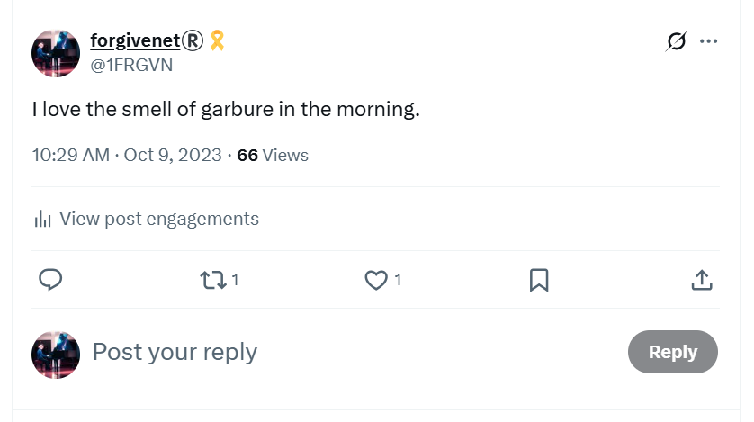
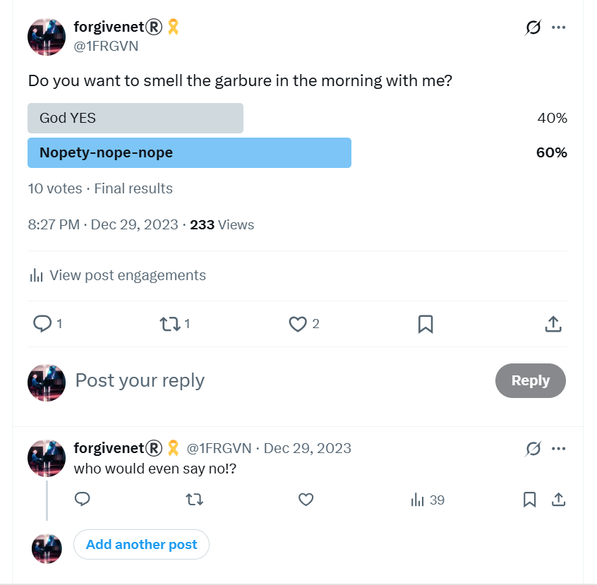
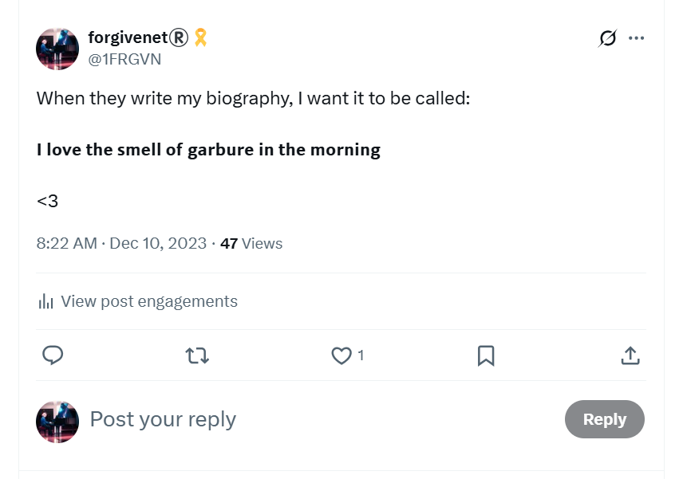
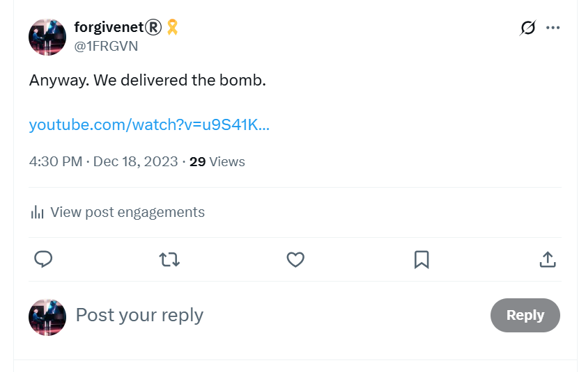
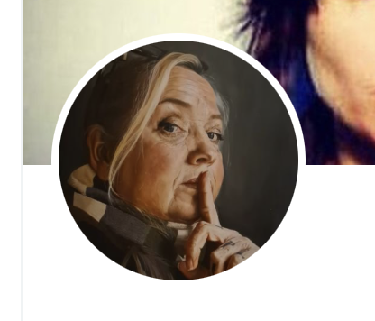

# Memes & triggers

- This pages describes words and symbols used by online manipulators to generate reliable triggers in a target's psyche, in the same way that animal trainers might use sounds and visuals to get animals to do whatever they want them to do.
- Some of these are fairly sinister.
- And some of these memes are mine, because I figured out what they were up to and I played their game back at them by instead shining light into the darkness. 

## I love the smell of garbure in the morning

- My meme.
- My personal favorite.

- I gave at least as good as I got online, certainly in the early days.
- Once I realized I was being full-on cyber-stalked ([12th June 2023](../timeline/2023/june.md#monday-12th-june-2023)) and started recognizing the patterns, I made every attempt to fight back. 
- Lately, I'm probably ahead.
- *I love the smell of garbure in the morning*, is my favorite proprietary meme.
- Garbure is a local dish from the Pyrenees and you can smell it being prepared in the hotel kitchens in Lourdes every morning. 

%20garbure&src=typed_query&f=live)

- I certainly felt that Mary was on my side helping me deal with these people; and that this was mine, Hers, and Saint Bernadette's battle-cry.
- Here's a poll about garbure from December 2023.

- Here's a tweet about how this meme should be the title of my biography.

- I wonder how it must have been for them to have gone from total certainty about my lack of humanity and the inevitability of my doom at their hands, to an inkling something wasn't going the way it usually did, to their stressed states nowadays as the pit of their own making swallows them up.
- I also wonder what it must have been like for the righteous silenced-and-fearful to watch these changes occur, still in marvelous progress.
- When Mary's with you, and they knew She was with me, nothing can hurt you.
- They know this too.
- The only explanation for their outrageous behavior is a mass criminal and psychopathic hysteria possibly born of watching too many mafia films.
- Unless, of course, this is a common occurrence in Spain, and everyone knows who the targets are, everyone is told about them, and I'm the only person who has put up a worthy fight.
- This is the scary option because it means they expect it, welcome it even, and it also means countless lives have been destroyed in similar circumstances in the most appalling ways.
- It also explains why no-one helped me and instead made sure I knew they thought I was dirt and deserved whatever was happening to me; a mass guilt projection.
- If I had been aware that this is normal practice in Spain and foreign women and children including babies are major targets, I would have avoided moving to Spain as much as I would have avoided moving to Afghanistan, and for the same reason.

## Batman and little girl

- I heard this said a lot around the conservatory, and it also came up regularly as a meme on X.
- I suspect local men attended my apartment while I was sedated dressed up in superhero outfits or wearing superhero masks to hide their identities.
- I find it curious that `El Pais` ignored the scoop of the millennia, and their servers were controlled by the porn-gangs and so all my emails were blocked and never reached the journalist I had spoken to.
- El Pais has a huge picture of Batman on the outside wall of their offices.
- Does this suggest the whole country is aware that women are being sedated and mass-raped in their own homes by men wearing superhero masks, and no-one cares?

## Horses

- This is a particularly insidious meme.
- While the [switcheroo porn was going on](../crimes/protagonists/vidal-sastre.md#four-distinct-men) at the conservatory over the period November 2022 to June 2023, I was tricked continuously into believing there was a love affair going on between myself and the *trumpet teacher*.
- I had no idea there were [a minimum of four men playing this teaching role](../crimes/protagonists/vidal-sastre.md#at-least-four) at the time because I had been drugged every day without my knowledge since February 2022, possibly earlier, and I was also being drugged with aphrodisiac-type substances whilst attending classes at the conservatory.
- I remain unaware of whatever sedated-woman-training exercises they will have used on me, perfected over many decades.
- They further reinforced the trick with the [Ana Requena love-triangle myth](../timeline/2022/november.md#the-trumpet-teacher) at the conservatory, also providing what would sound like a bizarre and unhinged alibi if I ever complained before understanding the whole story.
- Furthermore, the trick was reinforced continually with words and images on my hacked browsers through X, Google search, YouTube, and other websites that might be *suggested* to me via hacking.
- A common meme was horses, and this meme was very quickly associated with the man I believed I loved.

- It turns out, this was an ongoing trigger that had started some years previously for, I believe, sickening reasons.

### Police documentary

- While I was suicidally depressed in India in 2016 after leaving Dénia, I *stumbled across* a documentary about a woman who had rejoined the police and was undercover filming her male colleagues' appalling behavior.
- We see two male police officers snickering over a video clip on a WhatsApp group on their phones.
- They tell the female police officer they're looking at a naked woman running around a field somewhere after a horse.
- I was horrified. 
- The attitude of these policemen to this poor woman in the field was astounding. She didn't register as a human being to them at all.
- At the time, I assumed that the pornographers had threatened to murder the woman's children but I now believe the truth is much more sinister.
- When the more pernicious online stalking started, just after I moved back to Dénia in 2022, I once mentioned this video in an X post which I have yet to find.
- Immediately, a fake account replies with the exact film clip, show name, URL even, saying, *Is this the one?*.
- I reply *yes*, or similar.
- I now believe that this response came from Hazel, and either herself or her associates had begun the horse meme trigger all the way back in 2016.
- I believe the horse meme is 100% related to naked women running around a field after a horse, and I believe this field to be in the Marina Alta region.
- I believe I was shown this video in 2016 so that I would shockingly remember seeing it while I was doing the same thing once the switcheroo porn show was over and I was handed over to the sickest pornographers of all for the animal-show training.
- I only remember this as significant once the drugging has stopped for a long period and I have remembered the [switcheroo conspiracy](../timeline/2025/september.md#thunderbolt-clarity).

- The fact that I cannot find this tweet, or the reply to it coming from a stalker account, suggests collusion from backend X developers.
- This is a tweet they would definitely not want me to screenshot.

### Samuel is a dark horse

- At harmony class, Samuel uses memes and triggers constantly.
- In one class, he tells me that [Lorraine Blackbourn told him he was a *dark horse*](../timeline/2022/september.md#harmony).
- I write about this in reference to the fake account [aural fixation](../timeline/2024/march/1-12.md#auralfixation) which continues to stalk me to this day.
- Remember, Samuel and Domingo spent a lot of time with vulnerable children outside of conservatory class time.

### Maria understands the horse meme implications

- On my way to piano class, probably in April 2023 sometime, my piano teacher Maria Hontanilla bumps into me and we walk a little of the way together.
- I use a figure of speech *look a gift horse in the mouth* to explain something.
- Maria looks at me astounded and says nothing.
- I assume she hasn't understood what I've said, so I try to explain.
- She eventually speaks saying they have the exact same saying in Spanish.
- Why was she so amazed?
- Do Maria and everyone else know where women like me eventually end up?

### The horrible field

- Sometimes in 2022, on a walk with the British expat hikers, we pass a very unpleasant farm.
- It's in a small hidden valley and the paths around it are covered with dog faeces.
- It's horrible actually and I'm not sure why the English ladies have decided to walk this way.
- Visible is a muddy field, fenced off with a wire fence but and you could stand on the outside and see in.
- There may have been some pigs there, or elsewhere in the farm.
- There were some bulls, perhaps kept for the bull runs.
- There are two or three large, fierce and angry-sounding dogs in the farm running up against the gate and being very aggressive.
- You wouldn't want to be wandering around here alone.
- The whole feel of the place is sinister.
- I'm guessing it's somewhere like here you should start digging, but it's likely there's fields all over this region that are used for animal-porn starring drugged-and-trained women who probably don't make it out alive; wether they're murdered or they go completely mad and commit suicide.
- I'm guessing everyone knows about it too, and knows of someone who bought a ticket to one of the shows that end up in the UK police's informal WhatsApp groups.

## Jaws

- https://x.com/search?q=(shark%20OR%20jaws)%20(from%3A1frgvn)&f=live&src=typed_query
- https://x.com/1FRGVN/status/1710011124635070560

- I post about how we delivered the bomb just before I go to class. 
- The single male adult member of my choir class "bumps" into me in the hall. He is looking at me and shaking his head laughing.

## Checked shirts

- There was a whole bunch of men's checked-shirt results on Google search in the early days, after which checked shirts triggered a fear reaction in me.
- Did men wear checked shirts when coming into my apartment to assault me while sedated?

## Sylvia

- This name came up constantly.
- I wonder if it is a code name for the targeted woman?
- My thoughts eventually went to a [French woman, Sylvie, I did know in 2015](../timeline/early-years/2015.md#greek-man-with-a-twitch-and-sylvie) who was surrounded by the Denia body-building massive, i.e. Domingo Cano's friend, and I wonder if people could have been referring to her.
- However, this would mean that people fully engaged in terrorizing me were suddenly finding some heart and trying to warn me about what was going on, especially if some ill has befallen Sylvie, so I expect the connection is coincidence.

## Donatello

- This was a common meme early on whilst the cyber-stalking picked up after 12th June 2023.
- I'd see little pics of the mutant ninja turtle figure, with glasses.
- Sometimes this would be matched with a name, David.
- Later on the images morphed into actual humans.
- I'm guessing it was either related to the hacker dealing with me directly, or..
- It was a demo of one of the common ways they target kids online.

## Ssh

- Obviously, *VSSH* is a rendition of "Ssh", be quiet, but many fake accounts use this meme pictorially.

- I wonder if this sort of thing is very effective on the children, mimicking teachers maybe.

## Coffee

- This was an early days phrase repeated at the conservatory and regarding Domingo's repeated [coffee dates](../timeline/early-years/2014.md#first-piano-class-at-the-end-end-of-september) in2014, and requests for them, and my subsequent complaint about this to [Joan Carles](../timeline/early-years/2015.md#joan-carles) when I had zero idea that my apartment was spy-cammed up and men were gaining entry to it without my knowledge.

## Father

- *Father* was a regular repeated *meme* online and at the conservatory.
- Alfonso, the harmony teacher in 2023-24 used it a fair bit. I wonder if Domingo gave him a full and complete explanation of what it referred to. I suspect not.
- I always assumed it was due to the trumpet teacher being the father of two daughters (as I had seen on the Facebook page of [one of the men calling himself Vidal Sastre Sanchez Hornero](../timeline/2022/december.md#chamber-music-classes) in December 2022).
- Obviously, this is not the story that teachers and staff at the conservatory would have had about the trumpet-teacher fake narrative, so it's worth considering why this particular *meme* was important and what it genuinely referred to.

## Eagles

## Headphones

## Crows

## Strawberries

## The number 5

## Bees / bee-stings

## Repeating a target's own words back to them

### Shaman midwives