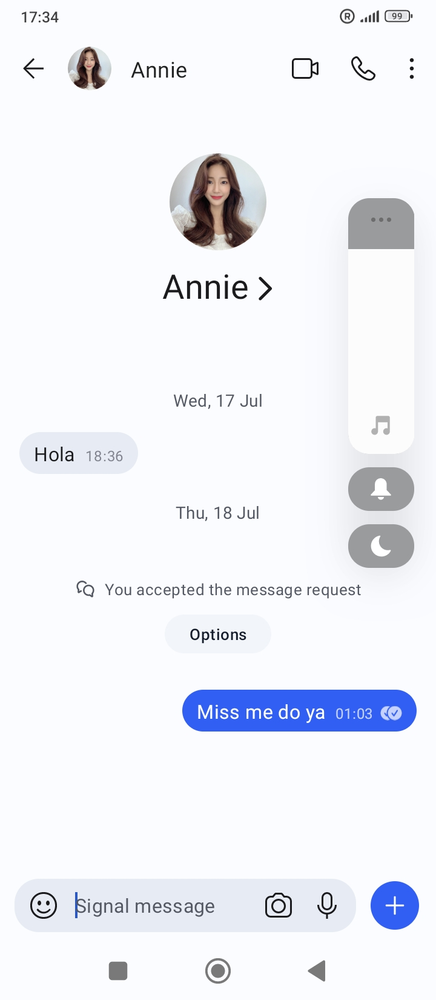
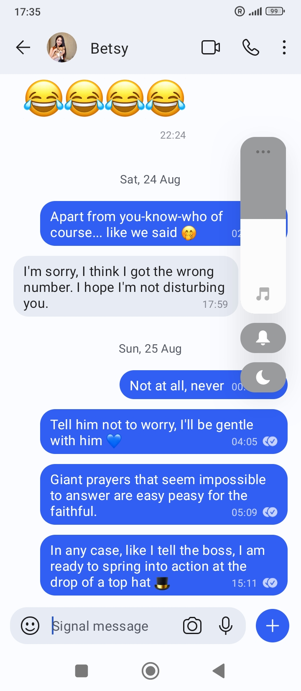

## Signal harassment

- I was contacted a few times on signal between April and August.
- I believe they started to drug me seriously again when I got back to Denia in April.
- Initially I was invited to play a game which I downloaded and it was just endless boredom.
- Then, in May, I was contacted on Twitter by Elon Musk's brother who told me Elon wanted to talk to me, and gave me the Signal details.
- One of the first things this account says is "send pics" and I am angry with them, but I still continue to talk.
- It's not clear why.
- It was extremely weird in fact. I had an extraordinarily long rant with this person while I was flying to Bali in May.
- I had been in Madrid the week before, and just made a speech about being targeted by a "manada" (which is rape gang group in Spanish) at Callao with Posey Parker.
- I was completely out of my mind.
- They must have managed to drug me somehow during this time.

{width=45%}
{width=45%}
{width=45%}
