## Fake accounts

- Here is a list of a small proportion the accounts that were, and still are in some cases, cyber stalking me.
- Some are clear images of people I know, especially teachers and staff from the conservatory. I will note that where I can.
- Some are obvious AI merges of people, sometime that I know sometimes not, and me.

!!! important "Disclaimer"
    - It's possible some of these accounts are legit and either I mistook something they genuinely or they were overwritten by hacking techniques.
    - Genuine stalkers embroiled legit accounts into appearing to be stalkers.

- Some I will point out as honey trap accounts; accounts used to lure people into a false sense of security and then, at some point, part with their money. 
- Honey trap accounts double as stalkers given Domingo and the trumpet teacher's whole game is honey trap.
- Some of the stalker accounts will just be retweets, and I believe this is automated.

!!! danger
    - It is also possible that genuine accounts are duplicated and used to harass and intimidate.
    - This happened a lot on my JackChardwood account.

| Account  | Comments  |
|----------------------------------------------------------|---|
| 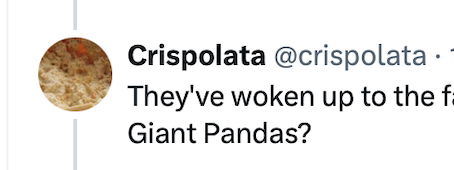{width=50%}  |  Stalker. |
| 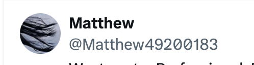{width=50%}  |  Stalker. Deleted. |
| 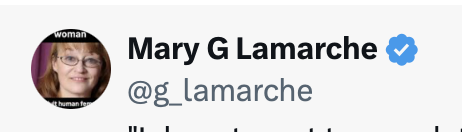{width=50%} |  Stalker. Deleted. |
| 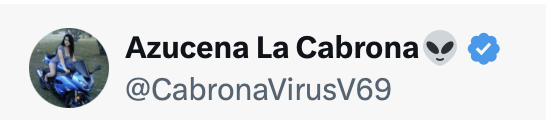{width=50%}  |  Stalker. Deleted. |
| 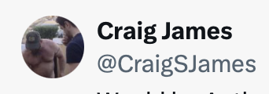{width=50%} |  Possibly legit and/or duplicated/leached. |
| 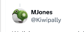{width=50%}  |  Possibly legit and/or duplicated/leached. |
| 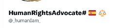{width=50%}  |  Mentioned previously. |
| 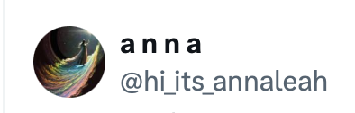{width=50%}  |  Possible honey trap account. |
| 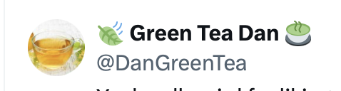{width=50%}  |  Stalker. Deleted. |
| {width=50%}  |  Stalker. Possible honey trap account. |
| {width=50%}  |  Stalker. Deleted. |
| 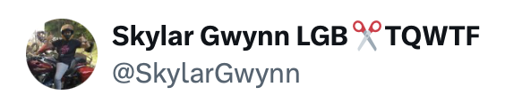{width=50%} |  Possibly legit and/or duplicated/leached. |
| 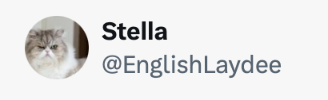{width=50%} |  Looks legit. Could be a genuine pal of mine. |
| {width=50%} |  This one popped up while I had the burps. |
| 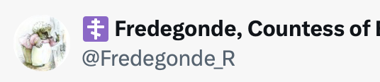{width=50%} |  This one interrogated me a lot. |
| 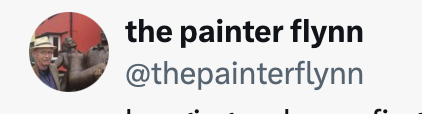{width=50%} |  Possibly legit and/or duplicated/leached. |
| 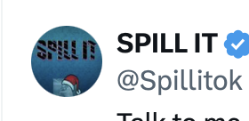{width=50%} |  Possibly legit and/or duplicated/leached. |
| {width=50%} |  Possible honey trap account. |
| 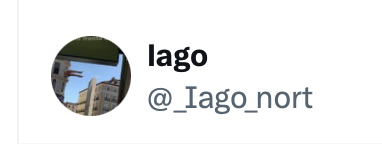{width=50%} |  Stalker. |
| 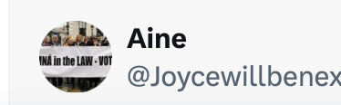{width=50%} |  Possibly legit and/or duplicated/leached. |
| {width=50%} |  Possibly legit and/or duplicated/leached. |
| {width=50%} |  Stalker. |
| 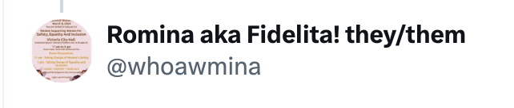{width=50%} |  Stalker. |
| 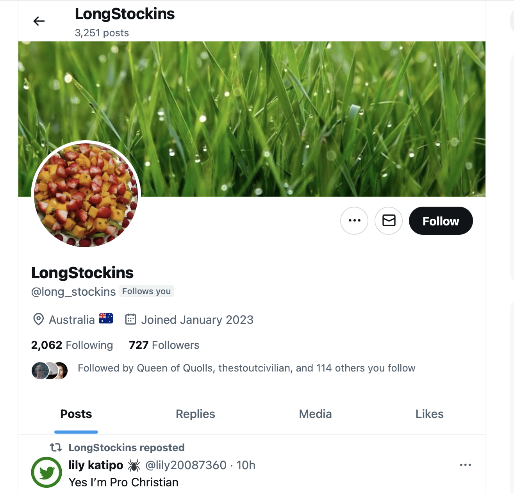{width=50%} |  Possibly legit and/or duplicated/leached. |
| 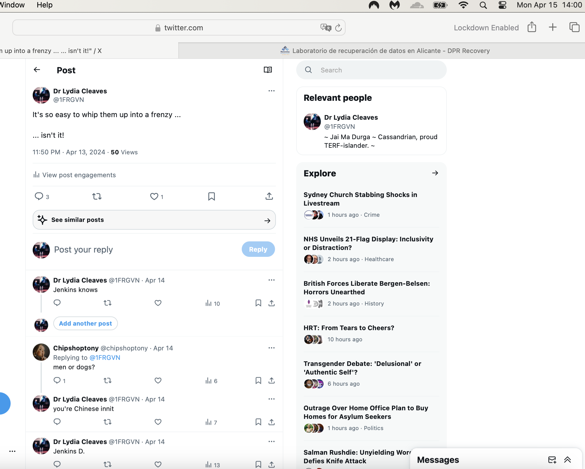{width=50%} |  Stalker. @chipshoptony |
| 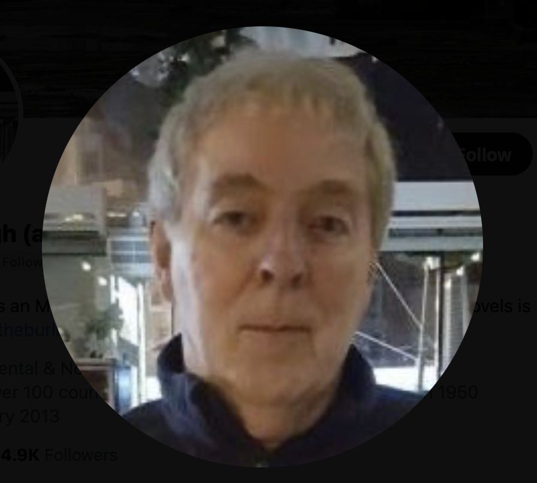{width=50%} |  AI mix of me and the trumpet teacher. |
| 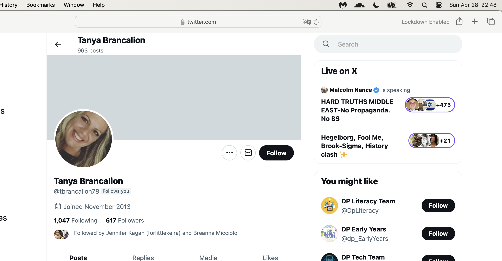{width=50%} |  Stalker. |
| 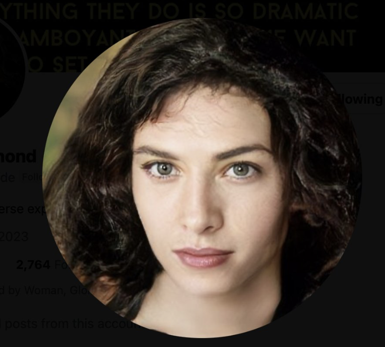{width=50%} |  AI mix of me and ? |
| 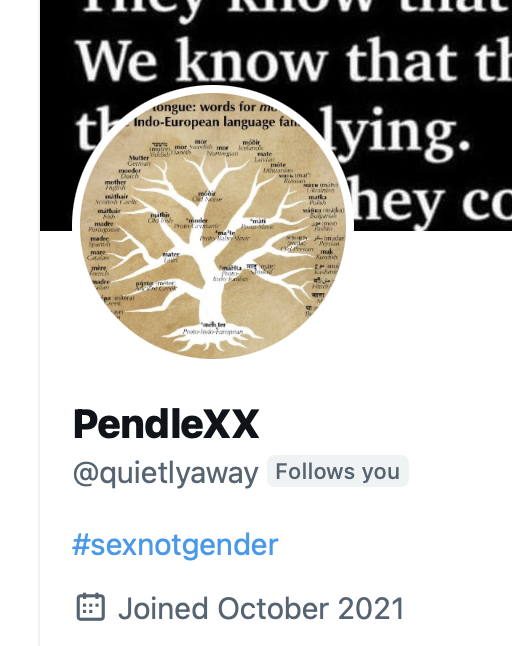{width=50%} |  Stalker account. Communicating with me from early 2022. |
| 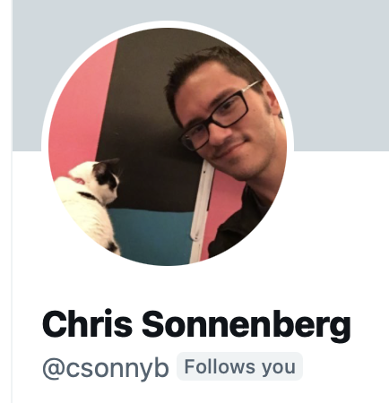{width=50%} |  Stalker. |
| {width=50%} |  Stalker. Honey trap account. This person may be a sexploitation victim. |
| {width=50%} |  Stalker. |
| {width=50%} |  Stalker. |
| 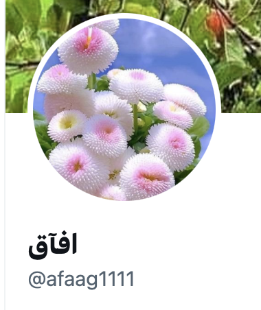{width=50%} |  Stalker.|
| 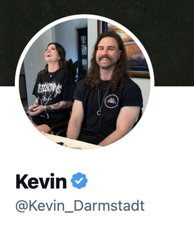{width=50%} |  Stalker. |
| {width=50%} |  Stalker. |
| 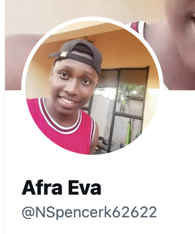{width=50%} |  Stalker. |
| {width=50%} |  Stalker. AI mix here but not sure with who, someone I trust because I had a long DM with this person. |
| 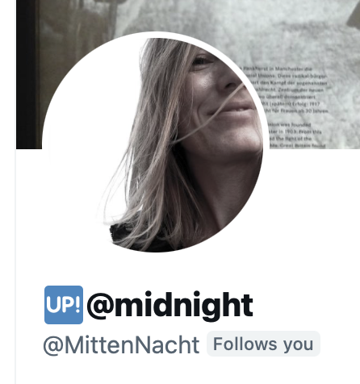{width=50%} |  Honey trap account. |
| {width=50%} |  Stalker most likely. Possibly legit and/or duplicated/leached. |
| 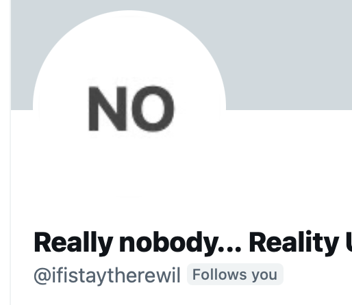{width=50%} |  Stalker. Tweets on auto-regenerate by the looks. |
| {width=50%} |  Stalker. |
| 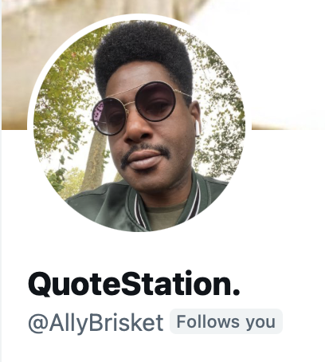{width=50%} |  Bonafide stalker and honey trapper. Often thought this was Domingo or Samuel. |
| {width=50%} |  Bonafide stalker and honey trapper. |
| {width=50%} |  Ana Requena modeling. |
| {width=50%} | Esteve the chamber music teacher.  |
| {width=50%} |  A young Maria Hontanilla on the left. |
| {width=50%} | Domingo Lopez Cano face aged with AI.  |
| {width=50%} | Paqui Fornet Pastor, younger, in a threatening pose.  |
| {width=50%} |  AI mix of the trumpet teacher and Gloria the conservatory receptionist. Is the suggestion they are related? She certainly was very familiar with him. |
| {width=50%} |  Stalker. Is this person the same as the following. |
| 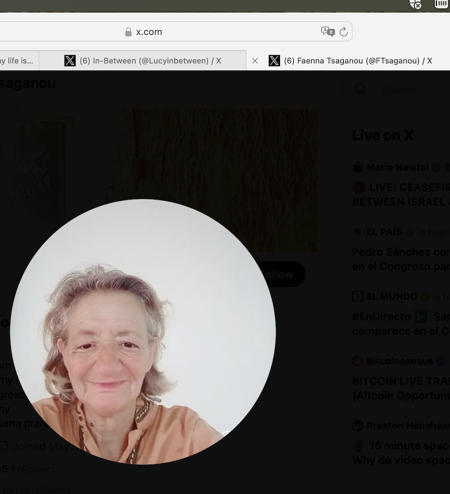{width=50%} |  Stalker. Is this person the same as the previous. |
| {width=50%} |  Possibly legit and delegated/leached. |
| 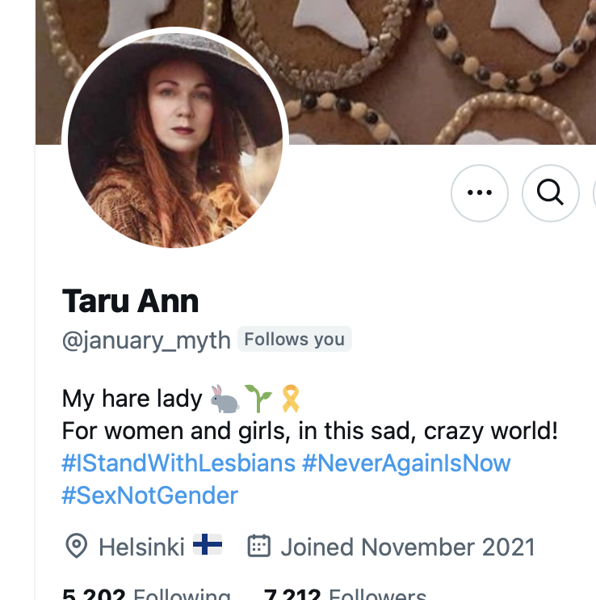{width=50%} |  Possibly legit and delegated/leached. |
| 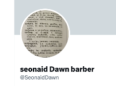{width=50%} |  Possibly legit and/or duplicated/leached. Most curiously, Seonaid ended up running for general election with the Party of Women alongside me. |
| 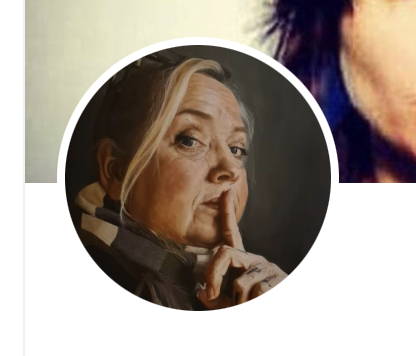{width=50%} |  Stalker. `@ChipShopTony` |

## Can't access spaces on desktop

- For a long time, I have not been able to access Twitter spaces on my desk top.
- I am able to access spaces on my mobile.
- This might be ok, except on desktop I'm registered as already logged into a space which is interesting.

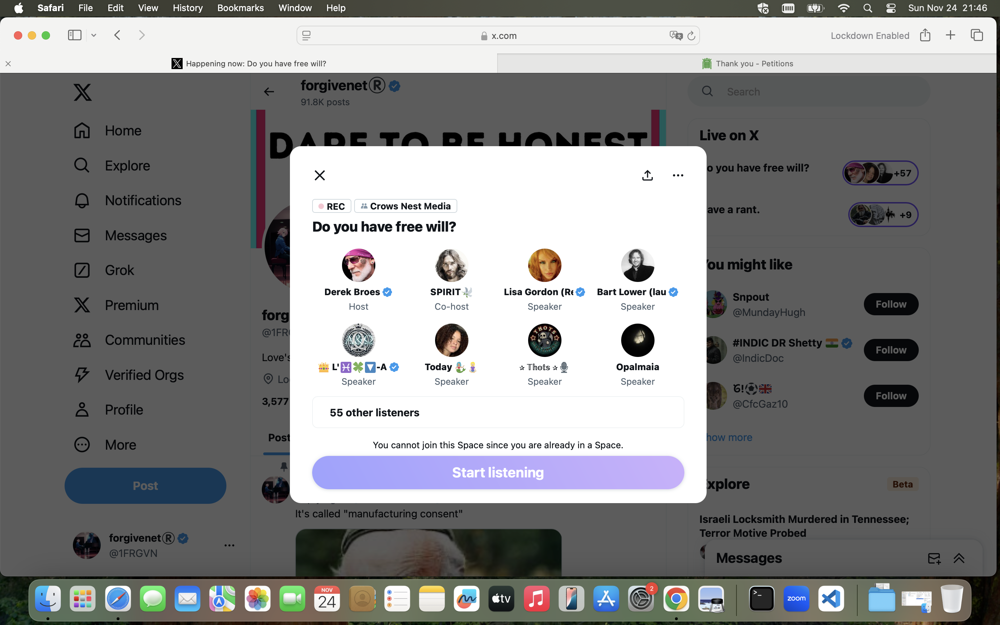

## My Twitter archives

- `@1frgvn`: https://drive.google.com/file/d/15OH_CM9zGW42zd-zCrV327TiqyHclnRR/view?usp=sharing
- `@JackChardwood`: todo