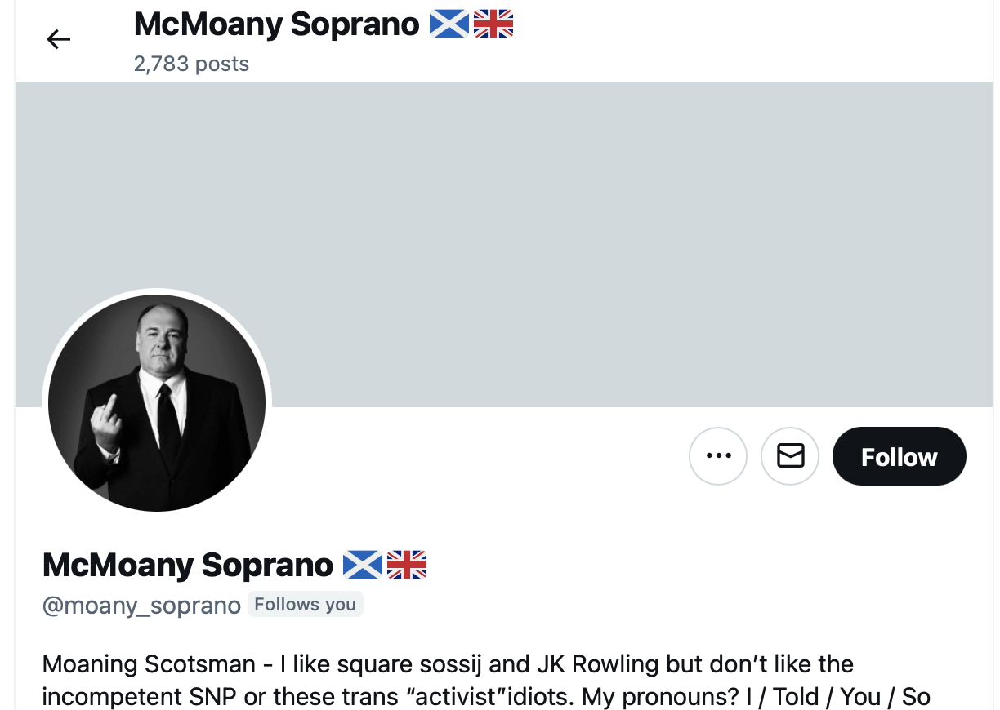

## Fake accounts

- Here is a list of a proportion of the accounts that were, and still are in some cases, cyber stalking me.
- Some are clear images of people I know, especially teachers and staff from the conservatory. I will note that where I can
- Some are obvious AI merges of people, sometime that I know sometimes not, and me.

!!! important "Disclaimer"
    - It's possible some of these accounts are legit and either I mistook something they genuinely or they were overwritten by hacking techniques.
    - Genuine stalkers embroiled legit accounts into appearing to be stalkers.

- Some I will point out as honey trap accounts; accounts used to lure people into a false sense of security and then, at some point, part with their money.
- Some of the stalker accounts will just be retweets, and I believe this is automated.

!!! danger
    - It is also possible that genuine accounts are duplicated and used to harass and intimidate.
    - This happened a lot on my JackChardwood account.

| Account  | Comments  |
|----------------------------------------------------------|---|
| {width=50%}  |  Stalker. |
| {width=50%}  |  Stalker. Deleted. |
| {width=50%} |  Stalker. Deleted. |
| {width=50%}  |  Stalker. Deleted. |
| {width=50%} |  Possibly legit and/or leached. |
| {width=50%}  |  Possibly legit and/or leached. |
| {width=50%}  |  Mentioned previously. |
| {width=50%}  |  Possible honey trap account. |
| {width=50%}  |  Stalker. Deleted. |
| {width=50%}  |  Stalker. Possible honey trap account. |
| {width=50%}  |  Stalker. Deleted. |
| {width=50%} |  Possibly legit and/or leached. |
| {width=50%} |  Looks legit. Could be a genuine pal of mine. |
| {width=50%} |  This one popped up while I had the burps. |
| {width=50%} |  This one interrogated me a lot. |
| {width=50%} |  Possibly legit and/or leached. |
| {width=50%} |  Possibly legit and/or leached. |
| {width=50%} |  Possible honey trap account. |
| {width=50%} |  Stalker. |
| {width=50%} |  Possibly legit and/or leached. |
| {width=50%} |   |
| {width=50%} |   |
| {width=50%} |   |
| {width=50%} |   |
| {width=50%} |   |
| {width=50%} |   |
| {width=50%} |   |
| {width=50%} |   |
| {width=50%} |   |
| {width=50%} |   |
| {width=50%} |   |
| {width=50%} |   |
| {width=50%} |   |
| {width=50%} |   |
| {width=50%} |   |
| {width=50%} |   |
| {width=50%} |   |
| {width=50%} |   |
| {width=50%} |   |
| {width=50%} |   |
| {width=50%} |   |
| {width=50%} |   |
| {width=50%} |   |
| {width=50%} |   |
| {width=50%} |   |
| {width=50%} |   |

## Can't access spaces on desktop

- For a long time, I have not been able to access Twitter spaces on my desk top.
- I am able to access spaces on my mobile.
- This might be ok, except on desktop I'm registered as already logged into a space which is interesting.

