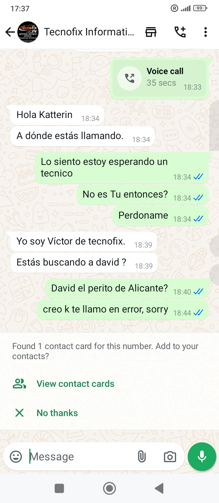
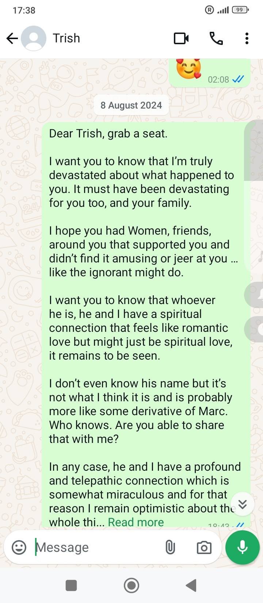
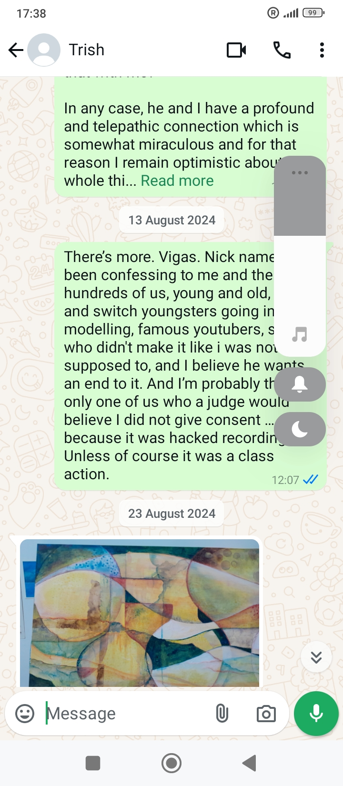
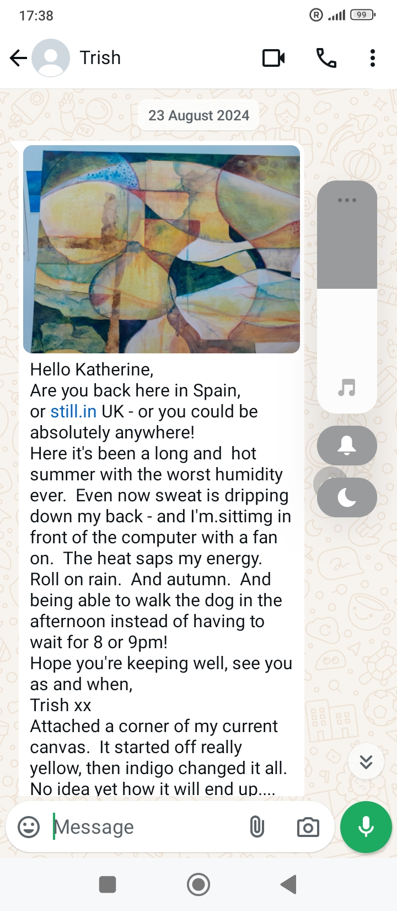

# WhatsApps

## Beatriz the landlady

- WhatsApp thread from my Spanish phone: [link](../content/whatsapps/WhatsApp%20Chat%20with%20Beatriz%20García%20Morales.zip)

## Roberto the English-speaking lawyer

- WhatsApp thread from my Spanish phone: [link](../content/whatsapps/WhatsApp%20Chat%20with%20Robert%20Rodriguez.zip)

## Chat about the leak with Pedro the caretaker

- The leak was still ongoing in April, or it had reappeared in fact: 

## Asking Knowhere if they have security cameras

- The guy blocked me:

{width=50%}{width=50%}

## Technofix

- I have no idea who these are. I phoned this company in April so I believe it is the cyber expert from Alicante, but they have a different name.
- I made a call to them without realizing it, in Dénia in October 2024.
- It was extremely weird. I think hackers took control of my phone and made this call.

{width=50%}{width=50%}

## Patricia

- Curious WhatsApp communication where Trish appears to ignore everything I say.

{width=35%}{width=35%}
{width=35%}{width=35%}
{width=35%}

