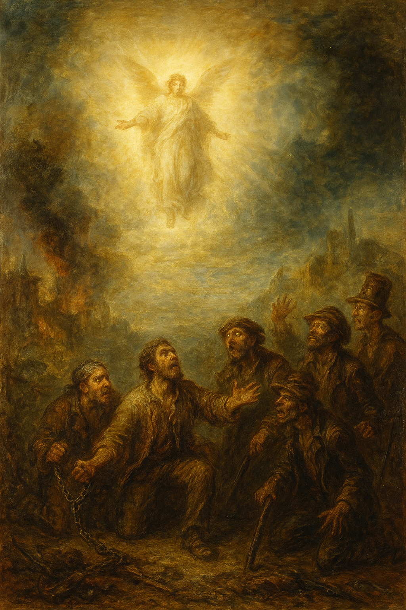
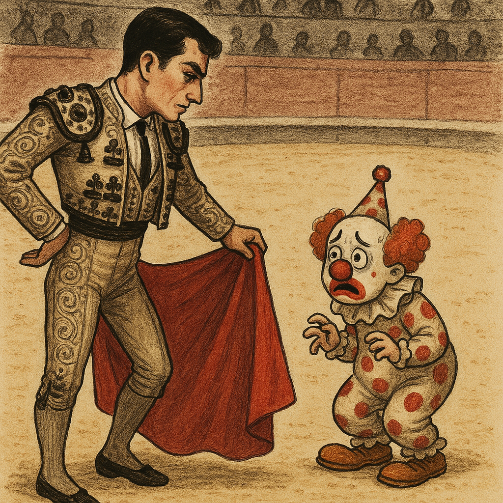

# Theories

## The biggest lie the world has ever known

1. Rogue group of lupins do terrible thing at salmon mousse's request thirty years ago - with the help of the onion-soup.
1. Lupins are told that only a small subset of the mousses has asked for this; and the rest of them were not involved.
1. After the event, the salmon mousses are so horrified by the sound of thunder, they decide to throw their compadres under the bus and distance themselves from the crime - they might have planned this from the start tbf.
1. Lupins never get paid.
1. Lupins go horribly rogue and totally insane with vengeance and rage.
1. The subset of salmon mousses in the frame fail to stand up effectively to the wider salmon mousse group; perhaps they tried and failed, like everyone else!
1. Lupins are told all sorts of BS about why they're not getting paid; the wider salmon mousse group insisting it's nothing to do with them.
1. Lupins are so aggrieved, they get started on their Sergio-Leone-type revenge program, and that means murdering innocent tax-paying British women visiting the region or living there.
1. They still do not get paid.
1. The murders continue.
1. No one investigates.
1. And no one cares because the salmon mousses own Spain, and continually block any attempts at stopping these rogue lupins.
1. And so it goes on, year after year, getting worse and worse, apparently normal citizens realizing they can do the unthinkable without repercussions, the total descent of society.
1. Aside from their vengeful purpose, the lupins go quite mad in every sense, turning a once thriving small Spanish town into the most famous criminal pornography studio in the world - ask any DIY pornographer worth his sedating drug collection.
1. In fact their insanity worsens so badly over the decades to the current state of industrial-scale baby-rape and pedophilia, full infiltration by criminal pornographers into the Spanish school system, and alongside that, implementing mass online-manipulation revenge policies against the mousses which have been unusually effective.
1. The lie the lupins believe is also believed by everyone else they tell, nearly, especially as no-one is coming to help the murdered women and children - assured by the mousses who control everything the Spanish do - and thus criminals from all around the world set up shop in Dénia where they know they'll never be brought to justice.
1. North London criminal gangs make use of the same lie to spread criminal porn into the stratosphere, addicting millions if not billions of men to sex-murder fetishes, and causing events like [Bali](../timeline/2024/may.md#bali) where tech-workers sedated and raped their female colleague for a whole week, and invited the most famous man in the world who thinks he will never be brought to justice - this is continually asserted to him by the salmon mousses that surround him who are feeding him the lie of two millennia! And he believes it.
1. Question: how many porn addicts have been told this lie? My friends certainly believed it (Paul, Matthew, etc.). My dad and brother believed it. How could they have all been told something so horrible, and we don't know about it? Is porn such a secret society it can be counted on to never tell on the worst things ever, while ever growing in participants and horribleness? And how could they do such terrible things on the basis of such a story? Are all porn-addicts sociopaths? Of course they are.
1. Good lupins (well, marginally better than the rogue ones) in the region don't know what to do about the rogue ones who have become so criminally insane that even their own families are in danger!
1. Our heroine enters the pic, totally unawares of what's going on, totally innocent, but with a tendency to say interesting things and make strange shapes with her face. (The mousses had signed her up for the intuitive program early on due to her strange face-shapes and trauma history, and sent her into the battlefield, expecting her to be killed but happy to ingest the information from her devices and home networks while she remained alive. God forbid she ever got wind of that; and then she did.)
1. She is targeted and made famous in sedated rape-porn internationally. So famous that random men recognize her wherever she goes in the world. 
1. She fights the good fight over two decades.
1. She does so well in fact, surprising everyone, that the rogue group of lupins gets worse and worse just to see how much sexual-torture she is prepared to endure (she doesn't know, she's sedated) and telling lies about her so that the whole region in Spain will hate her and support her early demise.
1. On the very day the mousses order her murder, a lupin bearing the name "Vidal Sastre Sanchez Hornero" is reported accepting a mousse-funded government award.
1. God sends the DANA.
1. The rogue band of lupins and their mousse masters do not heed the warning.
1. Our heroine is innocent of all blame, and knows it, and is unashamed of anything that has happened (a bit embarrassed sometimes) and there is no reason for anyone to hate her, but still they do.
1. So she prays. A lot. And survives attempts at her murder again and again and again - see Jesus's instructions on this in the Gospels.
1. The salmon mousse security service criminal gang replaces the lupins.
1. They spend years lying to our heroine to try to convince her there is an investigation going on and that someone cares about the Spanish babies, children, and women being sedated, raped, and murdered at the altar of porn in Las Marinas.
1. It's a lie.
1. They're distracting her. They have no intention of bringing any criminals to justice.

    1. I'm amazed actually, the budget for keeping this quiet could probably feed small nations for decades.
    1. But the most interesting thing is how they never questioned the veracity of the claim - which is just incomprehensible to me - and I wonder if that's because their violent misogyny is so deeply ingrained they had no capacity to think outside the box, as it were. An utter tragedy.

!!! tip "There is no healing without"
    - The abomination of desolation factored in. And that means spilling the 50 million onion-soups all over the world. Sorry.
    - Sorry.
    - Remember?
    - And eliminating rogue operations wherever they may be found.
    - And dedicating the future to God and His miracles.

1. Squirrel brings a whole nest of vipers with him in August 2025 -> for reasons vague and unbeknownst to me at this stage. Is it the *bad but not as bad as* Domingo's lot? Have they managed to convince the UN and the mousses they're the ones in danger? Why am I still running around being stalked continuously and operated on and injured on a regular basis by the mousses if even a nest of vipers are in that much danger? And did they ship them all off to Israel so they could save face, more "switcheroo" blame passing. Indeed, it's like an unconscious twitch, isn't it. 
1. Another obvious question is... if we now know the mousses were drugging me throughout 2025, why would they be so keen I didn't remember the switcheroo men? Is it so they can continue to protect themselves because the switcheroo men can spill the beans? Is that why (did I hear it was a UN raid?) they shipped half the team off to Israel, to silence them, keep them from talking?
1. Did they know that this bunch of people have been trying to stop the business for years too? And we couldn't have that now could we, because then there'd be questions...
1. Do you think if my viper chums did start to speak, or anyone did outside of mousse control, the lie would become VERY QUICKLY APPARENT to the whole world? I bet it would.
1. My view is that, given how they have treated me, they fully intended to murder me. I mean, where else do their actions towards me lead to logically? There is nowhere else for their plots to go/
1. But, also, they have had to be "pretending" they care, and are doing something, not just to me but to bloody everyone looking now, and I expect the majority of their own side had no idea too, cos it's BEYOND EVIL ... and that's a lot of people... which is good. I'm so glad I never shut up!
1. Remind me to never shut up!
1. Were the Spanish in Jerusalem in a terribly celebratory mood because finally they can see a future where they might be able to protect their own children? If so, please forgive me for giving you all such a hard time... it's been quite a twist and turn of a thousand knots to undo...
1. Is the recent "drowning" in a hot tob of a young British couple on holiday in Cullera - incidentally where Paloma told me to move to - a step up in the "life of revenge" of the Lopez Cano's?
1. By the way, can you check if these two were the ones staying in the next room to mine in Cauterets in [August 2023 when I was supposed to have sex with the mountain guide](../timeline/2023/august.md#climbing-the-viscos). Thanks.
1. If the Lopez Cano's found out they'd been lied to by the mousses all these years - people who have been pretending to be their friends, just like they did to me - would they all self-implode do you think?
1. Where do the mousses think such courses of action ends? Both sides can't keep bumping people off forever, can they? 
1. I think the world needs to know, don't you? And let the chips fall where they fall. It's gone on too long now and the children have never once been out of peril since it started.
1. Questions:   
    1. The big one. Who decided to let them carry on with the lie, and why. I assume that mostly people are unaware of what they're supporting, or may have suspicions. 
    1. What outcomes have their been for carrying on with the lie:
        1. Dead women and children.
        1. Baby-rape industrialists.
        1. Tech-bro mass insanity.
        1. The unquestionable disastrous state of society.
        1. God, this is nearly a total rewrite, except I had closed in on the truth so very nearly, it looks like it will just be a small adjustment.
        1. Given we have information about everything, an actual law-enforcement case for who murdered who (never mind why) is quick and easy and the children can be immediately safe.
        1. Teachers at the conservatory and the wider educational system! It's not so sinister - sorry, it is ridiculously sinister, I don't know how I said that - and the conservatory teachers and staff seem to be at the forefront of it all.
1. And just to say that I was studying music with people who were behind *that*, and thought it was OK! I mean... I knew humans were insane but... the world needs help quick.
1. It's time to take a deep breath and clear it all up, and don't worry about the thunder, you know what they're like (oh, by the way sir, we have a fix for that... it's something I've been obsessing over for oooo, 3 years now)...
1. In fact, I have been obsessing over this fix [since August 2023 when I went up the Viscos](../timeline/2023/august.md#climbing-the-viscos) with the man who had been promised I'd invite him back to my room afterwards.

#### Auggie

- Does it all hinge on Auggie? I was wondering... because, you see, he defected to the same side essentially thinking he was exercising vengeance.
- So it sounds like he and everyone else really did believe the lie.
- He thought he was "dropped in it" by the Lopez-Cano's and he defected to the side pretending to be law-enforcers.. the side giving them all such a hard time... (lie-enforcers really).
- But in fact, the mousses dropped him in it and we can prove this because of what I always said was Hazel's account; `@taruann` who sent me the image to trigger my memory of him from 2001. Which worked. He must have thought it was the Las Marinas lot, but it wasn't.
- Can we find out who owns this account for real? My guess is rogue mousses.
- Hazel was always just a placeholder, it appears.
- Perhaps, if not mousses, `@taruann` is a fatberg prodder, oh, is it squirrel?

## Vidal Sastre Sanchez Hornero control women and girls

- This statement came from a [dream I had in November 2023](../timeline/2023/november.md#dreaming-of-jesus-christ).
- Vidal Sastre Sanchez Hornero is a criminal sex gang that controls women and girls.
- They have been operational for decades, targeting women with money, such as [the ceramics artist](../timeline/2023/july.md#plate-lady-early-in-the-month) I mention in a previous section.
- Their modus operandi is to target a woman or girl, gain access to their electronic devices, and drug them in a clandestine manner.
- From here they can manipulate the mind of the target usually starting with an apparently real romantic relationship which is then reinforced by NLP/hypnosis techniques online.
- Targets are tricked into trusting the romantic partner.
- For younger targets, at this point, nudes are requested by the gang. The target believes their romantic partner is requesting them and so sends them.
- From here, this may extend into 'sex tapes' which the target may or may not agree to.
- The target will be wholly unaware of the fact that all these photos and videos are being monetized on porn networks.
- The gang has operated in freedom for decades and is protected by the highest orders of the land.
- This means that they are completely free to infiltrate schools and learning establishments and target minors.
- As time has passed, the nature of the porn that makes the most money for the gangs has evolved from brutalizing adult women into rape of children and babies.
- If gang members wanted to escape this life of crime, they would find it nearly impossible and require a miracle.

### Support from the community

- It is still too difficult for me to imagine that Spanish communities would support the targeting of their own children in learning establishments.
- So what could possibly persuade an entire community to terrorize a woman who seems to be the only person in the region that cares about the safety and wellbeing of their children?
- Do they understand that only foreign children are targeted and so turn a blind eye?
- Are they persuaded that the targets they are instructed to terrorize are somehow deserving of such treatment?
- Or do they simply not care about the children?

!!! tip
    - My previous theories, in which you might track my lack of, then growing, mental clarity as I emerged from three years of drugging and poisoning, are in earlier commits.

### The bull fight.. evolved

- Over the last three years, I have felt a lot like a Spanish bull in the ring, tormented and tortured by a large group of men, the community cheering them on.
- I believe that, in essence, this terrorizing of vulnerable living beings by brave male Spaniards is the foundation of what happened to me.
- An age old tradition of silencing uppity women, I expect.
- Except now, with the porn epidemic in full swing, and men more and more enticed into pedophilia and worse as they bore of the daily sexual violence against women and children, with baby-rape porn the most lucrative of all, a culture like this is probably doomed if they don't do something about it, and quick.

- A little ipad testy-poo.
