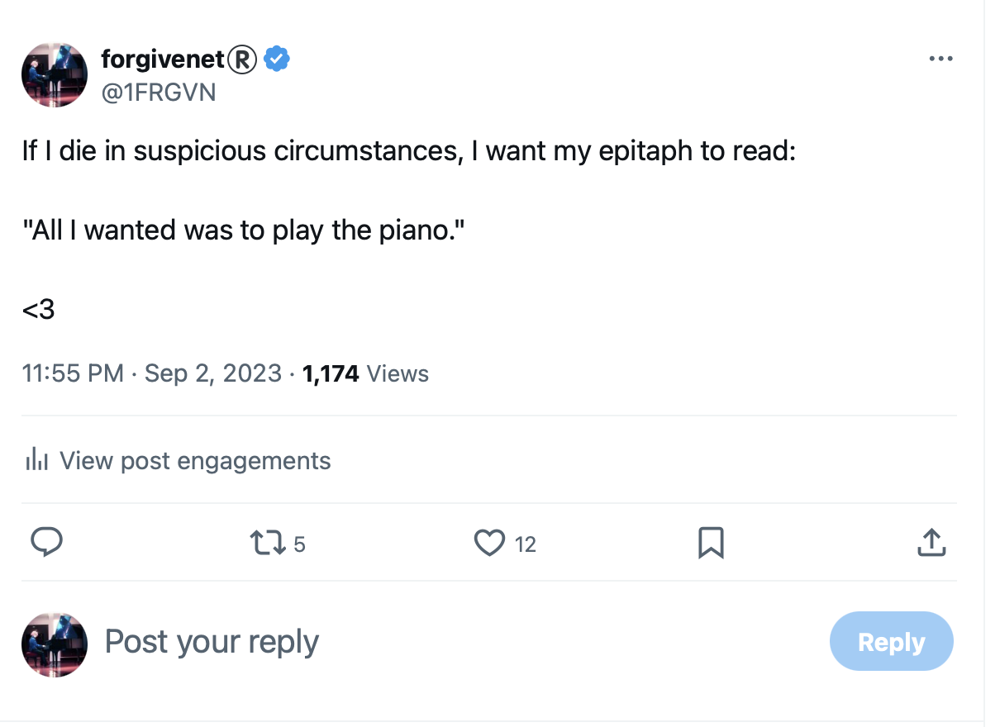
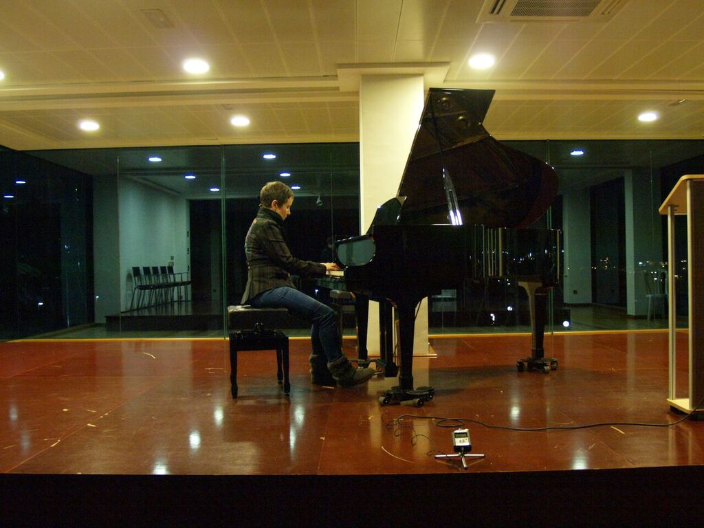

---
hide:
- navigation
- toc
---

# Fear & Loathing in Las Marinas

- Las Marinas is a suburb of Dénia, Alicante, Spain. 
- Suburb is probably the right word.
- Wrong-un's live there.

## Summary statement to the police

This document details the multiple crimes committed against myself, and countless others, by an international criminal porn enterprise based in North London and Spain, over many decades since I was a child.

I am Dr Katharine Margaret Murphy, Y2775989H; previously residing at Carrer Furs 15, Bloque 1, Escalera 2, Piso 3, Apartamento 17, Dénia, 03700 Alicante, Spain; an apartment set up with advanced spy-cam technology.

Over the three years I lived in Carrer Furs, Dénia, after [finding the apartment available online on the 8th December 2021](timeline/2021/december.md#too-good-to-be-true-on-the-8th-december), and [signing the lease which included a death clause](timeline/2021/december.md#death-clause), and moving in on [15th December 2021 to find semen stains on the sofa](timeline/2021/december.md#semen-stains-on-the-sofa), I was drugged, poisoned, brain-damaged, repeatedly sedated after going to bed, filmed and live-streamed to millions of porn-addicts around the world.

Eventually, because I had no idea about what was happening to me, and because the gang's attempts at frightening me always failed, they tried to murder me by poisoning on numerous occasions.

I continue to be gang-stalked and cyber-terrorized online and in-person to this day.

Up until I remembered [something extraordinary about the Tenor Cortis conservatory of Dénia in September 2025](timeline/2025/october.md#thunderbolt-clarity) and how it doubles as a porn-studio using teachers, staff, and children as its actors, and unwitting students as its drugged and brain-damaged *porn-stars*, I continued to suffer clandestine drugging and poisoning (attempted murder) anywhere I was in the world.

After I realized the extent to which the Spanish school system has been taken over by international criminal porn-gangs, I was only briefly drugged one time in Lourdes in April 2026 and all poisoning has since ceased.

## Mass voyeurism, cyber-stalking, gang stalking, honey-trapping, sedated spy-cam rape-porn, and staggering levels of sexual violence against women, children, and babies

This police statement details the following:

- How I have been the subject of a [porn fatwa](timeline/2001-to-2010/2003.md#porn-fatwa) since at least 2003, issued by UK criminal gangs - the Adams family and likely others - due to receiving £250K compensation for the Lockerbie terrorist bombing in which my aunt Geraldine was murdered while working as purser for Pan Am flight 103.
- How, in Dénia itself, criminal gangs hacked my home network, mobile phones, and laptops - including gaining access to my work laptops from three different companies via my [home router](timeline/2024/march/1-12.md#reporting-hacking-to-polygon-labs). 
- How I was hacked in a similar manner by the same criminal enterprise wherever I was in the world since 2003, possibly earlier, and how they were constantly monitoring my online activity and likely my family's too.
- How the same criminals targeted other family members, and [even other UK Lockerbie families](timeline/2001-to-2010/2006.md#lockerbie), to rob them of their Lockerbie compensation be it via honey-trapping, sexploitation and blackmail, or manipulated drug addictions.
- How British criminals living in Dénia targeted me [directly in 2007](timeline/2001-to-2010/2007.md#hazel-smith) and attempted to murder me by poisoning at that time; in the understanding that my money would be available to them via an inheriting family member they already had their claws into.
- How, in Dénia itself between November 2022 and June 2023, I starred in a [*switcheroo* porn show](crimes/protagonists/vidal-sastre.md#vidal-sastre-sanchez-hornero) filmed at the conservatory, in and around the town, and in my apartment without my knowledge, for which I had been brain-damaged over many years by poisoning to give me a neurological brain-disorder (like a stroke symptom) whereby I cannot now recognize people out of context.
- Throughout the switcheroo porn special, I was drugged heavily at classes and tricked into believing that four or more men were the same one male trumpet teacher calling himself Vidal Sastre Sanchez Hornero; all the men switching places regularly without me noticing.
- The trumpet teacher scam was well known to the Spanish government's school board, the Generalitat, and had taken place many times before.
- Teachers, staff, students (including children), parents, townsfolk and others in Dénia knew exactly what was going on at the conservatory and appeared to condone, approve, and even delight in it.
- It's clear that organized criminal porn gangs have infiltrated at a minimum the conservatory systems in Spain, and likely other learning establishments, and are free to target children and teenagers, as well as any vulnerable adult who might be lured in.
- Targets are most often foreign women and children, or Spanish outsiders; those who don't know *how things work* in the Valencian region. 
- The conservatory is just one example of criminal porn-gang infiltration into the whole of society in the region - the most horrific bar the baby-rape industry - and this report also details decades of similar spy-cam and sexploitation crime against women, children, and babies, targeted by the same criminal pornographers who have been freely producing the very worst sort of pornography for decades.
- I detail near-daily instances of physical stalking assisted by pinpoint tracking of my movements via my hacked mobile phones - and probably tracking on my car since I stopped using my phones - in order to harass me and create intricate choreographed situations with the sole intention of terrorizing me and causing me extreme anxiety and grievous mental and emotional harm.
- The mental and emotional hurts were intended to give me a reasonable explanation for the anxiety and depression arising from repeated sedated-rape, and the toxic effects arising from drugging and poisoning.
- I suffered drugging, poisoning, sexual grooming, and honey-trapping [online and in the classrooms](timeline/2023/january.md#serious-poisoning-at-chamber-music-class) of the conservatory of Dénia.
- I was drugged, sedated, and poisoned without my knowledge; in class at the conservatory, at home via tampered-with water and air systems, in my car (sprayed/misted onto surfaces and through the air vents), on all my belongings when I moved house, and in my hotel rooms the criminals gain access to for adding poisons and drugs to my personal items such as food and bathroom products; the most recent example of this occurring in [July 2025 in Lourdes](timeline/2025/july.md#lourdes).
- I continue to be under constant surveillance by Spanish and British criminal gangs.
- It appears that criminal porn-gangs are certain they can do whatever they like and that no-one is going to stop them.
- They even persuaded my father to [take a starring role](timeline/early-years/2015.md#inexplicable-anal-fissure) in an incest special - I suspect he was aware of what was going on in the town [from early 2013](timeline/early-years/2013.md#dad-visits-at-fallas) at least - and the criminals likely told him to [bring my mother out with him](timeline/early-years/2016.md#march) the next time he visited to make another million or so, and he agreed.
- I believe the British gangs have been colluding with my father from early as 1989 when child-porn was disseminating through the networks starring me, sedated, being gang-raped by black men in Tottenham on their mothers' kitchen tables and elsewhere.
- My father's involvement in all this finally triggered a severe suicidal depression for which I had no context and thus assumed had to be related to the 1989 attacks. 
- UK and Spanish criminals know everything about me including having copies of [pedophile pornography made by the rape-gang in North London in 1989 and distributed by North London gangs](timeline/2023/november.md#first-time-they-flash-up-my-naked-16-year-old-body-on-x). 
- I believe I was repeatedly sedated, raped, and filmed in my flat in Passeig Periodista Ramon Ortega between 2012-2014, and probably at my flat in Cami Llavador 5 between 2006-2009.
- On becoming political and [standing for general election in the UK in July 2024](timeline/2024/june.md#volunteers-not-what-they-seem), criminal gangs made sure they had their people in place to keep an eye on me and continue to threaten me.
- They even wheeled out [North London rape-gang boss Winston May](timeline/2024/june.md#winston-may) to terrorize me into silence, I assume. 
- I expect he had been in prison at the time and was given a day out by the police for this purpose.
- With such confidence in *getting away with it*, criminal porn-gangs were free to forge close alliances with my employers to create even more elaborate and sickening [criminal porn genres](timeline/2023/november.md#polygon) watched by the men I was working with; obviously making millions in the process.
- The porn gangs have made a lot of money out of me over the decades, and I'm not the only victim.
- All over Dénia, men young and old drive flashy new sports cars worth minimum $50K and upwards. This is a poor town with apparently zero industry.
- I detail unusual events taking place in the town that may point to mass child-sex-trafficking and other porn horrors.
- By the summer of 2024, the porn-gangs had finished with the *female tech-colleague you hate* porn genre, yet were still drugging and stalking me continuously as they worked steadily towards my assured total destruction.
- I was interviewed online in October 2024 by a fellow UK general election candidate. 
- The video was made public on YouTube, where I stated I believed [I was being drugged and there were spy-cams in my apartment filming me](timeline/2024/october.md#youtube-with-kelly-oliver-dougall) and that I had been [targeted professionally at Polygon](timeline/2023/november.md#polygon) where I worked and I was about to take them to tribunal.
- This was during the week I was supposed to die by poisoning with anti-freeze, methanol, or similar, [added maliciously to the water and air vents in my flat](timeline/2024/october.md#serious-poisoning-with-intent-to-kill), doused over all my belongings, and added to my bathroom products.
- The gangs were absolutely certain of my demise and their freedom to murder a woman without consequence.
- One working day prior to the poisoning, [Polygon fires me](timeline/2024/october.md#polygon-fires-the-whole-writing-team).
- I sustained an even more severe kidney injury that week (my kidneys had already suffered regular injury due to constant poisoning; see [rhabdo in January 2023](timeline/2023/january.md#serious-poisoning-at-chamber-music-class) and [kidney explosion at Halloween 2023](timeline/2023/october.md#halloween)) and my eyesight was severely affected. 
- My vision deteriorated and I was diagnosed with a [pre-glaucoma condition](timeline/2024/november.md#pre-glaucoma-diagnosis). This worsened in [July 2025](timeline/2025/july.md#lourdes) after another attempt at murdering me by poisoning failed.
- In December 2025, my eye doctor tells me all is well.
- My right kidney, injured by constant poisoning with anti-freeze and other toxic substances in my apartment over three years, remains weak but is healing well now.
- I have suffered [incalculable personal financial losses that continue](personal/expenses.md), and there has been an even more extraordinary amount of financial gain from my suffering, and countless others, to the [porn-gangs](crimes/protagonists/domingo-et-al.md#domingo-lopez-cano) of Dénia.
- I am currently homeless, with zero friends or family, and I am unable to work.
- I do, however, have a lot of God.

### A friend on the inside

- At some point, something happened between myself and a gang member, inexplicably and miraculously, that made him change his mind about his grim purpose.
- I believe it is to do with my memory of [a man sobbing his heart out in my arms](timeline/2023/march.md#dreaming-of-the-trumpet-teacher) in my bed one Monday night after chamber music classes at the height of the switcheroo scam and my unconditional and relentless good feelings for him that continue to this day.
- I believe he changed his mind about his grim purpose and maybe even asked them to stop, and they didn't - an impossible request anyway - and instead he started to help me in a clandestine manner.
- He told me about the region's decades-long honey-trap enterprise, sending me photographic evidence in the process.
- He sent me pictures of countless other female victims the gangs had targeted over many decades, some sexploitation blackmail victims, but many of whom I believe to have been murdered.
- He sent me pictures of the men involved in [the conservatory switcheroo porn-scam](crimes/protagonists/vidal-sastre.md#at-least-four) and much information I have been adding to this police statement.
- He told me about the proliferation of child-porn and the baby-rape industry in Dénia; one of the gang’s major sources of income.
- He warned me about poisoning in my home, and my car, amongst other things.
- While I was being severely and daily drugged with hallucinogens and toxic substances without my knowledge, it was hard to make sense of the information I was receiving, but I have been steadily piecing it all together.
- There is no doubt in my mind that without this man's help, I would not be here today.

### From honey-trapping to world domination

- The criminality in Dénia began as honey-trapping; target a wealthy woman, trick her into thinking she's in love, film the sex, and blackmail her with it.
- Evidence for this comes from [the Irene photos](timeline/2023/july.md#plate-lady-early-in-the-month) dating back decades.
- If the target is from a wealthy family, they might even set up a fake marriage situation, wait till she inherits and then murder her.
- Honey-trapping for porn and prostitution was also going on of course but, significantly, the porn being produced in the Dénia region was often of the vilest sort; bestiality, pedophilia, and murder-porn.
- As soon as the Internet connected everyone up, the gangs transferred their manipulation techniques into software and no-one could have imagined how successful it was going to be.
- The gangs not only mass-target victims for filming but they worsen user's porn-addictions, "honey-trapping" them into viewing more violence, then pedophilia. and worse.
- The more criminal the porn, the more expensive it is to view and today even millions of children and toddlers are manipulated online into self-producing porn for the gangs directly.
- This is how effective their manipulation tech is.
- At some point, some bright spark amongst them must have realized that porn was just one of a million lucrative themes the manipulation tech could be used for.
- I believe the criminals of Dénia sold their tech to the caliphate once they had demonstrated its power by tricking [Alessandra into undergoing an unnecessary bone-marrow transplant](timeline/2001-to-2010/2009.md#alessandra-gets-sick-or-does-she), and [Lorraine's daughter into believing she's a boy](timeline/early-years/2013.md#lorraines-trans-child).
- From here, I believe the gangs went back-to-basics using targets like myself for blackmailing porn-obsessed tech CEOs into giving them use of their massive processing hubs in order to run the caliphate AI tech.
- Just over ten years of this lying-software out in the wild and the world has gone totally mad.
- We are suffering from a tidal wave of sexual perversion and hatred towards women and children and Jewish people.
- We have children being totally confused about their bodies and their sex by their teachers; society quite happy to render them incapable of orgasm or procreation on an ideological basis alone.
- In Spain, your child might be starring in porn, with-or-without your knowledge, while attending music classes.
- Even more worryingly is the mass delusions of apparently educated people towards barbaric Islamic groups coupled with a terrifying rise in antisemitism which is starting to look like scenes from Nazi Germany.
- Every day a man is in court in the UK having downloaded thousands of baby-rape videos; the judge giving him a slap on the wrist.
- I believe the criminality allowed to flourish and distend in Dénia - baby-rape capital of the world - is behind it all.
- In a town accountable to no-one, where zero morals reign and obvious detrimental long-term consequences are ignored, I believe the criminal gangs and the local people have completely lost their minds.
- Their [hypno-tech doomsday machine](crimes/hypno-tech.md) needs to be stopped, and quick.
- I suspect some of the wiser amongst them agree with me too.

### Countless criminal-porn victims 

- When the gangs performed their switcheroo scam on me in 2022-2023, it was obvious to me this was an extremely well-oiled machine.
- There must be countless victims young and old; many murdered.
- I intend this police statement to help every last one of those victims, dead or alive.
- I believe that [**every daily event**](timeline/2001-to-2010/2001.md) I detail in the timeline of this police statement was videoed and broadcast to a mostly porn-addict and vile misogynist online audience as a kind of "show" which explains the townsfolk's total insanity and has also made criminal gangs very rich.
- This is, essentially, why so many people know who I am.
- It's possible that millions of porn-addicts around the world were betting on the outcome for me.
- I was in a kind of Truman Show, except the "Truman" is a targeted individual, usually a woman but not always, can be a child, and these "Trumans" are expected to die by suicide or serious ill health from poisoning, or be outright murdered, and none have never escaped. 
- Until now.

### Lorraine Blackbourn

- Lorraine Blackbourn was my friend who committed suicide in 2021; the same week I returned to Dénia after many years.
- I believe Lorraine was manipulated online into suicide.
- I believe she had found out her British friends were being sedated and raped by their husbands, or worse.
- I believe she complained to the authorities, as I did, and was ignored, as I was.
- I dedicate this police statement to Lorraine.

## Everyone knows who I am

- If you travel to Dénia and talk to just a few people; ask them if they know me. 
- A [Spanish official confirmed](timeline/2024/october.md#meeting-inma-and-paloma-the-spanish-official-in-madrid) that they answer in the affirmative; everyone knows who I am.
- If you ask them why the whole town persecuted and terrorized me for 3 years, the answers will be quite interesting.
- Try and find someone who's seen footage of me naked, maybe masturbating, privately in my flat. They will be easy to find.
- Perhaps you can find someone who's seen me going to the toilet, or having a bath, doing yoga, or taking an enema, or maybe they heard me passing wind very loudly?
- Was anyone party to private conversations I had with colleagues about industrial secrets; things I had to sign NDAs about?
- Try and find someone who's seen footage of me as a child, sedated, being gang raped by a group of black men, and you may find someone who has seen it. You will certainly find many people who heard about it. 
- It shocked me to learn that the townsfolk knew about these vile crimes against me long before I did.
- Try and find some of the men who have entered my apartment while I was sedated and raped me while the events were live-streamed internationally? They are there, and I have them on spy-cam too.

### Colleagues and employers

- It turns out, that everyone was having so much fun at my expense over the last twenty years, and making so much money too, the tech-bro porn-addicts at the tech companies I worked for (not all of them) were also involved in the conspiracy too, particularly [Polygon](timeline/2024/may.md#bali).
- Over the last ten years, possibly after being watched online by the global tech-bro porn-addict community, perhaps even being live-streamed sedated from Joan Fuster, and as a delightful extension on the regular violence against women requirement, even recruitment agents were employed to lure me into amazing jobs in which I was immediately treated like dirt, or grotesque interview set ups designed to upset me.
- For that reason, I'm uploading my CV here so that if anyone cares to investigate the global tech-bro porn-gang conspiracy (of which I am no doubt the tip of the iceberg), here's where to look first.

- Yes, I know I know, why is a Dr of Computer Science who built the world's first spiritual tech working in a role that's kind of akin to secretary?
- I will expand on all of this shortly, of course.

## Motive

While trying to figure out what was going on, I spent much time theorizing on why a whole town would put so much energy and resources into threatening and terrorizing a woman they considered vulnerable for over three years.

In the end, I am left with no other theory than that the town is suffering from a murderous mass-psychosis brought on by unfettered porn-addictions coupled with commonplace corruption.

I believe the town of Dénia has been a spy-cam porn-studio for over a decade. Prior to that, from at least three decades ago, wealthy and foreign women were commonly targeted for sexual exploitation using spy-cam technology; see the [Irene sections](timeline/2023/july.md#plate-lady-early-in-the-month) for an example of this. 

It would have been a seamless evolution into installing spy-cams in AirBnBs, hotels, rental apartments, and houses for sale, and making a lot of money by doing so.

Any resultant police complaints will have been silenced and ignored, and I expect there are thousands.

We know that porn-addicts get bored easily and need more and more deprivation, more rape, more murder and injury, younger and younger victims; so the porn studio must have seamlessly again extended into schools and places where children and young people are vulnerable to grooming. 

We don't know how many children have been victims of the porn gangs. Again, multiple complaints will have been silenced and ignored.

A more worrying trend is the evidence suggesting online manipulation techniques coupled with clandestine drugging is being used to persuade women to have babies with porn-gang members, which they can then abuse to add to the millions of baby-rape videos we hear about every week in the news, and pay for their ferrari's on the darknet subscription fees.

And what happens to people who have such power over others? The power of life and death by clandestine poisoning: The power of knowing what a person is doing 24-hours a day: The power of hearing all conversations, reading all letters, chats, and correspondence, and knowing total strangers intimately?

I believe that what Lorraine stumbled across was they had started creating live-streamed "shows" of targeted women, and everything that has happened to me, every incident in this statement, has been watched online by millions of sick porn-addicts and homicidal maniacs.

Could [Dénia TV](timeline/2001-to-2010/2008.md#denia-tv) be broadcasting such evil?

Perhaps they even run a betting segment; will she kill herself? Or should we just murder her?

No wonder Christine said, ["Why does someone always have to die?"](timeline/2023/december.md#piano-concert).

The suicide statistics in Dénia are off the scale. Something very evil is going on there.

The end goal of everything that happened to me, and any other target, is death; either by suicide, or murder.

If I'm right, I still can't believe they are all this insane. Are the good people of Dénia prisoners in their own homes? Do they know what's going on but can't do anything about it because they'll be killed or maimed? How many have tried to correct this problem and been murdered?

Are the cyber-stalkers who fed me information and evidence about actual crimes simply decent Dénia citizens unable to get help via any normal security routes?

Could such staggering criminality have been normalized by the Spanish police and governments in Spain, and abroad, because so many people know about it, and of course you have to be a porn-addict to know about it, and so many men are completely lost in porn, from all walks of life, and every echelon of society, hopelessly hopelessly lost?

Did security services try to bring the porn-gang down years ago, and the gangs disappeared Madeline McCann as a warning?

Is Dénia the only city in Spain where this is happening? Or is it everywhere; in Spain and throughout the Western world?

Is the vile misogyny in Muslim cultures bettered by the porn-gangs of Spain?

Does no-one do anything about this enormous evil that endangers the lives of so many because everyone's OK with it? Do the Spanish police and government think it is normal for women and children to be groomed, drugged, and sexually abused by gangs of adult professional men online and in-person? 

Should we expect this if we travel to Spain?

## Why was I in Dénia?

I love Dénia. 

I had many friends there and I sang in the Orfeó de Dénia choir, led by Klara Sarkadi, for years. It was while singing with Klara Sarkadi's choir that I met people who helped me enter the [conservatory of Dénia](https://portal.edu.gva.es/conservatoriDenia/) to study the piano.

Studying the piano at the conservatory was an enormous privilege. 

It is a special, magical place. 

I always felt Dénia was my safe place. I had no idea that I had been targeted by criminals and porn gangs in Dénia. for decades I had no idea of the ugly underbelly of this place, and the culture, and how women and children are particularly unsafe, even at public learning establishments.

In fact, I just wanted to play the piano and the standard of music teaching was second-to-none. 

{width=75%}

This photo is of me playing the piano as a piano student of the conservatory of Dénia in 2015.

{width=70%}

I still can't believe that everyone in the town is evil. I wonder if the battered women, like Paqui Fornet and others, felt unable to resist their husbands' maddening porn-addictions. I wonder if many others just went quietly mad too, knowing there was nothing they could do. I wonder if the majority prayed constantly and fervently to God, asking for His intercession. I'd hope it was a majority, I suspect it wasn't, but regardless, God answers every prayer. I hope this police statement does somewhat to answer at least some of those prayers.

## My personal suffering

- See [Health](personal/health.md) for more information on health problems arising from 3 years of poisoning and drugging in Dénia.
- See [Expenses](personal/expenses.md) for more information on the financial cost to myself of enduring 3 years of gang stalking and mass gender violence by the people of Dénia, including lost work due to extreme stress and non-consensual drugging rendering me incapable of making good decisions.

## Report layout

The report is set out into different sections.

1. Timeline of significant events.
2. Description of the crimes and protagonists.
3. Evidence including screenshots to prove hacking and cyber-stalking -> this section might mostly end up in section 1.
4. A summary of my personal suffering, including physical and psycho-emotional trauma, and also the financial and professional costs I have suffered due to these horrible experiences.
5. A concluding remark.
6. Updates and images for the report coming out in novel form in the very near future.

## Book cover

!!! tip
    - Contact me for any further information you may require on query@fearandloathinginlasmarinas.com.
    - This may include copies of any correspondence, emails, call logs, WhatsApp message, poison/drug samples for testing, etc.
    - Agent and publisher details coming soon.

## The Ark Project Trilogy

- This is the third and final part of The Ark Project Trilogy, I believe.
