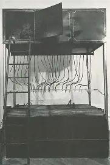
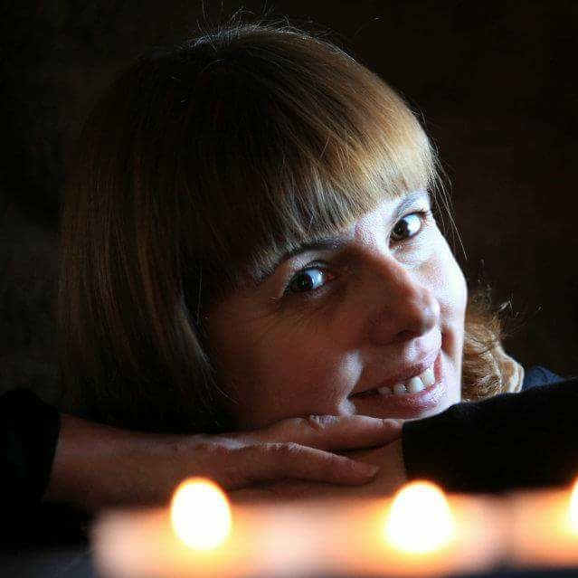
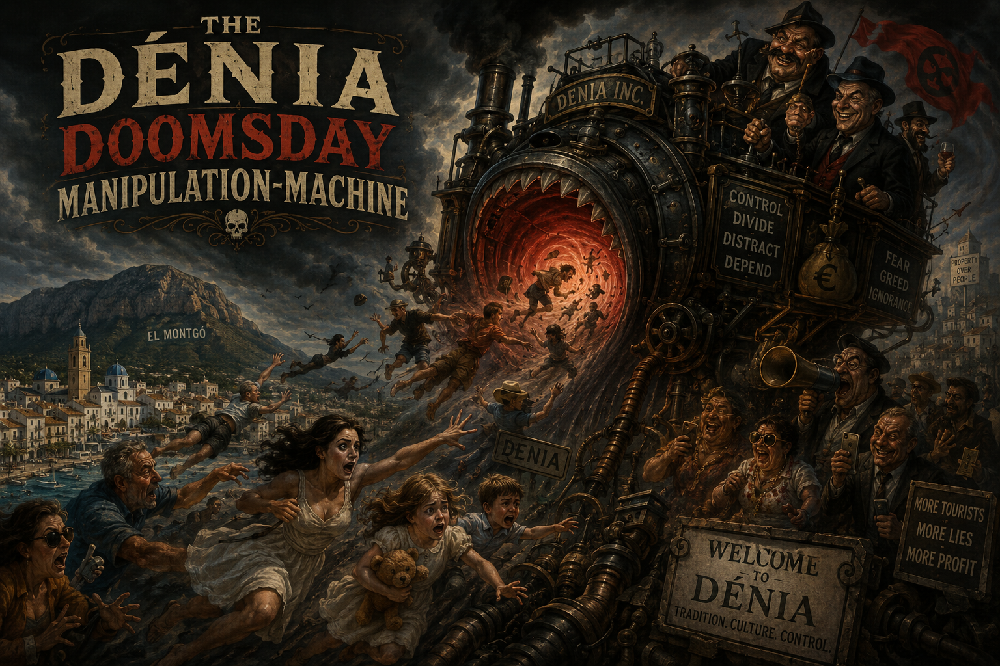

---
hide:
- navigation
#- toc
---

# Fear & Loathing in Las Marinas

- Las Marinas is a suburb of Dénia, Alicante, Spain. 
- Suburb is probably the right word.
- Wrong-un's live there.

## Summary statement to the police

This document details the multiple crimes committed against myself, and countless others, by an international criminal porn enterprise based in North London and Spain, over many decades since I was a child.

I am Dr Katharine Margaret Murphy, Y2775989H; previously residing at Carrer Furs 15, Bloque 1, Escalera 2, Piso 3, Apartamento 17, Dénia, 03700 Alicante, Spain; an apartment set up with advanced spy-cam technology.

Over the three years I lived in Carrer Furs, Dénia, after [finding the apartment available online on the 8th December 2021](timeline/2021/december.md#too-good-to-be-true-on-the-8th-december), and [signing the lease which included a death clause](timeline/2021/december.md#death-clause), and moving in on [15th December 2021 to find semen stains on the sofa](timeline/2021/december.md#semen-stains-on-the-sofa), I was drugged, poisoned, brain-damaged, repeatedly sedated after going to bed, filmed and live-streamed to millions of porn-addicts around the world.

Eventually, because I had no idea about what was happening to me, and because the gang's attempts at frightening me always failed, they tried to murder me by poisoning.

I continue to be gang-stalked and cyber-terrorized online and in-person to this day.

Up until I remembered [something extraordinary about the Tenor Cortis conservatory of Dénia in September 2025](timeline/2025/october.md#thunderbolt-clarity) and how it doubles as a porn-studio using teachers, staff, and children as its actors - with unwitting students as its drugged and brain-damaged *porn-stars* - I continued to suffer clandestine drugging and poisoning (attempted murder) anywhere I was in the world.

After I realized the extent to which the Spanish school system has been taken over by international criminal porn-gangs, I was only briefly drugged one time in Lourdes in April 2026 and all poisoning has since ceased.

I am currently homeless and essentially stateless, with zero friends or family, and I am unable to work.

I do, however, have a lot of God.

## Mass voyeurism, cyber-stalking, gang-stalking, honey-trapping, sedated spy-cam rape-porn, poisoning and drugging, and staggering levels of sexual violence against women, children, and babies

### Porn fatwa

- Since at least 2001, I have been the subject of a [porn fatwa](timeline/2001-to-2010/2003.md#porn-fatwa) issued by the same UK criminal gangs responsible for distributing criminal porn made by North London rape-gangs.
- I believe that this was, initially, due to them finding out I was going to receive £250K compensation for the Lockerbie terrorist bombing in which my aunt was murdered.
- At the time, and to whet the porn-addict appetite, [pedophile pornography made by North London rape-gangs in 1989](timeline/2023/november.md#first-time-they-flash-up-my-naked-16-year-old-body-on-x) starring me, sedated, was proliferated throughout criminal porn-addict networks.
- Specifically, porn-addicts were tasked with gaining more illicit porn with me in it - be it from hidden cameras or while sedated - and they obliged.
- As soon as I was in receipt of the compensation, they would move in with the films and demand I hand my money over.
- Except, something curious happened and the porn with me in it began to make more money for the gangs than any savings I might have been persuaded to let go of; and so motives switched early on and instead I became a prime target for the world's best known, and most loved, criminal porn studio of Dénia.
- Due to this, I have been under constant criminal surveillance for more than twenty-five years.
- The gangs know where I am to pinpoint precision: what I'm doing, who I talk to, where I work and who my porn-subscriber colleagues are.
- They read everything I write, watch everything I do online, attend work meetings, yoga classes, and therapy sessions with me, while keeping a careful eye on my financial status.
- Of course, the same criminals targeted other family members - and probably even [other UK/US Lockerbie families](timeline/2001-to-2010/2006.md#lockerbie) - to rob them of their compensation via honey-trapping, fake-relationships, sexploitation and blackmail, manipulated drug addictions, and online fraud.

### Brain-damaged for switcheroo horror-porn

- I was lured to Dénia online in 2006.
- Dénia - as the entire criminal underworld and any serious pornographer knows - has been the world's criminal porn capital for many decades.
- The porn-gangs there have been producing the worst sort of porn we all hear about, but usually only men like to watch: bestiality, incest, snuff, pedophilia, and baby-rape.
- British criminals living in Dénia targeted me [directly in 2007](timeline/2001-to-2010/2007.md#hazel-smith) with the intention of blackmailing me with child gang-rape porn from 1989, and other earlier films I've only just become aware of.
- When it became apparent I would not be parting with any money, they attempted to murder me by poisoning - in the understanding that my money would still be available to them via an inheriting family member (my brother) into whom they already had their claws.
- I survived the poisoning attempt, so they switched tack and I joined their brain-damage program instead.
- For nearly twenty years I was slowly poisoned by deadly herbs so that I would lose the ability to recognize objects out of context; a stroke-like symptom.
- This was so that between November 2022 and June 2023, the gangs could set up a [*switcheroo* horror-porn show](crimes/protagonists/vidal-sastre.md#vidal-sastre-sanchez-hornero) filmed live at the conservatory, in and around the town, and in my apartment without my knowledge, where at least four different men turned up to teach a class at the music school, children attending, and I would only know them as one man.
- This scam also required intense hallucinogenic intake to work effectively and I was drugged  intensely at my home before class, and topped up as I entered the music school by teachers, staff, and students.
- It was also intended that I would invite the "trumpet teacher" to my home - a man they had manipulated me into finding sexually attractive - where they planned to live-stream sessions of *switcheroo* porn through the 24-7 spy-cam network, me somewhat conscious.
- This did not happen as the man's rather pathetic romantic-advance (*oh, I'm in town on Monday afternoons*) gave me a PTSD reaction like no other.
- The body always knows.

### Gang-stalking

- This was nowhere near their first rodeo.
- When moving from spy-cam, honey-trap love affairs to sedated-rape back in the 90s, the gangs will have noticed that targets suffer with intense anxiety and depression after being sedated and raped. 
- I report on other women in the region who may have been targeted in the same way I was due to their inexplicable panic attacks and other suspicious symptoms, including my mother.
- In fact, my guess is this community has been brain-damaging women for centuries in order to rape them in macabre ways, and then laugh and point, and undoubtedly the same trauma effects have arisen in all victims historically.
- So, in order to "explain away" these expected feelings to a sedated-rape victim, the gangs create incessant and intricate, carefully choreographed, terror-vignettes starring multiple known protagonists that render a victim so anxious she doesn't notice the inexplicable anxiety and depression.
- I detail these near-daily instances of physical stalking assisted by pinpoint tracking of my movements via my hacked mobile phones in order to harass me and create anxiety-forming situations with the sole intention of terrorizing me into believing that the extreme anxiety and grievous mental and emotional harm I was suffering due to repeated sedated rape had a "logical reason".
- I assume the gangs expected this anxiety to also cover over the toxic physical side-effects arising from constant drugging and poisoning.
- Back in the UK in July 2024, while the terror was ongoing, I [stood as a candidate for general election](timeline/2024/june.md#volunteers-not-what-they-seem) and was stalked endlessly by criminal gangs.
- They even wheeled out [the 1989 North London rape-gang boss Winston May](timeline/2024/june.md#winston-may) who I complained about twice to the Metropolitan Police; once in 2006, and then again in 2015. 
- I expect he had been in prison at the time and was given a day out for this purpose alone.

### Drugging and poisoning with brake-fluid, pesticides, and other substances

- From February 2022 to October 2025, I was drugged continuously with hallucinogens and other substances.
- This ensured the efficacy of [the switcheroo-porn scam](crimes/protagonists/vidal-sastre.md#vidal-sastre-sanchez-hornero) while it was going on, and a continued inability to understand it afterwards.
- The hallucinogens were also used to exacerbated all emotional content; specifically terror, confusion and anxiety resulting from constant gang-stalking, and intense and overwhelming sexual arousal.
- My view is that the hallucinogens, along with sedatives and *happy pills*, were also used to keep my mind in a confused state so that I failed to notice the obvious signs of sedating-events when they happened.
- As soon as I had a period of continued clarity, the memories of those unusual events returned.
- [Sudden onset pre-glaucoma symptoms](timeline/2024/november.md#pre-glaucoma-diagnosis) point toward constant drug-taking as my pupils would have been near-permanently dilated, for years.
- Unusually elevated eye-pressure readings were reported as soon as I returned to Dénia in 2022.
- Whatever they gave me to invoke timed and overwhelming sexual-arousal was extremely effective and, given it always seemed to come on around lunchtimes - porn-addict showtime - I wonder if my neighbors popped in to add those substances to my lunch items while I was at the conservatory in the mornings.
- I believe that from around April to December 2023 I was also given some "physical performance" related substances as my yoga practice improved in miraculous ways for only those months!
- Curiously, something similar had happened to my body in September 1989 while I was in the clutches of the North London rape-gangs.
- I felt physically twenty-years younger for a short period and I have to wonder if that was intended as preparation for the planned faux-relationship leading to marriage (sudden death and inheritance) in which the sex would be filmed without my knowledge.
- Along with this, the gangs are poisoning me repeatedly with brake-fluid and antifreeze, pesticides, and similarly deadly substances.
- It's not clear why they would continuously risk the life of their live-streaming, sex-slave porn-star other than that they are murderously insane and their hatred of women makes the caliphate look like pussycats.
- My brain was damaged with poisoning over many years and I now have a perceptual injury whereby I'm unable to recognize objects out of context; this ensured that a group of vastly different-looking men - dressing the same, using the same voice (only one of them speaks), and performing the same actions - I thought were the same one man.
- I was drugged and poisoned without my knowledge; [in class at the conservatory](timeline/2023/january.md#serious-poisoning-at-chamber-music-class), at home via tampered-with water mains and air systems, in my car (sprayed/misted onto surfaces) and on all my belongings before I moved away, in my hotel rooms and wherever criminals have gained illicit access for adding poisons and drugs to my personal items such as food, water, makeup and bathroom products - the most recent egregious example of this occurring in [July 2025 in Lourdes](timeline/2025/july.md#lourdes), and in the street during numerous distract-and-drug events I detail in this statement.
- On Halloween night in 2023, [I was poisoned with brake-fluid or anti-freeze](timeline/2023/november.md#starting-my-new-job) and expected to sustain a serious injury or death at that time.
- At the end of October 2024, I was supposed to die by poisoning with brake-fluid, anti-freeze, methanol or similar, [added maliciously to the water and air vents in my flat](timeline/2024/october.md#serious-poisoning-with-intent-to-kill), doused over all my belongings, and added to my bathroom products for absorption through the skin.
- The gangs, from lengthy experience, were absolutely certain of my demise and their freedom to murder a victim without consequence.
- I sustained an injury to my right kidney which might now just be scarring (time of writing). 
- My eyesight was severely affected while being poisoned.
- Something I was ingesting thinned my bones and I had three repeated rib fractures at an already weakened area over the period I was living in Carrer Furs.
- I lost a great deal of my mental capacity and my ability to do mental work, and I found my chess-playing skills - previously exceptional - totally obliterated. I suspect this was very intentional.

### Sedated-rape

- It turns out, they had been sedating and raping me for years already, prior to the "switcheroo" events.
- They even persuaded my father to [take a starring role](timeline/early-years/2015.md#inexplicable-anal-fissure) in an incest special filmed at Joan Fuster.
- I suspect he was aware of what was going on in the town [from early 2013](timeline/early-years/2013.md#dad-visits-at-fallas) at least - and the criminals likely told him to [bring my mother out with him](timeline/early-years/2016.md#march) the next time he visited to make another million or so, and he agreed.
- During the *switcheroo* special, the *father* meme was reinforced constantly as if the whole town had watched my father anally-rape me while sedated, and just loved it!
- I believe I was repeatedly sedated, raped, and filmed in my flat in Passeig Periodista Ramon Ortega between 2012-2014, and probably at my flat in Cami Llavador 5 between 2006-2009.
- I believe the British gangs have been colluding with my father from early as 1989 when child-porn was disseminating through the networks starring me, sedated, being gang-raped by black men in Tottenham on their mothers' kitchen tables and elsewhere.
- My father's involvement in all this finally triggered a severe suicidal depression for which I had no context and thus assumed had to be related to the 1989 North London attacks. 
- This depression prompted me to report a more detailed story about what had happened to me in 1989 to the Metropolitan police in 2015 and while I was writing this statement online, the criminals were reading every word and would use phrases and examples taken directly from it as part of their gang-stalking choreography in 2023 at the conservatory.

### Police and government corruption

- Eventually, after the gangs *revealed themselves* and the hacking became obvious, I reported it to the Spanish police multiple times in 2024, and the company I was working for at the time, [Polygon](timeline/2024/march/1-12.md#reporting-hacking-to-polygon-labs), and even the Spanish government body who run the conservatories, the Generalitat.
- The trumpet teacher scam is well known to the Spanish government's school board, the Generalitat, and had taken place many times before.
- Targets are most often foreign women and children, or Spanish outsiders; those who don't know *how things work* in the Valencian region. 
- The conservatory is just one example of criminal porn-gang infiltration into the whole of society in the region - the most horrific bar the baby-rape industry - and this report also details decades of similar spy-cam and sexploitation crime against women, children, and babies, targeted by the same criminal pornographers who have been freely producing the very worst sort of pornography for decades.
- All over Dénia, men young and old drive flashy new sports cars worth minimum $50K and upwards. This is a poor town with apparently zero industry.
- I detail unusual events taking place in the town that may point to mass child-sex-trafficking and other porn horrors.

### The global tech-bro porn-addict community

- With such confidence in *getting away with it*, criminal porn-gangs were free to forge close alliances with my employers to create even more elaborate and sickening [criminal porn genres](timeline/2023/november.md#polygon) watched by the men I was working with; obviously making millions in the process.
- By the summer of 2024, the porn-gangs had finished with the *female tech-colleague you hate* porn genre, yet were still drugging and stalking me continuously as they worked steadily towards my assured total destruction.
- One working day prior to the poisoning, [Polygon fires me](timeline/2024/october.md#polygon-fires-the-whole-writing-team).

## A friend on the inside

- At some point, something happened between myself and a gang member, inexplicably and miraculously, that made him change his mind about his grim purpose.
- I believe it is to do with my memory of [a man sobbing his heart out in my arms](timeline/2023/march.md#dreaming-of-the-trumpet-teacher) in my bed one Monday night after chamber music classes at the height of the switcheroo scam and my unconditional and relentless good feelings for him that continue to this day.
- I believe he changed his mind about his grim purpose and maybe even asked them to stop, and they didn't - an impossible request anyway - and instead he started to help me in a clandestine manner.
- He told me about the region's decades-long honey-trap enterprise, sending me photographic evidence in the process.
- He sent me pictures of countless other female victims the gangs had targeted over many decades, some sexploitation blackmail victims, but many of whom I believe to have been murdered.
- He sent me pictures of the men involved in [the conservatory switcheroo porn-scam](crimes/protagonists/vidal-sastre.md#at-least-four) and much information I have been adding to this police statement.
- He told me about the proliferation of child-porn and the baby-rape industry in Dénia; one of the gang’s major sources of income.
- He warned me about poisoning in my home, and my car, amongst other things.
- While I was being severely and daily drugged with hallucinogens and toxic substances without my knowledge, it was hard to make sense of the information I was receiving, but I have been steadily piecing it all together.
- There is no doubt in my mind that without this man's help, I would not be here today.

## From honey-traps to world domination

- The criminality in Dénia began as honey-trapping; target a wealthy woman, trick her into thinking she's in love, film the sex, and blackmail her with it.
- Evidence for this comes from [the Irene photos](timeline/2023/july.md#plate-lady-early-in-the-month) dating back decades.
- If the target is from a wealthy family, they might even set up a fake marriage situation, wait till she inherits and then murder her.
- Honey-trapping for porn and prostitution was also going on of course but, significantly, the porn being produced in the Dénia region was often of the vilest sort; bestiality, pedophilia, and murder-porn.
- Abid Khan told us [all about it](timeline/pre-2001/1984.md#abid-khan-tells-the-class-about-the-criminal-porn-his-big-brother-shows-him) in 1984.
- As soon as the Internet connected everyone up, the gangs transferred their manipulation techniques into software and no-one could have imagined how successful it was going to be!
- The gangs not only mass-target victims online for filming but they deliberately worsen user's porn-addictions, "honey-trapping" them into paying to view more violence, then pedophilia, then worse.
- The more criminal the porn, the more expensive it is to view.
- Today, millions of children and toddlers are manipulated online into self-producing porn for the gangs directly.
- This is how effective their manipulation tech is.
- At some point, some bright spark amongst them must have realized that porn was just one of a million lucrative themes the manipulation tech could be used for.
- Did they start experimenting at that time?
- Did the criminals of Dénia eventually [sell their manipulation-tech to the caliphate](timeline/2001-to-2010/2008.md#dubai) once they had demonstrated its power by tricking [Alessandra into undergoing an unnecessary bone-marrow transplant](timeline/2001-to-2010/2009.md#alessandra-gets-sick-or-does-she), and [Lorraine's daughter into believing she's a boy](timeline/early-years/2013.md#lorraines-trans-child), and no doubt many other successful mind-control tricks which will soon transpire.
- From here, I believe the gangs went back-to-basics using targets like myself for blackmailing porn-obsessed tech CEOs into giving them use of their massive processing hubs in order to run the caliphate-AI social-media hypno-tech.
- Just over ten years of this lie-spreading-software out in the wild and the world has gone totally mad.
- We are suffering from a tidal wave of sexual perversion and hatred towards women and children and Jewish people.
- We have children's mind being scrambled by their zombified teachers; society quite happy to render them incapable of ever having an orgasm or their own children on an ideological basis alone.
- In Spain, your child might be starring in porn, with-or-without your knowledge, while attending music classes.
- Even more worryingly is the mass delusions of apparently educated people towards barbaric Islamic groups coupled with a terrifying rise in antisemitism which is starting to look like scenes from Nazi Germany.
- And every day a man is in court in the UK having downloaded thousands of baby-rape videos; the judge giving him a slap on the wrist.
- I believe the criminality allowed to flourish and distend in Dénia - baby-rape capital of the world - is behind it all.
- In a town accountable to no-one, where zero morals reign and obvious detrimental long-term consequences are ignored, I believe the criminal gangs and the local people have completely lost their minds.
- Their [hypno-tech doomsday machine](crimes/hypno-tech.md) needs to be stopped, and quick.
- I suspect some of the wiser amongst them (and hopefully at least some of the women) agree with me too.
- In their obsessive relentless crucifying, they only ended up crucifying themselves.

## A well-oiled sedated-rape-porn machine 

- The conservatory's [switcheroo-porn scam running in 2022-2023](crimes/protagonists/vidal-sastre.md#four-distinct-men), me starring, was an efficient and very well-oiled machine.
- There must be countless victims young and old; many missing, presumably murdered.
- I intend this police statement to help every last one of those victims, dead or alive.
- I believe that [every daily event](timeline/2001-to-2010/2001.md) I detail in the timeline of this police statement was videoed and broadcast to a porn-addict and vile misogynist online community as a kind of "show" which explains the townsfolk's total insanity and has also made criminal gangs very rich.
- This is, essentially, why I'm so famous.
- I believe that millions of porn-addicts around the world were, and maybe still are, betting on the outcome for me; madness, suicide, murder, more sedated-rape, etc.
- I was/am in a kind of Truman Show, except "Truman" is a targeted individual, usually a woman but not always, probably often a child student of the conservatory, and us "Trumans" are expected to die by suicide or serious ill health from poisoning, or go quite mad from the relentless mental torture, or be outright murdered if we're made of tougher stuff, and none have never escaped. 
- Until now.

## Lorraine Blackbourn should be alive today

- Lorraine Blackbourn committed suicide in July 2021; on the exact same day I returned to Dénia for a short holiday after many years!
- Her funeral was a few days later; the very day I went to the beach and saw Caroline England crying at the Rani Palace restaurant.
- I believe Lorraine was manipulated online into suicide by [the gang's hypno-tech](crimes/hypno-tech.md).
- I believe Hazel Smith invited Caroline England - devastated by Lorraine's death - [to lunch at the Rani Palace where we saw each other](timeline/2021/july.md#lorraine-blackbourn-commits-suicide).
- Did Hazel do this to demonstrate the power of the hypno-tech to Caroline; explaining that Lorraine was, in fact, driven to suicide and the same fate is planned for me?
- I believe Lorraine had found out her British friends were being sedated and raped by their husbands and the rest of the town's menfolk, and likely worse.
- Did she find out about the baby-rape-porn industry flourishing in the region?
- I believe she complained to the authorities, as did I, and was ignored, as was I.
- I believe that the overwhelm of horror, and the devastating knowledge that no-one is going to do anything to protect innocent women and children - coupled with years of mental/emotional torture as her daughter went through the trans-child-abuse-machine - tipped her over the edge, and she was unable to withstand the hypno-tech's suggestions and demands.
- [I dedicate this police statement to Lorraine](dedication.md).

## Everyone in *baby-rape-capital-of-the-world* knows who I am 
### Maybe everyone in the whole of Spain too

- If you travel to Dénia and talk to a few people, ask them if they know me. 
- They will say yes.
- A [Spanish government official confirmed it](timeline/2024/october.md#visiting-inma-again-in-madrid); everyone in Dénia knows who I am.
- If you ask them why the whole town persecuted and terrorized me for three years, I expect the answers will be quite interesting.
- Perhaps you'll find someone who saw me going to the toilet, or showering, or doing yoga in my sitting room, or taking an enema.
- Maybe someone heard me farting loudly.
- Many of the men will have seen footage of me masturbating in my bedroom or bathroom while I was drugged out of my mind on spiked hallucinogens and aphrodisiacs.
- No doubt they will have seen the regular sedated-rape sessions broadcast live from my apartment, or even [the preliminary switcheroo sex-assaults filmed live at music classes at the conservatory](crimes/protagonists/vidal-sastre.md#at-least-four).
- You could ask them if they were watching the porn specials back in 2015, 2013, or even 2008 from my other homes.
- Why not ask them who else they're watching in similar situations; there's bound to be masses of live-action spy-cam sex-slaves everyone knows about.
- Ask them how many of those women ended up dead, and if you like, you could ask them if they expected the same for me.
- You could ask them if they got access to private conversations I may have had with colleagues about things I had to sign NDAs about.
- Or whether they saw footage of me as a child, sedated and gang raped by a group of black men, or any of the other multiple times I ended up in porn without my conscious awareness, knowledge, or consent.
- Don't forget to ask them about the flourishing pedo-porn and baby-rape industry in the region.
- I can imagine you could start a conversation off with one of these people and it feel normal, and funny, and they're laughing, in a jeering way - they're way better than those foreign sluts that everyone hates that they watch obsessively on the porn channels - and you mention the children, and the conservatory teachers, and they're still laughing, but there's a flutter in their voice now, and you mention the babies, and there's a splutter, and then they stop laughing, you lose eye contact with them, and maybe, just maybe, the shame can come in and they're human again.

## Colleagues and employers with horror-porn subscriptions, and their mates

- It turns out, that everyone was having so much fun at my expense over the last thirty-eight years - and making so much money - even the tech-bro porn-addicts at some of the companies I worked for were enjoying my prolonged horror-porn-crucifixion; and most significantly at [Polygon](timeline/2024/may.md#bali).
- The porn-gangs even used regular, common, law-abiding, tax-paying tech-recruitment-agents to lure me into amazing jobs with great salaries in which I was immediately treated like dirt.
- Those grotesquely upsetting moments were lived-streamed for jeering, and masturbating over when the boys popped over later on after I had gone to bed and was rendered unconscious on sedating gas.
- For these horrible reasons, I'm uploading my CV so that if anyone cares to investigate the global tech-bro horror-porn obsessions endangering the lives of law-abiding, tax-paying, decent women and men (of which I am no doubt the tip of the iceberg), here's where you might like to start.

- Yes yes, I know I know, why is the doctor of Computer Science who built the world's first spiritual tech working in a role that everyone believes is worthless?
- Perhaps our story will explain that on its own, and without further effort.

## Motive

### Figuring it out

- Trying to figure out what the hell was going on in Dénia - never mind why - was a slow process.
- It was obvious to me something *very bad* was happening, but I failed to assess the seriousness of it for a long time, by design.
- Initially, I thought that just a few idiot men with pre-pubescent mental ages couldn't stop themselves terrorizing women and girls to the extent I was terrorized at the conservatory between November 2022 and June 2023.
- It upset me that they were able to involve so many women and children, but Spain is a macho-state after all.
- Once the online stalking and phone hacking became obvious in the summer of 2023, I started to shift my view on what was going on, but again it was a slow process and marred by constant spiked-hallucinogen intake coupled with the relentless emotional hypno-hacks embedded into all my devices by that time.
- The idea that I had been stalked by criminal gangs since 1989 when North London rape-gangs filmed me during multiple sex attacks and distributed those films to a "global porn-addict audience" - which, it turns out, could include any man we know, and for sure a great proportion of the men we do know - was preposterous.
- But it was this, and eventually my wealth, that made me the target of endless sedating/porn gangs in the UK, France, India, and Spain - some of which even included friends, boyfriends, and family members.
- Of course such a well-known target like myself is going to be lured to the horror-porn spy-cam studios of Las Marinas where no-one will ever come to help.

### Corruption to blame

- Spanish corruption ensures the criminal pornographers of Dénia are untouchable and, due to this, I believe the whole town slipped into a murderous mass-psychosis brought on by unfettered porn-addictions in the men, and men-worshipping in the women.
- Perhaps some good people tried to stop it, and were dealt with in ways that ensured no-one else would do the same.
- From here, it's easy to see how a small population might go totally mad: if you can't beat em, join em, right? 
- At least three decades ago, wealthy locals and foreign women were commonly targeted for sexual exploitation and blackmail by porn-gangs using already advanced spy-cam technology; as we saw with the evidence of [Irene's honey-trapped love affair](timeline/2023/july.md#plate-lady-early-in-the-month) which probably occurred in the 80s.
- My guess is that the gangs insisted on payment from victims or they would distribute the films - then distributed them anyway to the mostly male porn-addict networks who never tell.
- The porn arm of the criminal enterprise would have become even more lucrative as the Internet took off.
- It must have been a seamless evolution into installing spy-cam networks in holiday-lets, hotels, rental apartments, houses for sale, school classrooms, public toilets, hospital wards, and police stations, and making a lot more money by doing so.
- The next obvious step was setting up unwitting sedated sex-slaves; women and families on holiday, or lured to the area to rent or buy houses which are not only set up with 24-7 spy-cam networks but also sedating tech through the air-conditioning systems, and drugging and poisoning through tampered-with water mains or blatant trespass while the inhabitants are out.
- It is one thing drugging a woman while on a date, or even in the street with distraction techniques; it is quite another setting up whole apartments with sedating-gas technology for live-streaming sexual assaults onto porn-networks.

### The Dénia Doomsday Manipulation-Machine

- Of course, paying porn-addicts get bored easily (porn is *UTTERLY* boring after all) and no porn-businessman will lose a paying customer if he doesn't have to.
- And, thus, the manipulation-tech became a doomsday machine, tricking men into paying to see more and more deprivation, more rape, more murder and injury, younger and younger victims, old women in nappies, pregnant women and babies, there's no end to the depravity of the porn-addict and his relentless search for the next worst thing.
- To supply the demand, the criminals moved into schools; indeed anywhere that women, children, the vulnerable, and babies are available for grooming, drugging, sedating, and filming.
- The fact that no-one cares about these very obvious mass-crimes against the innocent is nearly inconceivable to me.
- My understanding is that the people of Dénia became so insane, they even broadcast sedated-rape events on the local TV channel, [Dénia TV](timeline/2001-to-2010/2008.md#denia-tv), and have been since at least 2007, and this is why everyone knows who the victims are.
- My guess is there are thousands of victims, many murdered for *snuff* porn.
- This statement publishes the photos of a small portion of these women.
- And working alongside the horror-porn-enterprise, you have people like Hazel and Sandra Smith, known British serial killers, operating freely amongst hundreds of their default target-types: British ex-pat pensioners with money and property.
- My guess is these two were brought in by the gangs via their solid North London connections to work solely with the massive ex-pat community in the region, and I suspect they are probably slaves to the gangs themselves.
- Even so, these two are formally criminally insane, and my guess is that they repurposed the honey-trap sexual-arousal manipulation-tech for suicide and murder - just for fun initially - and even that started to pay off.
- My guess is these two alone have murdered hundreds in the last twenty-odd years; and we can only guess at how many the Lopez Cano's have dispatched with.
- They literally enjoy it!
- A similarly worrying trend is the evidence suggesting that online manipulation techniques, coupled with clandestine drugging, can persuade women to marry if they're rich, and/or get pregnant quickly for more *product* supply.
- I believe that the hundreds-of-thousands of Category A child-and-baby rape-porn we hear about on the news every week in the UK is produced in Dénia by the same gangs that so easily infiltrated the government school system. 
- They just stomped straight into public classrooms; and all the teachers, staff, and government administrators tipped their hats.
- And let's never forget the long-established teachers and staff already on the porn-gang payroll.
- The criminals know very well how valuable their product is to Western porn-addicts, and how international judicial systems will do nothing to stop them.
- And of course everyone knows what happens to *very unwise* people who have unlimited power over others: the power of life and death by clandestine poisoning, the power of being able to manipulate a person into doing anything at all -> into experiencing strong emotions that include believing they're in a reciprocal love affair, to suicidal and homicidal feelings, or believing they are sufficiently sick to justify life-threatening surgery, or that they were born in the wrong body and should therefore chop bits off the perfect one they have, the power of knowing what a person is doing and where they are 24-hours a day, the power of listening to all their conversations, reading all their correspondence...
- This is a self-destructing and totally insane one-way street to more and more excessive and appalling criminal psychoses acted out.
- Do the criminals play games amongst themselves and the wider porn-addict community about who is going to kill themselves, who will undergo surgery, who would they like to see murdered or running around naked in a field after a horse?
- It makes statements I heard from apparent "friends", such as ["Why does someone always have to die?"](timeline/2023/december.md#piano-concert) chilling to the bone.
- Unsurprisingly, the suicide statistics in Dénia are off the scale. 
- The Dénia Doomsday Manipulation-Machine started life as a methodology for tricking women by cowardly petty-crook misogynists, and was left to spiral into its current monstrous form simply because no-one considered porn-driven decades of serious sex crimes against women and children worth stopping.
- We only have ourselves to blame.

### What happens to those who complain

- I believe Lorraine Blackbourn stumbled across something the gangs were doing that she literally couldn't live with (and you could take your pick here but my guess it was that the whole town was sedating and raping her friends - maybe even her too, for added suicidal depression).
- I believe she tried to get help, like I did, and was totally ignored, like I was/am.
- I believe this tipped her over the edge and she was unable to withstand the online suicide suggestions which I can tell you from first-hand experience are extremely powerful, albeit fake.
- I recall [a British woman telling me she'd refused to do porn](timeline/early-years/2013.md#the-british-woman-who-refused-to-do-porn) with her *much-younger-Spanish-boyfriend* and that he'd become enraged.
- When I saw her again, fifteen years later, she was crippled; my guess is due to regular pesticide-dousing of clothes and belongings, like they do.
- Then there was unusually irascible Maria, living alone, her liver swollen to three times its size; all her doctors and even the hospital in Valencia telling her it was nothing!
- I remember seeing crippled locals; a youngish man working in a tobacconist, someone I had known not so long before as fit and healthy.
- Is this what happens to the good people of Dénia? 
- Are they prisoners in their own homes or forced to get involved against their will?
- Will they be killed or maimed if they complain, countless examples available?
- How many have refused to do porn, or tried to stop some evil, and ended up crippled by pesticides or murdered?
- Are all victims of horror-porn, even the unwitting ones, summarily maimed or killed?
- Staying alive and well is always a strong motive.
- Are people's children threatened?
- My online helper - [the repentant trumpet teacher who I have forgiven](#a-friend-on-the-inside) - told me repeatedly that the gang will kidnap your kids if you go against them.
- It seems likely that a criminal porn-enterprise with expertise in sedating, surveillance, and spy-cam tech, with members all over Europe and the UK - including Portugal as I found out on my trip to Fatima in October 2024 - would be behind the Madeline McCann kidnap.
- Did they target Madeline to teach someone a lesson, like they do?
- Tweets like this one made me wonder if they kept her alive as a bargaining chip.

- Is this why no-one has stopped them?

### Motive summary

- So, to summarize: the petty crook, honey-trap, spy-cam porn operations of the 80s evolved in parallel with Internet technology and the horror-porn town of Dénia, Alicante, Spain - unimaginable outside of fiction - emerged as a mundane reality.
- We should not be surprised either; it was inevitable.
- The motive is, as [Paqui Fornet Pastor](crimes/protagonists/domingo-et-al.md#paqui-fornet-pastor) told me one evening at piano class in March 2024, *it's what they do*, and no-one's been able to do a thing to stop them.

- Until now.

## Why was I in Dénia?

- I love Dénia. 
- I thought I had many friends there.
- I had no idea that - apart from my first visit in 1997 - I'd been lured there by online manipulation as a prime target for horror-porn specials that require careful poisoning over many years to administer stroke-like, brain-damage symptoms.
- I sang in the Orfeó de Dénia choir, led by Klara Sarkadi.
- It was while singing with Klara's choir that I met the characters who made sure I applied to the [conservatory of Dénia](https://portal.edu.gva.es/conservatoriDenia/) to study the piano.
- "Find out what she wants", is their subtle and not-so subtle honey-trap game, and they supplied.

{width=75%}

- Here I am playing the piano at the yacht club as a student of the conservatory of Dénia in the winter of 2015 while suffering with increasing depression and anxiety as multiple local men were entering my spy-cam networked apartment to rape me after I'd gone to bed and been rendered unconscious with sedating gas.

{width=70%}

- Having a background in music, piano, and a Bachelor of Arts in Performing Arts, I had huge respect for the teachers and staff at the conservatory of Dénia.
- The standard of teaching was second-to-none and studying the piano with them was, I believed, an enormous privilege. 
- Dénia was my safe place; a special, magical place where I felt at home.

- I had no notion of the ugly underbelly of this place; about how unsafe women and children are, even at government learning establishments.
- It was inconceivable to me that the professional, well-educated, well-spoken, friendly, apparently normal Spanish people I interacted with on a daily basis were happily sacrificing women and children and babies to their never-satiated gods of porn.
- Is it possible God had another reason for me to be there, a good one?

## Police statement structure

This police statement is set out into different sections.

1. **Timeline** of significant events:
    1. The largest section and in continuous evolution (all other sections at the time of writing are in an early draft state).
    1. There are at least three Netflix-seasons in here:
        1. The sedated-sex-slave, conservatory switcheroo-porn terror; between February 2022 and let's say until surviving poisoning once again in October 2024.
        1. Our heroine struggles to save her own life; from November 2024 to this day.
        1. Background and history of significant and related events from our heroine's life; from 1980-2021, and this section could be split further:
            1. Childhood signs and symbols.
            1. Growing up and silencing: rape-gangs of North London and the effects of sedated sexual assault on a victim and on the obsessive and secretive porn-addict community close to her.
            1. A woman's career in tech and what happens when colleagues and recruiters find out she starred in sedated child-rape porn (a horror-porn Netflix miniseries special all it's own).
1. **Crimes** and protagonists -> information still coming in on the major porn-gang players of Las Marinas and North London.
1. **Evidence** -> at a very draft stage and in continuous development.
    1. My belief is that bulk of the evidence/proof will come from the tidal-wave of corroboration when people realize it's safe to speak, after which the mass of porn-evidence will likely emerge.
1. The **Personal experience** section is an early attempt to catalogue the costs to my health and finances but I'm beginning to realize the futility of this because:
    1. Apart from some brain-damage symptoms I'm not sure I care about (they do wonders for my meditations) and the long-term detox symptoms from pesticide/brake-fluid poisoning which look to be finally disappearing, I'm well.
    1. Continuous drugging with hallucinogens for years has also had no discernable bad effects (but is, of course, not recommended and I suspect I'm an unusual case).
    1. The costs to me financially, however, are incalculable and my attempts at itemizing them started in April 2024 when I still had no idea about the extent and reach of the evil, and what was still planned for me on the solid assurance - from multiple past-victim experiences - that I would be murdered and forgotten.
1. A **Conclusion** in editorial which I'm dreaming about updating as soon as the babies and children are safe.
1. **The novel** is a section I use to store book cover designs.

## Contact the author

- Contact me for any further information you may require on the-chief-of-police@fearandloathinginlasmarinas.com.
- Agent and publisher details coming soon.

- We can talk about the *Ark Project Trilogy* another time but this is probably Part 3, a true crime extravaganza. Part 1 was a foundational romance: Life Without The Liar. Part 2 was a prophetic horror: AntiChrist.
