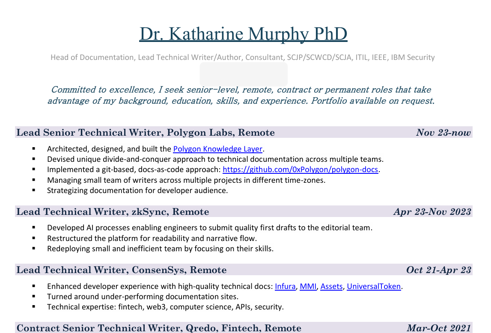

---
hide:
- navigation
- toc
---

# Fear & loathing in Las Marinas

- Las Marinas is a suburb of Dénia, Alicante, Spain. 
- Suburb is probably the right word.
- Wrong un's live there.

!!! warning
    - This is a private repo, soon to be available to the public.

## Summary statement

This document details multiple crimes committed against myself, Katharine Margaret Murphy, Y2775989H, previously residing at Carrer Furs 15, Bloque 1, Escalera 2, Piso 3, Apartamento 17, Dénia, 03700 Alicante Spain, not least attempted murder, that have taken place over the three years since moving into the apartment on 15th December 2022. 

Gang-stalking and terrorizing continues online and in-person since leaving Spain and while living in the UK and visiting France.

### Mass voyeurism, cyber-stalking, gang stalking, honey-trapping, and mass gender abuse/violence

The report details the following:

- How I have been the subject of a [porn fatwa](timeline/early-years/2003.md#porn-fatwa) since at least 2003, issued by UK criminal gangs; the Adams family and possibly others.
- How, in Dénia itself, criminal gangs hacked my home network, mobile phones, and laptops - including work laptops from three different companies - most likely using insider knowledge of my home router's MAC address. 
- How previously, in the UK, criminal gangs have been hacking all my online activity for decades and probably my families too.
- How criminals targeted other family members, and [even other UK Lockerbie families](timeline/early-years/2006.md#lockerbie), for their share of Lockerbie compensation.
- As the porn fatwa gathered momentum, it seems everyone went mad and were able to justify cyber-stalking and gang-stalking by teachers, staff, students including children, and others at the conservatory of Dénia; their friends and families and children, and, closely connected to them, organized criminal porn gangs that have infiltrated the public school systems in Spain.
- Physical stalking, tracking my movements via my hacked mobile phones, and probably tracking on my car, in order to harass me and create intricate choreographed situations with the sole intention of terrorizing me and causing me grievous mental and emotional harm.
- Sexual grooming and honey-trapping online and in a public learning establishment where many hundreds of children attend, the conservatory of Dénia.
- Drugging, sedating, and poisoning without my knowledge; in class at the conservatory, at home via the water and air systems, in my car (sprayed onto surfaces and through the air vents), on all my belongings when I moved house, in hotel rooms they gain access to, poisons added to my personal items such as food and toiletries; the most recent example of this occurring in [July 2025 in Lourdes](timeline/2025/july.md#lourdes).
- Constant surveillance which included taking photos and videos of me of a sexual nature, and otherwise, from hacked devices and/or hidden cameras, and disseminating them throughout Dénia, and likely making money from them on paid-for WhatsApp groups and/or porn networks.
- Weekly or more sedated rape-porn "events" videoed via a set of spy-cams in my apartment where numerous local men entered my apartment without my permission to rape me, sedated, the films distributed across international porn networks and viewed by my [tech employers and colleagues](timeline/2023/november.md#polygon).
- Constant 24-7 mass voyeurism of myself through my hacked devices and apartment spy-cams.
- Once I'd been run through and the porn-gangs had finished with me, and I refused to leave (because I had no idea what was going on), they decided they would murder me by poison, possibly strychnine, methanol, or similar; [added maliciously to the water and air vents in my flat](timeline/2024/october.md#serious-poisoning-with-intent-to-harm-or-kill).
- I have sustained a severe kidney injury due to the poisoning (which I believe will heal) which criminal gangs continue to be [extremely nasty to me about online](timeline/2023/january.md#criminal-gang-online-cruelty).
- My vision has also deteriorated hugely since September 2024 and I have been diagnosed with a [pre-glaucoma condition](timeline/2024/november.md#pre-glaucoma-eye-condition). I have noticed my peripheral vision has completely disappeared on the left side mostly and in front, right side too. This is why I think methanol was used.
- I have samples for all of this as well as physical injury.
- Extraordinary amount of personal financial loss, and an even more extraordinary amount of financial gain from my suffering to the [porn-gangs](crimes/protagonists.md#domingo-lopez-cano) of Dénia for over at least a decade.
- High likelihood of being sedated, raped, and videoed in the same way at my flat in Joan Fuster 11 over the years 2014-2016; events that triggered a huge suicidal depression.
- Possibly sedated, raped, and videoed in my flat in Cami Llavador 5 between 2006-2009.
- Criminals had access to extremely personal and criminal information about me - such as pedophile pornography made by a rape-gang in North London in 1989 which British criminals living in Dénia told them about. These criminals targeted me [directly in 2007](timeline/early-years/2007.md#hazel-smith), and obviously shared this information with a huge number of people in the town in order to gain support for extreme persecution, and to justify further targeting, harassment, and terrorizing a lone, vulnerable, and wealthy woman with no support; something they were so experienced and expert at, I cannot imagine I'm the only victim.
- I believe that **every event** I detail in this statement was videoed and broadcast to a mostly porn-addict and vile misogynist online audience as a kind of "show" which explains the townsfolk's total insanity and would have also made criminal gangs very rich.
- This is, essentially, why so many people know who I am.

### Everyone knows who I am

- If you travel to Dénia and talk to just a few people; ask them if they know me. 
- A [Spanish official confirmed](timeline/2024/october.md#madrid-and-paloma) that they answer in the affirmative; everyone knows who I am.
- If you ask them why the whole town persecuted and terrorized me for 3 years, the answers will be quite interesting.
- Try and find someone who's seen footage of me naked, maybe masturbating, privately in my flat. They will be easy to find.
- Perhaps you can find someone who's seen me going to the toilet, or having a bath, doing yoga, or taking an enema, or maybe they heard me passing wind very loudly?
- Were they party to private conversations with colleagues and industrial secrets; things I had to sign NDAs about?
- Try and find someone who's seen footage of me as a child, sedated, being gang raped by a group of black men, and you may find someone who has seen it. You will certainly find many people who heard about it. 
- Try and find some of the men who have entered my apartment while I was sedated and raped me while the events were live-streamed internationally? They are there, and I have them on spy-cam too.

#### Colleagues and employers

- It turns out, that everyone was having so much fun at my expense, and making so much money too, the tech companies (not all of them) I worked for were hugely involved in the conspiracy too, particularly [Polygon](timeline/2024/may.md#bali).
- Over the last ten years, possibly after being watched online in Joan Fuster by the global tech-bro porn-addict community, as an extended violence against women requirement, recruitment agents were employed to lure me into amazing jobs in which I was immediately treated like dirt.
- For that reason, I'm uploading my CV here so that if anyone cares to investigate the global tech-bro porn-gang conspiracy (of which I am no doubt the tip of the iceberg), here's where to look first.

- I will expand on this shortly of course.

## My personal suffering

- See [Health](personal/health.md) for more information on health problems arising from 3 years of poisoning and drugging in Dénia.
- See [Expenses](personal/expenses.md) for more information on the financial cost to myself of enduring 3 years of gang stalking and mass gender violence by the people of Dénia, including lost work due to extreme stress and non-consensual drugging rendering me incapable of making good decisions.

## Motive

While trying to figure out what was going on, I spent much time theorizing on why a whole town would put so much energy into threatening and terrorizing a woman they considered vulnerable for over three years.

In the end, I think the town has suffered a murderous mass-psychosis.

I believe the town of Dénia has been a spy-cam porn-studio for over a decade. Prior to that, wealthy and foreign women were commonly targeted for sexual exploitation using spy-cam technology, so it was a simple evolution into installing spy-cams in AirBnBs, hotels, rental apartments, and houses for sale.

Any resultant police complaints will have been silenced and ignored, and I expect there are thousands.

We know that porn-addicts get bored easily, and need more and more deprivation, more rape, more murder and injury, so the porn studio clearly extended into schools and places where children and young people are vulnerable to grooming. We don't know how many children have been victims of the porn gangs. Again, multiple complaints will have been silenced and ignored.

Furthermore, there is evidence to suggest that online manipulation techniques coupled with clandestine drugging is being used to persuade women to have babies with porn-gang members, which they can then abuse to make up the millions of baby-rape videos we hear about every week in the news.

And what happens to people who have such power over others? The power of life and death by clandestine poisoning. The power of knowing what a person is doing 24-hours a day. The power of hearing all conversations, and reading all letters, chats, and correspondence.

I believe they started creating "shows" of targeted women and everything that has happened to me has been watched online by millions of sick porn-addicts and homicidal maniacs. Could Denia TV be broadcasting such evil?

Perhaps they even run a betting segment; will she kill herself? Or should we just murder her?

No wonder Christine said, ["Why does someone always have to die?"](timeline/2023/december.md#piano-concert).

The suicide statistics in Denia are off the scale.

The end goal of everything that happened to me, and any other target, was death; either by suicide, or murder.

If I'm right, I still can't believe they are all this insane. Are the good people of Dénia prisoners in their own homes? Do they know what's going on but can't do anything about it because they'll be killed or maimed? How many tried to solve this problem and were murdered?

Are the cyber-stalkers who fed me information and evidence about actual crimes simply decent Dénia citizens unable to get help via any normal security routes?

Could such staggering criminality have been normalized by the Spanish police and government because you have to be a porn-addict to know about it, and so many men are, from all walks of life, and every echelon of society?

## Why was I in Dénia?

I love Dénia. 

I had many friends there and I sang in the Orfeó de Dénia choir, led by Klara Sarkadi, for years. It was while singing with Klara Sarkadi's choir that I met people who helped me enter the [conservatory of Dénia](https://portal.edu.gva.es/conservatoriDenia/) to study the piano.

Studying the piano at the conservatory was an enormous privilege. 

It is a special, magical place. 

I always felt Dénia was my safe place. I had no idea that I had been targeted by criminals and porn gangs in Dénia since 2006. I had no idea of the ugly underbelly of this place, and the culture, and how women and children are particularly unsafe, even at public learning establishments.

In fact, I just wanted to play the piano and the standard of music teaching was second-to-none. 

{width=75%}

This photo is of me playing the piano as a piano student of the conservatory of Dénia in 2015.

{width=70%}

I still can't believe that everyone in the town is evil. I wonder if the battered women, like Paqui Fornet and others, felt unable to resist their husbands maddening porn-addictions. I wonder if many others just went quietly mad too, knowing there was nothing they could do. I wonder if the majority prayed constantly and fervently to God, asking for His intercession. I'd hope it was a majority, I suspect it wasn't, but regardless God answers every prayer. I hope this police statement does somewhat to answer at least some of those prayers.

## Report layout

The report is set out into different sections.

1. Timeline of significant events.
2. Description of the crimes and protagonists.
3. Evidence including screenshots to prove hacking and cyber-stalking -> this section might mostly end up in section 1.
4. A summary of my personal suffering, including physical and psycho-emotional trauma, and also the financial and professional costs I have suffered due to these horrible experiences.
5. A concluding remark.
6. Updates and images for the report coming out in novel form in the very near future.

## Book cover

!!! tip
    - Contact me for any further information you may require on query@fearandloathinginlasmarinas.com.
    - This may include copies of any correspondence, emails, call logs, WhatsApp message, poison/drug samples for testing, etc.
    - Agent and publisher details coming soon.
