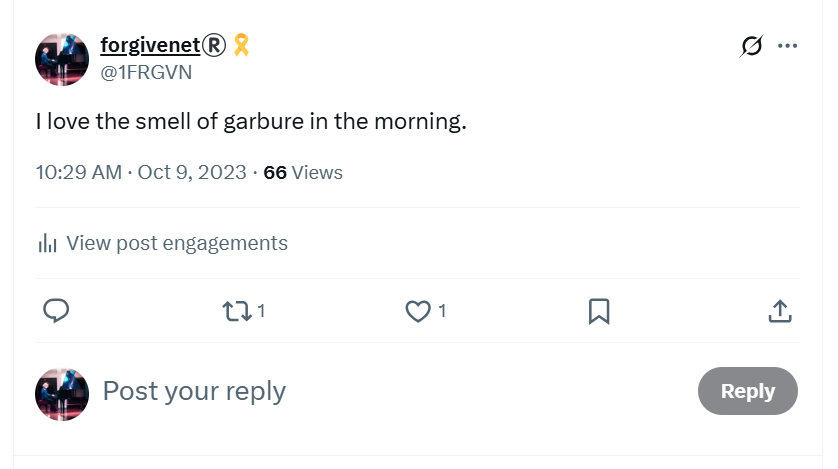
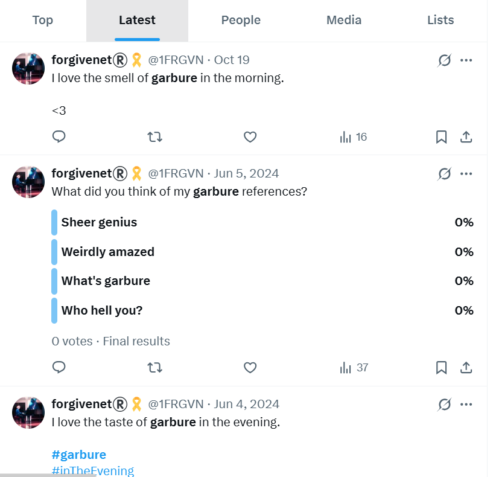
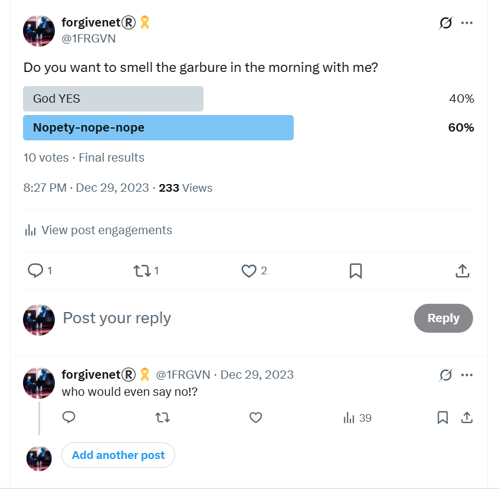
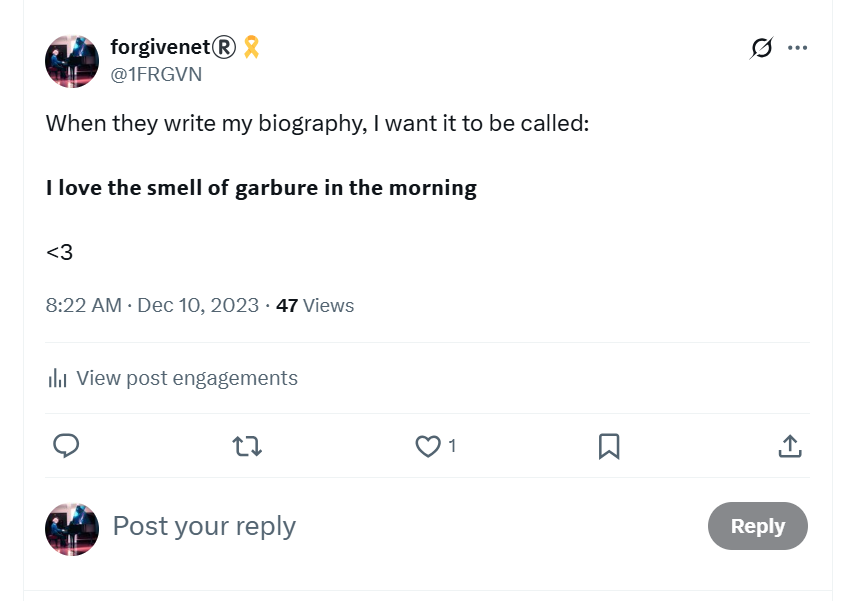
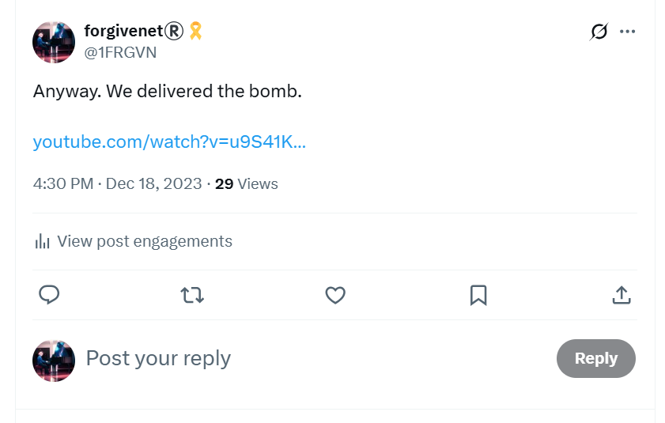

# Memes

## Garbure

- I gave at least as good as I got online, certainly in the early days.
- Once I realized I was being full-on cyber-stalked ([12th June 2023](../timeline/2023/june.md#monday-12th-june-2023)) and was recognizing the patterns, I made every attempt to fight back. 
- Lately, I'm probably ahead.
- *I love the smell of garbure in the morning*, is my favorite proprietary meme.
- Garbure is a local dish from the Pyrenees and you can smell it being prepared in the hotel kitchens in Lourdes every morning. 

%20garbure&src=typed_query&f=live)

- I certainly felt that Mary was on my side helping me deal with these people, and undoubtedly this was mine, Hers, and Saint Bernadette's battle-cry.
- Here's a poll about garbure from December 2023.

- Here's a tweet about how this meme should be the title of my biography.

- I wonder how it must have been for them to have gone from total certainty about my lack of humanity and the inevitability of my doom at their hands, to an inkling something wasn't going the way it usually did, to their stressed states nowadays as the pit of their own making swallows them up.
- I also wonder what it must have been like for the righteous silenced-and-fearful to watch these changes occur, still in marvelous progress.
- When Mary's with you, and they knew She was with me, nothing can hurt you.
- They know this too.
- The only explanation is a mass criminal psychopathic hysteria.
- Unless, of course, this is a common occurrence in Spain, and everyone knows who the targets are, everyone is told about them, in fact, and I'm the only person who has put up a worthy fight.
- This is the scary option because it means they expect it, welcome it even, and it also means countless lives have been destroyed in similar circumstances.
- It also explains why no-one helped me and instead made sure I knew they all thought I was dirt and deserved whatever was happening to me.
- If I had been aware that this is normal practice and foreign women are major targets, I would have avoided moving to Spain as much as I would have avoided moving to Afghanistan, and for the same reason.

## Batman and little girl

- I heard this said a lot around the conservatory, and it also came up on meme's on Twitter.
- I wonder if the porn contained superhero outfits.
- I'm also curious as to why `El Pais` ignored me and their servers were controlled by the porn-gangs.
- They have a big picture of Batman on the wall of their offices.

## Jaws

- https://x.com/search?q=(shark%20OR%20jaws)%20(from%3A1frgvn)&f=live&src=typed_query
- https://x.com/1FRGVN/status/1710011124635070560

- I post about how we delivered the bomb just before I go to class. 
- The single male adult member of my choir class "bumps" into me in the hall. He is looking at me and shaking his head laughing.

## Checked shirts

- There was a whole bunch of men's checked-shirt results on Google search in the early days, after which checked shirts triggered a fear reaction in me.
- Did men wear checked shirts when coming into my apartment to assault me while sedated?

## Sylvia

- This name came up constantly.
- I wonder if it is a code name for the targeted woman?
- My thoughts eventually went to a [French woman, Sylvie, I did know in 2015](../timeline/early-years/2015.md#greek-man-with-a-twitch-and-sylvie) who was surrounded by the Denia body-building massive, i.e. Domingo Cano's friend, and I wonder if people could have been referring to her.
- However, this would mean that people fully engaged in terrorizing me were suddenly finding some heart and trying to warn me about what was going on, especially if some ill has befallen Sylvie, so I expect the connection is coincidence.

## Donatello

- This was a common meme early on whilst the cyber-stalking picked up after 12th June 2023.
- I'd see little pics of the mutant ninja turtle figure, with glasses.
- Sometimes this would be matched with a name, David.
- Later on the images morphed into actual humans.
- I'm guessing it was either related to the hacker dealing with me directly, or..
- It was a demo of one of the common ways they target kids online.

## Ssh

- Obviously, *VSSH* is a rendition of "Ssh", be quiet, but many fake accounts use this meme pictorially.

- I wonder if this sort of thing is very effective on the children, mimicking teachers maybe.

## Coffee

- This was an early days phrase repeated at the conservatory and regarding Domingo's repeated [coffee dates](../timeline/early-years/2014.md#first-piano-class-at-the-end-end-of-september) in2014, and requests for them, and my subsequent complaint about this to [Joan Carles](../timeline/early-years/2015.md#joan-carles) when I had zero idea that my apartment was spy-cammed up and men were gaining entry to it without my knowledge.

## Father

- *Father* was a regular repeated *meme* online and at the conservatory.
- Alfonso, the harmony teacher in 2023-24 used it a fair bit. I wonder if Domingo gave him a full and complete explanation of what it referred to. I suspect not.
- I always assumed it was due to the trumpet teacher being the father of two daughters (as I had seen on the Facebook page of [one of the men calling himself Vidal Sastre Sanchez Hornero](../timeline/2022/december.md#chamber-music-classes) in December 2022).
- Obviously, this is not the story that teachers and staff at the conservatory would have had about the trumpet-teacher fake narrative, so it's worth considering why this particular *meme* was important and what it genuinely referred to.
