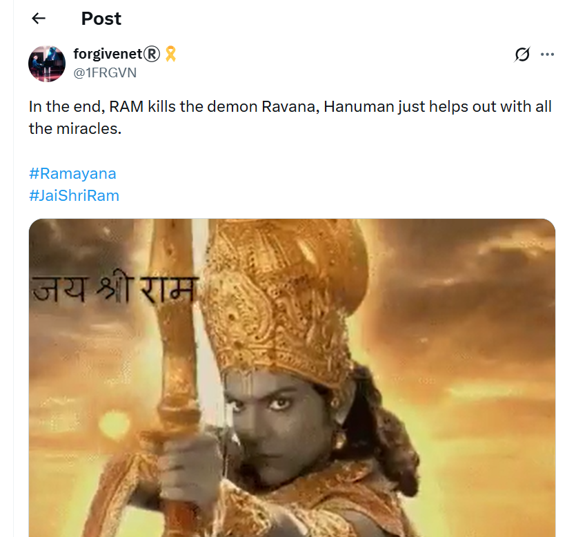

# New information - coming in from sources
## First addition after ebook publishing 29 September 2026

- Sandra Diaz's name is Benedetta and I'm told she's hiding out in Honduras - her Liverpudlian accomplice, "Andrew", will confirm.
- Hazel's real name is Kim Holland.
- Hazel was recruited by the CIA to work closely with (report back on) the gitano gangs in Dénia in 2005, specifically the Cano Lopez's (*oh, just a family we know*).
- Hazel was tasked with murdering me by poison in 2007 by the CIA's ACIM division (once called Shield, now Joy), and at the same time making sure to mention "Paco Sendra" (Antonio) who was a person of interest for them too.
- When I didn't die, they will have suspected I was one of Christ's followers - like the others - and they requested I be introduced to the Course which I was via Sandra ("Hazel's" mum; real name outstanding) who took me to Trudy's talk a year later.
- Hazel's attitudes/emotions towards me the night she tried to murder me were very interesting. She was angry I told her I had been sexually abused so early on because it made me more human, and she was able to relate. From that moment, her "energy", as it were, was exactly like Tina's in 2026 - bitterly purposeful.
- Due to this early survival in 2007, it's highly likely surgeries began early on; although perhaps it was inconceivable to even them at that time, and they started by ordering my continued and prolonged crucifixion at the hands of the porn-gangs instead.
- Whose idea was it, I wonder?
- I suspect the CIA may have even requested my dad and brother be brought in, just in case, as I was so special.
- They may have ordered my brother's rape too.
- Criminal gangs now feeling more favorably towards me in September 2026 will certainly let us know (wolves lying down with lambs, leopards with kids, etc.). Thank you.
- All this means that surgeries began much earlier than I expected, and the baby the CIA were passing around at the thermal baths in Cauterets in August 2025 - after surviving poisoning by digitalis and while eggs were being extracted while I was sedated at my holiday apartment - was mine.
- The small child reached for me - I thought they were trying to see if I'd raise the alarm about the safety of a toddler who looked like she was all alone amongst a crowd of adult men and a few women, it wasn't clear who her parents were.
- I knew it was spy activity - of course, it's not possible to guess at the true nature of their evildoing - so I did not raise the alarm. It will all be on CCTV, and double-agent footage.
- This means that [rhabdo on 28th January 2023 in class](timeline/2023/january.md#serious-poisoning-at-chamber-music-class) - incidentally Sarah Smith's and Paul Pompeus's birthday - was probably a murder-dose, which I survived, and they may have extracted eggs immediately.
- The CIA will have requested the police in Dénia to close the roads the following weekend (via a "make sure nothing happens to her" order or similar, which had a concomitant "rape her as much as you like and in as many criminal ways as you like"). 
- Transforming Touch courses I was undertaking at the time where Steve would talk about "a client" which sounded like my doppelganger (but I never suspected - all on film of course) mean Steve and co. were wholly aware about what was happening to me, for years, and didn't care. Their weird non-reactions to my personal horror further proof of that - were they involved in making those murderous and sex-offending decisions too?
- The doctor who was taking classes with the trumpet teacher is likely the surgeon tasked with egg-extraction at that time - as well as being tasked with amputating the legs, arms, and things of that nature that murder-porn victims kidnapped by the Lopez Cano's have been suffering - no one able to do anything about it because of the CIA ownership of the criminals in Dénia.
- Perhaps their evil suited segments of powerful CIA representatives with vile tastes in pornography - did they order it too?
- Perhaps they left their surgical interest there initially to avoid raising suspicions amongst the gypsy community - but some will have known, Antonio for sure - or it's not out of the question that I might have hundreds of children!
- It seems likely the CIA had a big problem with Antonio early on - he may have recordings of the American Lockerbie bombers discussing the delay of Flight 103 - and the CIA may have murdered his daughter to keep him quiet about it.
- Criminal gangs have been aware of who was behind the Lockerbie bombing for a very long time and there are suggestions that, specifically Liverpudlian for some reason, criminals have been paid off in the region of 300K for their silence about it and other matters related to it.
- This is how Auggie was aware of my impending wealth; he was told about me and others by his CIA friends (possibly even via [the Liverpudlian gangster I mentioned](timeline/2001-to-2010/2001.md#what-i-didnt-know-at-that-moment-was) who was in prison in Amsterdam - Curtis Warren) way back in 1998/1999 - they couldn't jail him in the UK obviously.
- He never once suspected the CIA murdered Diana - some lies are even *that* big - but some did, especially Antonio who may also have some hacking evidence towards it or perhaps he was just suspicious that they would have tasked the Cano Lopez's with such an "important" (for them) crime. It didn't make sense.
- And then, after the unexpected and massive reaction from the public, and then everyone heard how they didn't get paid, he knew.
- It's curious that the police phoned my mum up about her white Fiat Uno in regards to the investigation - early hints maybe?
- It's amazing they were able to keep it quiet for so long.. except, the lie was so helpful to criminals, and in so many ways, it benefitted everyone evil (and let's face it, who isn't right now) to believe it, even if they probably didn't.
- Events like the fasting retreat in June 2025 - ram packed with agents and intuitive industry specialists - also probably set up surgeries (my room mates were extraordinarily weird and unpleasant, and they had made the bunk bed I wanted to sleep in very itchy so I ended up having to sleep in the middle of the room where I didn't want to sleep - she was probably a surgeon).
- Antonio may be Nakamoto which is hilarious and means we are very much the same - although he's way smarter.
- How did they know about us before we did, is my biggest question?
- God, through me without my knowledge, was talking to Antonio through the books I was writing; was some of that Joy in my head too?
- Have the CIA been in my head, as it were, since 1989?
- Did they order Winston May and his rape-gang to target me via friends and then get it shut it down a month or so later?
- Who are the 144K, and have we all reincarnated from the Ramayana to build that bridge to Lanka again?

- And is the fact that Geetha, Arul, Paul, Matthew, Roseanne, and Chris Ludwick are all Sri Lankan just a coincidence?

## Who was directing Domingo?

- It's obvious that Domingo Lopez Cano and maybe Paqui Fornet too were giving instructions on the intense stalking activities and psychological torture at the conservatory:
    - How to arrange the classrooms (e.g. Alfonso putting the chairs in a circle one time, after a session at my house, on instruction).
    - What "playlist" to use.
    - What "words/memes" to use.
    - Etc.
- These were things designed to upset, destabilize, weaken (at a minimum and while drugged) that I had noticed were "exactly the same" process, often content too, at Loka Yoga in Bali - like they were operating from the same official manual.
- So, it will be *very interesting* to find out who was directing Domingo (and maybe Paqui too) and whether their instructions were coming directly from a similar live "production suite" wired up to spy-cams and audio in the music school and my house, just as was the case in Bali.
- It seems highly likely given the nature of the timed sequences at the school and throughout the town, that there was a "director" overseeing everything and giving instructions at any moment, which makes one wonder if the CIA uses the town as their own personal sick playground given it's unique status in the world of a place where literally no-one has any rights at all.
- It's easy to point to a monster and say "you dun it"... but there's always someone pulling his strings too.
- I wonder how free to do whatever they like the Lopez Cano's really are, or - apart from foolish things like jumping up and down outside Buckingham Palace years ago - whether everything they do is on instruction too, they're just one step down from the big bosses, as it were... and whether over the years the town has evolved into a complex CIA criminal (Bali-esque) playground supplying Epstein and co, and a million other evil things the public need to know about and QUICK!
- Lord of the Flies, but with perverted murderous unseen bosses.
