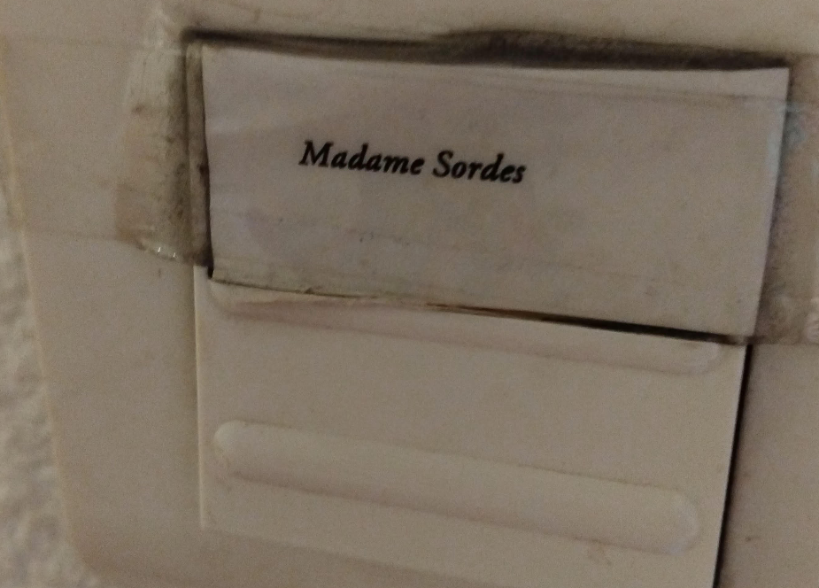

# Next Batch

- Notes on next batch of updates.

## TODO: list

### Home

1. New summary: 
    1. Rogue group of lupins do terrible thing at mousse's request - with the help of the onion-soups.
    1. Lupins only get paid half of what they've been promised by the mousses. The other half is never forthcoming (I wonder if they just didn't get paid at all, that'd make one sufficiently angry).
    1. Did the sound of thunder promised by the shock from the enormous and totally unexpected reaction to their evildoing frighten them and get them scrabbling around making deadly errors of judgement that have persisted and grown out of all proportion since then? I know this is in Madonna's Great Ray, but do we have a bible reference for this? There must be one, we've bible references for just about everything now don't we. I love you <3
    1. Lupins are told all sorts of BS about why they're not getting paid by the mousses they work closely with on other matters, mousses insisting it's nothing to do with them.
    1. The *biggest lie the world has ever known* that the mousses tell these lupins is what fuels the rest of this sorry story.
    1. These lupins (simple parochial folk really) go horribly rogue - I suppose the mousses thought so little of them, and it was such a horrific request, and upset so many people, that they unwisely thought this was the way to hide from the responsibility for it forever. Quite the error!
    1. They get started on their rogue-lupin revenge program on the mousse-half that (they believe) didn't pay them, and that means murdering innocent tax-paying British women visiting the region or living there.
    1. This rogue band of lupins then go formally criminal insane, mainly because they are never called to account for their actions and they never get their (apparently) missing money either.
    1. It doesn't get any better for this rogue group of lupins, in fact their insanity worsens over the decades to the current state of industrial-scale baby-rape and pedophilia, full infiltration by criminal pornographers into the Spanish school system, horror jacuzzi deaths in Cullera, and alongside that, implementing mass online-manipulation revenge policies against the mousses which have been unusually and whole-world-destroyingly effective.
    1. Mousse-controlled government officials in Spain forbid normal law-enforcement to address these horrific crimes against the innocent, the young, and the vulnerable and so this world of fake-hope-in-revenge just gets worse and worse.
    1. The rogue band of lupins in Denia had been watching too many Sergio Leone films and self-manipulated themselves into believing they "live for revenge" -> I even have a fake account screenshot with that message in the profile.
    1. To feed the murderous porn-hell they are creating, and an integral part of their revenge policy, thousands and thousands of apparently normal men are sucked into it; seemingly with no escape - but maybe they don't mind (are they told *why* they'll never see a prison cell - a lie, but the rogue band of lupins do not know it's a lie, yet, are they scratching their heads now)?
    1. Good lupins (well, marginally better than the rogue ones) in the region don't know what to do and it's gone on so long that even their own families are in danger from the rogue lupins!
    1. Our heroine enters the pic, totally unawares of what's going on, totally innocent, but with a tendency to say interesting things and make strange shapes with her face. (The mousses signed her up for the intuitive program early on due to her strange face-shapes and trauma history, and sent her into the battlefield, expecting her to be killed but happy to ingest the information from her devices and home networks while she remained alive. God forbid she ever got wind of that; and then she did.)
    1. She is targeted and made famous in sedated rape-porn internationally. So famous that random men recognize her wherever she goes in the world. 
    1. She fights the good fight over two decades.
    1. She does so well in fact, surprising everyone, that the rogue group of lupins gets worse and worse just to see how much sexual-torture she is prepared to endure (she doesn't know, she's sedated) and telling lies about her so that the whole region in Spain will hate her and support her early demise.
    1. God does not support it and sends the DANA.
    1. The rogue band of lupins does not heed the warning; some even accepting mousse-funded government awards on the very day the mousses order her murder.
    1. Our heroine is innocent of all blame, and knows it, and is unashamed of anything that has happened (a bit embarrassed sometimes) and there is no reason for anyone to hate her, but still they do.
    1. So she prays. A lot. And survives attempts at her murder again and again and again - see Jesus's instructions on this in the Gospels.
    1. The mousses are dumbfounded and don't know what to do.
    1. They formally take over, relieving the rogue band of lupins from their failing efforts.
    1. The mousses want what she has: the ability to survive poisoning.
    1. So they decide, in their infinite lack of wisdom, that they will make babies from her eggs that they will steal after sedating her, and surely those babies will survive poisoning and they can forge a superhero army, or something...
    1. And they will be very disappointed (see Gospels as mentioned), putting those children at huge risk.
    1. The mousses appear to be atheists, or if they are religious, helplessly arrogant folk who haven't a clue Who God Is.
    1. And here we are. 
    1. Me still here - a bunch of kids on the way or just born with unknown fathers and adopted mothers I WILL BE RESCUING from shortly! With God's Help. He told me. And it's in the Bible.
    1. Such wisdom, such power, such might, such fearfulness: the mousses totally lost their minds, stole and sold my eggs off to the highest bidder, some of whom were involved in the earlier tech-bro rape-porn attacks, which puts these children in even more jeopardy wherever they are in the world their whole lives until they're rescued by the servants of God. Which IS happening next.
    1. But the most sickening thing about the mousse pivot is... they have spent nearly three years obsessing over me while Spanish babies, children, and women continue to be sedated, raped, and murdered at the altar of porn in Las Marinas.
    1. And perhaps even more sickening is the fact that these perverts used this lie, believing it to be true themselves, to convince men to take part in the most vile acts imaginable, assuring them they would never be called to account. Their betrayal is [add-word-we-do-not-have-to-describe-such-evil-here]. 

!!! tip "There is no healing without"
    - The abomination of desolation factored in. And that means spilling the 50 million onion-soups all over the world. Sorry.
    - Sorry.
    - Remember?
    - And eliminating rogue operations wherever they may be found.
    - And dedicating the future to God and His miracles.

1. Squirrel brings a whole nest of vipers with him in August 2025 -> for reasons vague and unbeknownst to me at this stage. Is it the *bad but not as bad as* Domingo's lot? Have they managed to convince the UN and the mousses they're the ones in danger? Why am I still running around being stalked continuously and operated on and injured on a regular basis by the mousses if even a nest of vipers are in that much danger? And did they ship them all off to Israel so they could save face, more "switcheroo" blame passing. Indeed, it's like an unconscious twitch, isn't it. 
1. Another obvious question is... if we now know the mousses were drugging me throughout 2025, why would they be so keen I didn't remember the switcheroo men? Is it so they can continue to protect themselves because the switcheroo men can spill the beans? Is that why (did I hear it was a UN raid?) they shipped half the team off to Israel, to silence them, keep them from talking?
1. Did they know that this bunch of people have been trying to stop the business for years too? And we couldn't have that now could we, because then there'd be questions...
1. Do you think if my viper chums did start to speak, or anyone did outside of mousse control, the lie would become VERY QUICKLY APPARENT to the whole world? I bet it would.
1. My view is that, given how they have treated me, they fully intended to murder me. I mean, where else do their actions towards me lead to logically? There is nowhere else for their plots to go/
1. But, also, they have had to be "pretending" they care, and are doing something, not just to me but to bloody everyone looking now, and I expect the majority of their own side had no idea too, cos it's BEYOND EVIL ... and that's a lot of people... which is good. I'm so glad I never shut up!
1. Remind me to never shut up!
1. Were the Spanish in Jerusalem in a terribly celebratory mood because finally they can see a future where they might be able to protect their own children? If so, please forgive me for giving you all such a hard time... it's been quite a twist and turn of a thousand knots to undo...
1. Is the recent "drowning" in a hot tob of a young British couple on holiday in Cullera - incidentally where Paloma told me to move to - a step up in the "life of revenge" of the Lopez Cano's?
1. If the Lopez Cano's found out they'd been lied to by the mousses all these years - people who have been pretending to be their friends, just like they did to me - would they all self-implode do you think?
1. Where do the mousses think such courses of action ends? Both sides can't keep bumping people off forever, can they? 
1. I think the world needs to know, don't you? And let the chips fall where they fall. It's gone on too long now and the children have never once been out of peril since it started.
1. Questions:   
    1. The big one. Who decided to let them carry on with the lie, and why. I assume that mostly people are unaware of what they're supporting, or may have suspicions. 
    1. What outcomes have their been for carrying on with the lie:
        1. Dead women and children.
        1. Baby-rape industrialists.
        1. Tech-bro mass insanity.
        1. The unquestionable disastrous state of society.
        1. God, this is nearly a total rewrite, except I had closed in on the truth so very nearly, it looks like it will just be a small adjustment.
        1. Given we have information about everything, an actual law-enforcement case for who murdered who (never mind why) is quick and easy and the children can be immediately safe.
        1. Teachers at the conservatory and the wider educational system! It's not so sinister, yet, and they seem to be at the forefront of it all.
        1. Let the chips fall where they fall as the more sinister stuff comes out... just BLOODY DO SOMETHING WILL YOU!!!! #ffs 

### 1990

1. Is this Sullivan *the* Sully from the film? I didn't think the man was a pilot but maybe he trained. I guess we'll find out.

### 1996

1. On the busses with Ray Archer.

### 2012

- Robert has just been inordinately rude to me and mum and gone upstairs.
- He's always talking about his "friends" from Thailand when he lost the plot (the woman who "looks exactly like Eva", etc.).
- I say to mum, "they weren't his friends you know, they were telling him he could do porn..."
- Mum yelps loudly and shouts "STOP" to me.
- It's extraordinary behavior, and even more so when put next to how she dismissed me when I told her what was happening to me in Denia in my apartment.
- I guess this is proof Robert was manipulated into thinking he'd be doing "porn" and then they raped him, for porn, and then he told mum..
- But somehow they both decided it was my fault. Which is extraordinary. And that anything that happened to me was irrelevant and I could basically be discarded, even pushed closer towards suicide etc (I'll add those recordings later).
- It's really horrible. I can't understand how they could do this. How it could be justifiable unless they told Robert what was in store for me and how he had to help them, or else, and she chose their way along with him.
- Does this "throwing me under the bus" explain dad's actions the following years too? They all knew and neglected to warn me?

### 2013

1. After I write and publish my book, The Liar, Rich Freed's dad follows me on an early Twitter account I set up to promote it. The dad, or Rich's brother maybe, one of them, is playing polo (please look this up if you skimmed over it first time) in his profile pic. I never met his dad. I told Rich about this because it was bit weird tbf. He said nothing.
1. Rich Freed and I do a re-birthing session with *the* Stella in Koh Phangan. She is ice cold towards me. I mention this online in Bali in July 2026. Crickets. Every time I mentioned Richard Freed, it's like there's a collective gulp.
1. Same trip to Thailand, Rich and I are having something to eat at the spa, chatting, I'm making corrections to The Liar after having read Stephen King's On Writing. I mention briefly the "yoga teacher" in Rishikesh (meaning Jitendra Das) and Rich says, *Oh you mean the rapist!* and it's so incongruous and shocking actually - I never said he was a rapist to anyone - I laugh nervously. He was leaking a little here and there, wasn't he.

### 2014

- Mousse activity on the Tube with Domingo. Someone, a woman, opening her mouth wide in a sarcastic shock face at him. He has his back to me. I can see her. Warning? It worked. From that moment I really found him despicable... but was that the intention, i.e. no warning, part of the twisted choreography? The fact that Domingo is an inside man is just blowing my mind. Did everyone know? How did he get away with it? Are they all great chums? Of course they are. That's the point. They're all great chums apart from the ones who weren't involved. But this begs the question, how did they manage to exert such power over their neighbors? Did the mousses step in to sort anyone out who complained? Is that it? Is that why the locals were poisoned and murdered too? Did he go for me (and my dad, mother, and brother) as power play... knowing the Lockerbie connection and other stuff too? Total insanity.
- He insisted I take him to see the changing of the guards at Buckingham Palace. We arrived and there was a big crowd so we couldn't see anything. I'm not that interested so I step back. Domingo is frantic jumping up and down to try and get a view. He's leaping up and down, and his head is popping up over the people in front of him, again, and again, and again. It was after this I told him he was an ape in Pret at Green Park - not cos of his behavior outside the palace, but because of his despicable rudeness and woman-hating, although perhaps I did pick up on his genuinely pre-evolutionary state from his actions. I did an impression of an ape in the coffee shop. He was not happy about it. That'll all be on film I expect.
- One thing about Domingo on this trip which I found extremely weird was his little black bag... it was a businessman's bag, nearly a full briefcase, let's say halfway there, very formal. I couldn't understand why he would bring such a thing it was so strange. I just remembered it in his hand as he was jumping up and down. I never figured out why he would carry a bag like that, and when he became so obviously evil I wondered if it was for *paperwork* of some sort. It was a paperwork bag/case (not a briefcase exactly). At the time, I thought he was so ignorant (unworldly, like he'd never been out of Denia) that he must be trying to impress someone, me maybe, but not for long he was so rude to me and we hadn't even left Spain. Did they not get paid, or was this the most outrageous switcheroo the mousses have ever set up? (We know they like them so much). And no-one stood up to them.
- Interestingly, the words I used to describe Domingo's "immature unworldliness" to Inma that Christmas - like he'd never been out of Denia in his life - Paloma repeated back at me verbatim in October 2024. Perhaps a certain immaturity such as Domingo's would be prone to believe a "switcheroo" set up without too much question. In the words of Violetta Cope from my TT class, the irony is *delicious*! They have been *desperate* I believe such an outrage too. Would they have realized what such a lie would trigger? I doubt it.
- In March 2023, at one of my piano classes with Maria H, Mercedes is there. She has brought Maria a black bag as a gift, and it's the same size, color, shape, and style as the bag Domingo carried with him to London with me. I'm so high I see it, notice it, think they're crazy, and then forget about it. They must have thought I was fully in on it - and maybe someone (upstairs) wanted them to think that... and put words in my mouth. That's interesting isn't it. Like the ape thing before... and the woman on the tube blowing my (not) cover and putting me in even more danger. I bet there's loads more examples of this I'm so intuitive I just play people back at themselves all the time, so easily misread.

### 2019

- I visit Chris Ludwick, this is when I tell him about crypto and he gets into it.
- He has a picture of Diana on his wall, it's a bit incongruous. I ask him why he's got Diana up.
- He says "cos I like her".
- I think, fair enough.

### June 2022

1. Christine Betterton Jones's friend who works at the British foreign office comes on a walk with us in June 2022. She's has her baby with her on her back. She wants to know all about my Indian trips, where I go, who I see, etc etc. She seems like a spy to me... I ask her if she knows Rich Freed as he also works at the FO, and had been stationed in Pakistan at one stage as second to the ambassador or something huge like that. She said no. It seemed unlikely to me she wouldn't know him.

### July 2022

1. Fiona's murdered ACIM student - July 2022 Glastonbury Wearyall Hill. Fiona played us her singing live in Glastonbury Town Hall in the 90s I think, and called her "my love". She didn't seem sad when she told us she'd been murdered. I guess she got over it, or perhaps she's angry, unclear. She then plays, inordinately gushing as she does so, New York (the r&b one, female singer, is it Beyonce, I've no idea... never grabbed me much). I find all this a bit strange, notable, exaggerated, offkey, rememberable. 
1. I emailed Fiona at some point asking for a link to her music. I was going to put it on one of my "play lists" so I guess it was around summer 2023 I reached out to her. There was no reply. Did she get the email?
1. Fiona is the key. Saint Michael's team told me Fiona and I remembered my old friend Fiona Thompson but they did not look like each other. I thought it could be Fiona from Wearyall Hill, but it didn't make sense so I went with Hazel. It's her. *And* she's an old friend.
1. Karina is coming up now, but I'm not sure who she is. Is that Hazel?
1. Stein came up... but I don't know who this is. Judith Stein is ringing around my ears but Stein might also have been the woman who upset me in Dublin. Maybe this is the *Karina*... I guess we'll find out.

### November 2022

1. November 22 - when my Hanuman figure pops out of my bag on a walk with the British ladies and everyone's interested...Trish is standing to one side reporting back. She has been instructed to report back on everything I do because they know I am a CIA intuitive.
1. Hanuman's entry into this story early on was remarkable, and he has never left me for a second. It was even earlier than I thought too. October 2019 with guruji in Rishikesh (is that was lady at 2. wanted to hear about?)

### Jan-May 2023

- Is this the moment to tell them about the impressions I was doing of her when walking through the tunnel on my way home from the conservatory, totally high, and probably just dosed up with a sedative kicking in.
- There'll be footage of that.
- I can still feel my face going into that position... I never knew what that was all about, hadn't a clue. Just a simple servant of the Lord.

### May 2023

1. May 2023: The lives of others. The message in the tweet (if you translate it) is astonishing. I can't believe I missed it all, it was so obvious. I guess this is proof I was totally out of my mind on herbs, drugs, hallucinogens, whatever. And, I guess many of the tweets I have posted in this police statement must be similarly breathtaking.

### August 2023

- These dates have been tampered with: [Torus email](content/documents/emails/torus-scam-email-august-2023.pdf) because I was interacting with this recruiter in Cauterets at my desk in the hotel there, not at home. This Morgan McCarthy no longer exists on LinkedIn. I think this was part of the set up for me taking a job with Polygon with the Elon scam already in play.

### December 2023

1. CCTV at Lourdes on December 8th 2023 too. We'll like also be on Lourdes sanctuary CCTV.
1. New Year 2023 and I was just back from Madrid... a group of expats walking with Christine Betterton Jones on the Montgo. A group of British army boys - about 5 or 6 of them - were at the start of our walk, sons of Christine's friends, on holiday apparently, with massively heavy bags - I tried to lift one, 20/30kg each bag, they got me to try to lift it - and they ran up before us! Christine took me aside to walk with me separately that day and was getting updates on the porn-gangs, what I knew then.. not a great deal tbf but they obviously knew something explosive was going down.. they were worried weren't they, but not about me! I don't care.
1. Oh yeah.. others might care. I was walking that morning for a short while with a British expat woman who is a graphic designer and had (famously) designed the Walmart symbol! I had met her before and remembered this. She told me that she had moved into managing and mentoring direct reports rather than designing herself. I told her a little bit about what was going on for me; how I was a victim of rape-gangs as a child, how I was being targeted in Denia by the Lopez Canos and teachers at the music school, how they had even flashed porn of me when I was 16 up online, how he had visited me in London years previously and was probably sizing up the house, how I had thwarted his plans and believed that's why they were attacking me... this was all my fumbled view of what was going on at the time.. She was DEVASTATED and spent the rest of the morning in shock and tears. Her husband (a local who I could add to the list of people in the 5, 6, 7 trumpet teacher genome category, plus Trish's husband and the man at EthCC) took her away from me and kept his arm around her. Every time I bumped into them that day she still looked devastated, and he was grinning the (not snickery) everything's fine grin nothing to worry about here, I think, but it could have been a different sort of grin. Another honey trapper? It's unclear.

### February 2024

1. Yes, the yoga class I'm referring to in this tweet about Ana was Natalia's class - Feb 2024.

### May 2024

1. I heard Bali is all over Tiktok. And the mousses still wouldn't do anything about women sedated and mass-raped at work because of their sinister history? Letting Elon in on it, while he knew full well he'd be untouchable. It's incredible.

### November 2024

1. Naama Levy at Citadines - added. Worth keeping at the top.

### December 2024

1. Texting Rich Freed from the Spa Samui desperate for some help. He texts me back he is in Bali.

### January 2025

1. Paul's description of how he caught Diana as she fell in Camden High Street!

### May 2025

1. Babies and pregnancy signals in Israel module 2 May 2025 and how I read it as "when the investigation is over" and everyone can speak plainly, I might consider having babies.
1. Mrs Wasserman asks me what I think of Jonathan her nephew at the Wall. I say he's very nice. She stops, then adds quickly, and his wife is very nice too. I say I'm sure she is. Mrs Wasserman weeps. Did she think that was an agreement from me?
1. May 2025, Steve tells me they're sacking Rosheen. Apparently she fell in love with another TT practitioner from overseas (I guess online and then she joined for a session - I think it must be the Australian woman who came in Jan 2025) and this is NOT allowed. Steve is disparaging about her, calls her a liar. I knew Rosheen from the first course in Cork and we had spoken a lot. I had no issue with Rosheen but noticed her boundaries were miniscule, I could practically mind read with her. She had expressed a desire to move to Spain with her husband one time and I told her that was a bad idea as it is dangerous for foreign women with sex-gangs operating freely in schools. I had written to her and Yvonne too in a panic (not the first time) in September 2024 (I get these dates wrong a lot, confusing 26, 25, 24.. please note that) explaining I was being targeted by criminal gangs in Spain when it was all kicking off big time - photos of murdered women etc, poisoning threats. They all knew.

### July 2025

1. Hip/groin started to complain in Cauterets in August. I thought I had twinged it while trekking. Over next few months, while walking it complained a lot but I kept walking on it, something intensely, like all day just walk walk walk... never had an issue with that before. I think the botch (probably not a botch if you let the patient know they have to take A LOT OF REST for it to heal) might have happened in Cauterets, then weakened further in Bangkok, then pop!

### September 2025

1. At module 3, Jonathan tells me out of the blue he has the shingles virus. He doesn't tell me anything else. It's out of the blue, incongruent, and I again assume he's thinking about being a sperm doner. Again, it's hints and signals, the way they do, so I just stay quiet about it, note it, find the idea of motherhood very appealing, and wonder what's going on in everyone's heads , why are they thinking about me in this way. I must be special, a little thought flies by but I don't entertain it too much and there's too much other stuff going on (constant stalking/drugging in London, dad, family, no support for hideous crimes against me and thousands of other women and children and babies, squirrel just been extracted to Israel, etc, etc.. it's intense) and so this is just another weirdness which honestly I don't have time to figure out means they've been stealing my eggs since April 2025 at least.

### November 2025

1. Campaigning with Reform, I'm paired up with an agent. I have been walking all day every day for days... fast, like usual. She starts to slow me down but doesn't say why. She starts walking really slowly. It's a bit weird because we've tons to do and not a lot of time. I wonder if someone told her to make sure I didn't walk too fast because I'd been injured during surgery and had stitches. My hip (it's groin actually, I kept saying hip cos groin doesn't make sense) was hurting a lot that day.
1. I wonder if there was a further surgery at Napasa Samui also, please was full of agents too. And one day at the beach I had a snake episode.
1. Add hacked GA from November 2025 to April 2026.
1. Mousses pretending they're helping me with the investigation: Holly Hunter look alike at the Anantara. Tweeted about this. Someone replies *Liar*. The mousses are pretending to be the criminal gangs now, keeping me distracted for violation purposes.
1. Mousses pretending they're helping me with the investigation: American woman in BKK after I left the Oriental on her phone loudly saying, *we're gonna get every last one of them*.
1. Visiting India. On the way back from Ahmadabad to BKK, there is a "team" - quick aside: every time I fly now there are agents assigned to sit with me. However, this is a particularly unusual team. Three "very" Jewish looking American men shepherded by a couple of Indian officials. I'm sitting in the front pretty much alone (the first few rows are clear apart from me, and one Indian official woman sitting directly in front of me). These three get on and they're mucking around and quite funny, I mean they're behaving like giggly children, and they're making me laugh too, the stewardess tells them to behave. Everyone stretches out to sleep (the rest of the plane is full). One of them sitting behind me says: *you're safe now* or things of that nature. I know this is all for me and I'm expected to think it's a rescue team. They do not rescue me.
1. It is events like this (yes, there are more) that make me certain, as in KNOWING certainty, of how far up India's arse the mousses are.

### December 2025

1. Oliver name of medic at Fitkoh.
1. Just before they add an event to my Google calendar, and I pack and no-one comes, for the last few days before that on whatever comes up on my front page is messages about a intense 30 day AI course I'm going to be beginning.. the implication is once I've been rescued I can start learning AI intensely. Again, like the Calendar entry, it feels bogus but whatever.

### April 2026

1. TT in April 2026, Steve is bullying Gerardine and Yvonne.
1. Steve, Robin, and I are having dinner at the hotel near the Avila centre. It's probably just a couple of days before the first course begins and maybe the first time I see them. Steve announces that the King is visiting Trump next week and at that time he will step down, move to the Caribbean, and his son will become king. I ask Steve where he heard this (nonsense, I don't say nonsense but my face and grin is saying it)? Steve seems a little surprised I haven't just accepted everything he just told me. He mumbles AOL.. I know he's being fed BS online, but I'm a little curious as to how they trigger him to say it to me, is this a "formal" instruction, or manipulated?
1. My brother's friend Milan, a Jain, is on the phone recommending fertility herbs. In fact, that's about all he says with any actual content in it. I buy some and take them probably from April/May 2025 through to the end of the year. Coincidence? He's apparently in tech and I extend an invite into the forgivenet and he dismisses it completely, but keeps on telling me about the fertility herbs. MOUSSE!

### May 2026

1. Air France to Beijing. I was filmed laughing at the Snoopy videos with Woodstock wearing his particularly unique hat.

### June 2026

1. China taxi where the driver was organized by the hotel - spys everywhere. He is interested in me and at one stage tells me, after I've told him I'm going trekking in Tibet: *they'll organize a team* and I assumed he was talking about a team of agents to accompany me on the trip, which they did do, but they were pretending they were from multiple agencies, and they were just mousses.
1. I notice multiple little scratches on the skin around the area of my left kidney, as if a little gnat had been biting away at me, but only there and nowhere else.
1. Who dun it? A couple of them probably. The rest were independent witnesses from multiple jurisdictions.

### July 2026

1. Online communication from day 1 is about "no more stories", so I say, OK, no more stories, and you can see I stop writing in the repo, and I said it online a lot... you will see it on Facebook even... except story additions keep coming in from the past so I end up doing a lot of writing/editorial on past sections and new past sections. Why would they be so keen for me to stop writing? I did wonder at the time, but it seemed sensible to play their game at least till I figured out what was going on.
1. I see Glastonbury Tor from the windows at Loka Yoga every morning in class. It's such a strong vision, I decide to tell them all after seeing it every morning for days. Once I've told them all, it's gone and I don't see it anymore. And that's nearly as surprising.
1. Correction: Wound reopening in July 2026, not 2024 as stated in November 2025.
1. Taryn and her boyfriend come round to check the windows have been blacked out in Bali. I have been doing my bible study, which entails opening the bible wherever it may open and reading that bit. The doorbell rings and I leave the open bible on the bed to go and answer the door. They come up to see the work on the windows. My bible is open on the bed at Isaiah 31. The helpers and the helped.
1. Report snake episode at Loka Yoga, so astonishing I thought it had to be a robot. (Snakes warn me something evil is coming, or before me, used to see them in Denia before "events" too, significantly 12th June on my way to class there was a snake in the curb..). Loka Yoga was easily the biggest snake of them all. It stopped me dead in my tracks, it was massive, girth of a 2 litre coke bottle, about 5 meters although i didn't see the front of it, crossing the road from one padi to the other. As I said, I thought it was a robot it was SO EXTRAORDINARY... and there were robots about. But snakes do like to warn me. As do beetles. The day before Winston May destroyed my life, three beetles came out of the chimney... The latest beetle in Jerusalem was dead. And I believe that's a very good omen for me, for the children and babies, for the team, and for the world.
1. In Bali at Loka Yoga, constant references to "Project Jonathan" fly by on online communication channels (mostly Substack at this stage) while they are sedating me every night and the keyhole surgery scar returns. When I do find out about the surgeries, I realize they're dropping the Jews in it - perhaps they're aware my internal injuries are not going to be ignorable for so long. This action of the mousses throwing the Jews under the bus becomes significant and top-of-mind and I start to think about Sullivan...
1. Was Vincent from Singapore the surgeon at Loka Yoga. He, his mum, and one other woman "Carolina" (did she switch accents from German to Australian? that seemed to be happening with them too) who was pretending off-and-on to be a "bridge" manager official, were staying close to me in one estate while the majority of the other participants stayed in a different place. Something happened to Vincent, he was injured while surfing he told me. I wonder what really happened...
1. Did Rich Freed, Stella, and the mousses procure the women like myself and Natalia to send into hell, hacking our devices and getting info? Does that mean Domingo is a mousse-pal, an inside man?
1. Was setting up Stella in Bali at Loka Yoga the beginning of them throwing her under the bus?

### August 2026

1. In Dubai after a month of swimming a km to a mile every day or every two days at the YMCA in Jerusalem, the groin injury - it is inner groin - is paining me during the night. It's something to do with the mattress which puts my rump/hips/groin in a lower position than my legs. I swim breaststroke and so kick out a lot and noticed the groin injury complaining a bit while swimming but it doesn't make sense unless it is structural, a caused injury, broken sutures, something surgical gone wrong and reopened again and again.
1. And who was the woman at departures? I got jealous and remembered how awful that all was and started thinking of a cave or the nunnery again... was she Brunhilda? Isaiah 57. A nest indeed. Gosh, this is gonna be such a cool parallel plot line.
1. In Jerusalem I visit the Wall every day, it's like visiting God Himself. Some days I visit David's tomb too - these are often the days when I feel like I'm on the battlefield and need some spiritual-warrior strength. I'm very conscious of the bloodline to Jesus but I'm not interested in the Christian sites so much.
1. One day in Jerusalem, I suggest to my online friends that squirrel and I might do well in India because if the mousses are controlling everyone, at least me and him might stand a chance together in India - I talk a lot like this online (I never save these things, but they always know) ... I also look up "asylum in India" processes online. The next morning outside David's tomb they've set up an Indian woman with a MASSIVE plastic sign saying something like "Join us, you will be safe", or some such.. this is why I say these things about escape to India... but if the mousses control India, then that's out too even!

### September 2026

- Looking forward to another productive month of additions and publishing, and hopefully not too much mousse fannying around, por favor.
- Speaking of Great Rays, I think we found another greatest-of-all-time to add to the collection: *Dennis Moore and his lupins*, amiright? I'm sketchy on this but it feels like it might be spectacular.
- Another CIA prepared dwelling in Cauterets. Just like the one in July-August 2025, they had months to prepare it. I dunno, obviously there's still monitoring stuff but it seems like it might be quieter than expected... oh apart from the door ring which is a no doubt an intuitive-threat - did they forget to remove it? It's the same font as the *Futarderie*, except I really don't care what they do or say now, they went above and beyond and must be judged by their own lofty standards and their wrong-doing is now out of all proportion...

### Vidal Sastre Sanchez Hornero

1. Number 6 trumpet teacher: add Viktor porn with the bankteller example.
1. Add Walmart trophy hunter to *male family members* in protagonists.

### Additions and thoughts

1. And as for the lupins, well, my fight with the lupins is over. And it looks like everyone won. The best sort of fight. So no names.
1. And I was just wondering how crazy it would be if everyone started to realize how cool Israel really is. That would be another one of those best sort of fights.
1. Addition to the comparison table for lupins and mousses in CORE PROCESS: *Total lack of respect for human life*.
1. Anyhoo... widening my tent pegs, as it were... my guess is everyone will wanna be in my tent. No, everyone sane will already be in my tent, and those that aren't will be so desperate to get in, and the door is not closed to them but there are conditions to maintain inside the tent and it just might be too much for people, who knows.
1. Please God let it be over today, yesterday.

### Conclusion

1. One wonders, given mousse involvement, control, and management of very nearly everything, if not everything I have detailed in this police statement - people, events, who does what, controlling communities, staged activities, torture chambers, who says what to who, who goes to jail (no-one), who gets bumped off, etc., if they should be held responsible for all of it.
1. And for the record: I'm only interested in the gazing-house; not the money, fame, or bites of roasted meat although they are indeed tasty.
