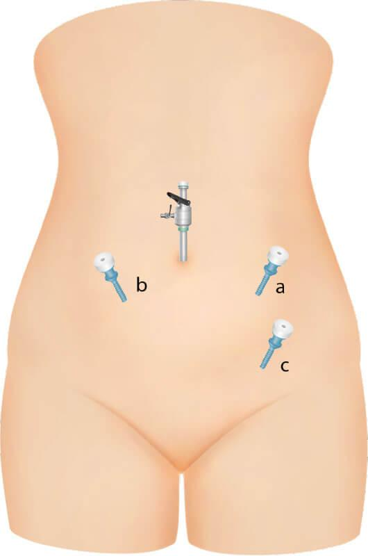

# Egg theft

- Once security services and governments around the world heard about the woman surviving poisoning, it's been a free for all to steal my eggs, hasn't it.
- Everyone thinks they own her.
- No-one care about my health or wellbeing - my humanness, even my *special* humanness is an aside, something inconsequential, unimportant - to the point where I strongly suspect the *surgeons* have gone in really heavy handed and caused me internal injury.
- All extractions took place in pre-booked accommodation tailored on Booking.com just for me so teams had months to prepare.

## Pregnancies nearly full term

- Word on the street is there are currently (time of writing August 2026) two pregnancies nearly at full term.
- This would mean egg-theft took place sometime in [November 2025](../timeline/2025/november.md#staying-next-to-the-american-embassy-in-bangkok) and most likely at the hotel next to the American Embassy in Bangkok I was lured to.

## Babies born

- I know a girl was born in May as I can feel her.
- Word online confirms it.
- This means egg-theft took place right after [poisoning in Lourdes](../timeline/2025/july.md#lourdes) while I was in Cauterets, and indeed the place was *swarming* with agents the whole time I was there.
- They would even tell me what I had been doing in the bathroom while I was at the shops: *cup cakes* in reference to my boobs popping out of the bubbles in the bath.
- Interestingly, I had the last period I've had right after I got back from France.
- My feeling is all this messing around with my body - sedated rape, sedated surgery - stopped them completely.

## Dorset theft

- They let the Brits have an egg or two too didn't they, which puts potential pregnancies from the eggs stolen in Dorset at the six months stage.
- Let's assume that all the *chats*, the pictures of rams horns and squirrels, and the ever present suggestion a helicopter was coming to rescue me at the [Booking.com accommodation in Dorset](../timeline/2026/february.md#what-wait-another-fake-collapsible-bridge-again) was just intense distraction while egg-extraction took place.
- While staying here I even had an ache in my left ovary.
- I had said online on X that just the image of a squirrel, strawberries, and a ram made my ovaries fire.
- They had responded back that I have ovarian cancer.
- Nice bunch aren't they.

## Dublin theft

- [April 2026 at the Beckett Locke hotel-cum-CIA-HQ](../timeline/2026/april.md#beckett-locke) more egg-theft took place.
- That would make any potential pregnancies at the four months stage.

## Bali theft

- Obviously they just got some more, so we'll have to wait and find out about those.

## Physical evidence

### Pinhole scars

- Currently (August 2026) I have evidence of **c** below on the right side.

- It was new and a little infected in [Bali](../timeline/2026/july.md#an-infected-spot-near-my-right-groin). I realized then it was unusual.
- However, it was actually a reopened scar that I had not noticed as suspicious in [April at Beckett Locke](../timeline/2026/april.md#beckett-locke), but remembered, and so they must have gone in through the same opening again in July.
- I didn't think anything of it in April, even though it didn't behave like a spot, and even though there were spiritual memes flying around to do with eggs, and pregnancy, and Steve had become strangely moody when I mentioned eggs.
- I also believe I had another scar closer to my naval in November or December of last year.

### Easy to see on examination

- Evidence of all this, I'm told, is easy to see on examination and I can see now why no-one wanted to help me out with health care, especially concerning my left hip injury which I believe is related.
- The left hip injury felt like something broke and crunched inside after two seconds of running on the first five minutes of a fitness course. 
- I wonder what that could have been/be. It is very unusual.
- I'm told egg-extraction is easy to see as, even though the pinhole is small and non-obvious, the surgery itself leaves internal scarring and other obvious signs, and I can't imagine they took any due care given how everyone feels about me. It's a thing you know.
- Who knows what's inside. 
- We'll have to have a look, won't we.

## Total free for all

- One wonders when and how they were going to finish me off, because that was a certainty, clearly.
- No wonder they've been swarming around me here; threatening, ice cold American women.
- People are aggressive, oppressive, and violent in ratio with their guilt levels about what they've done or are doing to you.
- It's a solid equation.
- The more they hate you, the more they can justify the evil they're doing to you, and it's so obvious too with the taunting and veiled threats.
- My guess the second two weeks of Bali is when they planned to put me on ice, as it were, and my senses telling me to pack and leave were life saving.
- I've said it before, and I will say it again and again.
- I may have been raped a thousand times by a thousand men while sedated - and remaining celibate - but this is infinitely more violating and I believe the whole world will agree with me.
