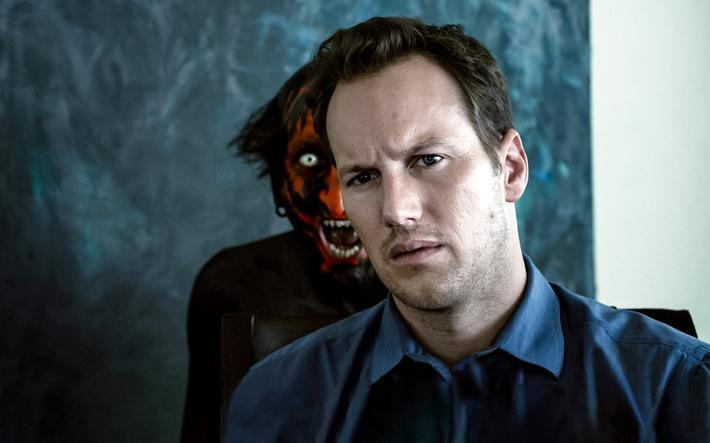
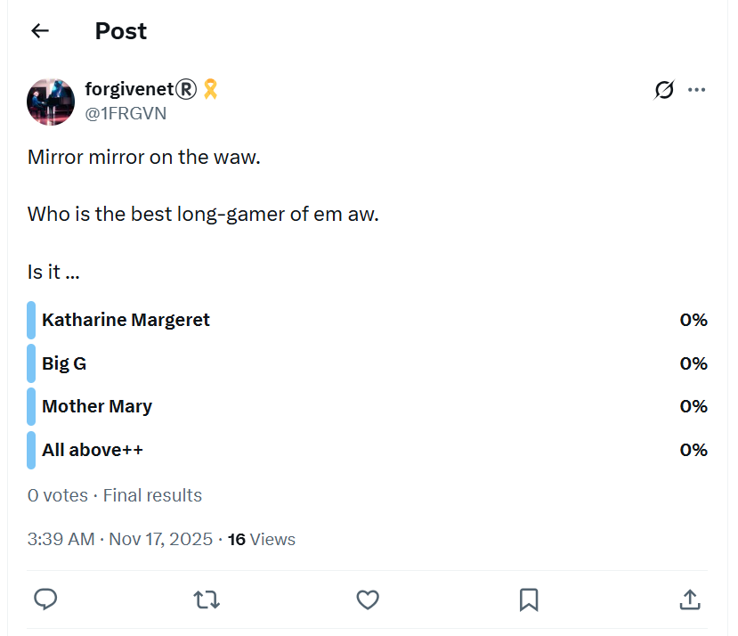

# Health

## Post-surgical internal injury in the left hip/groin region

- In December 2025, during the first few seconds of a Thai boxing fitness course I had signed up for at Fitkoh in Samui, my hip crunched and gave way.
- It was extremely painful, but only when I did certain body movements. Other than that, it was unnoticeable.
- Whatever it is, it is still not fully healed in August 2026.
- It felt like a serious and structural injury at the time, except it was inexplicable to me that something serious could happen after a few steps of gentle jogging - I had been hiking in the Pyrenees just months before - so I didn't take it seriously and expected it to get better quickly, like most things with me.
- It didn't get better, and I was very disappointed about it.
- It is only now that all this makes more horrible sense.
- We are asked to jog around the practice space for about ten minutes before class begins, barefoot.
- I ran gently for about ten meters, then something crunched in my left hip/groin area, and I was unable to run anymore due to the searing pain at every step, which stopped completely when I stopped running.
- I believe this was an injury caused by multiple clandestine surgeries to my lower abdomen with no proper aftercare nor concern by the medics performing keyhole surgeries, in adverse and unclean conditions, unavoidably reopening recent surgical wounds.
- I believe all this will be very obvious on examination.
- I had been operated on just weeks before in November in Bangkok, maybe even twice or three times in quick succession (at the Anantara and the Oriental Residence next to the American Embassy - both heaving with agents) while they disregarded any rest period my body would have needed to recuperate.
- I had already been operated on in August in Cauterets, then before in May in Dublin too, at the same surgical sites doing exactly the same procedure.
- I understand that fascia, nerves, and tendons are cut to reach ovaries during these keyhole operations.
- I believe my abdomen's distension, slow digestion time, and general dis-ease since all this began are due entirely to these surgeries. (I guess that's why everyone has been so insulting about my weight - online and in the street - up to a couple of days ago. Projected guilt.)
- I believe the man the salmon mousses sent to talk to me at Fitkoh in Koh Samui in December 2025, a British man traveling with his Spanish or Romanian wife and their small son, was one of the medics.
- Looking back, I had been unusually exhausted in Bangkok and Samui, and I put it down to trauma having just found out my dad had starred in sedated-rape-porn with me in 2015.
- But it was more than that because I was unusually tired and had no energy at all. I could hardly ride a bike 100 meters.
- You know, I'm still feeling tired like this in August 2026 and I do not think my body has had any time to recuperate while evildoers have been biting chunks out of it, while I'm sedated, in April 2026 again in Dublin, and in Bali just a month ago.
- The British medic (originally from Peterborough, he said, living in Dubai, he said) at Fitkoh popped up the day after the hip injury and was ostensibly discussing effects of poisoning - I had told him about that - and he gave me some tests which proved something was wrong with my brain function.
- When I mentioned my hip injury, he seemed very concerned, overly concerned perhaps, and I asked him for help but every time I saw him again he moved away from me, or didn't talk to me, wouldn't look me in the eye, and he didn't reply to messages on his WhatsApp which was a Romanian number.
- In March 2026, I told the salmon mousses via hacked communication channels that I felt I needed medical attention and needed help.
- Instead of doing anything to help me, they set up more elaborate "bridge" episodes in France, before performing more sedated surgery in Dublin and Bali.
- As part of this short message I also mentioned wanting to "go home", and this was repeated to me in a taunting manner by an American Transforming Touch classmate in Dublin just a month later in April 2026, after more egg theft, and she made me cry.
- I guess people are compelled to taunt, bully, and upset someone they are doing extreme evil to - or ice cold management are telling them what to do and say through their earpieces, without them knowing what's really happening in their names.
- The Transforming Touch community connecting into the wider trauma-therapy community is massive, international, very public and online, and these people, agents, (there must be some non-agent therapists amongst them) are very well known and are treating multiple vulnerable clients!
- I guess everyone got the memo and was certain I was going to be murdered, just like the Spanish did.
- My guess is the budget for stealing my eggs is now in the $100s of millions. We are talking travel for hundreds and hundreds of agents, doctors, medics, military, NASA, buildings, whole housing estates, taking over small beach towns, multiple vehicles including lorries, then there was squirrel's extraction with UN helicopters and God knows what else... then on top the backend support must be enormous!
- The idiots!
- I guess God lured them all in, knowing they'd default to stupid, and then He could get on with the massive backlog of evildoing.
- *Whatever it took, Father. Whatever it took.*
- As I mentioned, the injury is still there, I feel a weakness in that area which makes me reluctant to run - although I did run for a short while recently (pre-Loka Yoga) and it was OK for a very short gentle jog, *but* I felt like I shouldn't push it and there were some twinges.
- Post Loka-Yoga, I feel the weakness there again without doing anything much and even while swimming.
- So knowing full well I was injured, and not caring, they fiercely assailed me by carrying on biting chunks out of me while I was unconscious.
- The medic at Fitkoh was staying with his family for a few months. I'd recognize him in an instant.
- His Spanish-speaking wife had been told to ignore me, she didn't even smile or say hello.
- I can't remember the name he gave me, but he looked a lot like this actor except he was a bit balding.

- Wait till I tell you about the UN woman there...
- It was hard to tell if there were any normal people at Fitkoh while I was there; they all appeared to be agents.
- I was thinking it's easy for them to seal off an area like this as it's just one road in and out, like the Holiday Inn at Nusa Dua.
- My guess is as well as the now confirmed photographic evidence of multiple sedated surgeries performed by criminal surgeons and mousse medical teams operating in Bangkok, Bali, Dublin, Cauterets and elsewhere, there will be photographic evidence of *EVERYONE* hanging around me wherever I've been since October 2024 when I survived the gypsy poisoning in Carrer Furs.
- Even Citadines where I stayed just after in November 2024 seemed to me to be accommodating child-rape pornographers (children screaming in pain in the night), but maybe it was surgery instead, and maybe the maid was crying about me too - the local people know everything, remember.
- As well as photographic evidence, the mousses have not been the only people hacking me since 2006, and I'm told the gypsies and Adams will also have copies of the texts I refer to here which I didn't keep because of the relentless overwhelm of hacking designed to make me isolate myself even more, so I'd be easier to dispatch with, amiright? Of course I am.
- My view, incidentally, is that the gypsies and Adams know and have evidence to prove that I had been working as an intuitive for the CIA since 2006, unpaid and without my knowledge, and for that reason I was super-targeted, brain-damaged, in fact the porn-gangs threw the book at me. 
- Everything they did was a finger up to the mousses, everything, and that's why the compensation is going to dwarf Lockerbie (one wonders now if the Lockerbie compensation level was agreed to enable some unsuspecting and unpaid agent work - remember, Auggie knew about it back in 1999 - as well as the projected guilt).
- I expect, however, that even they wouldn't be quite so stupid as to think that they could steal God's special gifts via egg-theft.

!!! tip "From here..."
    - All sections from here were written when I considered my only enemies to be the porn-gangs of Spain, North London's finest, and my tech colleagues and had no idea who was really behind it all.

### Mirror, mirror on the wall

- I used to taunt the porn-gangs right on back on X.
- One thing I liked to taunt them about was who was winning the fight by suggesting it was me, but really saying it was God.
- Little did I know, they knew very well I was the mousse's lurer, they just didn't expect me to overcome everything they threw at me.
- Well, I was right about who the true lurer is.

- The nice thing about this tweet is that I wrote it while surrounded by mousses at the Anantara Riverside in Bangkok... and wait till I tell you about the first time I noticed the mousses there, when they made themselves known to me in 2017, and I mistakenly thought they were my friends which is why I returned there.

## Physical tension and stress related rib injury

- I believe, since watching all these disaster investigations, that because my rib had had a break earlier in my life, it was structurally weak and would fail quality testing for exaggerated levels of stress.
- So, with heavy men leaning on me, over and over and over, while I was unconscious and without being able to alert anyone to the pain or danger, it snapped easily in March 2024.
- And, the heavy men just kept on coming, over and over, so like the [hip/groin injury from repeated surgeries](#post-surgical-internal-injury-in-the-left-hipgroin-region) my rib has never had a chance to heal and just worsens.
- What's even more worrying about this is that it continues up to now (August 2026), snapping apart whenever I carry heavy bags - something I've no choice in while roaming around the world without a home - or when I do yoga poses I've been doing forever without issue (May 2026).
- I feel it while swimming and it seemed stressed during an aqua aerobics class just a week ago (time of writing August 2026).
- So, this makes me wonder if the "surgeons" didn't also have a quick go at me too, especially if they had a porn-subscription and knew who I was, which is hardly unlikely.
- Is this why I felt and remembered them entering my back passage in Bali.
- I bet there's photographic evidence of all that too.

## Homeopath

- The homeopath I saw in Dénia from early 2023 to March 2024 was Ana Villalba.
- In her notes, you will see I complained about the following symptoms over this time:
    - Stress and anxiety, PTSD issues primarily
    - Inflamed gums, teeth issues
    - Kidney issues
    - Urinary issues
    - Vomiting and sickness at home
    - Eye problems, burning sensation, feeling like I can't see properly
    - Tiredness
    - Absent mindedness, can't think straight
- I also reported being unusually and overly sexually aroused. I was a bit embarrassed about this and only alluded to it in writing.
- Ana did not want me to write to her with information. She insisted I phoned her but I was uncomfortable speaking about my health issues in my flat as the neighbors would hear.
- I didn't think it unusual that Ana was so insistent I didn't write anything down until recently.
- Ana was over-interested in my sexual abuse history and asked me about it every visit, asking questions like, "where were your parents" etc. The questions were not loving or kind, and felt like she was trying to find a way to blame me for it.
- She gave me homeopathic drops which I got from the [Farmacia Romany](https://www.facebook.com/farmaciaromany/) and I took them every day for months. Here are some of [my updates to her](../content/documents/emails/ana-homeopath-1.pdf).
- When I complained about my eyes, she suggested an eye mist company that she had an account with Quinton Medical, and I bought two or three eye mist products.
- Another thing she mentioned, every session, was domestic violence by giving an example of a patient who had finally found the strength to leave. I always found this strange as it was completely unrelated to anything I was telling her. 
- When I left her practice after being terrorized to the extent I feared for my life, I wrote her [this letter](../content/documents/emails/ana-homeopath-2.pdf) to which I received no reply.
- A family member of hers appears to be [advertising help for poor vision](https://www.ameliasalvador.es/index.php/contacto/) at the same location I visited Ana. That's interesting in itself.
- I noticed Ana Villalba in a photo included in a spiritual retreat centre website in Pedreguer. She was part of the retreat's online advertised offerings.
- Could it be the same retreat centre mentioned as being shut down by the police in August 2025: https://en.lamarinaalta.com/salen-a-la-luz-los-detalles-de-la-redada-en-la-finca-de-retiros-de-ayahuasca-en-pedreguer-detenidos-investigados-y-numerosas-sustancias-intervenidas/?
- Or do the Spanish police only prosecute foreign criminals, turning a blind eye to the uncontrolled seething, swirling, swelling and spreading snake-pit at their doors?

## Cognitive loss

- I believe I have lost my previous level of cognitive skills to a large degree and I can only assume this is due to being poisoned over time in my apartment.
- I mentioned in my description of [March's traumatic events](../timeline/2024/march/13-end.md#changing-my-bankcard-pin-numbers) that I had great difficulty performing simple tasks.
- In fact, I have noticed my writing skills declining over the last year. It used to be extremely simple for me to prepare and execute writing tasks, now it isn't. 
- I believe this makes it highly unlikely for me to continue working in the way I was before as things are now difficult.
- I have also completely lost my ability to play chess well. I used to be extremely good at chess, and quick to understand the board and game status, and I always beat average players. I was always able to see the permutations of about 5 or 6 moves in advance.
- Even when addicted to valium in 2018, I beat the men in the tech department during a chess tournament we set up at Goldman Sachs, much to their annoyance.
- I subscribed to Chess.com in August and I couldn't quite believe how useless I am at chess. I'm below average now, if that, and I make ridiculous mistakes constantly.
- I think this must be proof of poisoning; methanol is my guess.

## Hair narcotic test

- On the 5th November 2024, at AlphaBioLabs in London, I undertook the 12 month hair analysis for narcotics.
- The results came back negative.
- I remained unconvinced and asked them to repeat the test with the second hair sample they took.
- They didn't have the second hair sample.

## Heavy metal analysis

- On 11th November 2024, at Medex in Bangkok, I undertook the comprehensive heavy metal and toxicology blood tests.
- Everything came back normal.

## Kidneys

- Since December 2022, when the trumpet teacher began at the conservatory,  I have had trouble with my kidneys, particularly the right one.
- At Christmas 2022, I had a seizure of some sort in Samui on holiday and I went to A&E at Bangkok Hospital. They told me everything was fine, it was just panic, but nevertheless I had frothy urine for a few days after that.
- On 28th January, I got a mild form of rhabdo at chamber music class with the trumpet teacher.
- I suffered frothy urine and other ill effects after that for some time.
- I went on a strict kidney diet, lost a lot of weight (15kg) and the urine problem became intermittent.
- I went to my GP in Dénia for a blood test to check for kidney failure markers. They did a blood test for everything and skipped the kidney function test. There was no explanation why.
- I went to the pharmacy in Dénia to do a DIY creatinine test. They never had one available. It was not clear why.
- The frothy urine and pain in my kidney area always comes back hard if I'm unwell. So, for example, when I had Covid in May 2023, my kidneys were battered from it. This was also true when I had the serious chest infection from 13th March to 5th April where I even cracked a rib coughing. I also became unwell in August 2024 with a chest infection. During these times I had frothy urine and back pain all the time.
- My urine became frothy again whenever I was back in Dénia living at Carrer Furs.
- On 12th November 2024, at Bangkok Hospital, I undertook the comprehensive kidney analysis tests.
- Everything was normal except for anion gap which was low.
    - [Kidney analysis results page 1](../content/documents/health/kidney-1.JPG)
    - [Kidney analysis results page 2](../content/documents/health/kidney-2.JPG)
- I continue to have daily pain in my kidney area but no froth in urine at the time of writing.

## Eyes

- On 17th March 2022, I went for a regular eye check up at [Alain Afflelou in Ondara](https://www.afflelou.es/opticas/ondara/afflelou-c-c-portal-de-la-marina-av-costa-blanca-1-local-b65-03760).
- [The report](../content/documents/health/March%202022%20eye%20report.pdf) was clear at that time although the ocular pressure is in the high range of normal.
- On 23rd April 2023, I went again for a check up. The report came back with [high ocular pressure](../content/documents/health/April%202023%20eye%20report.pdf).
- I was told I had high ocular pressure and needed to come in to have it monitored regularly as it could be a sign of sudden onset glaucoma which can cause blindness.
- I went in regularly until the I left for holidays and the pressure was always high. I went once in France too I believe.
- Alain Afflelou didn't note every check that I had but usually did.
- I was away from Dénia until September 2023. When I got back, I went for an ocular pressure check again and the pressure was low again. They told me I didn't need to come back for monitoring anymore.
- Since then it's been difficult to think straight about anything and I failed to go for a check up again until November 2024.
- My eyes had been feeling pretty OK up until I spent a week back in my apartment in Dénia at the end of October 2024 when I started to feel really unwell.
- Included in those unwell feelings was concerns about my eyes: burning sensation, blurred vision, headaches, shooting nerve pains around the face.
- I got a preliminary eye pressure check in Bangkok mid-November and was informed the pressure was high.
- Today, Thursday 28th November, I had a full analysis and checkup done at Rutnin Eye Hospital in Bangkok.
- Ocular pressure was not so high but I have been diagnosed, nonetheless, with Primary Angle Closure Suspect.
    - [Medical certificate for PACS](../content/documents/health/medical-certificate-PACS.JPG).

## Menstruation

- I thought my last period had been in January 2024, and then I assumed I had entered menopause.
- It was not so, as I had another period in July 2025, after five months away from Dénia and having undertaken some detoxing and health changes.
- I believe I skipped 18-months of periods due to overwhelming levels of fear stress affecting my physical body.
- See [January 2024 statement](../timeline/2024/january.md#menstruation) for more information.

## Psycho-emotional effects

- My mind has been battered with online NLP/MRA seduction techniques and porn symbolism since, at least, December 2022.
- This would probably have had only little effect if it hadn't been coupled with some kind of narcotic substance.
- I can't imagine how young girls deal with this. It must truly overwhelm them.
- The safety of minors in the school system must take precedence. 
- The fact that the criminal gang has been utterly obsessed with my child sexual abuse experience for nearly 10 years, and have used the information I wrote in my statement as part of their choreographed gang stalking has been enormously stressful as you can imagine.

### Erotomania

- Erotomania is when a person believes they are in love and in a relationship with someone, but they aren't.
- It can be a [side-effect of certain drugs and medications](https://pubmed.ncbi.nlm.nih.gov/12662255/), such as antidepressants.
- I wonder if certain substances, together with continued NLP/hypnosis techniques online, could imprint an erotomania effect on an unsuspecting target for abuse.
- I wonder also if some other side-effects could arise from similar substances; such as autoimmune complaints like frozen shoulder, rheumatoid arthritis, lupus-type kidney complaints, etc.

### Work

- While I was being drugged it became impossible to deal with difficult situations at work.
- The anxiety I was feeling was so intense, I couldn't cope with it and had to leave two jobs.
- At the time, I thought it was because I had been suffering from anxiety and depression for a long while, but now I'm not so sure it was *all* my own original anxiety because it was intense in a way it had never been before at work.

### Negative

- My mind feels utterly polluted with porn and unhealthy sexual ideas. This is more so if I am feeling aroused which thankfully I don't if I am not in flat in Dénia. 
- These thoughts are not my own. It's horrible.
- I don't know when it started but I was overwhelmed with the feeling I was going to have a child with the trumpet teacher. It was intense and inexplicable. I think they were "throwing the (NLP/hypnosis/online seduction) book at me", at this stage, and I wonder how many women have been trapped into marriage by these manipulation techniques and, therefore, a lifelong connection with someone they were probably unsure of, at best.
- There was a lot of content that I'm sure was intended to make me feel insecure about how I looked. Content about fat women when I was putting on weight. Content about acne when I had some. Even content about a tiny wart on my nose. Lots and lots of content about the urinary problems I was having that I did a lot of online searches about. It was relentless.

### Positive

- Ironically, whatever NLP plus medication combo they were using on me that made me fall in love healed me completely of anxiety and depression. 
- I wonder if I was on an informal drug trial.
- I thought what I was experiencing was true love, and it probably was a little bit, but the real trigger was the drugs and sexual feelings in the context of love that I hadn't experienced for twenty years.
- Another extremely positive effect of me enduring these NLP seduction techniques online in the context of sexual grooming of women and children is that I am now able to describe it.

## Boils

- It seems to me that the genital boils I have suffered on and off since 1991 may well be connected to sedated sexual attacks.
- It is as if the body itself is complaining in no uncertain terms about things that have happened to it without the mind's knowledge.
- The first set of boils I had was in 1991 and they were all over my face in the first month of me starting my BA studies in Performing Arts at Middlesex University; a time in which I struggled daily with severe PTSD.
- The next time I had anything similar was as I was succumbing to systemic candida, a common autoimmune disease, triggered by blood poisoning and the ensuring hardcore antibiotic dose.
- At that time, from 2001, I started to get random boils in my armpits and genital region, but nothing overwhelming.
- Incidentally, I got an anal fissure (confirmed by GP) at the time, probably 2002, which [dripped blood exactly like the time in 2015](../timeline/2011-to-2020/2015.md#inexplicable-anal-fissure) which is why I knew what it was.
- The first time I can remember having severe genital boils that would burst blood and pus stains across the room was when I was living at Passeig Periodista Ramon Ortega in Denia from 2012-14.
- I don't remember having these at Lourdes in 2014.
- I don't remember having them at Joan Fuster until I started preparing my police statement in 2015; I may have mentioned them in it.
- From 2016-2020 I had them the worst they'd ever been when I moved back to London.
- It's like repressed anger manifesting.
- Suffering from colitis is also interesting if I have been regularly anally-raped without my knowledge.
- Although they settled with a steroid cream, I would also get boils whenever I spoke with my parents when I was living away.
- I started to get them again in November 2022 when I noticed a big one near my groin area.
- Detoxing regularly and going on the kidney diet in 2023 relieved me of boils for a short while.
- It's hard to remember anything like this from 2024.
- I would also get them in my armpits, but this was more common earlier on, and I believe that was anger coming from being *passed around* as a child.

## Making fists

- Making fists is another way I processed trauma.
- I remember that from August 1989 for many years I made tight fists that would not relax.
- This started again in 2006 after remembering gang rape from 1989 and lasted years again, possibly till 2008.
- Interestingly, I was in Denia at that time too, possibly in another *procured* rental at Cami Llavador 5. We can check, obviously.
- Then again, from 2015 when I wrote out my police statement in Joan Fuster, I made fists, probably until I started on medication in December 2016.
