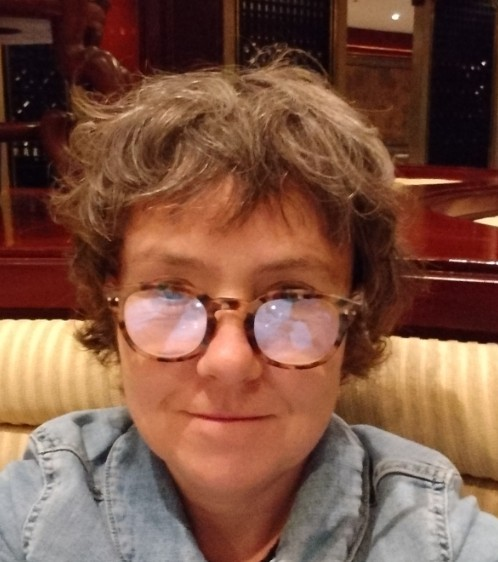
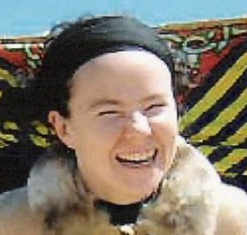
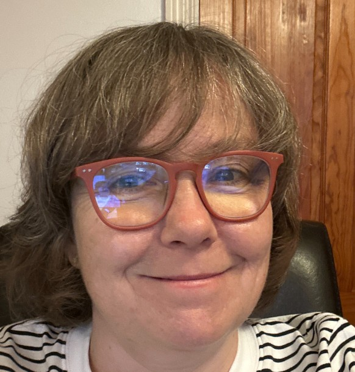
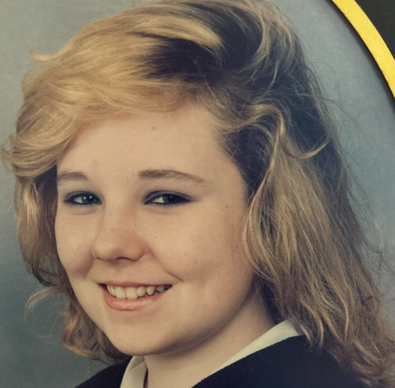
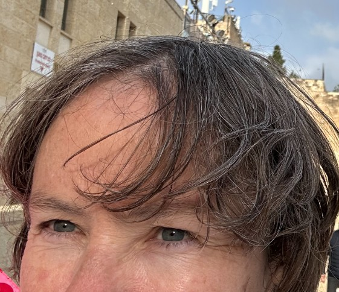
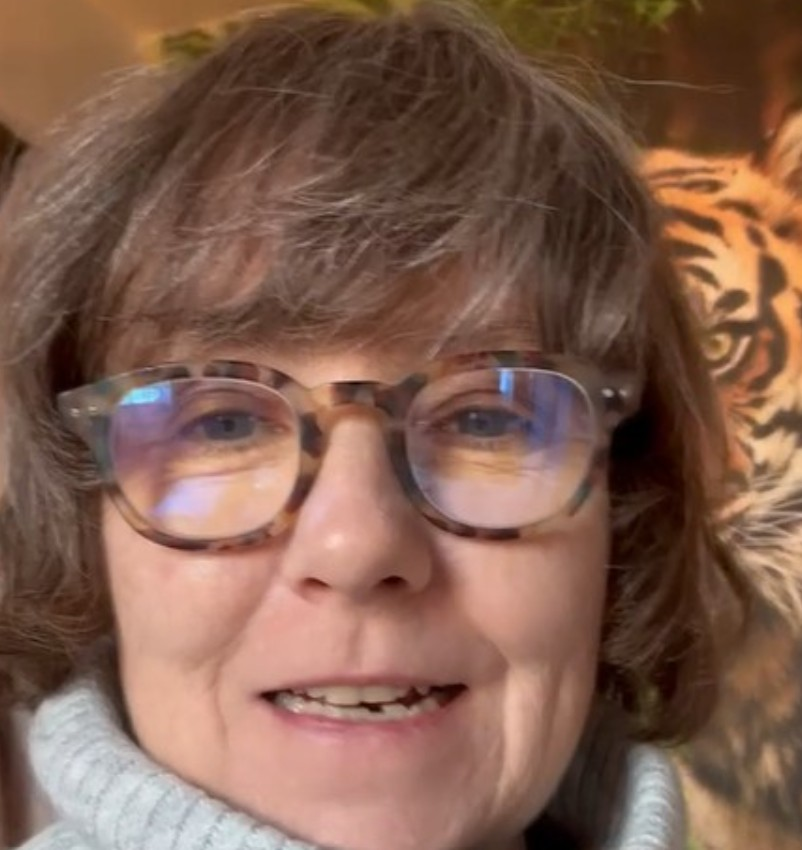
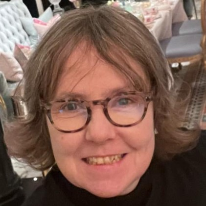
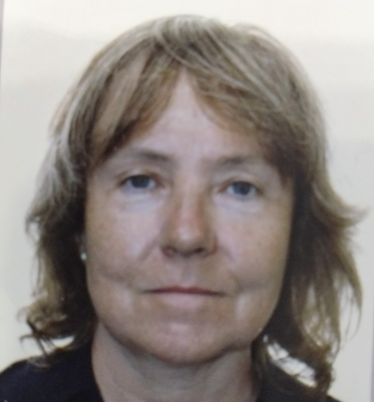
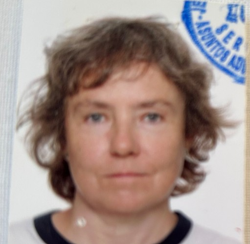

# Dear offspring

- Hi.
- I'm your mother.
- Your parents are robbers and thieves, they stole you from me in a most violent manner and I hope they have not treated you similarly.
- Here's a bunch of pictures of me if when you grow up, you look like me, and they take you to the doctors all the time for tests and tests, and for no particular reason, and you are suspicious about it.

- In fact, if they tell you you're sick and you have to undergo surgeries and procedures and this and that, they're probably lying to you.
- If you want to be like me, you have to put in the hard work, it doesn't come naturally, you don't get it handed to you, you're not born with it, you have to have a serious relationship with God and purify your mind, and this doesn't come easy in this day and age.
- It also has to be part of His Plan. 
- Regardless, if you love God and do what He says you'll be fine.
- I recommend studying A Course In Miracles and The Bible, and other things too, but you could start there.
- Don't get caught up in nonsense or carousing or evildoing, if you can help it.
- I'm so sorry the world is so evil. It can't support itself much longer like this.
- If I'm around still when you find out, I'm hearing now that I'll be here for quite some time, and you can find me, do reach out, I'd be happy to welcome you into my home at any time.
- Your loving mum.
