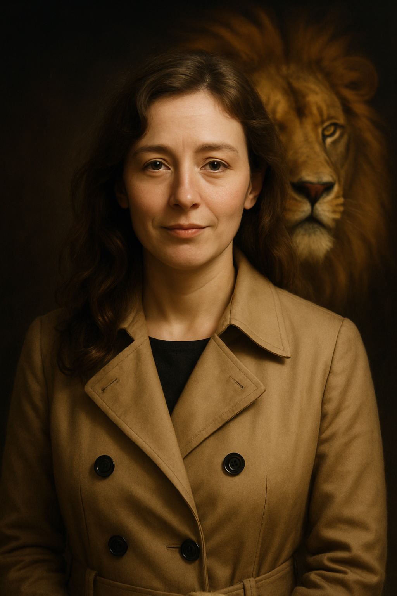

---
hide:
- navigation
- toc
---

Dear reader,

This book started life as a police statement.

It was written under extraordinary pressures, and while the author was being poisoned, drugged, and terrorized by criminal gangs.

The gangs had been stalking her for years, since at least 2006. They eventually tried to murder her because she was stubborn and blame-free, and she refused to leave the town and people she loved. 

Providence stepped in. She escaped to Bangkok where she would write her police statement.

People she had reached out to for help up to then were confused about what she was telling them as the story was so convoluted, so bizarre, and so much had happened, and she was so scared and anxious, and so many people were involved. And also, because, no-one really cares about the horrors that women quietly endure.

Her story sounded like a Hollywood spy-action blockbuster. It was difficult to accept that this tiny, not-very-good-looking, soft-spoken, middle-aged, rather boring and sometimes very annoying British lady could be the focus of so much evil and loathing, and require so many criminal resources.

*"It sounds like a chaos, doesn't it?"*, a Spanish government official had said. The same official advised her to write up a timeline of events and take it to the police.

The author knew she only had a short time to write down everything she knew about the murderous evil that has taken over the small, but important, town of Dénia on the east coast of Spain where the boats go back-and-forth each day to the Balearic islands.

In communication with the gangs online, the author found out that the evil had been in residence for decades, but it has only lately grown out of all proportion into something so hideous, so despicable, so egregious; no one is safe, especially children.

So sure they were she would not survive - like *countless* others including friends and family of the author herself - they told her all their secrets, and she wrote them down.

A lioness had been waiting so long to emerge.

You might think the police would be keen to root out sex offending networks as quick as possible, particularly when their main targets have morphed from single, wealthy and foreign, vulnerable females (or males given the right circumstances) - targets who might happenstance into the town and bump into one of the numerous *"introduction agents"* - into children and younger, and not necessarily just foreign ones anymore either.

Yet all the author's requests for help were silenced and ignored; by the Spanish police three times, and by UK police numerous times too.

Why is anyone's guess.

Nevertheless, even if the people of Dénia have ceased to care for the safety and wellbeing of their own offspring, the author, a child sexual abuse survivor herself, has not.

For that reason, the statement is now a novel in production and the author is in the process of filling out the details from the skeleton draft she managed to put together in Bangkok in November 2024.

Given now she has poetic license, the story is taking a new and more positive form. 

Ultimately, this book is a love story; a tale of good versus evil, a story of marriage and communities coming together under a strong commitment to Truth, to Life, and to the Light.

I hope my words bring healing. My words, I may have mentioned, are all I have.

And God. Of Course. And God.

Dr K Murphy, North London, 2025

!!! tip "Where to now?"
    Click `Next` at the bottom of each page to navigate to the next section.
