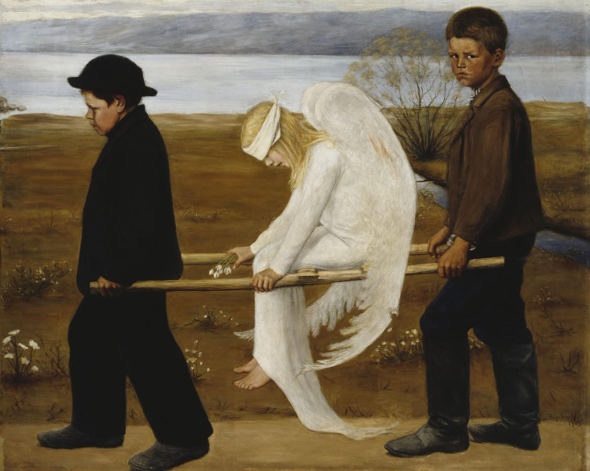

# 2001

## Amsterdam

- I'm living and working in Amsterdam, Netherlands.
- I work for Philips Electronics as a webmaster.
- Brian, my boyfriend, drives over to help me move back to the UK.

!!! tip "Meeting Brian"
    - Brian and I had met in London on one of the weekend trips back home I made in the Autumn of 2000.
    - Usually I met my best friend Jennifer and somehow we had bumped into Paul, Brian, and Niall, or she had met them and they'd all arranged to meet me when I came back, I cannot remember the details.
    - Brian and I *rendevouzed* in the Holiday Inn Brent Cross, and the first time we went there my friend Jennifer and Brian's brother Niall were there too and they were supposedly interested in each other except Niall wasn't really interested in Jen.
    - There was a lot of cocaine flying around.
    - Whenever I came back to the UK to meet Brian, we would stay there.
    - He told me once that his brother Aamon had told him about the Holiday Inn Brent Cross.
    - It was an unusual comment, like, what would you need to be told about?

- It is May probably.
- We stay at a Holiday Inn brand hotel near to the Rivierenbuurt where I lived in an attic room with no washing facilities (apart from one tap) and a chemical toilet in a small cupboard outside the door.
- As we're driving out of the hotel carpark, on our way to take the boat from Rotterdam, I see something strange.
- A black sedan-type car cuts us up while we're approaching the carpark exit.
- A woman is sitting in the front. She is wearing a thick white blindfold.
- Behind this car is another car of a similar nature. 
- The two black cars have a motorbike police escort and are driving in an aggressive manner, way over the speed limit.
- Brian brakes hard, and swears quietly.
- In the car behind, sitting in the back seat, slunk down low, is an extremely ugly man. Really, really ugly.
- His ugliness startles me.
- After they speed off, I ask Brian if he saw the people in the cars?
- He said he hadn't.
- So I told him what I saw, because it was so strange.
- This was the same man who stalked me on X, and followed me around [Lourdes and Cauterets](../2024/august.md#ugly) a few days later with a woman in August 2024.
- His sinister appearance in Cauterets that day (not his ugliness, the fact he was there, and perhaps a bad feeling about something I was consciously unaware of having happened...) concerned me enough that I described him in the [supplementary page to my handwritten letter](../2024/august.md#my-cubic-centimeter-of-chance) that I send to international law enforcement organizations and the mass media in August 2024.
- While thinking about the events from the past, I have a sense of being in the Amsterdamse hotel bar the previous night in 2001 with Brian, and meeting a bunch of foreign, brutish, olive-skinned men.
- Did I tell one of them he was greasy?
- Did they tell us they were dockers?
- The driver of one of the cars looked exactly like the [one of the switcheroo-porn trumpet teachers](../../crimes/protagonists/vidal-sastre.md#1-mark) that came to the music school in Dénia to teach classes in 2022. The the same [man who had stalked me at my apartment in Lourdes](../2021/march.md#the-portuguese-man-next-door) in 2021.
- The other driver was another [switcheroo-porn trumpet teacher](../../crimes/protagonists/vidal-sastre.md#6-viktor-the-man-that-interviewed-me-for-a-job-in-2016) that I would see around the town while the sedate-and-rape porn-fest was going on at my home.

### Memories of the past triggered on X

- I had forgotten about this event, it was so long ago.
- However, the woman in the screeching car wearing a thick white blindfold meant I would never fully forget it.
- The memory was triggered online in November 2024 by a post from an account that had been significantly involved in the cyber-stalking activity on X: [@january_myth](https://x.com/january_myth).
- I write extensively about [the `@january_myth` account here](../2024/march/13-end.md#january_myth).
- I believe Hazel/(Fiona) Smith was/is managing this account primarily but I could be wrong; the North London gangs' cyber-stalking tech seems to me, after some consideration, to be way more primitive than this.
- Anyway, in October 2024, the account posted this picture: https://x.com/january_myth/status/1846980956680278115.

- This image, coupled with the extremely ugly man who had stalked me on X and in person in the Pyrenees just a couple of months before, triggered a memory of what I had seen in Amsterdam with Brian in 2001.
- The man Brian and his friends called Ugly saw or was told about this, and believed he had been grassed up by his criminal "mates" from Dénia, Spain who had started to panic because I refused to die.
- So he defected to the CIA - because they had pointed me out to him all those years ago as a woman about to get rich - and not realizing that the CIA have owned his criminal "mates" from Spain since the 90s and know about every woman, man, child, baby, and horse that the gangs have murdered since then too.
- My thoughts and feelings about the blindfold lady have always been related to justice.
- It'll be interesting to find out why they set up this bizarre scenario in 2001.

#### Asking Brian if he remembered Ugly in 2024

- Of course, the moment I remembered the strange event [I contacted Brian about it](../2024/november.md#my-ex-boyfriend-brian-contacts-me-out-of-the-blue).
- The curious thing about that was we had just days previously had a long and healing chat on Facebook about our relationship.
- Was Brian prompted to contact me at that time?
- If so, who prompted him?
- I certainly would not have initiated communication with him because I had always found that risky (when doing so in 2008, long after we split up, he would phone me up drunk and crying that he'd *never got any of my money anyway*).
- When I asked him if he remembered the ugly guy in the car and the blindfold woman that morning in 2001, he said something very strange.
- He said: "oh, we were very high those days".
- He then blocked me.
- It didn't concern me again until [I was able to think straight about things](../2026/january.md#could-brian-have-known-who-ugly-was-back-in-2001), over a year later when the constant drugging stopped.
- I also contacted some other old friends about it including [Paul](../2025/january.md#paul) and Brian's brother Niall (who sounds like Henry's Cat when he speaks).
- Niall Higgins blocked me after I messaged him one word: *Ugly*.
- And [Paul](../2025/january.md#paul) gaslit me: *you really have to stop this nonsense*, he said.

### What I didn't know at that moment was ...

- Around the same time, if not at the precise time that weird event happened, lawyers in offices around the world were making deals.
- In just a few years, I would end up with *a lot* of money, completely out of the blue; compensation from the Lockerbie air disaster in which an aunt had been murdered by terrorists.
- £250K to be precise.
- Ugly knew about this from his CIA connections, and he had told Brian about it too.
- Just to say, when I did get the money, I spent it all really wisely, and no-one got their hands on it like they wanted to.
- Sadly, I believe my brother and cousin were successfully targeted by North London gangs for their share.
- I spent mine on healing and education.
- However, this meant I ended up earning way more than I'd ever received in compensation.
- So I remained a target for financial exploitation, especially given they had copies of [the child rape-gang porn from 1989, starring me](../2023/november.md#first-time-they-flash-up-my-naked-16-year-old-body-on-x), that everyone I knew had heard about, except me.
- And on top of that, because of my early CIA connection, related to the Lockerbie bombing but not necessarily to do with the compensation, I was always going to be every sex offender's free-for-all because they knew no-one would ever going to come to my assistance if I needed help because the CIA owned me - just like they own everyone living in the Dénia region.
- And so it began.

!!! tip "Curtis Warren"

    - While trying to figure out the identity of the ugly fellow, I remembered reading about a famous Merseyside criminal gang-leader Curtis Warren in the Guardian in 1998.
    - I mistakenly wondered if Ugly was the same man.
    - It's curious I would think this, so why did I?
    - Well, I knew Curtis Warren was in prison in Amsterdam, and I couldn't imagine he'd get out so quick, so the setting was correct.
    - In August 2024, I had seen Ugly with [Marie Henderson's](../2022/june.md#meeting-zoe-and-marie-while-walking) daughter on the X fake account, and she's Liverpudlian.
    - I knew the man [I saw in Cauterets and Lourdes](../2024/august.md#ugly) had to be famous enough to make everyone sit up and pay attention; which was what was obviously happening very soon after my handwritten letters reached their destinations - except I'll find out later that was due to him defecting to the CIA rather than there being any interest in the crimes.
    - But I think the most interesting thing about the connection I made here is that I had been appalled and horrified to read in the Guardian that Curtis Warren had chased down a young man and raped him, in the street, in broad daylight, in between parked cars.
    - I can only guess at what happened to me after [the distract and drugging at Les Halles in Lourdes](../2024/august.md#distract-and-drug-activity) in broad daylight, but it's possible I bit the ugly man on the cheek during the assault.
    - ChatGPT posted a picture of Curtis Warren for me, and he has no facial disfigurement at all.
    - So I was wrong about that.
    - Except, there could be a similarity, and Warren does have strong Spanish family connections.
    - Could he and Ugly be related?
    - I also wonder if, perhaps, Ugly and his gypsy-servant-family were also in Amsterdam to visit Warren in prison back in May 2001, and whether they used their real names on the prison log book, and whether high-security prisons keep CCTV recordings for decades, just in case...

### The boys come round

- It's 2002. Brian organizes a boys night in, and I'm invited too.
- Paul Pompeus, Niall Higgins (Brian's brother), and Simon Reid (one of their mates) come round with beers and drugs and we all get very drunk and high.
- Paul says something weird to me about Matthew Copeland paying for prostitutes outside my 21st birthday party venue, and I know he's doing it to upset me.
- I think he's idiotic; just trying to cause trouble.
- I'm just wondering now if there was another "date" that night.
- I remember feeling extremely strange on the sofa and Brian going to bed before anyone else (unusual) and getting impatient with me that I hadn't gone to bed yet, so I went early too.
- He was angry about something too.
- The following morning, when I got up, they'd all left.
- This was unprecedented.
- Normally after a night out we'd meet and have breakfast at a minimum, and they were at our house.
- Why did they scurry away for a two hour drive back to London before I got up?
- It reminds me of [the Polygon management team](../2024/may.md#the-management-team-cant-look-me-in-the-eye-or-be-near-me) at the Bali offsite in 2024.
- The mind does play tricks, but I've an awful feeling I can hear Simon's voice saying, "and that's for...", over and over.
- Did Ugly supply Brian with a pocket spy-cam for the occasion?
- I don't believe I saw any of the boys ever again, until [Paul flies to Madrid](../2025/january.md#paul) in January 2025.

### The children often came round

- While Brian and I were living in Hastings, we had his two children every fortnight, and sometimes his brother Niall would bring his daughter too.

### A strange man comes round

- One night in Warrior Square, Brian has gone out for something briefly and the doorbell rings.
- I go to answer the door and a man is there asking for Brian.
- I have no idea who this man is, but he knows Brian well.
- I have never even heard of the man when he tells me his name.
- And it seems they have a date of some sort arranged for that night; but I thought Brian was staying home.
- I tell him Brian's out and when he gets back from the shops or wherever he's gone I tell him the man came round.
- Brian gets angry: *he should never have come round like that*, he keeps saying.

### St Bernards

- Whenever Brian got drunk, he often started waffling on about St Bernard dogs, you know the dogs that rescue people in the snow with their little kegs of alcohol.
- I never really got why he was always going on about them; it seemed like he might have watched a film sometime, like he was remembering something he'd seen.
- He always spoke about them in a sexual way too, which I found a bit weird I have to say.
- It would not surprise me if something like that was on my sedated-episode list, and he was remembering it out loud drunk, without bothering to mention how much danger his girlfriend is permanently in from rapists.
