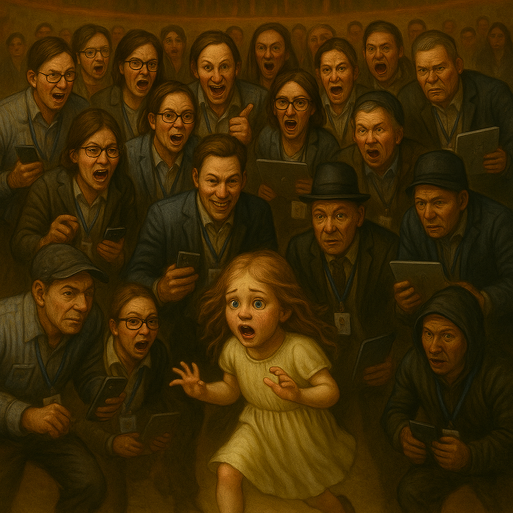

# 2003

## Porn fatwa

### Or, the perfect victim

- Sometime in or around 2003, a porn fatwa was issued on my head.
- Undoubtedly this has happened to numerous people for various reasons over the years.
- In my case, North London criminal gangs responsible for distributing pornography in which I had repeatedly "starred" as a sedated child, gang raped by numerous black men in Tottenham, were watching closely as it became clear I was going to suddenly have a lot of extra cash from the Lockerbie air disaster compensation payouts; £250k to be precise.
- This was a figure criminal honey-trapping porn-gangs could not ignore, obviously.
- The fatwa, as it were, I believe to have been a notification on men's underground porn-addict community networks requesting DIY spy-cam and/or sedated porn, of me, so that they might target me and blackmail me for my money.
- At the same time, the early films will have been re-released so as I would be recognized and to whet the appetite.
- I'm guessing substantial rewards would have been on offer for any porn with me in it, or maybe they gamified the whole thing online.
- It would have been very easy to drum up more hatred towards me, and thus collect massive subscriber fees from the tech-bro community who despise smart women and have been known to mass murder us, for example, for simply existing.
- Therefore, every single relationship, and indeed every job I have had since 2003 is potentially part of the wider conspiracy.
- I expect I have starred sedated or otherwise in countless more spy-cam porn videos since then.
- The fees they collected from the 2015 incest porn will have been astronomical! 
- It is my belief this *fatwa* became uncontrollable and its spidery-tentacles extended into my professional life, my personal life, everywhere.
- I believe criminal gangs of porn creators and distributors, a global tech-bro audience, and porn addicts the world over have been watching in horror as I pick up the multiple threads and untangle them one-after-the-other, never having thought for a second they'd get found out.

- Also, I'm sure [my friend with the facial disfigurement](../2024/august.md#ugly) can shed more light on this as he may have been [the one to get it started](2001.md#amsterdam) and also the [one to finish it](../2024/august.md#distract-and-drug-activity), just before the porn-gangs of Dénia tried to finish me off, hoping for the [end of an era maybe](../2024/october.md#serious-poisoning-with-intent-to-kill).
- They got a lot more than they bargained for.
- So, apart from the relationships already detailed in this police statement, it's probably worth mentioning another few.

### Dennis Buchwald 2003

- A Dutch porn addict living in Rotterdam I met in Australia in early 2003, the first year I received a wedge, who love bombed me and paid for a flight for me to visit him in Hong Kong for two weeks.
- I believe he made porn of me while I was there.
- Dennis was a computer programmer working for a major tech company: Concentrix.
- The firm was running a multi-billion dollar tech systems operation based in Hong Kong. The team was made up of mainly Dutch men and the lead was a cowboy with long hair, cowboy boots, and a cigarette.
- I believe it is highly likely the team he worked with, that I met for dinner one evening in Hong Kong, knew what he was up to with me.
- Was this the first tech-bro firm involved in the North London and Spanish porn-gang sedated-sex-slave conspiracy?
- The last time I looked him up, about 10 years ago, his Facebook profile had a picture of him and two women posing as ISIS terrorists which I found extremely odd and then promptly thought no more about it.
- He was the first man (since Winston May the pedophile in 1989) who spoke to me in an overtly affected and disingenuous manner, as if he proper thought I was an idiot.
- He told me, by text while I was in Australia after two days of knowing him, that he had decided he was calling me *Pookie*. Online stalkers on X call me *Pookie*, a lot.
- He had a Greek "girlfriend" on the tour when I met him; a woman who looked after stray dogs in Athens. And one of the other women on the tour, a Canadian, he flew out to visit him in Hong Kong once I had left!
- Did he create more porn with them and others without their knowledge?

#### Turtles 

- While I was being love-bombed by Dennis Buchwald residing in Hong Kong, I was traveling up the coast of Queensland.
- I met a few weirdoes on that trip.
- One particularly interesting weirdo was a woman I met in the queue to see the turtles hatch and run into the sea somewhere along the coast possibly Townsville.
- She seemed to know me, and she was *horrible* to me.
- I mean she was rude, offensive, it was so strange I had no idea what had got into her.
- It was as if she stalked me out, targeted me, and just laid into me.
- She was staying at the same hostel as me also, and had probably been on the bus to the venue I guess.
- Anyway. She was dark black haired, long, looked a bit Greek but was probably gypsy.
- I think she sedated me that night, briefly.
- The reason is, we were all in a group, and the next thing I know I'm standing in the trees away from the group, on my own, and the evil woman is with all the others who are waiting for the bus or something, and she's giving me dirty looks, and I have *no idea how I got there*!
- Was she filming too?
- Seems likely.
- Remember, this was when the compensation money was being *finalized* by the Lockerbie lawyers and I was hearing about it excitedly every time I phoned home.
- And curiously enough, I didn't believe it. It was too preposterous, to me.
- I think Ugly knows this lady. Did he say her name was Renee?

### Adrian 2007

- Adrian was a friend of Anita Diamond.
- She and her husband Matthew introduced us and set me up with him.
- They were very keen on getting me into a relationship for some reason, and had been instrumental in the [disastrous Dave Porter affair](../2001-to-2010/2006.md#dave-porter-on-guardian-soulmates).
- Adrian was introduced not long afterwards.
- I met Adrian in Valencia and we stayed in a hotel one night and had sex.
- I told him I'd just remembered being gang raped as a child, and was traumatized by that, and for that reason I was not interested in taking it further.
- I don't really know why I had sex with him, but he was a nice enough guy.
- Looking back, I believe near-constant PTSD was causing my behavior to be erratic and self-destructive.
- I was also extremely easily manipulated by "friends" and I had known Anita since I was 11, a near-perfect conspirator.
- I wonder if the brief and unloving encounter with Adrian begat another porn video.
- If so, there would have been a lot of people involved in conspiring to organize it, and the hotel room would have to have been set up with spy cams.
- He also had a Blackberry and a beeper.
- Adrian had links to criminal gangs; Anita took pains to tell me this more than once when [we worked together at Qredo in 2021](../2021/march.md#qredo).
- I think he told me he'd been a doorman too. 
- I'd be delighted to be wrong about Adrian but in my current statelessness, homelessness, joblessness, utter lack of human rights and no-one taking any notice of what's happened to me and so many more women and children in Spain, I have no option but to add anything that might be part of the most sinister global sedated-sex-slave porn conspiracy that probably most men are aware of, and don't think there's a problem with for some reason.
- Do the porn-gangs of Dénia only target women and children they're 100% sure will never get help; the perfect victims?
- Adrian had children and his first grandchild had just been born when I met him; so I hope he will understand why I had to include him.

### wip

## Flying home from Dubai with Brian

- Can you check passenger seating on flights from 2003?
- We flew Dubai to London on Emirates at Christmas/New Year.
- We sat in a row of three seats.
- Sitting next to me, was the woman from Mallorca who had let me and Patrick from Alkmaar stay at her apartment in the summer of 1999.
- She was always talking about how much sex she was having with the locals.
- Seems likely they were filming there, doesn't it.
- Were they taking the piss, or just coincidence?
