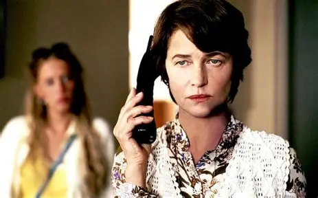

# 2005

## Women's self-esteem retreat with Sat Santokh

- In January, in Barcelona, I attend a retreat at the Kundalini yoga centre.
- It was recommended to me by my homeopathist, Peter Smith working at [the Hale Clinic](https://www.haleclinic.com/), after I told him I was trying to remember the details of sexual abuse from 1989. 
- I had not yet remembered anything the North London rape-gangs did to me while I was sedated, and I hadn't been to the police at that time either.
- My suspicions about what happened did not include sedation.
- However, I did know something awful had happened to me because of continuous and intense PTSD.
- I thought I had "blanked it out", like we used to say happened to victims of serious sex offenses, and maybe that is possible if the mind is unable to consciously carry the reality of traumatic events.
- Although, we haven't really considered the possibility that rapists are mass sedating women and children and have been for nearly half a century, or more.
- I meet Inma from Madrid on the course and we remain friends.
- Inma turns out to be a professional retreat-attender and is probably reporting back to the Spanish government about these things - I guess whether the people are involved are dangerous in any way, whether there's any weird stuff going on.
- She will play a significant support role in the [2022-2025 Dénia conservatory sedated porn scam events](../2024/october.md#meeting-inma-and-paloma-the-spanish-official-in-madrid).
- I meet a woman called Lydie here who looks *exactly* like Marion Cotillard from [Inception](https://www.themoviedb.org/movie/27205-inception).
- A curious synchronicity is that [Mike Wenham](../2001-to-2010/2010.md#mike-wenham) will invite the department to the cinema in 2010, and take us to see Inception in High Wycombe; random I know, but still curious.
- Even more random and curious, the retreat is run by an ex-roadie of the Grateful Dead, [Sat Santokh](https://www.satsantokh.com/), whose daughter Snatam Kaur has cornered the Western Indian-spiritual-music market.
- I'm there hoping to access significant and lost memories from August 1989.
- I don't.
- All I can see is my 16-year-old self in the back of an open-top, burgundy VW Golf parked in Plevna Crescent Tottenham, with Leon and Winston May in the front, and a terrifying man who looks and sounds like Chris Rock approaching the car - *Busby*, [Ugly](2001.md#amsterdam) calls him in 2026 on X - shouting and behaving extraordinarily bizarrely, calling me names and firing racist insults at me while the other men laugh and a grey wall of mist comes down over the scene...

## Warrior in the Heart

### Richard works for the criminal gangs

- As part of my healing process from child sexual abuse by North London rape gangs, I study shamanism in Glastonbury UK with the [Warrior in the Heart](https://www.facebook.com/warriorintheheart/) organization run by Howard & Elsa Malpas.

- I have the money to do all this healing because of the Lockerbie compensation; a gift from God.
- I know I have blocked memories of sexual abuse, and I'll do anything and everything I can to access them.
- That is my sole mission in life at this time.
- Shamanism with the Warrior in the Heart team is a year long course, and we meet on four occasions in Glastonbury.
- The group is small; around seven women and two men.
- One of the men seems extremely out of place; Richard.
- He's staying in the same guesthouse as me, Berachah. 
- Coincidence? I think not.
- He tells us he has just got out of prison for cocaine trafficking and he's looking for a wife.
- The first statement seemed reasonable, the second less so as he ended up bedding a good few of the ladies on the course. 
- Not me, by the way, but he was inordinately interested in me.
- Inordinately interested.
- We went to dinner together, and he asked me if got my money from prostitution. I was mortified and really angry.
- He kept mentioning how he'd just got back from his apartment on the Algarve in Portugal, where he'd been with a woman who had shouted really loudly when he told her to let it all out, or something like that. 
- Apparently her screams had been so loud, all the neighbors must have heard; he chuckled at that point, and then explained it as her healing process that he was somehow directing.
- He then suggested I had come into my wealth during the `.com` boom.
- I told him I loved him.
- At one of our meetings, in August, he suggested I have a threesome with him and his lady friend from nearby town Somerton who looked a bit like Lady Diana. 
- He was getting annoying.
- He clearly knew I had money, and he wanted to know where it came from.
- One morning, doing yoga, he just came out with it. "Where did you get your money?"
- I told him; "international terrorism", which was true.
- He giggled and said, "I expect it was."
- Later, he persuaded me to go to an all night festival with him in Cheddar Gorge, the Big Green Gathering; one of the other participants was going to be there running a chai café.
- I had a dreadful chest infection, but went along anyway.
- After arriving, I just got sicker and sicker. I was running a temperature, and I had to lie down.
- I knew I might get pneumonia if I had to sleep in a field.
- I told Richard I was going to have to leave, and asked him if he wouldn't mind taking me to somewhere I could pick up a taxi and go to a hotel.
- He was furious.
- I demanded he do so; it would take him 30 minutes max and he'd be back at the festival.
- He was so angry with me; it didn't make any sense to me that he would be so angry with me. He'd pretty much ignored me from the moment we arrived.
- In the end, weirdly, we both left the festival for the night.
- He drove us back to his house in Bristol and he gave me his bed to sleep in while he slept on the couch.
- On the way back to his in the car, he was still angry, furious even; ranting.
- I remember he kept saying; "I'm not scared of the Adams family."
- I had no idea what he was going on about.
- Now maybe I do.
- Years later Howard, Elsa, and I remembered him. 
- We all remarked on what hard work he was, and giggled.
- We three had all wondered if he was a policeman.
- He had that officious air about him.
- He definitely had hidden motives, we also agreed on that.

!!! info "What does this all mean?"
    - This was before my mind cracked open in December 2005 and I remembered being gang-raped semi-sedated in Tottenham North London.
    - I guess this means I was a target for blackmail with child rape-porn as early as 2005 and Richard was checking me out probably with the intention of setting some scam up at the festival that night, or maybe even a porn rerun. 
    - He clearly had been told I had money, and he wanted to know where it came from.
    - Was targeting women for their money part of what he did?

- Richard ended up in a serious relationship with one of the course practitioners - the chai lady - who at that time had a six-year-old daughter Mazey (I can't remember the mother's name).
- We all heard how he had been violent towards the woman and at one time had locked her in the fridge.

#### Flying from Spain and Portugal to the South of England

- Richard talked about how he often flew from south of England over to Spain and Portugal on a small aircraft, perhaps just a one or two passenger craft, perhaps not quite a plane.
- I remember this because I was in Madrid at the time and he kept saying he could fly to Madrid from England anytime.

#### Seeing Richard again

- Someone who looks *exactly like Richard* pops up at [Newgrange in September 2025](../2025/september.md#richard-at-newgrange).
- I like to think that's a good sign.

#### Elsa's introductory talk

- At our first meeting, the very first thing that we did was listen to Elsa giving an introductory chat to the group.
- I'll never forget it.
- She explained she had been contacted by an orthodox religious Jewish man with a request for healing, and she had met him and given him some healing.
- She then said she spoke with him again just before the course started, possibly over the phone.
- She said that, the morning before setting off for Glastonbury and the course, something had happened to her in her home in the corridor while she was moving towards the kitchen.
- She'd had a shock, or some sudden *light* event, something that bothered her or even caused her injury.
- She was annoyed and upset.
- So much so, she had to tell us about it, even though it was apparently irrelevant to our meeting.
- She had to tell us; perhaps her guides told her to tell us.
- She said she *knew* it had been something to do with her client, the Jewish man.
- She then explained how to do shamanic journeying, and we all undertook a first journey while Howard drummed.
- I saw the rainbow snake.
- Sadly, Elsa is not with us anymore to corroborate but Howard may remember this story; as might Richard, of course.

## Mantak Chia

- In May I travel to Chiang Mai in Thailand to attend a Taoist female sexual practice course.
- I meet a Swiss woman on the course who looks like Charlotte Rampling.

- We exchange a few emails after the course for a while.
- I wonder if the gangs simply couldn't resist researching any woman I was in touch with that attended a course like this; I mean, sex, oooOOOooo!
- Did they hack the Swiss woman, find out she was wealthy, and turn on the manipulation?
- The reason I say this is because I believe [I see the same woman talking to Domingo in Dénia in 2014](../2011-to-2020/2014.md#i-can-describe-her-perfectly).
- We were having a coffee after piano class. I was feeling a little high. His phone goes off. 
- "Oh, I have to meet someone", he says.
- He gets up to talk to a woman who is walking over.
- I see her perfectly for the few minutes they talk.
- She's upset. They're discussing a problem.
- She looks at me intently, again and again, as if she recognizes me or wonders who I am.
- At the time, for some reason, I thought she was his therapist. 
- Perhaps that's what he intimated.
- Later, I got suspicious and thought he was  (ridiculously) trying to make me jealous by showing me women he was involved with, and maybe doing the same to her, hence the looks.
- I never thought for one moment he could be involved in an international spy-cam sexploitation scam and got kicks out of telling his victims what he's doing knowing they'd be way too nice and polite to imagine what he was really up to; and that's exactly why I didn't immediately recognize her as the Swiss woman from 2005.
- I wonder how long it took the porn-gangs of Dénia to go from spy-cam honey-trapping to setting up a porn-studio at the conservatory and start drugging the students.
- Did anyone ever complain? 
- Please God, someone must have tried to stop them, or did they know they'd be murdered if they did?
- Did Hazel Smith’s arrival in Dénia in 2005 change the landscape?
- Did the women-hating porn-gangs lose their minds once they knew that Hazel's UK enterprise controls police forces in Spain and the UK?

!!! tip "More than interesting..."
    - The reason this is *MORE THAN* interesting is because... I was living in Madrid in May 2005, and I hadn't stepped foot in Dénia since an afternoon in October 1997 (which no-one was aware of), so if Domingo and his associates did target this woman, solely due to my meeting her, we've successfully connected the hacking dots up from North London to Dénia (via Madrid and Zurich or wherever...).

## Sean Hamman

- And Olly in Montpellier.
- Did I see Olly yesterday?
- Wild.
- Olly reminds me of someone because of the way he drove the car up the mountain to the Iboga retreat from Montpellier.
- Sean Hamman (sauna hamman) was annoyed with him about the way he rally-carred it up, not particularly fast, but throwing us all around as he braked then pumped the gas and braked again.
- The way he was driving was completely unnecessary.
- Roberto drove in exactly the same way when he took me and Catalina up the mountain for a walk in December 2012 near Alicante.
- Catalina was embarrassed.
- There is no reason to drive like that unless, perhaps, you're perma-taking the piss out of everyone, including yourself without realizing.
- Sean Hamman now... was he on the bus in 1989 when I freaked out and ran out of the nightclub on my own and somehow found my way home? Was he the man pretending to be handicapped coming up the stairs? The one I mention in my police statement from 2015?
- That would be even wilder.

