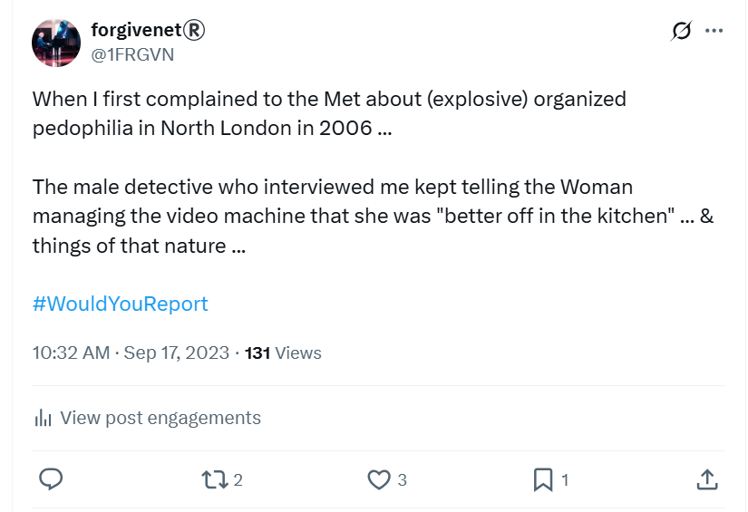
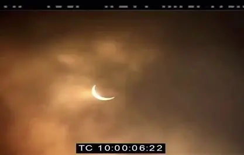
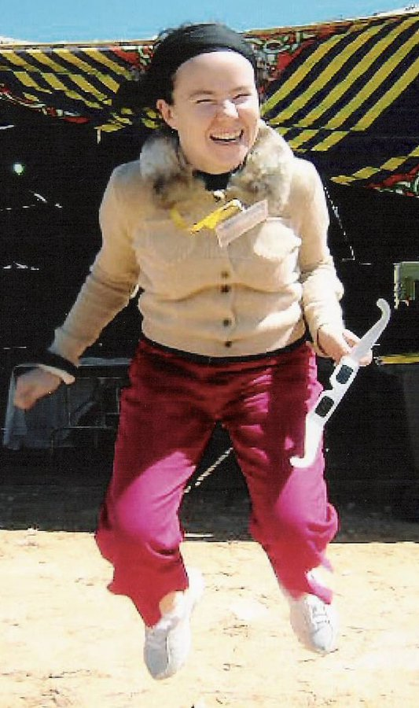
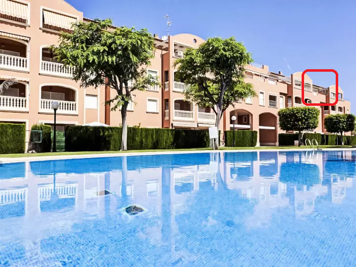
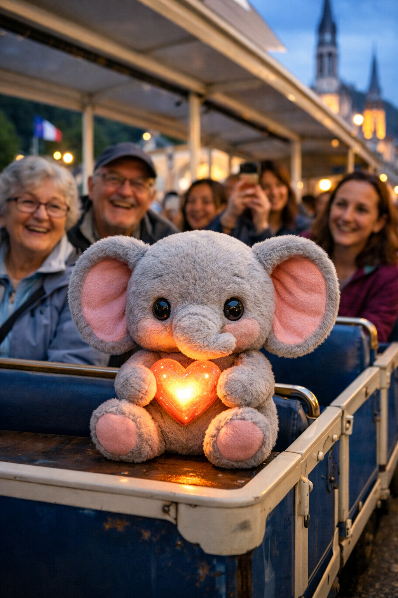
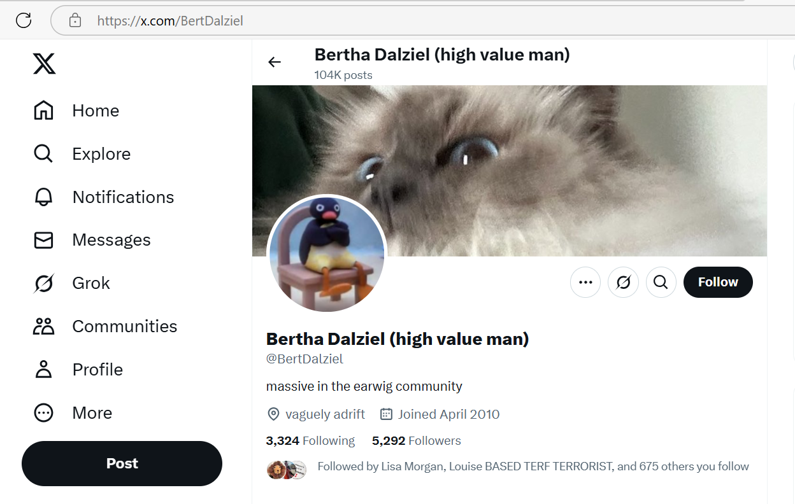

# 2006

## January

### Reporting child sexual abuse to the Metropolitan Police

- I go with my mother to the old Highgate courthouse building to give an interview about the North London rape gangs who had sexually assaulted me when I was 16 in 1989.
- I had remembered being gang-raped while taking part in an Iboga ceremony in Montpelier in early December 2005.
- Iboga is a herb that can access hidden and suppressed memories.
- Unsurprisingly, sedating rape gangs are *extremely interested* in any therapy that has the potential of uncovering a tidal wave of *hidden-in-plain-sight* crime.
- The interview was led by a detective from Hornsey Police and it was videoed by a woman police officer.
- The detective met me previously for lunch at Casa Pepe's in East Finchley where I wasn't able to eat anything due to trauma, and he told me about his wife having suffered, like me, from a debilitating autoimmune disease, candida.
- I had remembered just one instance of being drugged and gang raped; although there were multiple instances.
- Most, if not all, of these horrific events were filmed and paid for by criminal porn networks, but I wasn't to know that until 2025.
- I believe my father was invited to view the films soon after they were taken and while I was still suffering a severe PTSD from the experiences.
- This would have locked him into any continuing conspiracy regarding my right to life.
- Remembering this single event was extraordinarily traumatizing.
- I also remembered other smaller peripheral details such as, for example, a man with a black case, which I believed, and said, was a VHS video camera although I didn't remember seeing it.
- I had no other memories concerning filming and only one memory of the gang rape that took place in a house in Plevna Crescent, London N15. 
- In fact, in 2006 I did not give the police the street name; that came later, in [my second report to the police in 2015](../2011-to-2020/2015.md#statement-to-the-metropolitan-police) after I'd had ten years to collect and make sense of my memories.
- I also did not mention in 2006 how the rape gang had got hold of at least three other friends of mine; although they successfully demonized me which made it impossible for us to support each other; a common *distract-and-deflect* practice amongst pedophiles and sex offenders reminiscent of the behavior of teachers and staff towards me at the conservatory between 2022-2024.
- I mentioned this in 2015 and I believe the police spoke to those women. It's not clear if they had anything helpful to say.
- Sedating, drugging, and poisoning victims is an extremely effective way to commit apparently undetectable crimes.
- I did mention in my 2015 report a high level of racism towards me from the gang; vile things they said to me, insults, derogatory comments. 
- They only went for the white girls from my group of friends, although I did report seeing one black victim at the ringleader's house.
- I reported the Pakistani husband of the ringleader's sister and how much I hated him as well as the ringleader Winston May.
- At the time of the interview, I was studying for my PhD in Computer Science at the technology department of the Universidad Politécnica de Madrid and I lived in Madrid, Spain.
- After remembering this horrible event and going to the police about it, I suffered from a debilitating re-traumatized PTSD and I found it extremely difficult to be among my colleagues and classmates at the university and found some comfort in isolating myself from the world.
- I also got genital boils for a year or so while I was suffering.
- Astoundingly, the detective made continuous sexist comments and put-down jokes to the female police officer throughout the afternoon of the interview.

- This made me wholly conscious of how unimportant I was, and I think it was supposed to.
- My mother waited outside while I gave the short interview.
- As we were leaving, she suddenly blurted out that she had seen bruises on my legs back then when I wasn't coming home till all hours or the next day!
- Porn-gangs of Dénia and North London, totally protected and safe to continue to enrich themselves on my suffering [started to post stills of the 1989 porn on my X UI](../2023/november.md#first-time-they-flash-up-my-naked-16-year-old-body-on-x) while I was being terrorized online and offline in Dénia in 2023 and 2024.

## March

### Total eclipse of the sun

- Me and mum visit Egypt on a tour which culminates in us seeing the total eclipse of the sun on 29th March.

- I'm eclipse crazy after Cornwall in August 1999. 
- This was the moment I became *fully conscious* of the fact there is a God and He loves us.
- The other woman on our tour, Tanya, and I go to dinner one night without mum.
- She shares she was sedated one night in Italy when she was young, in the late 80s maybe, while on a date with a man, and she was likely sexually assaulted.
- I tell her I've just remembered being gang raped in London in 1989 and I'm ready to talk about it.
- Tanya's a spy.
- She doesn't tell me this - or maybe she kind of does.
- I feel like I just know.
- Me and mum like her, a lot. Mum doesn't realize.
- I figure she's been sent by the Americans to make sure we're not total nutters; after all Gaddafi himself is going to be at the eclipse site.
- We are, of course, Lockerbie family members so it would not have been sensible not to provide some sort of support.
- Shady, our tour guide, seems to have been peeping at us while we're washing ourselves.
- He already got a bit weird with me on the first day of the tour and had to be dealt with.
- At the end of our tour he declares he is going to "prove" to us all he is a psychic.
- He tells me about the tattoos I have which you would only know about if you'd seen me naked.
- I think, at the time, they must have peepholes in the hotel bathrooms in Egypt and assign those rooms to women they want to spy on.
- Here's proof of how happy being at the eclipse and knowing God was behind it made me.

- I see Tanya again in May 2025.
- She's with what looks to be a tour group waiting at reception in the hotel I'm staying at in Dublin for Transforming Touch practice.
- I sort of know why she's there, and it is comforting.
- It wasn't nearly as comforting as the Israeli-woman's 40th birthday celebrations I'd found myself amongst the day before at the spa, however.

#### Nanu-nanu

- Me and Shady ended up being a bit of a double act.
- It was on this trip, I told the best joke I've ever told, maybe.
- We were in the Egyptian Museum in Cairo and I was remarking on how the elongated heads on some of the statues of ancient Egyptians made them look like aliens from another planet.
- I wondered out loud if the ancient Egyptians were, in fact, aliens.
- Shady says: *Well, if they were aliens, what do they say?*
- And I say: *Nanu nanu.*
- It took a long, long time for us to stop laughing.
- I'm still chuckling.

## July

### Lourdes

- First visit to Lourdes.

## August

### Ceremony to say goodbye to the past

- I was doing all this shamanic work which was great.
- I just remembered gang-rape from 1989 and it had shattered my whole world.
- I decided when I got back to 31 from Spain (via Lourdes that year) I would do a ceremony to say goodby to the past, with the intention of healing me from it.
- I planned it out online on my laptop, this ceremony, for a few weeks probably, giving the date and the details.
- I arrived back home that evening, no one was in.
- My parents were away on holiday so the house was empty.
- As I started to prepare the ceremony, gathering items from my belongings which I was going to burn in a ceremonial fire, my brother came home.
- He was drunk.
- The things he was saying... it was as if he'd been hanging out all day drinking with a bunch of Jamaican men:
    - *Never tell man,* he was saying, *You must never tell if you do wrong to the women*.
    - *Ha ha ha*, laughing.
    - *Never tell.*
- It was extraordinary.
- I said to him, at that moment, those men are pedophiles Robert, you do know that don't you, and continued with my plans.
- It was obvious to me who he'd been talking to and what the implications of what he was saying were.
- It did not occur to me until today that the fact he was saying it at that moment was significant.
- Well, that's a bit of a lie.. this one has been popping up for a few weeks and now's the time to write it down. That's how it works.
- He then got extremely angry with me, raging in fact, that I was burning all my past belongings.
- It upset him existentially.
- It was nothing to do with him, I thought, wrongly, and kept going.
- If I had realized how everything effects everyone always at that time, I might have done something different, but that was a wiser state to come.
- (It may have been 2005, I'm not sure yet).

### Beau's lines

- It's around now, on one of my very first drives from Madrid down to Dénia, that I notice my left thumbnail is all lumpy with horizontal lines.
- These are Beau's lines, I find out twenty years later.
- Prior to this in early 2006 (maybe after my trip to Dénia at Easter time that year) I had started to see dark specs in my nails, but these disappeared.
- The Beau's lines have been pretty consistent since then in my left thumbnail - apart from perhaps a few periods of not much going on there.
- They signify trauma to the internal systems... basically something extreme happens to the body and the nail stops growing temporarily while the body sorts out whatever it is that's happened.
- It can be caused by poisoning, and in my case I believe it was.
- Thus, we might be able to say, porn-gang poisoning began very early on for me, way back in 2006, right about when they were all making their plans for my money, and maybe even at my apartment in Boadilla del Monte just outside of Madrid too.
- Every Saturday at Boadilla del Monte, my downstairs neighbor would play the accordion, gypsy style.
- I thought it was great.
- It would not have been hard to manipulating me into renting a different flat than the one I saw in the window of the estate agents there; and my landlords were absolute monsters, the man was even called Adolf! I mean.. he lived up to it too.
- I was very addicted to masturbating there.
- I thought it was because I had been to Thailand to do the female sexual Tai Chi course in May 2005 - obviously yet another lure - but now I'm not so sure, not so sure at all...
- The Beau's lines are always worse on my left thumbnail. 
- Sometimes the right thumbnail is pretty clear, but often it is not, but it is never as bad as the left thumbnail.
- I believe this signifies specific organs attacked on specific sides of the body and suffering from poisoning trauma (right kidney/liver area I reckon, which I have mentioned untold times in this police statement).
- The worst it ever was was after [the chamber music class on 28th January 2023](../2023/january.md#serious-poisoning-at-chamber-music-class) when they either totally overestimated the dose or intended to kill me, both outcomes fit their intentions in any case.

## September 

### Lured to Dénia

- Something made me want to return to Dénia after nearly 10 years.
- I believe I was lured there by the Smiths and Lopez-Canos using their online manipulation tech.
- My [sudden wealth](../2001-to-2010/2001.md#what-i-didnt-know-at-that-moment-was) and the [sedated child-rape-porn films with me starring](../2001-to-2010/2003.md#porn-fatwa) are more than a decent motive to have me trapped in their world-famous criminal-porn-studios' lair.
- Little did they know, I had been there once before, in 1997, where something extraordinary happened which gave me a permanently good feeling about the place, as if I belonged there somehow.
- They lured me there again and again.
- Whenever I left, they'd wait a while and start the luring tech on me again.
- This was exactly how I was [lured back to Dénia in 2012, and again in 2021](../2021/july.md#thinking-about-moving-back).
- What they didn't know was... had what happened to me in 1997 not happened, I probably wouldn't have come!

#### Lockerbie

- It turned out another UK Lockerbie family member ended up in Dénia too.
- What are the chances of that happening?
- Moreover, my dad repeatedly mentioned to me how worried he was when he heard that this other Lockerbie family member had bought property there.
- He said: *my heart sank when he told me he was in Dénia too*.
- Not worried enough to say or do anything that may have protected me, though.
- In fact, dad always hid genuine concerns under a despicable guise of hatred which meant we just ignored him.
- As the truth steadily emerges, I realize that nearly everyone I have ever known has *deliberately* thrown me to the wolves, and quite often been snickering while doing so.

### Moved to Dénia

- I moved to Dénia in September to live alone quietly and peacefully for three years, and write my PhD thesis.
- I returned to Madrid to see my professor about once a month.
- I lived at Cami Llavador 5, Dénia 03700 Alicante; the one-bedroom attic flat marked in the photo.

- My neighbor was a woman called Charo.
- She didn't like me very much, for no particular reason.
- She obviously knew about the 2022-2024 spy-cam conspiracy early on; I saw her one afternoon at the supermarket not long after I moved back and she started shouting at me in front of all the shoppers.
- It was extremely weird and unpleasant; I was embarrassed for her.
- She'd obviously been told to do that which makes me wonder about everything.
- For example, could she have been popping in to my home whenever I was out, like they do?

#### In which apartment did the spy-cam sedation start?

- It makes me wonder in which of my Spanish apartments the sedating spy-cam rape-porn began.
- I don't think it happened in Cami Llavador for a number of reasons but mainly, and significantly, I had no genital boils over the years I lived alone there in peace.
- The other significant reason against it is that the Internet was not up to running spy-cam networks at that time.
- I did, however, have a boyfriend for a short time who would never eat anything when he came round.
- It was strange.
- He refused even to try things and never gave an explanation why not.
- Did he think my food might be contaminated?
- This was Vicente, brother of the man who married [Barbara Loftus](../2011-to-2020/2012.md#barbaras-wedding); a woman whose well-being and safety I have extraordinarily strong concerns about.
- I remember vividly him telling me one day that there were *VERY VERY BAD PEOPLE* in Dénia, and I didn't think for one minute he was being serious.
- My *significant* memories of this period do not suggest sedated spy-cam activity, aside from that short romantic relationship with Vicente; a man who undoubtedly knows what goes on in the town.
- I do, however, I have some concerns about my devices so it's possible I was targeted for online manipulation early on, and probably clandestine drugging to compliment it.
- I suspect drugging and manipulating women for honey-trapping, porn, and prostitution like this has been going on for centuries in this region, one way or another, and the Internet just made it so much easier.
- It's also true I found the property online initially, and even though I was hacked by criminal gangs by 2005, or earlier, it's possible I connected with the Madrid-based owners on a device and network that I didn't own; back in the day when we used Internet cafes and business centres in hotels.
- Nevertheless, during these years I masturbated a lot, and I believe this was somewhat manipulated, even on my 56k modem network (running via a freephone Spanish landline number).

##### Eli's little heart

- There is perhaps one incident that points to people entering my apartment in Cami Llavador without my knowledge.
- I had a little soft-toy elephant called Eli. 

- I loved him; he was very healing during these horrible times of retriggered trauma and isolation.
- I took him everywhere with me. 
- He was, essentially, a travel pillow.
- Anyway. On one trip to Barcelona probably in 2008 I met my French friend Lydie.
- I believe this was either a trip I took to go on a Carlos Castaneda workshop, but it could have been something else. It may have been the kabbalah conference. I can't remember exactly. I used to pop up there from time-to-time for various retreats or workshops. 
- Anyway.
- Oh btw, Lydie was a woman who took part in the [women's historical trauma workshop with Sat Santokh](2005.md#womens-self-esteem-retreat-with-sat-santokh) in 2005 in Barcelona and that's how I knew her. 
- My Madrid friend Inma who [*helped* me in 2024](../2024/october.md#meeting-inma-and-paloma-the-spanish-official-in-madrid) was on the same workshop.
- Lydie looks *exactly* like a famous actress, Marion Cotillard, and I sometimes wonder if it really is her.
- We were at the vegetarian restaurant and I showed her Eli (I took him everywhere) and she was looking at him and she remarked, *Oh look at his little heart!*.
- I didn't know what she was saying.
- She pointed to the area where his heart should be and indeed there was a perfect heart imprinted in his soft felt body.
- It was quite bizarre and I had no idea how it got there.
- I wonder who did that, and whether it points to people coming into my apartment at Cami Llavador without my knowledge.
- And who would do such a thing?
- Did they love him as much as I did?

### Dave Porter on Guardian Soulmates

- Friends, Anita Diamond and her husband Matthew, visited me at Cami Llavador and stayed for two whole weeks.
- They booked the cheapest flight, which was a 200 mile round trip to pick them up and leave them back.
- They didn't offer me any petrol money.
- Matthew had celebrity connections and I do wonder if that sort of thing can make you vulnerable to criminal gangs.
- He was reading the Book of Job at the time, and mentioned it repeatedly.
- Another thing he kept repeating, I kid you not, was the theme from Hart to Hart.
- He did a great impression of Uncle Max and me and Anita roared with laughter every time he did it.
- During their stay, they recommended I join Guardian Soulmates. In retrospect it was a terrible idea, I was reeling from sexual trauma and they knew very well.
- Anyway, foolishly I was persuaded to join and, after Anita and Matthew left I was on it a fair bit.
- Eventually I met a boy on there, Dave Porter originally from the South Coast, Shoreham-by-Sea or Worthing way, who manipulated me by online love-bombing me one occasion, which he never repeated. 
- I always felt that Anita's husband had known Dave Porter personally, I don't know why. I think it was because they spoke the same way, using the same terms and figures of speech.
- I invited Dave Porter out to Dénia.

!!! tip "Dave Porter's gang"
    - Highly likely to be connected to Dave's North London associates, if it's not him himself, the following account:

    

- He visited and we had sex and it was all very weird and something wasn't right.
- Just before he left Spain, he *very purposefully* told me about how he had been chatting up a 15-year old the previous weekend at a mate's party.
- Prior to him visiting, I was very *very* unsure about what was going on, and I asked a psychic for advice.
- There were these spiritualist meetings going on in Las Marinas near my house that I attended, just out of curiosity really.
- They were run and attended by Brits.
- A woman called Sandra Smith organized the meetings.
- She sat on the stage with some others doing readings for people.
- I never interacted.
- I only went to one or two of these meetings, I believe, and at one of them, a "famous" physic had been there; a large, muscular gay man with a coiffed handlebar moustache who lived in Benidorm.
- After the meeting, I privately asked him a question about this Dave Porter I'd met on Guardian Soulmates who I was worried about.
- The psychic said something to me at that time which was very strange, and gave me pause. 
- He said, "it's good someone like you is doing this" (as in joining online dating). 
- What did he mean, *someone like you?*.
- I could not shake off the obvious child sexual abuse implication.
- Did this man know who I was and what had happened to me already?
- Did Sandra Smith - just like [Ugly](2001.md#amsterdam) - know who I was, my personal history, and the fact I had a lot of extra cash? 
- Consequently, I met this man David Porter again in London, and, unbelievably and utterly horrifyingly for me, I believe he filmed us having sex with the help of his flatmates who seemed to have a studio set up for that purpose in the next bedroom in their shared house in Stoke Newington, London. 
- His flat mate was snickering as we passed him with his bedroom door open, sat in front of two or three monitors.
- He may have even been rubbing his hands.
- Dave Porter ghosted me immediately afterwards.
- Curiously, although he broke off all communication with me, there was some social media activity for a good few months which, thinking back, was extremely similar to the kind of online stalking in 2022-2024 I endured in parallel to the in-person gang stalking in Dénia.
- It was the same intriguing content, trigger words and images, suggestive posts, grainy images, love-triangle stuff, and weird accounts reaching out to chat. 
- I now wonder if even my 56k modem (my landline) was hacked at that time.
- It seems likely the freephone network was run by Spanish hackers.
- Some of the things I was reading on Facebook at that time were *exactly* like the content from more recently.
- A good example was a Facebook post I read at that time which reminds me now of the [grotesque love story](../2023/july.md#romance-in-san-sebastian). 
- The poster (implied to be Dave) was talking about how he would trick his girlfriend into self-harming by suggesting a bet that if she won would hurt her; for example eating three whole plates of spaghetti. Weird things like that.
- I wonder if they set up other related meetings in London after that.. where people who knew Dave would "be friendly" and talk about someone who seemed to be him.. giving me pause. I bet they did.
- I informed the Metropolitan Police about Dave Porter and his flatmates anonymously a few months later, giving them the correct address too.  
- The *nearly-rape* scam could be described as "consent without consenting"...
- It was less than a year since I remembered gang-rape at the hands of the Tottenham rape-gang in 1989 where I was repeatedly drugged and sedated. 
- I had reported these hideous crimes to the police who did nothing about them; even though all the men I named were known criminals and very likely police informants too.
- For that reason, it was too traumatizing to deal with the police directly again at that time.
- I believe criminal gangs are very aware of this sex-offense victim trait and farm for survivors, using our lack of personal boundaries to their advantage; easy meat as it were.
- I have to wonder if information from child victims of rape gangs get shared with criminal gangs after the police speak to suspects?
- Does reporting to the police put victims in *more* danger? 
- Is it possible that certain factions of police (perhaps the porn addict community of police officers) gather information about sex abuse victims? This is certainly [what was happening in Rochdale](https://www.bbc.co.uk/news/uk-england-manchester-68300484) and elsewhere. Why not North London too?

!!! tip "Dave Porter back and forward to Spain quite a bit by the looks"
    - When I met Dave, he'd just got back from Vigo from a mates stag doo.
    - He also mentioned that that summer he'd been at the Benicassim festival.
    
!!! tip "Rethinking the criminal motivation around Dave Porter"
    - The gangs had a need to stop me from looking for a boyfriend so that there will be no men in my life to protect me.
    - A horrible experience like Dave Porter is more than sufficient.
    - It also means that they "allowed" me to have Vicente, Barbara's brother in law, as a boyfriend.

### Matthew goes upstairs on his own

- I had given Matthew and Anita my laptop's login credentials when they visited so they could use the Internet whenever they liked.
- One morning, we're setting off for a trip somewhere.
- We've gotten ready and gone downstairs to the carpark.
- We're just outside the building when Matthew declares he needs to do something upstairs and asks me for the key so he can go back up again.
- I give him the key.
- I ask Anita what he's doing. She doesn't say anything.
- I think it might be a poo, but he normally would have said.
- Matthew goes back up to the flat to do something.
- He is a long time.
- He returns.
- He never tells us what he was doing.
- I don't distrust people right off-the-bat as a rule, but it was so strange I never forgot it.
- Did he download and install an early release of their UI-tailoring manipulation software onto my laptop?
- That was, interestingly, the nature of his actual job.
- My network was *really* slow at that time - a 56kb freephone telephone modem - so it wouldn't have been easy to do a secret download and installation whilst I was in the flat.
- Is this paranoia?
- You could forgive me for it, I guess.

## October

### A beast is stalking me

- I pop home to see my family in London.
- Anita "thoroughly" recommends a healer in Enfield. 
- I book an appointment.
- It's table healing, hands gently applied; but I can't remember much more about it.
- Except for one thing.
- After the healing, the healer told me she'd seen something during the session.
- I asked her what she saw.
- She said she saw a brutish Neanderthal-type man following me everywhere I went.
- I thought this was a strange thing to see, and say, and promptly didn't think about it again.

- Was that you Ugly?
- Friend of yours was she?

### Matthew and Anita say something I only mentioned online

- While I was visiting Anita and Matthew in Hemel, Anita said something to me on leaving which surprised and upset me.
- Something related to complaints I had only mentioned in my personal diaries on my laptop.
- It was about the petrol money.
- I had expected them to offer something towards the two 250 mile trips, and the free accommodation, food, and travel for two weeks, but they hadn't.
- Eventually, I was so pissed off about it, I asked them if they wouldn't mind giving something towards the petrol for the airport run when they left.
- Matthew had said, yes of course, and then at the airport he had pretended to be angry with me about something he neglected to explain and so it never came up.
- He even said it at the airport cafe: *I'm angry with you*, without telling me why.
- So I never mentioned it again, apart from in my online diary, which I didn't for one minute think anyone was reading.
- As I was leaving the house, Anita said something very sly to me about whether I needed some petrol money to drive 5 miles.
- It made me think they were actually annoyed I'd asked them for money.
- But that's absurd, isn't it?
- What it did do was cause a relational rift so that I didn't see Anita again until [we worked together at Qredo in 2021](../2021/march.md#qredo), and I stayed isolated in Las Marinas; just as the porn-gangs like it.
