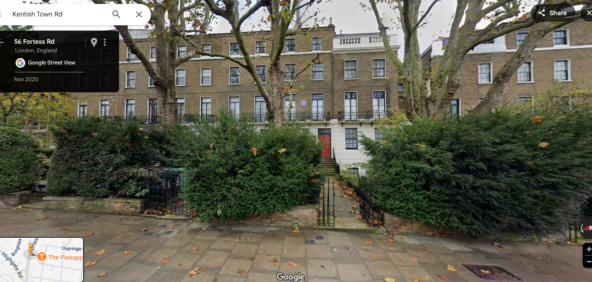
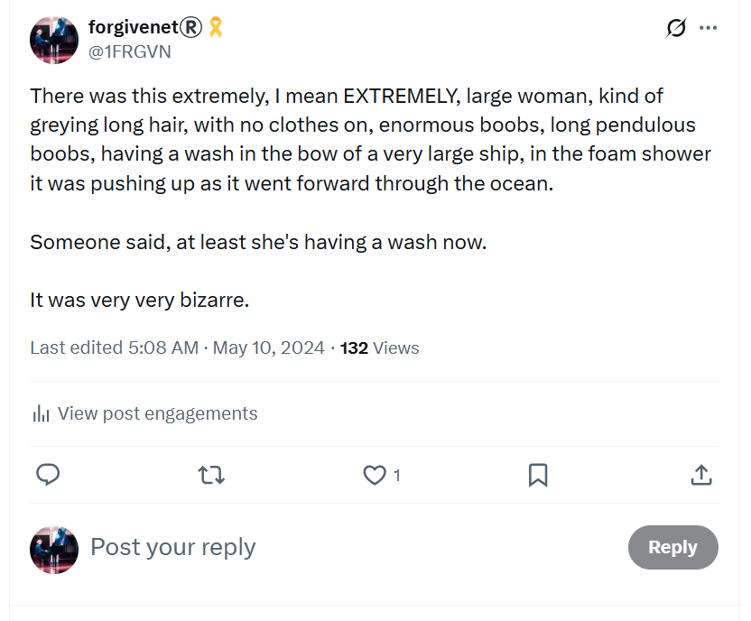
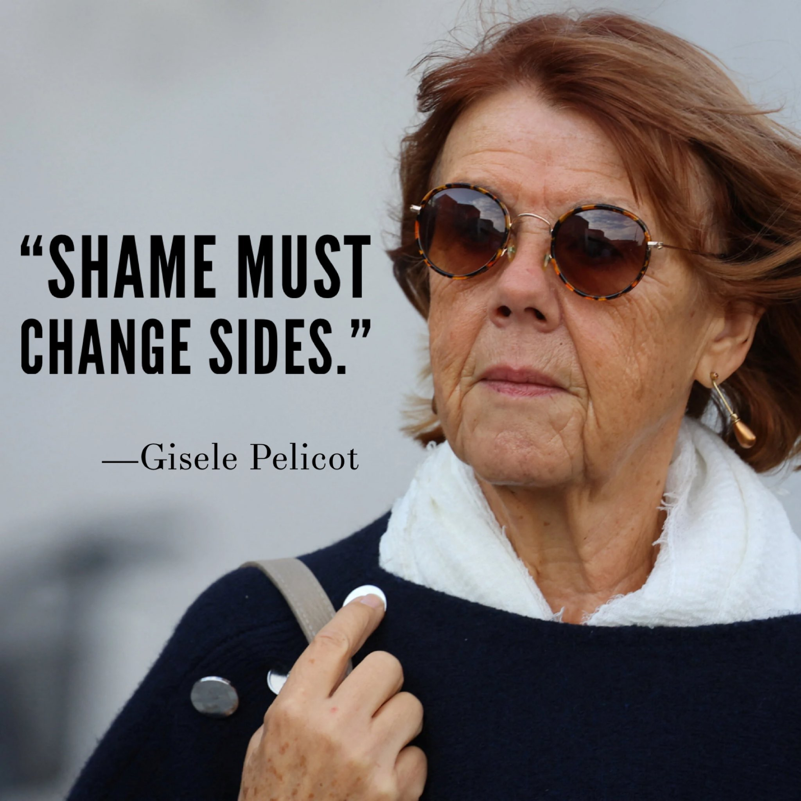

# 2007

## October

### Kabbalah conference

- I attend a Kabbalah conference in Barcelona.
- Me and Inma are invited, but Inma doesn't come.
- It's amazing.
- It feels a bit like being immersed in an overwhelm of wisdom.
- I retained very little of it.
- For some reason, people got a bit cross with me at one point, and I'm still not sure why.
- I wondered if I mentioned Jesus too much, but at that time I wasn't interested in him at all, so I don't think it was that.

## November

### Hazel Smith

- I meet two women in Dénia via the U3A, Sandra and Hazel Smith - mother and daughter (apparently).
- I already knew Sandra from the [spiritualist meetings](../2001-to-2010/2006.md#dave-porter-on-guardian-soulmates). 
- Sandra was very keen that I meet her daughter; very keen, just [like Zoe BJ's mum](../early-years/2008.md#lingualink) was very keen I meet Zoe, and in exactly the same way.

#### Channel 4

- Hazel and Sandra remind me of two women, a mother and daughter I had seen in a Channel 4 documentary, aired in the 90s when I was living in London.
- The documentary told the story of a mother and daughter who "befriended" old and wealthy people with dementia, or who were close to death. 
- The women "somehow" managed to get them to change their wills - with the help of random strangers such as bookshop assistants for example - and then took all their money and/or houses when they died.
- Adult children of the victims were telling their stories on the documentary and it was appalling and sickening to learn that this sort of thing was actually happening in the world.
- I was horrified, in fact.
- One of the victims had lived in a North London townhouse, a bit like these, which the family lost ownership of.

- There was a strong suggestion that victims had been drugged, possibly poisoned, and there was even a suggestion of sexual activity with regards to the male *and* female victims and the younger woman. 
- The documentary went on to say that the two had actually been charged, and the case went to crown court; The Old Bailey I believe.
- Sadly, they were found not guilty and left to carry on.

#### I put people in boxes

- These two women in Dénia were *EXACTLY* like the two on the documentary, even down to the mother's headscarf.
- I'd just got back from the [Kabbalah conference](#kabbalah-conference) in Barcelona when they invited me out to dinner.
- I went along to a restaurant in Dutch alley.
- I was not surprised to hear constant references to them borrowing money, to suggestions they couldn't pay their bills, to them waiting for me to suggest I would help them out.
- I was silent and I did not mention my suspicions.
- Sandra, the mother, was involved in a "situation" with someone in the community she had borrowed money from and it was all a bit of a drama.
- Hazel was talking about how she was sleeping with a married man, a local Spaniard.
- She told me his name was Paco Sendra.
- I must have shown concern because she told me that it was OK, *she had him in his box*, she said.
- She then said, *I put people in boxes*.
- I had no idea what she meant by this but I assumed she was referring to some visualization technique she used to deal with difficult situations.
- Nevertheless, their behavior and everything they said made me more and more sure that they were the poisoning honey-trappers from the Channel 4 documentary I had seen in the 90s.

#### Club Havana with Raul Perez

- After dinner, Hazel invited me out for drinks and dancing at the nightclub on the Las Marinas beach, right behind Fernando's restaurant.
- We had both drunk an awful lot - well over a bottle of wine each - but nevertheless Hazel drove safely.
- Once there, we drank more alcohol.
- I remember she tried to get me to leave my handbag down unattended alongside hers. 
- I didn't.
- I didn't trust her.
- She wasn't around much for the few short hours we were there.
- I was dancing.
- No one in the club spoke to me.
- When I saw her again after a bit, she was chatting up a much younger bloke at the bar.
- The club closes and Hazel invites us (me, the man at the bar and his mate) back to her house.
- Hazel Smith, at that time, lived in the Rosaleda II urbanization in the Las Marinas area of Dénia. 
- During the vicious gang stalking between 2022-2024, a German friend of mine Alex (Alessandra) and her British partner John were living there too; people also implicated in everything that's been going on in Dénia and likely also victims.
- I strongly suspect Alex and John eventually rented Hazel's house; the one we all went back to.
- Hazel disappeared into the bedroom with one of the young men; a man who may have been Raul Perez, a future English student of mine.
- Looking back, this man appeared nervous.
- He never spoke, and I wonder now if he had been drugged.
- Myself and the other fellow left and walked home to our respective houses. 
- The slobberiness of his kiss goodnight when we got to my gate suggested he had been assured of more happening.

#### Hazel tries to kill me

- A few days after our night out, Hazel invites me for an Indian meal at the Rani Palace on the Las Marinas road.
- She tells me things over dinner that suggest she uses sex to get what she wants out of men.
- She mentions getting off a speeding ticket in Spain this way. 
- She tells me she had nearly been married once, but backed out at the last minute, but not before she'd got a car out of the man.
- She asks me if I liked the boy she left me with the night we went out, and the suggestion is in a sexual way. 
- I ask her if she is out of her mind.
- She's shocked.
- (People don't talk to her like this.)
- I then tell her that I had only recently remembered serious child sexual abuse, and I had reported it to the police in North London and that, at that time, my life was all about healing.
- Her demeanor changes completely.
- She becomes weirdly angry,  upset, and aggressive towards me.
- I figure I've hit a nerve with regards to something similar that may have happened to her as a child.

!!! danger "Another interpretation of Hazel's words and anger"
    - Was Hazel's anger actually due to the fact I was clearly unashamed of what had happened to me, and was happy to share the information?
    - Had she planned on exploiting or blackmailing me with the child gang-rape porn videos she had of me and a level of shame - that I did not have - was required for her success?
    - Were all her lack-of-morality talking-points used for gaging how easy it would be to get me into situations with men in which I would be vulnerable to more abuse?

- We paid, and when the waiter brought the change, she threw it at me as if she was disgusted!
- She then asked me back to hers for a drink and a smoke. 
- I agreed. 
- I did not smoke pot, but I had a few puffs. 
- She explained she was a pot addict.
- She gave me a drink and, soon after, I started to feel extremely woozy and heavy.
- We were listening to Comfortably Numb by Pink Floyd and I remember singing along a little.
- At some point she declared loudly I was to get up from my chair, she was taking me home.
- I dragged myself up, and staggered speechless into her car, with her help, and she drove me to my apartment building.
- She leaned over me to open the door from inside the car and shouted "get out". 
- She may have pushed me. 
- She may have had to push me.
- I managed to get out of the car and into my flat and into the bathroom.
- I probably vomited.
- I then lay on the cold tile floor, completely still, unable to move or speak, for about 6 hours. 
- It was winter and I believe the vomiting and the cold tiles kept me alive.
- I knew that I had been sedated with an extremely strong drug, poison, or anaesthetic.
- It was horrifying and overwhelming.
- I was unable to go to the police about it.
- I made excuses in an email, pretending I was concerned about how much I was drinking, and I never saw her again. 
- Well, I did see her one other time, in passing.
- She was standing up and reading a magazine at the Carrio bar in the Calle Diana one morning when I was walking past.
- This is the sort of thing I know now that stalkers might do to "present" themselves to their targets for some sick and convoluted reason.
- *Remember: I haven't forgotten about you*, or something like that.
- In any case, as I came round from whatever she had given me that November morning, I was 100% sure that Hazel and Sandra Smith were the two women I had seen in the 90s Channel 4 documentary, and that they were still active.
- I wondered if having that sort of power over people was addictive.
- I believe she probably decided to get rid of me because our shared-trauma-experiences were a bit of a challenge for her, and because I had reported the offenses to the Metropolitan police already, and regardless my death would mean my brother inherits, and they already had their clutches deep in him, he was easy... and, of course, she had gotten a taste for murdering people.

#### Tax accountant for the British elderly ex-pats

- It horrified me that Hazel was working as an accountant and financial adviser for hundreds of British pensioners knowing what she was capable of, as if it was as normal as breathing.
- Over subsequent years I saw her advertising talks and seminars for the British expat community, via the U3A and similar. 
- A few times I saw her on social media she had been listed under a company name, Smith and Sendra.
- While we were out drinking, Hazel had talked about her time on P&O cruise ships as the ship's accountant and mentioned how it was a "long way down" if you had fallen from deck on those boats.
- The implication made me shudder.
- I may have even dreamt something about it.

- Is her real name Fiona?
- And I never told a soul until [September 2024](../2024/september.md#lourdes-with-dad).

!!! info "Why am I telling you all this?"
    - There is so much "normalized" sedating and poisoning in Dénia, it seems there must be a connection.
    - In September 2023, when I stubbornly returned to Dénia to continue my piano studies after having been severely terrorized by teachers and staff at the conservatory, the gang stalking got exponentially worse.
    - Specifically, the online stalking on social networks was suddenly delivered in native vernacular English.
    - It was intense and overwhelming; a mix of sexual grooming, hypnosis, NLP suggestion techniques, and threats of violence and murder.
    - Furthermore, the illicit drugging and poisoning that was going on without my knowledge also intensified and exaggerated the emotions triggered by the online content I was seeing; fear, sexual arousal, euphoria, anxiety, on a loop. I can see this now in retrospect.
    - Fake accounts that interacted with me knew things only Hazel could know. 
    - And indeed the stalkers/hackers mentioned her many times in our bizarre exchanges. 
    - They even created a fake X account with an AI generated profile photo which looks to be a mix of mine and Hazel Smith's face. 
    - Note the name: "Connie".
      
    
      
    - I realize, years later, I can see in this image [Simon Gaskin's photo of me](../2026/february.md#groomers) - the photo that [North London rape-gang professional Winston May]() has an original copy of - and that's how I saw myself in it.

!!! danger "Old Bailey"
    - I have searched extensively for the documentary and cannot find it.
    - I contacted the Channel 4 archive about it and the staff member, *Dom Halloran*, said they would not be able to help me. 
    - The name is startling, don't you think? Could it be fake?
    - In any case, there will be records of the case at the Old Bailey, even if the documentary has been pulled.
    - I wonder how many people might have been saved if the info about these two had not been suppressed.

!!! danger "In retrospect"
    - Writing this statement has brought a lot of old memories to the surface.
    - I wonder if, while at dinner with Sandra and Hazel in 2007, they managed to turn the conversation around to me playing the piano, and I can hear Hazel saying at that moment, "Oh, Domingo plays the piano doesn't he?" to Sandra, who then told her to shush.
    - I then asked who's Domingo and they said oh just someone from a family we know.
    - This points to me being targeted long before I mentioned the sexual abuse to Hazel and implies they already had their conspiracy planned out.
    - The criminals of Dénia, Domingo the piano teacher, his family and friends, the trumpet teacher team, and the online hackers, have a habit of informing you about what they're doing long before you could possibly know about it.
    - The must get a sick little kick out of that.
    - How did the criminal gangs of Dénia know about the child rape-gang porn from 1989 and get access to it, and from whom?
    - Are Winston May and the North London rape-gangs co-conspirators?

## Rewards offered

- I have no doubt that footage will come to light now as it must have gone around to many, many people over the last 35 years.
- I'm currently offering a substantial reward for any files of pedophile rape-gang porn where the offenders will be predominantly black males.
- I'm also offering rewards for any Dénia, sedated or otherwise, spy-cam porn from my flat in Carrer Furs, my flat in Joan Fuster, and any other addresses, and from my hacked devices.
- I'm emotionally and psychologically prepared to see all of it; thanks, ironically, to spending 3 years in the psycho-sexual-emotional warfare trenches of Dénia, and being a target for gypsy poisoners internationally. 
- I believe that women who stand up to sexual abusers with the boldness and courage that comes from full knowledge that they are innocent, like Gisele Pelicot did in 2024, can heal the world.

## Javea Computer Club

- Around this time I join the [Javea Computer Club](https://javeacomputerclub.com/). I am introduced to Christine, the chair at the time, by a member of the U3A.
- Christine and I become friends and she is very supportive of my PhD efforts.
- The club is extremely busy in the years I visit, 2007-9, and 2012-13.
- It is now not so busy.
- At some point in 2008, I believe, Christine insisted I borrow one of their computers. I had no need for it at all but she pushed it on me. I wonder why now. I borrowed it for a while and returned it. I often walked around naked in my flat in front of it. I wonder if there was a camera inside. I was only on a 56k modem at that time so I can't imagine they would be live streaming. 
- I wonder if the JCC is another central point where incoming expats to the region are assessed for targeting, i.e. how much money they have, if they are sensitive or vulnerable, etc. 
- The reason I wonder about this is because my "friend" Christine pretended she knew nothing about what was going on in 2022-24 but, in fact, everyone knew. She threw me to the wolves.

