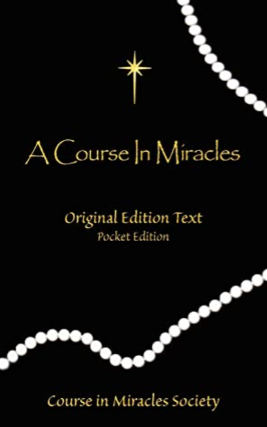
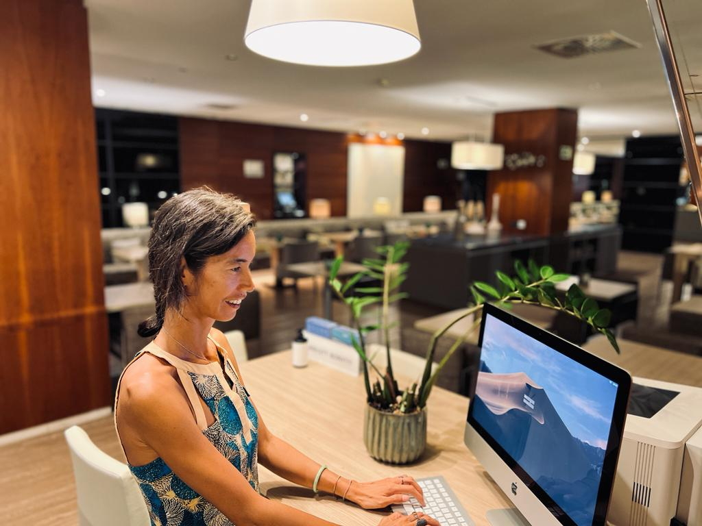
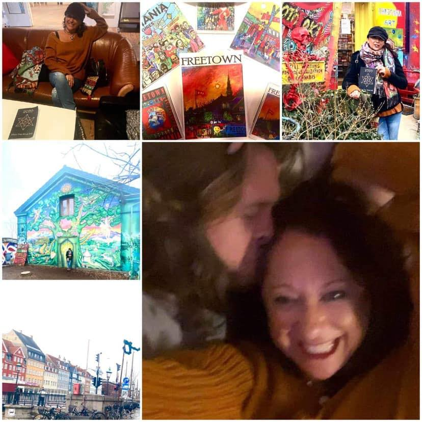
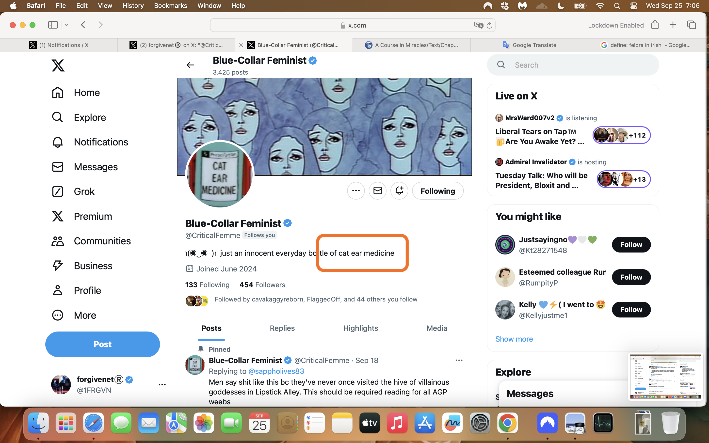
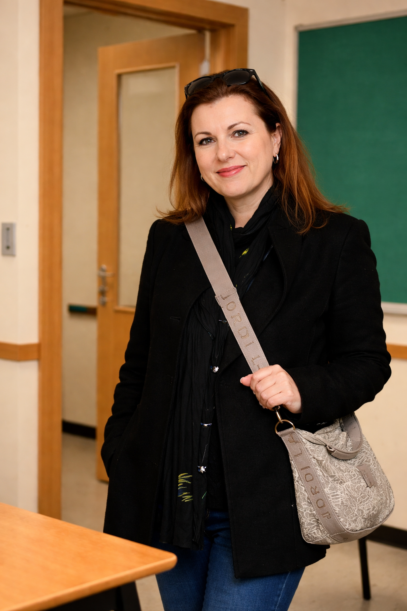
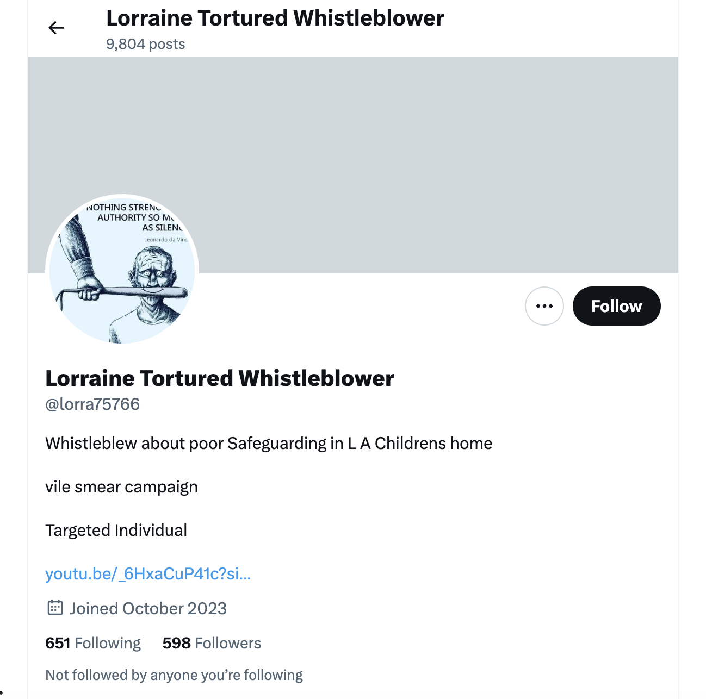

# 2008

## A Course In Miracles

[{width=36%}](https://en.wikipedia.org/wiki/A_Course_in_Miracles)

- I never saw Hazel Smith again after [she tried to murder me and failed](2007.md#hazel-tries-to-kill-me), apart from that one fleeting time I mentioned in that section.
- And one other time [outside the conservatory in 2023](../2023/october.md#hazel-outside-the-conservatory) after I started tweeting information about that dreadful night that only she should have known about.
- I did, however, see her "mother" Sandra a couple of times.
- On one occasion she picked me up from outside my house in Cami Llavador and we drove over to Javea to attend a kind of "spiritual" event.
- Hazel and her cohort never do anything without some dark intention so it's very unclear why she would have been so keen to take me there, unless it was an opportunity for a drugging top-up if that was going on back then as well.
- Anyway, at the event there were two speakers; a mystic-meg-type psychic from Bulgaria, and Trudy, a Dutch yoga teacher, who was giving a talk about A Course In Miracles.
- The psychic was extremely giggly and silly, and I was not impressed by her.
- She found me equally unappealing due to my suspicious attitude towards her and was even physically violent towards me, although, I now wonder if that could have been a [distract and drug](../2024/august.md#distract-and-drug-activity) event.
- The talk that Trudy gave on A Course In Miracles totally blew my mind.
- As she began to describe what the book was about, the room erupted.
- Holy war kicked off fiery arguments and angry debates about God and religion.
- People were getting offended left right and centre.
- I couldn't believe it. It was utterly unexpected and a little insane.
- But whenever I looked back at Trudy, she was calm and collected. And everything she said was *exactly* the right thing. 
- She never reacted. She always responded calmly, and she never exacerbated the chaos around her. Rather, her words had a curious power that extinguished the flames of anger.
- Whatever she had, I had to have it too!
- I ordered the book immediately, and from the moment it arrived it has been the only book I'm able to read...
- I wonder about that too now, and whether not being able to read is another effect of brain-damaging drugs because I stopped reading books completely around that time.
- I used to be a voracious reader but now reading feels like *looking inside people's heads*, and it's rarely a pleasant view.
- I have been studying A Course In Miracles every day since then.
- A Course In Miracles, to me, feels like the key to the door out of hell.
- Like Jesus Christ himself came down and showed me where to find the door out of hell, and handed me the key to opening it at the same time.
- The astonishing irony is, of course, that Sandra Smith took me to that meeting.
- And more so that my own thinking started to mirror that of the wicked witches around me, but in a completely orthogonal manner, as it were.

## The Chi Kung course at the monastery

- I kept a fairly low profile in Dénia although I did attend the U3A events and anything interesting that might come up locally.
- There were zero opportunities for boyfriends, although I attended meditations and retreats at the Buddhist centre and I met some of the local British expats.
- I traveled frequently to Madrid to see my PhD professor.
- I believe one of the expats I knew, Katie, told me about a Chi Kung course up at the Buddhist monastery in La Sella.
- I signed up.
- A lot of people came; easily around 100.
- The *master* gave a talk about how he was a healer and had healed many people of serious diseases.
- At one stage, a black British woman stood up and started having what looked like an epileptic fit and fell to the ground and shook herself violently.
- The *master* comes over and *heals* her.
- It was all a bit weird.
- I believe I saw this man again in 2023 having coffee with his wife who turned out to be [the acupuncturist who had told me I had diabetes and must go to my GP urgently](../2023/june.md#last-session-with-the-acupuncturist)!
- Is Dénia a haven for scammers for some reason?
- When I think back, they charged me 330 euros for the non-residential weekend, which I thought was extremely expensive but it was *WHAT IT SAID ON THE WEBSITE*!
- I assumed, therefore, everyone had paid the same, but looking back most of the people there were unemployed drifters, housewives, and students like myself.
- No-one spoke to me, either.
- I guess they had been *warned off*, as usual.
- We did have a very nice professionally-cooked caterer's dinner, however.
- I guess I paid for it.

### Parallel patterns of lying between Hazel and the acupuncturist

- You may remember me mentioning that whenever I looked Hazel Smith up on Facebook after [she tried to murder me](2007.md#hazel-tries-to-kill-me), I saw references to her accountancy company with offices in the Marquis de Campo, [*Smith & Sendra*](2007.md#tax-accountant-for-the-british-elderly-ex-pats).
- She was offering tax accountancy services and more for the British in Spain, mainly pensioners, and the realization that she therefore had access to hundreds of vulnerable people's financial details made me shudder.
- I remember seeing a complaint on her *Smith & Sendra* Facebook page from a man with an Islamic name: comments that she had sat on his accounts for months and done nothing.
- I believe this was a fake complaint and there was likely no formal Spanish business at all.
- The Facebook page is where I saw her advertising talks with the U3A on how British pensioners might manage their finances when living in Spain.
- I believe the U3A had nearly a thousand members in 2008; with a majority of homeowners.
- One time, Hazel posted pictures of her "office" with all her staff.
- If you looked closely, you could see the office was completely new and bare. 
- It had desks, chairs, computers, and phones, but nothing else.
- No one was doing any business from it, that was for sure.
- She had a bunch of young people sitting at the desks - local stalking-performers no doubt - pretending to type while looking intently into the screens.
- My guess is she got everyone into some random office for rent under the pretext of viewing it, and snapped happy.
- A picture on ThaoQi's website is wholly reminiscent of this, although this looks like a conference center or hotel even.

## Meeting Zoe's mum at LinguaLink

- I start working part-time as an English language teacher for [LinguaLink (now LinguaLogic)](https://lingualogic.es/).
- LinguaLink is owned and run by Lorraine Blackbourn and her partners, a British ex-pat couple.
- I teach a class on a Friday evening.
- An older woman, Theresa, teaches another class which finishes at the same time as mine.
- Theresa is very active in local Christian groups, churches, the Salvation Army, and such like. 
- She also attends local clubs such as art classes, etc.
- She invites me for a tea after work one evening.
- I remember not really wanting to go, and declining, and then being urged into it.
- At tea, she quickly tells me she has an adult daughter Zoe Braganza Jones who is around my age, a little older perhaps, and she thinks we should meet.
- Turns out, the whole meeting is about her persuading me to meet Zoe.
- I make excuses.
- However, the woman seems nearly desperate I meet her daughter Zoe.
- It's weird and reminds me of Sandra Smith's insistence that I meet her "daughter" Hazel.
- I'm reluctant because of [the attempted murder incident](../2001-to-2010/2007.md#hazel-smith).
- Zoe's mum mentions early on how Zoe and a woman called Hazel had gone walking in the mountains; but after that one time none of the Braganza-Joneses ever mention Hazel.
- I vaguely remembered Sandra Smith mentioning Zoe too.
- I am extremely reluctant to meet Zoe, and I believe I am keeping my guard up the whole time I know her.
- I tell Theresa I'm too busy, or whatever.
- However, Zoe's mum is relentless.
- She orders more tea.
- I'm ready to leave but she won't let me.
- We talk, and talk some more.
- She goes to the toilet. I go to the toilet.
- She looks at her phone a lot during the conversation.
- Eventually, worn down and eager to go home, (drugged a little maybe?), I agree to meet Zoe and Theresa gives me her number and says she'll give Zoe mine.

### The woman who only wore a sarong on holiday

- Theresa tells me and Zoe one day I went over for lunch she knew a woman who went on holiday and only wore a sarong.
- She kept saying it, repeated.
- It was strange because I felt she was referring to me in Mallorca in 1999.
- Why do they do that?
- Are they trying to free themselves from abject misery and slavery, even without meaning to?
- Is it a cry for help?
- Is it the loudest cry for help ever heard in the whole universe?

## TEFL at Regent's Park London

- Bree, attendee, friend associate of [Dave Porter](2006.md#dave-porter-on-guardian-soulmates).
- wip, if I could be bothered
- wip then
- Definitely worth a look tho.

## Zoe BJ

### The Zoe Braganza Jones timeline

- I'm adding the whole timeline of the Zoe Braganza-Jones story to this section, although it spans many years from when I first met her in 2008 until the last time [I saw her in 2024](../2024/july.md#zoe-and-the-transvestite) just after I ran for office in the UK general election and while I was still being drugged, poisoned, sedated, raped, and live-streamed onto subscriber porn networks from my apartment in Carrer Furs Dénia and elsewhere; something the whole town, a vast international porn-addict community, and even my work colleagues knew about... while I had no idea.

### First meeting with Zoe

- It's early 2008 when I meet Zoe for the first time.
- We go for coffee.
- She spends a great deal of energy lauding the benefits of prostitution.
- I'm pretty horrified.
- It's the usual, "oh high-class hookers have a great life", type thing.
- I wonder if she is trying to justify something she does herself or if she is truly that ignorant.
- Or is she trying to groom me?
- I remember her telling me repeatedly how men are "visually" sexual, not like women, "aren't they Katie?" 
- It was such an overly repeated statement I added it to a book I was writing in 2012 as an example of incorrect thinking.
- I now realize it was a justification for porn.
- She has a teenage daughter Asia she is trying to get into "modelling".
- I find this very troubling at the time, more so now.
- I wonder if Asia is safe and well.
- Hazel Smith is all over our conversation, but never formally mentioned.
- I wonder why Zoe doesn't mention Hazel as her mother had done. 
- Anyway, Zoe and I remain friends.
- I rather liked her company, except for the things she would say sometimes, which were excruciating.
- I wonder, if like with Domingo in 2014, meetings with these people include some kind of relaxation technique, especially if you're not believing the BS.
- When I moved back to Dénia in 2012, after meeting her again at [Barbara Loftus's wedding](../2011-to-2020/2012.md#barbaras-wedding), I rekindled our friendship.
- We hung out a bit; we were both writing books at that time and so had a shared interest.
- Nevertheless, she would say ridiculous things at times, often, and it made my head hurt.
- One thing did surprise me.
- She supposedly had a degree from Sussex, but she had *no idea* about basic word processing. 
- It was a little incongruous and for that reason, I find the Sussex degree questionable.
- One afternoon in 2012, on one of our lunches at mine while we were both writing books, she brought up the Islamic rape gangs out of the blue, just like Luke her brother did.
- Were they researching reactions?
- Is the world-famous Dénia criminal porn studio intimately connected to the British Islamic rape-gangs through their North London co-conspirators?

### Meeting Luke Braganza Jones

- My brother visited me for a weekend in Dénia in February 2008.
- It was his idea, curiously.
- Given he was controlled by North London criminal gangs at that stage who were extracting his money from him via a tailored drug addiction, I have to wonder if they recommended visiting me to him, like they will do with my father in 2013…
- While he was with me, we became mates again, after a long time, and I suggested he come on detox with me in Thailand in the summer and he agreed.
- We went out on the Saturday night and got drunk.
- While we were out drinking, someone stole his passport in a very dodgy nightclub on the Las Marinas road and we had to go to the British consulate in Alicante the following Monday to sort it out.
- Luke, Zoe's brother, was in the club that evening, and he introduced himself. 
- I hadn't met Luke before, and didn't even know he existed, but he explained that he was Zoe's brother.
- The three of us went back to mine together on Luke's scooter - it was 100 metres up the road.
- Luke stayed a short while at my apartment in Cami Llavador with us, chatting.
- During this miniscule time we met him, he specifically mentioned an Islamic gang on the Arenal raping a young white girl.
- My reply to him was ill-considered, unexamined, and utterly abhorrent; and I didn't believe it either.
- Maybe he remembers.
- I'm too ashamed to tell you.
- It did serve to help me understand the world a little better, and realize that at some level we all need to purify our beliefs and weed out the lies.
- I have to wonder if anything else happened that night I'm unaware of.

### Zoe's "sick" friends

- Zoe always had some sort of scam on.
- I never initiated any appointments with her; she always suggested meetings or events.
- I thought it all rather harmless, at least the beauty product stuff seemed so.
- She did introduce me to a couple of "sick" friends she wanted me to meet which in retrospect deserve a short word.
- There was one young man, apparently a good friend, blond boy, who came into her apartment on crutches, actually.
- Zoe explained the boy was sick with some "condition" that meant he was always suffering; I can't remember what it was.
- I tried to talk to him, but he was a bit wooden when it came to the ole acting.
- I think the idea was I was going to feel sorry for him and give him all my money, or something.
- Then there was an older woman; she had survived breast cancer apparently.
- Zoe was *very* keen I met her.
- The woman even made sad begging eyes at me one afternoon.
- It was all a bit ... well ... tiresome.
- I did try to keep my distance.
- I guess I made a good target because I was able to socialize well with extremely dishonest and disagreeable people.
- This also ensured I would only question dubious things later on.
- The perfect lure.

### Meeting Zoe's dad

- One Sunday I was invited round for lunch.
- Zoe kept saying, *my dad wants to meet you*.
- I think it was in early 2013 and probably just before [I meet the trumpet-teacher for the first time at Elke's workshop](../2011-to-2020/2013.md#daniel).
- So I went over for Sunday lunch, and we hung out a bit, and there was this event on the horizon, "meeting Zoe's dad".
- I didn't know why he wanted to meet me.
- I didn't notice she was making a *thing* of it, as if it was important, like an interview.
- He stayed in the background that day until the evening.
- We kept hearing him roaring at something, maybe the TV, in a back room.
- I took it he was a bit volatile and certainly that's how Zoe always described him.
- Anyway, it came to evening time and it was time to "meet Zoe's dad".
- Zoe is standing a little bit away from the sofa where he's sitting.
- She motions me to go over and sit down next to him.
- I've had a glass of wine maybe, or something; I'm relaxed.
- I don't think anything strange is happening. My guard is down.
- I sit down on the sofa next to him and say hi.
- He reaches for my ear.
- I flinch back and he says, *oh I thought I saw something*, and reaches again.
- I don't remember another thing about this evening.
- Could this have been a preliminary test of some sort, to see how my body reacts to the sedating drugs?
- I guess I passed.

#### Worst ear infections of my life

- I'm not sure if this was the first time I had been sedated, or if there was an early occurrence at Cami Llavador.
- Shortly after first drafting this section, I started to get an ear ache which was painful for a few days.
- I remembered I had suffered the worst ear infection of my life in the winter of 2008.
- The ear infection was so bad, my eardrum perforated.
- It went on for weeks and weeks, and I think it only got better when I went back to London at Christmas.
- For that reason, I think it's possible there was an ear sedation event sometime before I *met Zoe's dad*.
- And I think this event, and perhaps the beginning of sedated events at Cami Llavador, were the precursor to me deciding to leave Spain; because the body always knows.
- The only other time I have ever had an ear ache and infection like this one began on the day that Noah Donohoe disappeared in Belfast.
- And, of course, someone was trying to tell me in 2024 about how the gangs were drugging me without my knowledge.

### Taking a nap at her family's mansion

- I visited her family home a few times over the years 2008-2013.
- It was a big villa with swimming pool in the country near Pedreguer.
- Her dad had been a roadie for Cat Stevens; at least that was the story behind the money.
- I enjoyed Zoe's company, even though she said ridiculous things, and I loved their little dog Lola(!).
- I remember getting giggly with her! Like I had smoked pot, but I hadn't, and didn't.
- One afternoon, probably in 2013 sometime, I was invited for lunch at the mansion.
- Zoe's dad was not there, as far as I was aware.
- After lunch, Zoe put mattresses down in one of the little guestroom outhouses, and insisted we had a nap.
- I thought it was a bit contrived but entertained her.
- I have to wonder about this now given the wider story.

#### Dreaming we were a lesbian couple

- Shortly after the [nap event](#taking-a-nap-at-her-familys-mansion), Zoe tells me that her dad had a dream about how she and I are a lesbian couple and I pay for everything.
- He told the whole family at breakfast, apparently.
- Zoe giggles.
- I'm pretty disgusted at the thought of it, but more so that she would tell me such a gross thing.
- My mother also found this rather sickening too.

### Telling Zoe and her mum about The Liar in the kitchen

- I had just published my book [The Liar](../2011-to-2020/2012.md#the-liar) and was thinking about how to market and talk about it.
- Zoe had also published a book so we often discussed these things.
- One afternoon, I gave a short explanation to Zoe and her mum in their kitchen about what I was trying to do with the book.
- It may have even been [nap day](#taking-a-nap-at-her-familys-mansion).
- I drew out some ideas I was having about how to explain what I was trying to tell everyone.
- It seemed to me as if they were trying not to laugh at me; probably on purpose.
- I gave up talking about it to people after a few reactions like this.

### Yasmin falls asleep with her eyes open

- One Sunday evening in late 2012 or early 2013, I visited Zoe at her house in La Xara.
- We may have had Sunday lunch at her family's mansion and then gone for a walk in the countryside and ended up there afterwards.
- Yasmin is Zoe's younger daughter and she was 10 at the time.
- Zoe leaves Yasmin and I on the sofa while she pops out for milk and juice.
- Yasmin and I get on well; she’s a lovely girl, and we were chatting and laughing while Zoe was out for about ten minutes.
- It was early; around 7pm.
- When Zoe comes back from the shop, she gives Yasmin a small carton of fruit juice and tells me to come into the kitchen.
- Five minutes later, I notice Yasmin is sitting quite still on the sofa with her eyes open.
- I go over to her, but Zoe pulls me back saying *don't wake her up, she's asleep*.
- Yasmin's eyes are wide open.
- She looks wide awake.
- I'm a bit shocked.
- Zoe says, *oh she always sleeps with her eyes open*, as if it was totally normal, *she's done it since she was a baby*.
- I'd never seen it before.
- I knew a woman once, the mother of a girl at Henrietta Barnet school, who would fall asleep with her eyes open all the time; but you always knew she was asleep.
- This was different, Yasmin looked wide awake, her eyes wide open.
- But Zoe told me casually that Yasmin always did that, it was normal, and I had no reason not to believe her.
- As I'm leaving, I walk past Yasmin and it looks like she's staring right at me.
- It's unsettling.

### Dubai

- There was a period of time time when Zoe was going on constantly about her much younger sister's new *man*.
- I believe this was around the time I moved back in 2012.
- He was an older man, in his late 50s; an Arab from Dubai. 
- And a billionaire.
- He had invited the *WHOLE FAMILY* out to Dubai for a few weeks.
- Five or six of them flew business class and stayed in a villa at the Palm resort; all expenses paid.
- Zoe made sure we were aware that her sister was not marrying this man; and that he wasn't her boyfriend either. 
- This was important for us to know, for some reason.
- The whole thing was important for us to know, for some reason, and we heard it on a loop while it was going on.
- The implication was that the billionaire was being generous for sexual favours, but it was all too much for that.
- The sister got married a few years later, I believe, with an age-appropriate Arab in Dubai; although she had been hanging around the Ibizan yacht scene for some time before that and Zoe had expressed continued concern for her safety.
- There was never a good explanation for the trip, and I always remember incongruous things.
- Did Hazel Smith join them? I guess that's unlikely.
- Perhaps the criminal gangs of Dénia sent Zoe's dad - well-known friend of famous Islamicists - to do business with the Arabs.
- The seduction tech was already fully functional, as I had noticed after the [Dave Porter](../2001-to-2010/2006.md#dave-porter-on-guardian-soulmates) affair some years previously.
- Were the Arabs ready to do business after seeing more powerful demos of the manipulation tech; such as [Alessandra's phantom illness which prompted her to undergo a full bone-marrow transplant](#asking-zoe-about-alessandra), or [Lorraine's daughter's transformation into a trans man](../2011-to-2020/2013.md#lorraines-trans-child), one of the first?
- Did Zoe's dad sell the manipulation tech to the Arabs on that trip?

### Horse riding with Zoe's friends

- A little while after the Dubai trip, in the summer of 2013, Caroline England - Zoe's friend who [I won't see again until the day of Lorraine Blackbourn's funeral](../2021/july.md#lorraine-blackbourn-commits-suicide) - invites me to go horse riding at a riding school up in the valley.
- The school is run by a British woman and is out near Benimeli somewhere.
- Caroline is a co-conspirator of some variety and certainly knows what's been going on.
- I remember on one occasion she asked me; "Did you [meet Zoe's dad](#meeting-zoes-dad) then?", like it was a *thing*, which I expect it very much was.
- Anyway, at the ranch, I find myself utterly allergic to horses, but they seem to like me.
- What I found strange was how Caroline and the British woman kept saying the following:
    - "Oh Zoe is so lovely looking, don't you think?", said one.
    - "Yes, she is isn't she, so attractive.", answered the other.
- It felt like they were waiting for me to comment.
- I didn't.
- It felt like someone had been telling salacious lies about me and Zoe and I remembered [her dad's dream](#dreaming-we-were-a-lesbian-couple) but not [the nap](#taking-a-nap-at-her-familys-mansion).
- Were these two aware of the sedated sexual assault for porn scam, popular with the region's crime families?
- Did they know this had already started happening to me at my apartment in Joan Fuster, if not in Cami Llavador as well?
- Why were they instructed to say these weirdly contrived statements, by whom, and for what purpose? 
- I wonder if it was to do with finalizing any friendship I might have had with Zoe so that the main porn-gang employees, made up of teachers and staff the conservatory, could start moving in?
- I guess they could have also been researching my reaction to horses, because of the horse porn the region is most famous for.

### Lauding male violence

- The death knell in our relationship came one afternoon not long after that when we went to the beach for a picnic with her younger daughter.
- This would have been in the early autumn of 2013.
- Zoe spent the whole time talking about her ex-boyfriends; the violent men she had been in relationships with.
- The whole time.
- Every relationship she recounted was a tale of bitterness, sadness, violence and violation.
- Her daughter listened eagerly.
- I was horrified.
- It was when she started to retell the relationship she'd had with someone where they'd both been self-harming, I reached my limit.
- I had to try to reset the tone somehow, and bring back some love.
- I told a story about an ex-boyfriend who had really loved me.
- Zoe's daughter's face went from frowning to smiley.
- I explained that this man had loved me so much, he even loved my farts.
- Zoe starts to get uncomfortable.
- I explain that whenever I farted, on those rare occasions, he would grab me and put his nose right...
- Zoe stands up, and starts shouting; "Stop stop!"
- "That's enough!", she says, implying that she doesn't want her daughter to hear any more of this story.
- I'm flabbergasted.
- How can a loving and intimate story - yes a little crazy - upset Zoe so much, especially when she'd just spent the last couple of hours relating every violent exchange between her and her multiple ex-boyfriends.
- I was trying to present an alternative view to her 11-year-old daughter.
- The interaction made my head hurt so much, I couldn't see Zoe again.
- But I mean, it REALLY hurt my head, in a way that suggests to me the drugging had already begun.
- I couldn't explain her behavior sufficiently to myself so that it made any sense either.
- However, in 2026, in the light of everything we know now, I wonder if she might have been recording our conversation, and for some reason, what I was saying didn't fit.
- Was it too endearing?
- Was Zoe horrified that someone might change their mind about me through loving tales such as this one?
- Or were they still trying to groom me into some weird relationship where I would be frightened and hand over my money?
- Or maybe the whole intention of the meeting was to be so weird that our friendship would end.
- Is that what happens when the porn-gangs are given the green light from above to start entering a woman's property and set up spy-cam and sedating tech; all the *introduction agents and shepherdesses* drop away and disappear?
- It was just after this that I taught the English class with Lorraine and I meet [one of the switcheroo trumpet teachers](../../crimes/protagonists/vidal-sastre.md#mark-from-english-class-in-2013) for the first time.

### Zoe with another target

- It's a calm and balmy Sunday evening in January 2014.
- I'm living at Passeig Periodista Ramon Ortega.
- I'm at the marina taking pictures for my book cover: https://www.amazon.com/Forgiving-Unforgivable-Removing-Obstacles-Love/dp/1497308216/.
- This is the picture I take:

- As I start walking back home, I bump into Zoe BJ.
- She is with a Spanish woman of a similar age to us that I have never seen before, nor since either.
- The woman may have a Madrid accent.
- Zoe and I are no longer friends so we don't talk for long.
- I'm dubious about this chance meeting for some reason.
- I watch them walk off up the marina together chatting.
- Did Theresa meet this woman somewhere, the church maybe, or art class, and invite her out for tea and insist she meet her daughter?
- Did Zoe introduce her to me so she would remember my face later on when it was *her turn* instead?
- Or was Zoe *showing* me to her; the latest sedated rape victim, live-streaming for the locals and international subscriber porn-networks?

### Asking Zoe about Alessandra

- Apart from ["bumping into" Zoe with the transvestite](../2024/july.md#zoe-and-the-transvestite) in July 2024, and again ["bumping into" Zoe and Marie](../2022/june.md#meeting-zoe-and-marie-while-walking) in June 2022 when Zoe's tells me about Lorraine's suicide - both meaningful and significant set-up events - I didn't see her again.
- However, when I was back in the UK, probably around 2017 while suffering from depression, I had contacted her.
- I had become unusually concerned about [Alessandra's health](../2001-to-2010/2009.md#alessandra-gets-sick-or-does-she) as she had undergone a total bone marrow transplant in or around 2010.
- I couldn't find Alex online at that time and I searched hard for her (I now suspect hacking interference).
- Eventually I tracked down Zoe on LinkedIn and I asked her how Alex was doing.
- I got a reply from Zoe that Alex was OK and that was enough for me at the time.
- I now believe Alessandra was never sick.
- I believe she was psychologically manipulated into believing she was sick, with drugs and online triggering.
- Initially, I thought a motive behind this could have been the surgeon's ambition - as in him needing a healthy test subject required for some prestigious and eponymous advance in medicine.
- We were told repeatedly about how important the man was - the very best in Spain - and how it was the first operation of its type in Spain too.
- Now I have to wonder if Alessandra served as an early demo of the manipulation tech for [the caliphate sale](#dubai).

### Hypno-tech gone mad

- When I looked Zoe up online over the years, at some point I noticed on [her LinkedIn](https://www.linkedin.com/in/zoe-braganza-jones-906b0914b/) that she was working as a hypnotherapist.
- She had been running a hypnotherapy centre somewhere near Dénia with a British man.
- I don't see him mentioned anymore.
- I find the hypnotherapy connection interesting in relation to our story's focus on online manipulation - hypno-tech as it were.
- This is the technology the porn-gangs of Dénia have been using to manipulate women and children for porn and prostitution for decades, and I experienced it personally at extreme levels.
- Although, I had to be drugged for it to have any effect; and that effect, for me, was pure mind-poisoning now 99.99% cleared.
- I do believe they manufactured the intensity of the reasonable depression I suffered from 2015-2023, which included inciting suicide attempts.
- Clearly, while no law enforcement agency thought the criminal pornography was worth doing anything about, the gangs safely expanded into pedophilia, baby-rape, setting up porn-studios in schools, hospitals, etc.; and then the mass manipulation of vast swathes of the world's population for various dodgy purposes (trans-ideology, pro-Palestine).
- Like I mentioned before, lies like these tend to take on a life of their own at scale, becoming utterly uncontrollable.
- Due to a collective psychological pathology - in that they are unable to do anything that doesn’t consist in “taking” something from someone to leave them nothing - there will be, thank God, evidence of this tech in server-farm logs all over the world... and ONLY where criminal porn-subscribers work and are available for blackmailing; the City of London tech-bro start-up world being once such hub.

## Dénia TV

- Sometimes, late in the evenings, I would flick through the TV channels.
- Usually I'd skip local channel Dénia TV because the signal was so poor you couldn't see or hear anything particularly well - my apartment was not more than a kilometer out of town.
- Also, if they weren't showing some weird porn on a loop, it'd be locals talking in a TV studio that looked like someone's garden shed.
- The porn on a loop was remarkable, however.
- A naked woman with long blond hair stood completely still and upright while two naked grinning men ran round her and entered her, one after the other.
- The original video lasted about two minutes, less even, and it was replayed over-and-over, week-after-week.
- I never considered the possibility the woman was sedated, but looking back she did indeed seem to be.
- She was unemotional, blank.
- Curiously, I saw one of the grinning men working in the VW garage; the short stocky one with ginger hair.
- Even more curiously, the woman may have moved in downstairs from me at Ricardo Ortega.
- Is Dénia TV how the whole town knows who's being sedated and raped?
- Do the porn-gangs supply the TV channel with a live spy-cam feed from people's homes?
- Is this how everyone knows what's going on?
- How can they be so OK about it?

## Cleargreen in Barcelona

- This was the year I met Elke Kopmann; a German woman living in Dénia.
- Elke ends up enslaved by the people of Dénia, probably from about 2018 - main-man manipulation again - and doing hard labour in the fields.
- Seems there's nothing these folk aren't into.
- She follows Carlos Castaneda practices.
- I had devoured those books when I was younger, again and again, so I was happy to know Elke.
- We became good friends although she stopped answering my texts and emails once she had properly gotten together with the modern-slaver.
- Cleargreen is the international Castaneda organization.
- They had a conference in Barcelona in 2008, which I attended.
- This was where I met [my German friend Elke](../2023/september.md#my-friend-the-german-translator) who has lived in Dénia for decades and knows Richard.
- We ate at the organic vegetarian restaurant off Las Ramblas on my recommendation as I had been there with [Lydie in 2005](2005.md#womens-self-esteem-retreat-with-sat-santokh) and knew it was good.
- After meeting her, I signed up for some weekly evening practices at Llunàtics and I attended some workshops she ran in the Hostal Loreto.
- In Barcelona, I shared accommodation with a bunch of women.
- If I had been sedated and raped there, my roommates would have to have been sedated along with me.
- It is possible, I guess, because the "accommodation" was in residential apartments with the owners living there alongside us; not that difficult for the dedicated porn-gangs to have organized.
- This was the same trip on which my tiny elephant Eli suddenly had a little heart printed on his chest. It was rather peculiar.
- I met [Lydie](../2001-to-2010/2005.md#womens-self-esteem-retreat-with-sat-santokh) for a vegetarian meal while I was in Barcelona, and I introduced her to Eli (who I carried everywhere with me) and she noticed it first.
- I guess this could have happened when pornographers were entering our accommodation bedrooms without our knowledge.
- I also meet [Gammadian Freeman (Richard)](../2011-to-2020/2011.md#gammadian) there who takes a more prominent role in our porn-soaked story in a few years time.

## Lorraine Blackbourn

### Lingualink and the English Studio

- I worked with and for Lorraine Blackbourn between 2008-2015.
- While I was living in Madrid in 2005-2006, I had worked as an English teacher for a company called Hot English, so when I moved to Dénia I reached out to the local academies and was given part time work at Lingualink.
- I first met Lorraine at the [Lingualink academy (now Lingualogic)](https://lingualogic.es/en/) which she ran with a British expat couple who lived in Moraira.
- They had a spectacular falling out which might be interesting to find out about...
- Lorraine then set up her own academy, [the English Studio](https://www.englishstudiodenia.com/), and I worked for her there in 2013-2015.
- The company is still running today and is managed by her trans-identified daughter Jayden.
- Jayden, I believe, was targeted online by Hazel Smith's enterprise in 2012 or even earlier; arguably one of the first kids to have been manipulated online in this way.
- Lorraine was devastated about what was happening to her daughter in 2013, as you can imagine.
- I wonder if Hazel singled out Lorraine's daughter due to personal differences and the fact that [Lorraine might not have been entirely fooled by her](#lorraine-tells-me-about-hazel-without-saying-her-name).
- I believe, like [Alessandra's bone marrow transplant](../2001-to-2010/2009.md#alessandra-gets-sick-or-does-she), the main intention behind the manipulated transing of Lorraine's daughter was demonstration purposes.
- The parallels between Jayden and Alessandra are remarkable.
- I believe the criminal gangs wanted to demonstrate to the caliphate the power they had over young English-speaking minds and how better to do that than to convince them they were *born in the wrong body* and that life-changing surgery was necessary.
- And look what happened to that lie once it took off at scale!
- I considered Lorraine a friend and, even though she was somehow warned off me in 2015 while I was being sedated and raped in my apartment in Joan Fuster, I still consider her a friend and I am heartbroken that she committed suicide in 2021 just as I returned to Dénia after nearly five years away.
- Did Lorraine know what had been happening to me?
- Was she likely to warn me if she saw me back in the town?
- Is this why they bumped her off (manipulated her into committing suicide)?
- When I met Zoe's friend and co-conspirator [Marie Fielding or Henderson or whatever - scouse Marie](../2022/june.md#meeting-zoe-and-marie-while-walking), friend of [Ugly](../2024/august.md#ugly), in 2022 just before the conservatory switcheroo porn began, she told me that her daughter was now working at the English Studio for Jayden and had a contract.
- Is this the same daughter I saw in the photo with Ugly just a few days before [he drugs me in the street in Lourdes](../2024/august.md#distract-and-drug-activity)?

### Trumpet-teacher Marc studying at the Grupo Glorieta 

- Lorraine offered me some work with the [Grupo Glorieta](https://grupoglorieta.com/), a Spanish training company, from December 2013-March 2014.
- I taught two intensive English classes paid for by the European Union due to the unemployment situation in Spain at that time; a short two-week course in the evenings for those looking for jobs in technology, and a longer 12 week course.
- Grupo Glorieta only recorded the shorter evening class for tax purposes, but that was the more criminally interesting class in any case.
- In that class of mostly men, one of [the switcheroo trumpet teachers](../../crimes/protagonists/vidal-sastre.md#mark-from-english-class-in-2013) sat in the front row.
- His name was Marc, and I found the man attractive; there was some chemistry between us too, but I noticed his wedding ring immediately.
- Sitting next to him was a muscle man, and beside the muscle man a kind of older cowboy type.
- Lorraine was interested in which of the men in the class I fancied, and I told her. 
- She was surprised it hadn't been the cowboy-type sitting in front of me.
- I said no, I didn't find the cowboy attractive at all. But the guy sitting at the end of that row, next to the muscle man, yes, I found him very attractive.
- She looked up thoughtfully and said, "Um, but he's ..." and trailed off. 
- I asked her, "What is he?". 
- She said "never mind", and that was that.
- The man Marc looked a bit like Lorraine's soon-to-be-ex husband - same facial features, size and build - and I believe they are related.
- I remember a younger man in the class who was smart and keen.
- He was very polite and kind to me for the first couple of classes, and then, suddenly, he was rude and weird.
- I believe they drugged him. His behavior was unexpected and erratic.
- It reminds me now of the [erratic harmony teacher](../2022/september.md#harmony) during the switcheroo porn production at the conservatory who was clearly off his head in class.
- During the time I taught Marc, I was preparing to take the conservatory entrance exam.
- My guess was that meeting this man Marc in the class at this time was part of whatever they had planned in the long term, porn-wise for me, related to my conservatory attendance, and I wonder if Lorraine may have even been aware of me being a honey-trap target for the men in the town.
- Like, has it been a well-understood "thing" they do to foreign women as a rule?
- I wonder if there came a time when the porn-addict honey-trappers of Dénia - the ones everyone knows and loves - crossed a line that perhaps Lorraine and others could not adjust to?
- Was it the sedated spy-cam, gang-rape and incest live-streaming... or the industrial-scale baby rape I wonder?
- The fact that it took me 18-months to remember that I had taught and knew a trumpet teacher is yet more proof of the severity of the brain-damaging drugs and poisons I had ingested at the hands of teachers and staff at the conservatory and other local porn-gang operatives.

### Lorraine tells me about Hazel without saying her name

- While I was working at Lingualink between November 2008 to March 2009, Lorraine and I had a curious conversation.
- It was the end of the evening at the academy.
- I was teaching three men from the area at the time; one of whom I had seen [at Hazel Smith's house in the Rosaleda II](../2001-to-2010/2007.md#club-havana-with-raul-perez) not long before.
- Lorraine started to tell me about a woman she knew.
- She started with, "we know this woman..." and I took that to mean she and her friends had been discussing someone they knew.
- She explained that the woman had a new boyfriend who was a lot younger than her, like about twenty years younger. 
- She kept saying that none of it made any sense.
- Lorraine went on to say the boyfriend was a footballer, for Dénia (maybe), and was extremely well known, good looking, fit, and strong.
- Lorraine looked thoughtful.
- *It doesn't make sense*, she said.
- Lorraine sounded suspicious about the unnamed woman.
- I started to think about Hazel.
- I asked Lorraine if the woman she was talking about was British.
- Lorraine said yes, and then quickly added that it just didn't make any sense that she would be with this famous youngster.
- Lorraine was avoiding giving me any precise details about the woman.
- I felt it must be Hazel Smith.
- Did Lorraine know Hazel well enough for her to have given instructions never to mention her name to me, as she had done with Zoe BJ?
- As Lorraine spoke about this situation, I understood that some poor sod could have been drugged, filmed, and blackmailed into being Hazel's boyfriend.
- I didn't mention what I was really thinking.
- I now realize this is the North London-Spain porn-gang modus operandi: targeting athletes, dancers, yoga teachers, and famous people.
- Fit bodies can better stand the sexual brutalization, I expect.
- Rich and famous people are good for blackmailing, and better to get them early on too, so the trap is a huge surprise when it comes... am I right?

### Zoe BJ badmouths Lorraine repeatedly

- Zoe BJ never had a good word to say about Lorraine.
- She said very damning things to me about her, in fact.
- It annoyed me immensely.
- I wonder if Zoe BJ was trying to get me to distance myself from Lorraine.
- Did Zoe BJ know that if Lorraine found out what the porn-gangs had in mind for me, she would not be happy?
- Something made me think Lorraine *had* found out something unforgivable, and tried to fix it somehow and failed and that's why, like me, she was targeted for depression, anxiety, and suicide with the manipulation tech.
- Did she find out her friend [Mrs Lara](../../evidence/maybes.md#alice-lara) was being sedated and raped by the men of Dénia and nobody cared?
- Or was she targeted because she left her husband?
- Some of the [stalker accounts](../2024/march/13-end.md#lorraine-tortured-whistleblower) appeared to suggest that Lorraine had been a whistle-blower; rather like what feels like ten lifetimes I've spent doing without anyone lifting a finger to help vulnerable women, children, and babies in the Marina Alta in Spain and in North London too.

- This X account, which I believe was run by the Smiths and their North London co-conspirators, was [tag-team gang-stalking me while I was being terrorized continuously on the run up to the piano concert at the conservatory in March 2024](../2024/march/13-end.md#online-stalking-and-threats-over-this-period) and beyond.
- One of the tag-teamer accounts, `@SeonaidDawn`, was owned by a woman who ended up standing for the [Party Of women in the UK general election in July 2024](https://electionresults.parliament.uk/general-elections/6/political-parties/264/elections).
- Like many of the people hanging out with Kelly J Keen, it's not clear who Seonaid is affiliated with whether it's national security folk or the trans-manipulators worried about their hypno-tech, or both maybe.
- Seonaid appears to be familiar with the [Granny Smith account](../2025/january.md#seonaid-dawn-and-granny-smith) which I suspect was also controlled by the Smiths and North London criminal gangs.

!!! quote "[Who the hell are you people?](https://x.com/1FRGVN/status/1707479849630089437)"

    
<iframe src="https://www.facebook.com/plugins/video.php?height=314&href=https%3A%2F%2Fwww.facebook.com%2Fjack.chardwood.3%2Fvideos%2F1686361321869766%2F&show_text=false&width=560&t=0" width="560" height="314" style="border:none;overflow:hidden" scrolling="no" frameborder="0" allowfullscreen="true" allow="autoplay; clipboard-write; encrypted-media; picture-in-picture; web-share" allowFullScreen="true"></iframe>

    
## Enric

- Enric Gil works for the Dénia town hall in the capacity of [international relations officer](https://www.denia.es/es/denia/directori/directori.aspx?id=297).
- He runs events for new arrivals to the area such as language interchange services, quiz nights, and other things to encourage community involvement.
- Through Enric I meet Anne and Pete, a British couple, who I saw a lot over this time.
- I haven't managed to find out where they are now.
- Pete had been *diagnosed* with something serious at the health centre when I knew them!
- I saw Enric Gil again in March 2024 as the [terror from teachers and staff at the conservatory became fever-pitched](../2024/march/1-12.md#enric-gil).
- Gloria, yes *the* Gloria, knows Enric and the specifics of his job which is essentially being an communication link for new arrivals.
- Perhaps Gil functions as an introduction agent for wealthy foreign targets.
- Gloria advised me to go to talk to him about what was going on.
- When I went to see Enric that day, he shut me down the moment he heard the name Domingo Lopez Cano and threats of poisoning.
- Enric and I went outside the town hall building to talk to the local police.
- He said he was going to help me.
- While we were in the square, he kept laughing at me as if someone behind me was taking the piss.
- He went over to talk to a policeman and came back and said they couldn't help me.
- I was perma-high back in those days - thoroughly brain-damaged like today - and it was difficult to know exactly what was going on and what to do about my horrendous situation.
- The gangs had GIANT plans for me still so they weren't going to let me get away, or murder me just yet.
- I expect Gloria told someone to follow me to the town hall and be an idiot.
