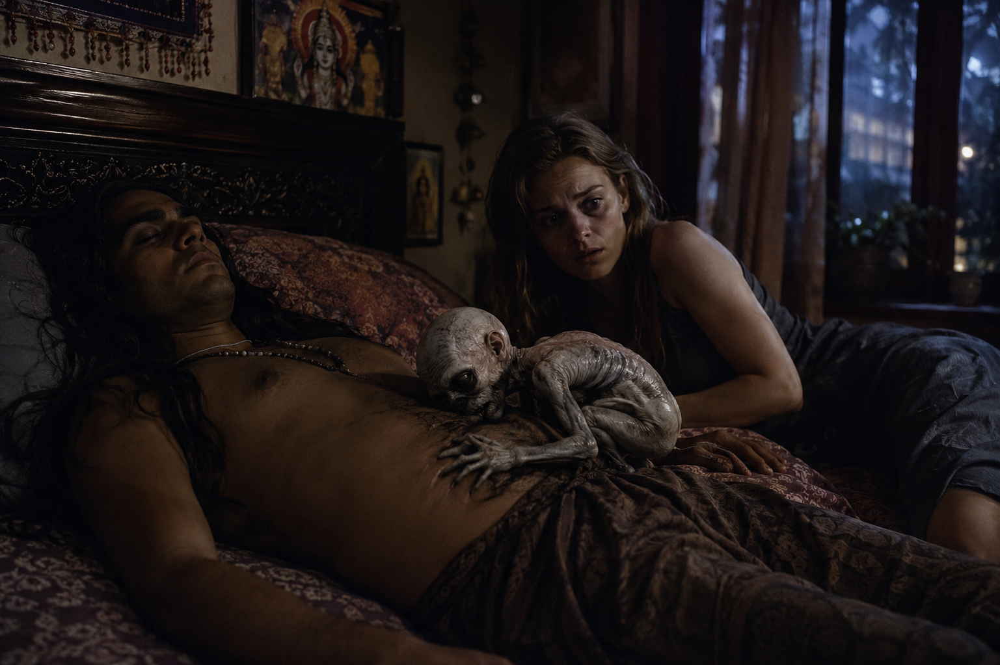
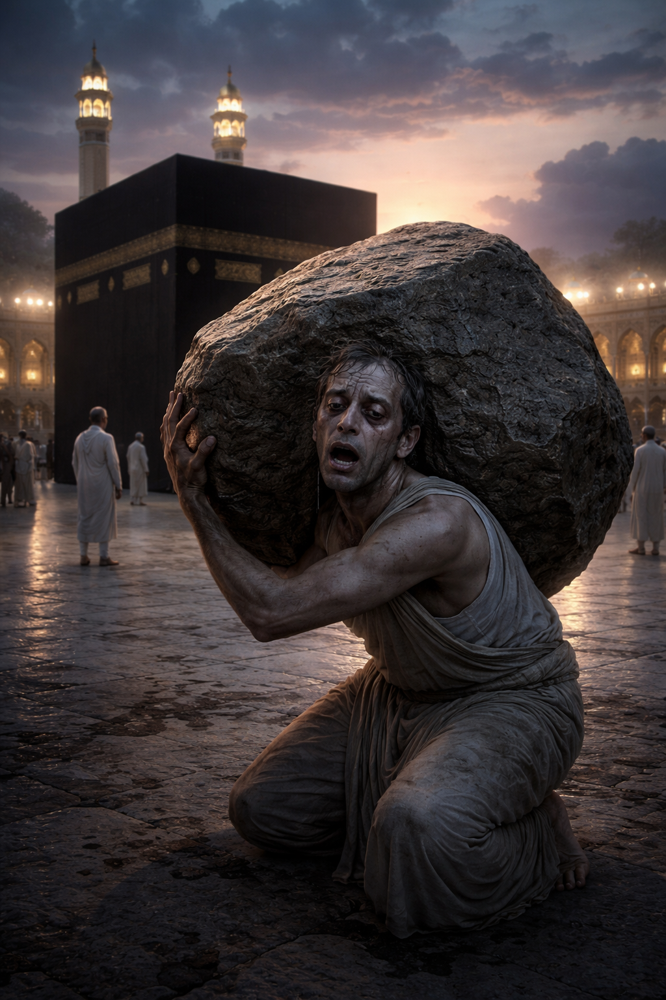

# 2010

## Jitendra Das, yoga-teacher porn-star

### Traveling to India 

- Even with a PhD in Computer Science, I find it impossible to get a junior position as a female programmer; my sole ambition in life at the time.
- I travel to India in April 2010 to study for professional Java qualifications.
- I plan on doing some intensive yoga activities also.
- I search for a yoga course online.
- The only course that comes up, again and again as the first and only option in Google search, is [a course in Rishikesh run by a Jitendra Das, PhD in Yoga](https://www.patanjaliyogafoundation.com/).
- There are hundreds of yoga courses and ashrams in Rishikesh, but only his came up on search.
- I found it weird and *significant* that only his course came up in Google search.
- I never considered online manipulation; ever. Not once.
- I thought it, perhaps, a spiritual matter (which inevitably in some ways it was, but not the way I thought at the time).
- The course was taking place during, or just after, an extremely important Hindu festival; the Kumbh Mela in Haridwar.
- I signed up.
- Jitendra requested students send photos of themselves, which I found weird. I can't remember if I sent one.
- His website was full of photos of himself in extraordinary yoga poses wearing nothing but little red pants.
- At meals with the British and Australian men studying alongside me at the training centre [Koenig in Dehradun](https://www.koenig-solutions.com/), I told them all about the yoga teacher with the tiny red pants.
- They weren't impressed, and one of them even warned me because he didn't have a good feeling about him when we all met him in Rishikesh on one of our weekend trips.
- I was thinking; *I'm a big girl, I can look after myself*... famous last words.

### The giant spider and the scorpion

- In my room at the house in Dehradun, I had some room mates: a scorpion that I could just see hiding under the tiled wall where there was a gap - the tip of his pincer visible very close to the toilet and my foot - and an ENORMOUS spider who one morning decided to share the shower with me.
- Curiously, a langur monkey was seen sat outside my door in the mornings too.
- I don't like killing animals so I just put up with my guests for a while, until the shower event, at which point I had to ask the caretaker for help.
- I asked him not to kill the spider (I didn't mind too much about the scorpion but I like spiders) but he did anyway, which made me a bit sad, but heck I could have a shower in peace after that.

### Jitendra pushes his way in

- As soon as the course starts, I find out that Jitendra Das is a pervert.
- Actually, in truth he is a lost soul who had been doing intensive spiritual practices while young and he had made huge progress in yoga asana, i.e. the physical postures.
- He even had great calluses on his ankles from sitting in meditation for very long periods.
- However, he lacked wisdom and something, somewhere in his life, had made him lose his way.
- I wonder if this experience could have been a honey-trap event. 
- Indian men like Jitendra would have had no experience of women throughout their lives so, I'm guessing, it would be very easy for criminal gangs to drive them insane with porn or sex, or whatever.
- Jitendra is a rampant sex addict with no control of himself at all.
- He targeted me immediately as a *lover*.
- I was not looking for love, nor interested in Jitendra but, at that time, I had no personal boundaries due to sexual trauma.
- Porn-gang honey-trappers know this very well about sexual abuse survivors and indeed "create" such survivors for their own purposes, as well as mass field online for us as they know how easy we are to manipulate.
- More horribly, when the porn-gangs started targeting children and toddlers online in the 2000s, they found that their established manipulation techniques worked in ways that probably seemed *too-good-to-be-true*, as personal boundaries are built up through life experiences and children and babies have none.
- I had remembered gang rape from 1989 just four years before attending Jitendra's yoga class and I was still suffering from emotional, mental, and spiritual injury from the retraumatizing.
- My PTSD was through the roof.
- It's also highly likely I had been sedated and raped in Spain over the years 2006-2009... keeping the effects of trauma very much intact... and there were all the times we've only just recently become aware of between 1989-2006.
- Although I did give a bit of a fight, a man like Jitendra, who had no respect at all for women, just pushed his way in and I seemingly lost any ability to say no.

### Sex with Jitendra

- We had a lot of sex.
- And all of it was unpleasant.
- Jitendra was rough and unloving, verging on violent, sometimes actually violent, and he obviously despised women.
- I complained about it to him.
- I told him I didn't want to be having sex-olympics every darned night.
- He didn't care about what I wanted.
- I told him he was like a farm animal. 
- He was offended.
- Even so, I found it impossible to say no, and stay in my hotel on my own.
- It was like I was enchanted, bewitched.
- One night, while we slept, I saw a demon-like being lying curled up in his second chakra.
- Was he drugging me with hallucinogens like they do in Spain?

- Like all demons, and all evil, it was weak and pathetic. Sad. Colorless.
- It looked ancient; like it had been here for millennia, all shriveled up and desperate to cling to life somehow, anyhow, but always in some self-imprisoning way.
- I realized that his addiction, however naively it may have begun, had drawn a spiritual parasite into his energetic field and he was mostly feeding that.
- Is this true of all sex addicts, I wondered?

### How I know he was filming

- I didn't know at the time, but Jitendra was obviously filming every sexual encounter he had.
- He always had a little pen in his top pocket which he never used.
- He was always looking for a pen to write with.
- I expect his room was also wired up with live-streaming spy-cam tech.
- This wouldn't be enough to be sure, however.
- When hackers started posting images referencing significant sexual posturing that Jitendra had forced me into in 2025 - where he was extremely rough with me - I knew I had starred in porn with Jitendra as well.

### How I coped with the sexual trauma

- It was an extremely unpleasant month with Jitendra and it destabilized me mentally and emotionally.
- It took a *long time* to get over it.
- I told myself I was in love with him and believed it.
- I see now that doing this was a defensive accommodation; the only way I could keep myself safe in such a horrible situation.
- The mind's most optimal way to deal with sexual abuse; ultra-fawn of course.
- The mind is primed for self-protection and will make up lies to cover the trauma we can't process.
- Thank God Jitendra didn't love me back; we were totally incompatible in every possible way.
- Who told him about me, that I was coming, that he should target me, drug me, and film me?
- When I realized I was not in love with him, about a year later and after some intense meditative practices, I liberated my mind.

### Jitendra visits Valencia

- Five years later, in 2015, when I was living in Dénia and attending the conservatory, I saw he was visiting the Valencian region to teach courses with a Spanish yoga teacher.

- This was when I was living in Joan Fuster where I was regularly sedated and raped, including when my father visited me, and I was becoming more and more severely depressed and anxious.
- Jitendra usually worked with a Ukrainian team who organized trips out to India from Kiev.
- He had visited Kiev too at some point.
- He told me about a dog in a Kiev street going crazy at him.
- His little-red-pants pics were professional photos that were taken there. 
- There were hundreds of miniature shots of him in various yoga poses wearing his tiny red pants; his substantial tackle most obvious.
- I'm guessing these were pre-porn photos, perhaps casting pics.

### Rampant perversion with nothing to stop him

- Jitendra told me, again and again, how he was going to set up an orphanage for boys at his new yoga centre that was being built at the time. 
- I shuddered.
- He got extremely excited when he told me he was having toilet stalls put in at his new centre, with gaps in the floor and ceiling; he was very specific that these gaps were a marvelous thing.
- The man was an out-and-out pervert and I don't believe he had any limits at all.
- I saw more recently on his website that he is offering pregnancy yoga, which is more than concerning.
- Jitendra was a total coward, and not very bright, and there was *a lot* of food-poisoning going on in Rishikesh at that time.
- If he got bored of you, and fancied another woman, or man for the night, he might take you to a restaurant he knew well and tell the chef to use toilet water.
- I read an online review from a woman about his new place which did not surprise me.
- She said he had touched her inappropriately at check-in for a course, and after complaining she ended up with food poisoning the whole time!

- I was sick constantly too while I was in Rishikesh; every few days I came down with something it seemed.
- Were those the nights he fancied someone else?

### Criminal porn gangs all over it

- My guess is the North London criminal gangs realizing the financial potential of my starring role in the 1989 child gang-rape porn they had of me, who had been hacking me for nearly ten years anyway while I came into a lot of money, lured me online onto Jitendra's course.
- Perhaps the link between the gangs and Jitendra is the Ukrainian woman and the multiple young women she brought out for him over the years who he told me about - how they were prostitutes, how they always had condoms with them, how they liked it very rough, etc etc vomit.
- Of course, it is no surprise I saw him "popping up" in the Valencian region.

### Jannita V D Stein

- One of the most curious things about my experience on Jitendra's course in India was a very weird girl, Miss VD Stain (phonetic spelling - Stein), who was also a student in the class.
- She was a curiously ugly person, inside and out, and I suspect she was also having sex with Jitendra when she wasn't having sex with someone she'd just met in a cafe and he wasn't having sex with me.
- A strange thing happened one morning after class when we went for breakfast.
- We were sitting at a table finishing our breakfast. 
- Miss VD Stain got up from her chair, and a second later the ceiling fan came down on her empty chair, brushing her slightly.
- It would have killed her if she had been sitting there.
- She had been a nano-second away from instant death.
- It scratched me slightly on the way down.
- Miss VD Stain made an enormous fuss and drama about that scratch. It was extremely bizarre.
- I remember thinking it was a warning; to me; about her.
- She was also running game on me for Jitendra. 
- I remember one instance of her making a huge drama, tears, wailing, etc., with the intention of getting information out of me, for him I assumed.
- I remember thinking; "This young woman thinks she's in Big Brother!".
- She was rather like [Sandra Diaz](../early-years/2014.md#sandra-rita-diaz), in retrospect.
- She most certainly could have been one of the porn-gang team, and she was certainly ignorant and immature enough to have been delighted to be doing porn.
- Something about her unusual looks (she had a condition which made her head oversized) would have delighted the porn-gangs I expect.

### Celibacy

- Anyway, this cesspit of human behavior I encountered in India this year is why I decided to be celibate for the rest of my life, and I still am.
- Sedated rape doesn't count.

### A curious synchronicity

- At the same time, a famous guru in India, Nithyananda, had been caught "fraternizing" with [an Indian film star Ranjitha](https://en.wikipedia.org/wiki/Ranjitha).
- It was all over the media and the only news item I saw that month whenever I looked online.
- There were videos of spy-cam footage in the guru's bedroom.
- I remember being in Jitendra's bedroom and we were looking at the news online and this was the *only* news item.

## Mike Wenham

- I'm back in the UK and I get my first job in programming as a junior Java developer for a e-commerce company owned by British Telecom.
- I love the job.
- I'm one of two women in a department of many men.
- The other woman is being bullied, relentlessly. It's ugly.
- I don't know how to help her. It's my first job as a programmer and I want to do well.
- About four months after I start, she walks out.
- The men sing, 'Ding dong the witch is dead'.
- Another man, Peter, walks out in disgust at the same time.
- The bullying reverts to me immediately.
- Porn on my screen. Rape jokes.
- It's relentless and overwhelming.
- I realize I will never advance in a brutal and hostile environment like this, and leave.
- My boss, Mike Wenham, is furious and tries to get me to stay.

!!! info "Two weeks before I hand in my notice"
    - I hand in my notice on the run up to the New Year.
    - Mike was moonlighting as a builder and had an account on one of the builder platforms.
    - Two weeks before I left, Mike had been doing building work in a maisonette in Lesley Road very near to my street in East Finchley, literally the next road.
    - He had asked me to come and see him there one Saturday morning. It must have been December 4th or 11th of 2010.
    - I wasn't sure why he was asking me to pop over, I just thought friendliness.
    - Anyway, I went along and he let me in, or the door was open and he was at the top of the stairs. 
    - He was carrying a stanley knife.
    - All the floors were protected by plastic sheeting.
    - It was the upstairs maisonette and I only came up half way before deciding I didn't want to go up to see him and left.

- There was some online activity that suggested I had been hacked at that time by silly males (porn infestation), and my bank card was used online to buy men's clothing, the first and *only* time that has ever happened to me.
- Did Mike Wenham hack my devices? He certainly organized hacking my work terminal to put porn up while I was working, sometimes with my name in it, one of the reasons I could not stay there.

### Mike Wenham hacks my devices

- The criminal gangs already had full access to my online activity, but Mike Wenham hacks me too.
- He's undoubtedly hacked my work laptop with the help of the rest of the department, and I believe he hacked my personal devices as well.
- Perhaps this is where and how he and the criminal gangs met?
- At Christmas, before I resign and just before I travel to Thailand, porn comes up on my personal laptop screen at home.
- It's a hack using the location of my work offices in High Wycombe; I can't quite remember the details, but it drew me in with something like *we know where you work*, and described something familiar so I'd get pulled into it.
- Photos from a satellite zoomed in again and again, from outer space, to country level (UK), to map level (Buckinghamshire), to area level (near my work offices), to a field with a building, then further down, and then it was the field with a naked woman in it looking like she was doing porn.
- The horse was out of shot.

### Shopping fraud on my card

- The next day someone frauds my credit or debit card; the *only* time this has ever happened to me.
- They buy men's clothes from a men's fashion online outlet.
- I think it must be Mike because of his evil behavior towards me.
- The size and style of the clothes are Mike's.
- I report the fraud immediately.
- Now, I think it’s more likely Hazel and North London’s finest, seizing the easily-manipulated porn-addict opportunity that has presented itself, and planting seeds in case I call the police on him at some point in the future. 

### Mike sabotages my future roles

- After I quit my job, annoying Mike Wenham hugely, I believe he sabotaged *all* my future jobs before he ended up in jail for murder with 3 cms less of a penis.
- I also now believe he had help from Hazel Smith and North London’s finest; even if that help was just a little bit of the manipulating he needed to do it - maybe a bit of technical help too.
- He probably did not know I was the target of an [international porn fatwa](../2001-to-2010/2003.md#porn-fatwa), and so he may have inadvertently become a valuable scapegoat for anything that happened to me, and a caliphate-demo.
- The gangs do end up *working with him* closely, as Hazel will tell me online in 2024.

- Did they manipulate him into thinking about murdering me?
- He clearly hated me enough already, so that can't have been too hard. 
- When I was unavailable for murder, had their manipulation tech already been so successful he was unable to stop himself murdering Karolina?
- And did they also use poor Mike for another demonstration to the caliphate of how powerful their manipulation tech is and how it can make *apparently* normal Western men undergo 100% chance-of-risk surgeries to their penises?

### Four years later

- Mike's wife emails everyone asking for support because her husband has just murdered a woman. I'm in Lourdes at the time.
- Mike had contacted me a couple of weeks before the murder, out of the blue, and asked me if I wanted to go to an ayahuasca ceremony with him.
- It seems like he might have been planning on murdering me.
- Do men (and women) become overwhelmed with hatred for women who have been targets of rape-gangs and it didn't destroy them?
- I read the news article (it *pops up* on my timeline) on my first *ever* day serving Mary at Lourdes.
- Coincidence?

### Five years later

- Details about Mike's extremely sordid case is [published in the tabloids](https://www.mirror.co.uk/news/uk-news/michael-wenham-dad-who-decapitated-5071160).
- I do not read this article until Easter Sunday 2015, when I'm staying at the Buddhist temple in Pedreguer and it *pops up* on my screen.
- Mike, it turned out, appeared to have become homicidal towards women after a botched penis enlargement operation.
- It seems he must have been suffering an exaggerated porn addiction at the time and probably when I worked for him too.
- Is it possible Mike was targeted by the sentiment-manipulators also as part of the [porn fatwa](../2001-to-2010/2003.md#porn-fatwa) debacle?

## My brother loses his mind in Thailand

- It's the third time my brother visited Samui while I was there detoxing.
- The first time we had gone together and had a really amazing time. 
- We'd got on so well, I thought perhaps we might have fixed our relationship.
- On that first trip, however, the nightlife did attract him in not a good way, but only briefly I thought.
- The second time we went together, in 2009, I [wrote about already](../2001-to-2010/2009.md#falling-out-spectacularly-with-my-brother-in-thailand), it seemed he could have been targeted by the gangs.
- Something happened to him on that trip which irrevocably severed our relationship and I cannot believe it was me *saying something* reasonable to him that anyone would have said.
- In 2010, my brother just *happens* to be in Samui at the same time as me, which is curious in itself as he had been traveling the world.
- He had been there for a few weeks already by the time I arrived.
- I believe he'd had such a good experience at the detox originally that he intended to do it again, but the gangs had gotten their claws into him in 2009, and big time in 2010.
- When I arrived he was being thrown out of the detox hotel because he had been bringing prostitutes back to his hut every night and drinking excessively.
- His room veranda was littered with empty beer bottles.
- They'd asked him to leave.
- I went with him to collect his stuff.
- He was still angry with me.
- It was as if he was blaming me for everything bad that had ever happened to him, and his behavior was somehow getting me back.
- The prostitute he was with was young and had severe acne.
- It was all very unpleasant.
- He was clearly not thinking straight, at the very least.
- He moved to a place onto the beach and I didn't see him much after that.
- One afternoon I visited him.
- He told me about how he was going to do porn.
- I was worried about him.
- He was saying it like it made him a better person; *I could do porn you know*, he said, as if someone was massaging his ego on sexual-prowess terms.
- He said angrily to me about how the women who were coming round his house were prostitutes: *prostitutes*, he emphasized and peered at me in judgment.
- It reminded me of Brian Higgins saying how he'd *heard I was a prostitute* when we first met and I found it offensive but never quizzed him about it.
- Had they shown my brother the child gang-rape porn?
- A day or two later, he turns up at my hotel. 
- It's New Year's Eve I think.
- He's met this *man*, a Londoner, who gave him some speed and told him how to buy it at the chemist.
- My brother is off his head.
- *He's a really cool guy*, he keeps saying about the cockney.
- As I write, I'm thinking about teeth.
- I'm worried about my brother but I can't talk to him because he really *really* hates me.
- A few days later, my mum contacts me saying Robert's not answering his phone and hasn't called her in days and she's so worried she's contacted the foreign office.
- A few days after that, I go back to Samui to rescue my brother from a drug induced disaster.
- He has been totally high every night.
- And totally comatose every day.
- Something happened to him and he will never be the same again.
- Did they film him doing something they've been blackmailing him with ever since?

### Robert at Mecca

- I had a dream about my brother while I was being drugged, sedated, and raped repeatedly at my home in Carrer Furs between 2022-2024.
- I was at Mecca.
- Everyone was going round the big black stone.
- I was just sort of wondering around amongst them. 
- It was a dream state so nothing like it actually is, but these were the symbols of the dream.
- At some point, I saw my brother going around the big black stone with the rest of them.
- He was carrying an extremely heavy weight; huge it was.
- It made him stoop and kept his gait slow and unsteady.
- As he passed me, he looked at me in despair, but he wasn't asking for help.
- He could not put the weight down, he was chained to it.
- He'd resigned himself to the weight.
- I understood the dream very well, with no specifics required.

- It described [everything that had happened to him in Thailand and eternally ever after](#my-brother-loses-his-mind-in-thailand).

## Christmas with Jitendra

- I had arranged to meet Jitendra in Thailand that Christmas for a few days.
- Curiously, my brother was in Samui at the same time as me.
- The last time I saw my brother before going up to Chiang Mai, he told me he had met this British guy who told him how to get high by buying a certain type of medication at the pharmacy.
- My brother had followed this man's advice, and when he told me about this he was really speeding hard.
- I was worried about him.
- Anyway, I went up to Chiang Mai for a bit and I met someone really nice. A Dutch man. 
- And then… suddenly… my brother went totally AWOL in Samui on these pills, my mother was calling the embassy as no-one could get hold of him, and I had to go rescue him and put him on a flight home.
- So that was that with the Dutchman.
- I wonder if my brother's British drug adviser was the same guy I saw at the Radiance restaurant in December 2024 who looked like the H Samuel’s thief from 1989 … greasy black longish hair with a much younger Mediterranean wife, a man who literally bared his teeth at me.
- Were they tracking my every move back then too?
- Did they know about the Dutchman? 
- Did they have to stop any relationship so I would continue with this ridiculous plan of meeting Jitendra?
- Were they heavily financially invested in Jitendra and making sure everything went to plan?

## Cyber-stalking in Dénia

- When the gang stalking peaked, in [March 2024](../2024/march/1-12.md), online and at the conservatory and in the streets of Dénia, wherever I went in fact (they had been tracking my movements online for years it turned out), the stalkers and criminal gangs used the above history to try to intimidate and frighten me even more. 
- They knew everything about me, where I was, what I was doing, and they shared my life with the people of Dénia.
- So, now, I'm returning the kindness for God's purposes. 

