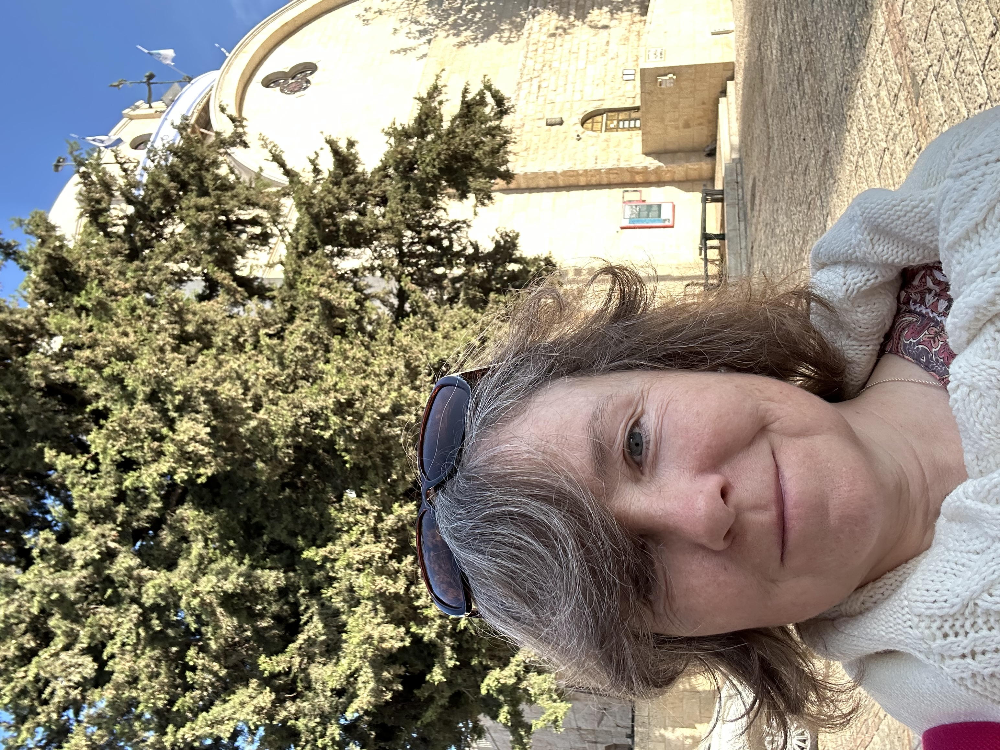
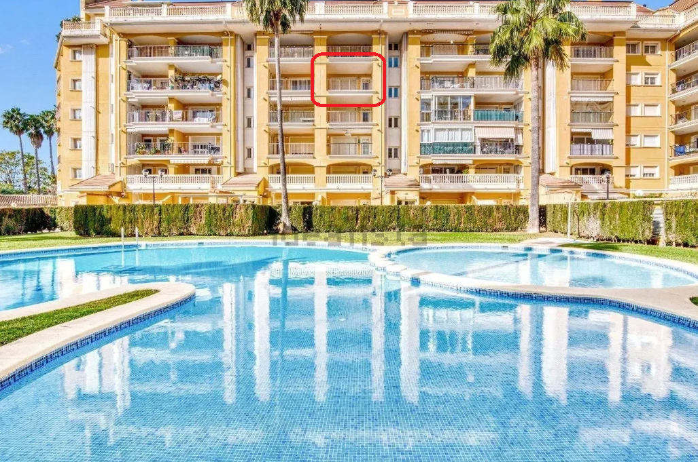
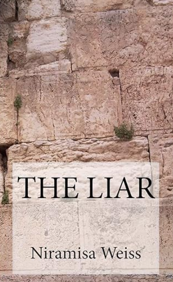

# 2012

## Leon, a man I worked for

- An example of hacking and constant sabotage of everything I do?
- Would [Mike Wenham](../2001-to-2010/2010.md#mike-wenham) have been involved?
- Did the UK porn distributors and honey-trappers team up with Mike Wenham?
- Was he their first true test of whether they could use online lust and porn triggers to manipulate someone into undergoing extremely risky genital surgeries and then murdering a person?
- Was another *test*, as it were, Lorraine's daughter?
- Did the trans ideology manipulation software, aimed mainly at children, girls usually, get released soon after these successful outcomes?
- Can we tie it all back to a small town in Spain?

## Tiferet 

- In early May I visit Israel and take a 7-day Holy Land tour.
- I fall in love with the country, in a million different ways.
- During our visit to Jerusalem, we stopped at a square which I always called Tiferet Square.

- It's not really called that, but kind of.
- Anyway.
- As we walked up to the square, back then in 2012, I could hear music.
- Two buskers, a female keyboard player and a male instrumentalist, possibly a trumpeter, I'm not yet sure; they were playing [*Bésame Mucho*](https://youtu.be/BueVGiyx_E4).

- I became entranced.
- The reason I remember this so well is because I didn't listen to music at the time and I had the song in my head for weeks after.
- I told our tour guide, and a few others since, that I want to live on Tiferet Street close to the Hurva Synagogue, which resurrects, periodically.

- I still want to live there.
- Why did I tell you this story?
- You tell me.

## Barbara's wedding

- Barbara Loftus invites me to her wedding in Dénia.
- Barbara is an Irish woman from Dublin who taught English at LinguaLink from 2008 or so.
- We worked together with Lorraine Blackbourn.
- Zoe BJ's mother Theresa gave a class there every Friday too.
- I'm delighted to receive the invitation and I visit Dénia for the wedding weekend.
- Barbara is marrying a Spanish civil servant, Joan, who may work for the Generalitat but more likely another Spanish government department.
- Zoe BJ and her mother have also been invited and we sit together at dinner.
- Zoe doesn't know Barbara and it's not clear why she was invited.
- She keeps telling everyone this and giving a reason why she is invited, which I do not remember.
- At church, myself, Zoe and Zoe's mum are standing together.
- As Barbara walks out of the church up the aisle, Zoe and her (apparently very Christian) mother make loud fat-shaming statements about Barbara.
- I can hardly believe it; it's disgraceful!
- Not only that, Barbara can hear it and she'll think I think this too because I'm standing with them.
- I can't remember but I do hope I told Barbara how beautiful she was later on at the party. I have a feeling I did. She was beautiful that day.
- She didn't talk much that day, which was strange, and in retrospect I wonder if they had already started the dosage.
- When I think about Zoe and her mother's frightful behavior at the church, I wonder why they would have behaved that way.
- These two were not usually so ignorant, never in fact, and it took me aback at the time.
- Again incongruous; I have to say it was a bit, well, staged.
- Knowing what I know now about the porn-gangs of Dénia, I have serious concerns about Barbara's safety and wellbeing.
- I'm so sorry I didn't keep in touch with her when I returned later on in the year, but perhaps that was also manipulated.
- Around a year later, I saw Joan the husband in the cafe I usually met Lorraine in for coffee.
- He didn't see me to say hello.
- It was a Monday or Tuesday afternoon and he looked and smelled as if he had been up for days and not been home.
- I remember telling Lorraine about it and she laughed.

## Early evidence of Facebook hacking

- One night, I'm stalking people I've known, probably Hazel was someone I looked up.
- Something comes up about Crowland Road, Tottenham, the club I had gone to with Winston May the night he raped me at his house in August 1989.
- I believe something happened at the club I'm still unaware of.
- Suddenly, on Facebook, I stumble onto a post where a person is saying they'd been at the club in 1989 and a young girl had stripped off naked on the dance floor, and it was such a huge trigger I think I closed the laptop then and there.
- I think something did happen in the men's toilets most likely; even elsewhere.
- It's obviously common knowledge too.
- I'm guessing there's photographic evidence even though back then people weren't taking photos like they do today but still, Winston had already been to Denia and had the sedation training; perhaps he had spy-cam training too, the sort we can see was used with Irene.
- Did Brian have the same?

## Passeig Periodista Ramon Ortega

- I move back to Dénia in October.
- I have had severe colitis since I moved back to London the previous September.
- For a whole year I have been bleeding from my bottom, badly.
- I'm back in Dénia for about a week when I notice it has completely cleared up.
- Prior to moving back, I did a colonic fast and cleanse in Thailand.
- I rent a flat in Las Rotas initially, but the woman has lied to me about their being sufficient internet so I have no option but to find somewhere else.
- I find a flat in Passeig Periodista Ramon Ortega.
- By the way, my mother has all the full addresses somewhere, I can't be bothered to look. 

- The size and layout is exactly like this flat: https://www.idealista.com/en/inmueble/109473972/.
- I rented the flat from [Lex estate agents](https://inmobiliaria-lex.com/) so they will have the information too.
- Zoe visited quite a lot as we were both writing books and exchanging notes.
- One afternoon, I remember she started talking about the Pakistani rape gangs out of the blue in my sitting room. I found it a bit weird. I wasn't thinking about it.
- My dad also visited at Fallas time in 2013 and stayed about a week.
- I wonder about that visit.
- Did someone approach us in the Irish bar?
- The only reason I have to be suspicious about my stay here - which I loved - was that I had extremely bad genital boils after that.
- I remember because I would burst them sometimes and they would stain the wall opposite with blood and pus. They were *really* angry.
- Does this mean I was being sedated and raped in my apartment here too?
- I'm not sure.
- When I left the apartment, I tried to sell a few items to my neighbors. A man came round. He walked into my apartment looked around, looked at me in disgust, made a rude comment, and walked out without saying anything. This makes sense if I was being sedated and repeatedly raped in my apartment here and everyone knew about it which would not surprise me anymore.
- I do know that the woman who moved in downstairs looked a fair bit like the [sedated woman I saw on Dénia TV](../2001-to-2010/2008.md#denia-tv) in 2008, enough to make me do a double take when I met her.

## Thanking Trudy

- On my return to the Marina Alta region, I was very keen to seek out Trudy and thank her for introducing me to the Course.
- And I did so.
- Remember [Trudy giving her talk in 2008](../2001-to-2010/2008.md#a-course-in-miracles)?
- We met in Javea in the old town and we had coffee.
- It was winter, coldish, I suspect late November or December.
- I wanted to thank Trudy soooo much because basically A Course in Miracles had shown me the door out of hell (and I knew very well it was Jesus talking to me - often without a clue what he was saying...)
- I told her all this and thanked her profusely.
- I told her about my trip to Israel earlier that year, about how I'd heard the Voice at the Wall and how it had inspired me to explain to the Voice, a mission if you will, what the liar is in the mind - because the Voice didn't know - and so answer Her question.
- But of course the Voice didn't know what the liar is. That's our very own invention not shared with Heaven.
- Anyway. Trudy.
- Trudy was quiet, thoughtful, sad.
- It was as if she was preoccupied by something and not communicating with me at all: 5% of her was with me, the other 95% was thinking about something that made her upset, unhappy, quiet...
- It was strange and very unexpected but I didn't think about it much at all...
- Until recently when I remembered that hackers had told me repeatedly about Trudy - and I understood it to mean she had known I had been targeted by the gangs back in late 2012 but couldn't say anything to me about it, or they'd murder her too, like they do.

## The Liar

- On 21st December 2012, I finish my first book, [The Liar](https://www.amazon.com/Liar-Niramisa-Weiss-ebook/dp/B00CA5F602), inspired by my visit to the Western Wall in Jerusalem in May of this year.

- It occurs to me, today in January 2026, that I calmly and rationally describe evil in this book; how it works, how to notice it, how it's nothing at all, how weak and feeble it is, etc.
- And immediately I did this, the devil himself - offended - came after me, as if to prove me wrong.
- And, so far, I got away with just a few scrapes and bruises.
