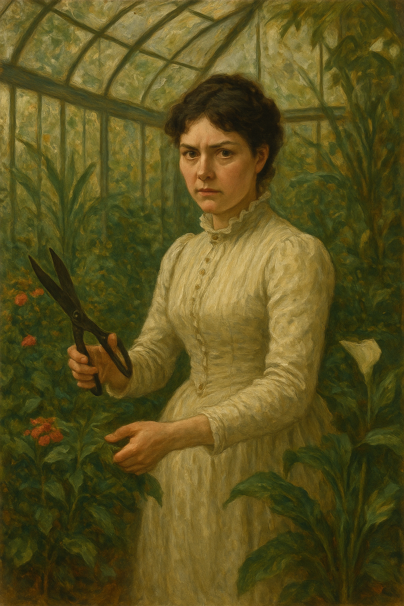
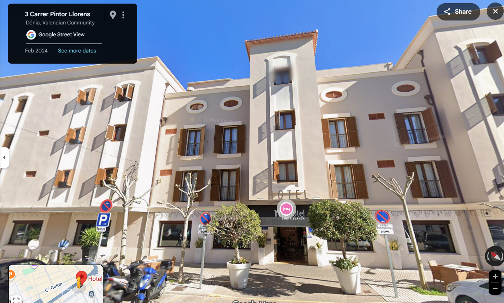
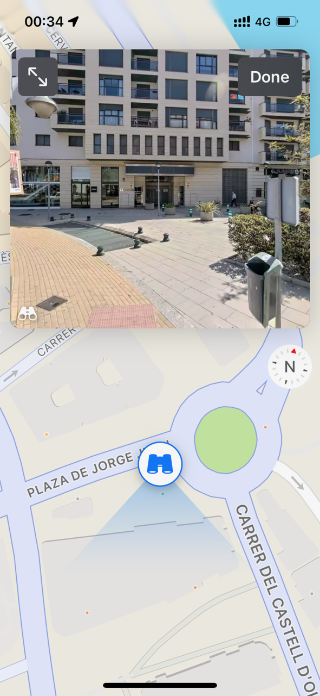

# 2014

## March to July

- I move from Dénia at the end of March to live in Lourdes, France, to volunteer at the baths.
- I put all my things in a [secure storage facility in Ondara](https://securistore.com/).
- I stay one night at the Best Western in Lourdes before starting service the following morning with the Hospitalite de Lourdes.
- I bring my piano keyboard with me so I can practice for the audition at the conservatory.
- I study for the written exam and the sight singing, and I practice my keyboard every day.

### Life Without The Liar

- In Lourdes, I intend to write a novel that has been forming in my mind for a couple of years, *Life Without The Liar* under a pseudonym, Margaret Murphy, my grandmother's name.

[{width=50%}](https://www.amazon.com/Life-Without-Liar-Margaret-Murphy-ebook/dp/B00M0CZN94/)

- I feel like my time in Lourdes inspires every chapter; as if Mary is guiding my attempt to heal the horrific experiences of child sexual abuse and London rape gangs from thirty years previous, experiences which statistically are likely to destroy a person (see some [ACE study data](https://www.cdc.gov/aces/about/index.html) for more info) but, for some reason, I survived.

### Mike Wenham murders a woman

- The morning of my first day of service, Mike Wenham's wife emails - he is an old boss of mine.
- She tells us Mike has murdered a woman and asks if we would write to her saying what a good bloke he is because they think he's gone temporarily insane.
- He bullied me out of my job, so I don't agree he's a good bloke, but I do offer to light a candle at the grotto for him.
- The picture on the wall of my room at the Best Western becomes even more curious.
- I had slept really badly that night, and I was finding the picture on the wall really scary.
- Every time I turned the light on I would see it.
- A woman dressed in Edwardian style is in a conservatory garden. She has a pair of sheers with her for pruning the plants and flowers.
- She holds the garden sheers open and looks directly at us. She is not smiling.
- She has black hair and pale skin, and she's beautiful.
- I find the picture sinister, yet powerful; energy I don't understand pulsates from it.
- Mike's wife's email seems in keeping with the tone of my hotel room.

- I tell a lot more of the [Mike Wenham story](../2024/march/13-end.md#mike-wenham) in a section from March 2024 where it becomes apparent I'm being stalked and harassed by people in Spain who know him very well.

### Sandra Rita Diaz

- A woman called Sandra Rita Diaz attends the volunteer's course at Lourdes at the same time as me.
- I tell her about Mike Wenham as it is on my mind.
- She is Portuguese and lives in Paris, and is a translator for the police and other social services in France.
- She is a member of the Hospitalite de Lourdes, and she is in the system.
- We become friends and I mention her throughout the story, especially during the three years or so that I was drugged and cyber-stalked.
- I'm never quite sure if I can trust her. Something's off, but I'm not sure what. 
- She presents as a ditzy blond, always late, giggly, etc, but every now and then [the mask slips](../2023/december.md#sandra-rita-diaz) and someone very calculating appears for a nanosecond.
- Over the years I know her, every now and then she will say or do something extremely out of character and I wonder if this is to gauge a reaction.
- Is she part of the conspiracy? If so, it seems that whatever abuse I suffered as a child, which was filmed, must have generated a lot of interest, and made a lot of money for criminals. Thoughts like these make me feel quite unwell.
- The timing of our meeting suggests she could be part of the conspiracy. I'm about to enter the conservatory where some horror is supposed to await me.
- Like the online stalkers and others, she always pretended to be seriously concerned about what was happening to me, but when pressed for a bit of real support, became utterly disinterested and dismissive.
- A gang stalker's interest in a target is superficial. They're just doing what they're told. They don't really care. When normal concern is required from them, they deflect and ignore. They have better things to do, and lives to live. It's just a job for them. They are getting some reward for their behavior of course; you can be sure of that.
- Like other conspirators, such as [So, real name Janet, my electoral volunteer](../2024/june.md#volunteers-not-what-they-seem), she was always suggesting I came and stayed with her for a few days at her house.
- I wonder what might have happened if I had accepted either of their invitations.
- Stalkers and manipulators use common destabilizing and gaslighting tactics and language and Sandra Rita Diaz was no exception.
- Perhaps Sandra is not her real name. I would not be surprised. Sandra is a common gang pseudonym. I expect it signifies the person taking the role of throwing "sand" in the eyes of targets.

!!! tip "An accomplice?"
    - Sandra Rita Diaz may have had an accomplice at Lourdes on that first course with the Hospitalite.
    - He was a British man, scouser if I'm not wrong, Andrew.
    - He was a drama teacher.
    - We chatted. 
    - He said strange things about his girlfriend which gave me cause for concern, like she didn't like going out, she didn't have any friends, she wasn't working. 
    - It sounded like she was in prison.
    - The reason I think he might be an accomplice is because in the last few years I saw Sandra, when I was living in UK also, she was always mentioning him, how he asks about me, this sort of thing.
    - There was some intention behind it.

#### Sandra's dad is dying

- I can't remember exactly when she first told me her dad had pancreatic cancer and was dying; it was either in April 2023 at Easter in Lourdes, or the following late summer of 2023 when I returned to France.
- Either way it's curious that this came up during these horrific times, and my guess is it's not true and the lie was potentially due to a planned parallel event occurring to my dad and that she *would be there for me*, (*I'm worried about you*, *you can always talk to me*), as a friend.
- Eventually, Sandra told me her father did pass away.
- The last time I saw her, in Cauterets in September 2024 while I was feverishly sending my [handwritten letters](../2024/august.md#the-handwritten-letters), she asked me if I wanted to see a picture of him.
- I said yes.
- She found a picture of a man on her phone (it was an old black and white shot).
- The man looked to be in his forties, and he was standing in the middle of a field completely bare-chested.
- He had dark trousers on and was barefoot too.
- I found it weirdly inappropriate.
- It triggered something unpleasant within me, and I think it was meant to.
- I wonder about the whole story of Sandra's dad now. 

### Men in dresses at Lourdes

- During my time volunteering in Lourdes, there were a number of times I noticed men pretending to be women and accessing areas in which women and girls were in vulnerable state of undress.
- A pilgrimage from Glasgow had two of these men: One calling himself Mary worked in one of the bath teams with me one afternoon. An Italian woman was furious but no-one else seemed to notice.
- Another man calling himself Mary, from the same Scottish pilgrimage, was volunteering at the emergency medical station.
- I noticed these things well, but had no context around them so I did not know how to respond to them, and they didn't seem important until closer to the time of writing this police statement.

### Sandra recommends Saint Jean de Luz

- Sandra sung the praises of this little town, over and over, so much so I ended up checking it out and visiting regularly over the period 2016-2019.
- Yes, some curious irrationally unfriendly events occurred there, and maybe even an introductory moment too.

### Feeling high when spending time with Sandra

- I remember after one lunch with her in July/August 2024, I was *speeding my proverbials off" just afterwards at the grotto.
- I start to remember other times like this too.

### A spiritual experience with some humus

- I'm living in Aspen en Lavedan.
- To be fair, it's a bit of a dive, and it got way worse after I left.
- Nevertheless, I had a great few months in my tiny apartment.
- I wrote [a romance novel](#life-without-the-liar), and I was even in [an earthquake](#earthquake)!
- I used to buy Israeli humus from the Monoprix.
- One evening, I was looking at the tub, and all the Hebrew letters started to glow and sort of come alive.
- I never forgot it.
- It was really trippy.
- At the time, I thought it must be a spiritual experience of some variety.
- This is one of the reasons I took Hebrew classes in Belfast - an embarrassing reason I don't mention too much, until now.
- I told some folk about it at the time.
- They'll no doubt remember, it was a crazy story, and true.
- Now, I think it meant that Ugly and his mates from Dénia had started to drug me while I was staying in Aspen en Lavedan, and they were coming into my apartment in the run up to the conservatory exam and beginning classes with Domingo Lopez Cano - main man poisoning pedo piano teacher at the conservatory.
- It would have been nice if it was a genuine God moment.
- And in some ways, it genuinely was.

#### A priest is staying in a room very close to mine

- I left my flat one morning, he's leaving his flat at exactly the same time I am.
- We see each other.

##### The abomination of desolation in the holy place

- Could Lourdes be another one of those holy places mentioned in Daniel and Matthew?

## April

- I formally apply by post to the [conservatory of Dénia](https://portal.edu.gva.es/conservatoridenia/es/inici/) to join the first year of professional studies for piano.

### Earthquake

- In the morning of 29th April, there is an earthquake.
- It wakes me up.
- It feels and sounds like a train going through my bedroom.
- Everything shook and rattled and juddered up-and-down.
- I realized at that moment why the paintings were nailed onto the wall rather than hung.
- The painting in my room was a view of the Viscos.
- It reminded me of the Last Supper, for some reason.
- I even told someone that, who may remember.

- You can see the Viscos mountain from Lourdes High Street as you drive down towards the Post Office from the direction of the train station.
- On a clear day the view can be quite startling.
- I climbed it [in 2023](../2023/august.md) and [in 2024](../2024/august.md) while I was suffering an extended crucifixion of some variety.
- Perhaps that's why the picture reminded me of the Last Supper.
- At the time of writing, in 2025, I can serendipitously see the Viscos peak from my chair; and the cross outside my building is aligned with the mountain.
- There are no thunderstorms at the moment so I've no idea where [the lightning came from](https://drive.google.com/file/d/1W92R2v8QAsAzDaAs1oIg99ozWLrcuqJ4/view?usp=drive_link).
- 29th April is the feast day of St Catherine of Sienna, just saying.
- Was this assignment distribution day?

## May

- I receive the [receipt of my application from the Generalitat](../../content/documents/papeles-conservatorio/justificante-may-2014.pdf).

## June

### Meeting Domingo Lopez Cano at the conservatory audition

- I travel back to Dénia from Lourdes to take the exam.
- Domingo the piano teacher is there, at the back of the classroom during my audition. 
- He's not officially part of the audition procedures in any capacity at all.
- He makes a point of introducing himself to me afterwards and chatting a little.
- It's the first time I meet him.
- His English is very good.
- I find him a bit weird, odd looking, pale; unwell maybe but polite and charming.

## September

### The piano at the storage facility

- When I return to Dénia, I collect my things from the [storage facility in Ondara](https://securistore.com/).
- Pretty much right outside the area where my things are stored is an upright piano.
- Of course, I ask the English people who manage the place about it.
- It is for sale, 150 euros.
- It is so cheap, it is impossible for me not to buy it.
- The English people organize a man with a lorry to move it to my apartment in Cami Llavador 5.

### Cami Llavador 5

- This is the apartment I used to live in back in 2006-2009.
- I had met the landlords again in Madrid prior to returning from France so that I might have somewhere to live and they agreed to rent it to me again.
- When I entered the property, it smelt like there had been a serious gas or sewage leak.
- I stayed at the Hotel Costa Blanca for a couple of days because of the toxic smell.
- It was also a mess, and full of the last resident's stuff.
- I cleaned the property, top to bottom, and made it look really nice again.
- I could still smell the toxic odour from time to time, however, and it bothered me.

### First piano class at the end end of September

- I'm delighted to be playing the piano again after a twenty-odd year break.
- Domingo Lopez Cano is going to be my piano teacher.
- It has been arranged.
- I have no problem with this; why should I?
- Domingo is a muscle-man-type and looks like he may have been taking testosterone and similar. 
- Domingo asks if I want to go for coffee after the first class, I decline.

#### Strange experience at the Hotel Costa Blanca

- I'm staying at the Hotel Costa Blanca in Dénia because of the gas/sewage smell at the Cami Llavador apartment.
- I've told Domingo about all the issues I'm having with the property and why I'm staying in a hotel.
- I check in.
- Pretty soon after, I get really, *really* sick; flu-like symptoms. 
- On top of that, I become deliriously upset about something, and I phone home ranting, two or three times, on the night I get sick.
- My mental/emotional state the next day is completely fine and I don't understand what happened.
- I felt like I was spiked with drugs it was so out of the ordinary.
- I phone home to apologize for my crazy calls.
- When I'm better, I forget about it.
- I wonder what really happened that night at the Hotel Costa Blanca and how common an occurrence this is for guests.
- The hotel manager was really very angry about something.

- When my mother and father stay there in 2016, [my mother ends up in A&E with a panic attack](2016.md#march) in the middle of the night.
- The hotel manager is similarly angry and they mention it to me the next day.

### The gypsies with the buggy

- While I'm still at Cami Llavador, one afternoon at lunchtime (siesta time when no-one is around) I am walking back to my apartment from the conservatory.
- I'm walking along the CV-730 towards Las Marinas and I have just passed Casa Federico, pretty much [here](https://www.google.com/maps/place/D%C3%A9nia,+Alicante,+Spain/@38.8474069,0.1028702,3a,75y,273.19h,72.27t/data=!3m7!1e1!3m5!1sAKa379ejXnVgtE1BSn1aIg!2e0!6shttps:%2F%2Fstreetviewpixels-pa.googleapis.com%2Fv1%2Fthumbnail%3Fcb_client%3Dmaps_sv.tactile%26w%3D900%26h%3D600%26pitch%3D17.72985641868108%26panoid%3DAKa379ejXnVgtE1BSn1aIg%26yaw%3D273.1915393963973!7i16384!8i8192!4m6!3m5!1s0x129e1b226dfbd341:0x86f3d778aff1e134!8m2!3d38.8387992!4d0.1050557!16zL20vMDFoc2Ri?entry=ttu&g_ep=EgoyMDI1MDkwMy4wIKXMDSoASAFQAw%3D%3D) although it looked a bit different in 2014.
- On my left is a little turn-in road for doing a u-turn - the same place Maria Hontanilla tells me she fell off her scooter and Domingo Lopez Cano did her a favor by standing in for her while she was dealing with the cops, her boss Joan Carles refusing to accept this as a reasonable excuse, and therefore implying she'd been set up to owe him.
- I see a gypsy couple, I recognize the woman but not the man.
- The woman is pushing a buggy and there is a small boy sitting in the buggy. He is no more that 5-years old.
- The woman is commonly seen around Dénia begging. 
- The last time I saw her was probably October 2024 outside the Mercadona in Avenida Miguel Hernandez.
- She is extremely fat now, but she wasn't that fat in 2014.
- There's something not right about them; they look as if they don't want me to see them.
- I'm concerned about the boy, he is completely still and his expression is fixed. 
- He has very pale skin and they are brown-skinned.
- The three are not communicating with each other normally.
- I feel something's very wrong here as the buggy wobbles over the stoney ground and no-one speaks.

### Joan Fuster

- Even though I had cleaned up the property in Cami Llavador, there was a lingering smell, and I started looking for better accommodation.
- I found a flat nearby but there was a chain-smoker next door and poor ventilation.
- Domingo was very interested in my house hunting and had a lot of advice to give me on it.
- There were no more flats available, and then one came up, in Joan Fuster 11, 3rd floor above the evangelical church facing the street.
- My landlord was a lawyer with offices on the Marquis de Campo.
- I dealt with Miguel Angel Piano directly.
- I wonder if the man *Lopez* who works for Miguel Angel Piano is a relative of Domingo's. There is definitely a family resemblance.
- When Miguel Angel Piano and his employees came round to move furniture their demeanor was noticeably peculiar; cold, wouldn't look me in the eye, not speaking. I thought it weird, but people are often weird aren't they.
- It turned out Miguel Angel Piano had been in legal disputes with [Lorraine Blackbourn](../2001-to-2010/2008.md#lorraine-blackbourn).
- Lorraine shuddered when I told her who my landlord was.
- Lorraine would bring her son over for piano lessons regularly; her boyfriend had also come round once to fix something.
- I now believe cameras had been set up in this apartment and I was being sedated there too.
- This would explain the [woman at yoga's strange comment](2016.md#evidence-the-town-is-surveilling-me-without-my-knowledge) and Domingo's [weird performant behavior when he came round](2014.md#domingo-comes-for-tea).
- I believe that this is the underlying reason behind I became extremely depressed and suicidal the following year and wrote to [the Metropolitan police](2015.md#statement-to-the-metropolitan-police) about the North London rape gangs again, because what was happening to me, without my knowledge, was triggering those memories.
- I listened to the Hanuman Chalisa a lot at Joan Fuster.
- I also bought a mezuzah from an artist I met on a Chicago conference. She was making these beautiful items and putting scrolls from A Course in Miracles inside them.
- Given the Course did arise from the CIA's study on hallucinogens, and given too my continued unpaid and unwitting service, it seems likely that this tiny thing on my door stop would have been recording the goings in-and-out of groups of men every night.

#### The missing wallet

- I'm spending a lot of my free time with Domingo: coffee, meetings, he walks with me everywhere.
- I'm with him in the morning I'm going to give the keys back and get my deposit from the landlords at Cami Llavador.
- I'm all ready to go, and I meet Domingo outside Joan Fuster for some reason he has brought up beforehand.
- When I'm at the property in Cami Llavador with the landlords, I look in my bag and my wallet is not in my bag.
- I'm sure Domingo took it.
- I don't know why I think this.
- The landlords are really angry with me, which is unfair I industrial-cleaned the whole flat for them for nothing.
- So I finish up business with the landlords at Cami Llavador really quickly because of this and because my wallet is missing and rush home to see if my wallet's at home.
- I tell them, *oh, I think someone's stolen my wallet*.
- In my mind I'm thinking Domingo is responsible, but he must have done it by accident.
- The landlords at Cami Llavador are furious with me; it's irrational fury too, but I don't have time to speak with them about it because my wallet's missing.
- I rush home to Joan Fuster.
- My wallet is sitting on the table in a place I would never leave it.
- I check the contents; everything is there.
- I'm hugely suspicious about this at the time, something is very off.
- But then, like everything else, I forget about it.
- I think this signifies a sedating episode.

#### Marie Carmen from TLC

- Marie Carmen, the owner of the TLC academy, has an apartment in the same building.
- My cousin Igor and his family had visited that summer - on my dad's recommendation that something amazing happens in the town.
- Igor had wanted to stay at my previous apartment in Ricardo Ortega, because of whatever dad had told him happened at that apartment.
- Instead, the whole family studied Spanish for two weeks, organized by the TLC academy who also arranged their holiday accommodation.
- I wasn't in Spain during the time they visited.
- When I was back, and living in Joan Fuster, I remember going to visit TLC to see if there was any English-teaching jobs going.
- I was sort of ignored and shooed away.
- I mentioned to Marie Carmen that my cousin Igor, his Russian wife Delphine and their two children, a girl and a boy (around five and seven at the time or possibly even younger) had used her academy over the summer and she said, "oh yes, maybe, bye".
- And I left and that was that.

#### Going to the music shop with Domingo

- There's a music shop in the town and we went there together to buy piano music.
- The snickery shop assistants had put some sheet music out so I could see it: *Just a gigolo*, and I thought .. *they've done that on purpose, why?*
- Well, it's obvious why now isn't it.
- The sedating porn-scam was well known to bloody everyone in the town back in 2014, and they all had their parts to play.
- My view is that the salmon-mousses created this horrible situation whereby sedated-rape and criminal porn (including murder-porn and baby-rape) became completely normal in the region - by their need to keep their gargantuan lie afloat - and it just grew out of all proportion.

#### Moving the piano in

- The same British man who [helped me shift the piano to Cami Llavador](#the-piano-at-the-storage-facility) helps me move it over to Joan Fuster.
- He keeps talking about how there's a picture of him sitting naked at a piano.
- He even sends it to me because I have been communicating with him online and he has my email address.
- I'm not particularly impressed.
- Was the picture a very recent photo of my delivered piano, in my flat, while I was sedated?
- Seems possible.
- His boy responds weirdly to me when he finds out the tram is right outside my new apartment.
- The boy laughs in a jeering way, *ha ha, it's so noisy here for you*.
- He's happy because he believes I'm going to be hurting in some way.
- Why would he have such a disposition to a woman he has never met before and knows nothing about?

#### Signs a Spanish lawyer is not behaving correctly

- A curious characteristic of Spanish lawyers I have noticed pops up when they are not treating you correctly.
- Perhaps it's something not-very-clear-minded humans do unconsciously when they feel guilty for how they're treating you and want to be able to condemn you about something to alleviate it; they set up a situation in which you will undoubtedly become disagreeable and then they can say, *oh she's not very nice*, or whatever.
- I noticed this with Miguel Angel Piano as the rent was very high, and I had to put plastic over the main window because there were holes in it and it was cold in the winter.
- He would not address this when I complained.
- Also, my electricity bills were through the roof, inexplicably, and I complained about this too and was ignored.
- I always felt something funny was going on, as if I was paying my neighbor's electricity too.
- He had been dishonest about the car parking space from the beginning by telling me I could use a space which he didn't own, and not to worry about it, so I assumed he was a dishonest person at some level.
- After I left, he chased me for 30 euros from the next month's water bill.
- He said the new tenants were not prepared to pay it.
- I explained I had picked up at least 100 of the previous month's bills when I moved in, but he was adamant I had to pay this paltry figure.
- I got really angry with him.
- Something similar will happen in November 2024 with [a lawyer from Madrid who I pay to help me with an illegal dismissal employment claim](../2024/november.md#hiring-a-lawyer-to-help-me-fight-polygons-illegal-dismissal).
- I start to become suspicious about the Madrid law firm when it becomes obvious they are mis-hearing and re-writing important things I have said, which would make me look like a liar.
- They also appear to be ignoring the sexual harassment claim I'm making about a male colleague. 
- I had no idea that my male colleagues and managers at Polygon, just like the people of Dénia, believed they could sedate and rape a woman they knew and would never be held to account for *some very specific reason*.
- They then appear to be colluding with the company I'm complaining about by only calling witnesses who work for the company, and ignoring [Nadim Kobesi](../2023/november.md#polygon) who may have been working for the porn-gangs, the British Pakistani man who made a [violent sexual threat towards me at dinner in Bali](../2024/may.md#bali) who again may have been working for the porn gangs via Polygon management, and the other sacked writer on my team who was there at the time who (at the time I believe it) very likely would not have lied about what happened.
- He asks me in the same petty and insistent way to pay a paltry fee of 115 euros travel expenses for a trip to Barcelona.
- I'd just paid him nearly 4000 euros to represent me.
- I sack him and he refuses any refund.

### Musical language classes at the conservatory

- As well as classes for your instrument, you have to study other things as part of the public professional studies for music in Spain.
- We had a class called *musical language* which was a sort of stepping stone to harmony study later on.
- The teacher there (I cannot remember his name) became extraordinarily angry at some point during the first term.
- He was furious, raging.
- He could hardly speak he was so upset about something.
- Domingo told me his father had died.
- Could the musical language teacher have known what they were doing to me, and others, and was he really angry about it?
- Was he unable to act humanely due to the criminal choke-hold on the schools (police and healthcare) in the Valencian region of Spain?

## October

### Second piano class

- Domingo asks if I want to go for coffee.
- I decline.

### Third piano class 

- Domingo asks if I want to go for coffee.
- Slightly warn down, I agree.
- We go for coffee.
- I find Domingo to be sexist and disagreeable.
- He tells me his family is from Andalusia, but I think they have strong French connections.
- He talks about his ex-girlfriend who left him for another man.
- He tells me she had a baby really quickly after she left him.
- She's German, half black (British military I'm thinking today), and he had visited her family in Germany, he tells me.
- It's not clear why they split up.
- He's implying he's upset about the whole thing, but he doesn't seem to be to me.
- We go for lunch and for dinner on different occasions.
- The dinner is at the Japanese restaurant and we are sitting at a table with two other couples. 
- Domingo behaves in a loud and obnoxious manner, and the people at the table laugh politely at him.
- I find him a little embarrassing.
- I feel like he knows the people at dinner, as they are not responding normally to his very weird and loud performances.
- He behaves in [exactly the same way a man at the Red Lion in High Barnet](../2025/march.md#a-man-who-reminds-me-of-domingo) in March 2025.
- I find out Domingo has a problem with food, something like bulimia.
- He keeps telling me, loudly, about how I'm too old.
- *You're so old*, he says repeatedly.
- I find it offensive and weird given he is only a couple of years younger than me. I tell everyone I'm friends with about this.

!!! important "Babies for porn"
    - I now believe Domingo's references to my age were with regards to me not being pregnancy ready like Natalia and his ex-girlfriend had been.
    - It turns out Domingo is gay and all his sexual references were likely to do with my product-readiness for porn.

### Consequent piano classes

- We become friends, even though I don't like him particularly.

!!! tip "Domingo tells me he used to sing with the Orfeo de Dénia"
    - During our chats, Domingo tells me he used to sing in the choir I sing in.
    - Domingo and [Klara Sarkadi](../../crimes/introduction-agents.md#klara-sarkadi), the choir master, have been associates for many years.
    - Klari had also told me she knew Domingo.
    - I wonder if he met his German girlfriend at the choir. I should have asked him.
    - Klari will know.

- I don't feel unsafe with him. There is not that feeling of a man wanting to have sex with me, which always used to make me nervous and apprehensive. I felt more like I would feel if I was with a gay man, but I don't register this consciously at the time.
- He starts love bombing me while at the same time saying offensive and extremely sexist things; women shouldn't be in politics, women are terrible drivers, etc.
- He tells me he is seeing a therapist for something he doesn't disclose but I guess it's bulimia and maybe relationships.
- He plays mind games with me and other women, including the yoga teacher Natalia. He shows me pictures he has taken of her doing yoga poses. I don't believe she's aware she's being photographed.
- It seems like he is trying to make me jealous, which is ridiculous.
- I find him immature and sexist. I'm thoroughly unimpressed with him.
- He often mentions funeral marches in our discussions about music and my repertoire. *Oh we will be doing a funeral march*, he says emphatically, often.
- I think he is taking the piss and disregard it.
- Domingo came to the toxic-smelling flat to see the piano I had bought. 
- On the walk there, we went through the tunnel under the castle, and when we were on the other side, Domingo mentioned how the gypsies lived in that area. 
- He said it in a kind of fearful way. I wondered why.

## November

### Invitation to Lourdes

- One evening, Domingo and I are walking through the town after classes.
- I tell him I'm visiting Lourdes at Christmas, and ask him if he would like to join me.
- He looks at me like I'm insane and says nothing.

### The stressed woman

- Domingo and I are having a coffee at the top of the Marquis de Campo.
- We are sitting outside.
- He is on his phone.
- All of a sudden, a woman walks up to him and he gets up and leads her away a bit so I cannot hear what they are discussing, although I think I hear a French accent.
- She is about 50 with short neat hair, and she is fairly tall and slim.
- She is dressed nicely.
- She looks anxious and stressed.
- She has something serious to talk about with him.
- For some strange reason, I think it's his therapist. Perhaps he has been talking about that before she "popped up".
- She looks at me, stares even, in a concerned manner.
- I'm feeling a little light-headed.
- She leaves and Domingo returns.
- I think nothing more of it, until now (check commit date for exact date).
- Now, I wonder if this is another target and what stage of the game she was at.

#### I can describe her perfectly

- At the time, I thought she looked exactly like someone I know, but that she wasn't actually that person.
- I'll explain.
- In May 2005, I traveled to Chiang Mai in Thailand to [Mantak Chia's Chinese spiritual centre](https://www.mantakchia.com/tao-garden/) to do a women's sexual chi kung course.
- On the course was a Swiss lady who looked *exactly* like this woman, and we were friendly.
- There were only about 15-18 women attending.
- We may have emailed socially for a year or so after also.
- She looked a lot like Charlotte Rampling.
- Of course, I'm now wondering if this section is again part of the [porn fatwa](../2001-to-2010/2003.md#porn-fatwa).
- Nothing would surprise me anymore, and perhaps the woman I saw with Domingo was the same woman I met in Thailand; certainly if they found out she was single and vulnerable, and rich.
- Incidentally, there was a Spanish air hostess on that course too and she was a nervous wreck.

### Domingo comes for tea

- Domingo visits my house for tea one Sunday evening.
- He tells me he approves of my kitchen.
- We have tea and biscuits and a (I thought) nice chat.
- He leaves.
- On the way out he puts a large chewed-up bolus of the biscuits I offered him into one of my boots at the door.
- I find this when I go to put my boot on the following day.
- He had pretended to eat two biscuits, gone to the toilet and retrieved them - possibly by vomiting them up - there was biscuit all over the sink as I remember.
- He had kept them in his pocket for another hour and put them in my boot on his way out the door. 
- I think he must have been performing for the cameras.

### I visit Domingo's house

- Domingo makes soup for me.
- He serves the soup into two dishes, and gives me the broken dish.
- I take the broken dish and start to eat.
- He looks at his dish, and suddenly says he's not hungry anymore and doesn't eat.
- He expected me to insist on the non-broken bowl.
- I think he probably sedated me anyway on that occasion, I don't remember leaving.

### His British landlord's Royal Doulton collection

- Domingo lived in a rented flat at that time; an apartment on an upper floor at Plaza de Jorge Juan.

- It seemed like a rather big flat for just him but apparently his ex-girlfriend had moved out recently, although she was already married to someone else and they had a baby.
- It seems to me that Domingo would not have stayed alone in an expensive apartment for a long period. He was a very stingy person, the rent was excessive, his parents lived up the road in Las Marinas and they had an empty apartment in Pedreguer too.
- He told me his landlord was a British expat, a pensioner. 
- The landlord had left the Royal Dalton tableware in the flat; the correct spelling is Doulton, I only knew it phonetically until I looked it up.
- It turns out that Royal Doulton tableware is rather valuable. I didn't know this until recently and it begs the question, why did the landlord leave his very valuable tableware in the apartment? 
- Had the landlord passed away already?
- If so, how?
- Domingo kept going on about the Royal Doulton tableware as if it was important to him. 
- He suggested at one point he was going to take the tableware with him when he left the flat. 
- I thought this was extremely low behavior, theft in fact.
- I now wonder why he thought this seemed like a reasonable thing for him to do, never mind tell me about it.
- He was boasting of his vengeance games wasn't he; and I'd put money on the British owner having been a victim of them, and there being no rent to pay at all.

### Sexualized comments about schoolgirls

- On one occasion we are having coffee at a bar in the Marquis de Campo and a group of schoolgirls walk past in their school uniforms.
- They are probably no more than 14 years old.
- Domingo leers and whoops, saying sexualizing things about them; things you might imagine a man in the 1960s would say about 14 year old girls in school uniforms.
- I am appalled.
- Given his gayness, I have to wonder where this excitement comes from. 
- Is it entirely about the power a predator feels when women and children are drugged and sedated?
- This is something I mentioned to the Generalitat in one of my letters of complaint in 2023.
- I did not understand the scale of the problem in 2014.

### A conservatory trip

- There is going to be a trip to Paris or similar for the children of the conservatory.
- Domingo suggests I come along as one of the guardians.
- He mentions something that makes my ears prick up which is in reference to looking after the girls at night while we're away.
- There's something not right about what he's saying and I relate it to his views on schoolgirls generally.
- Have they been targeting the children on their regular foreign trips?

### He gets to me

- It's not clear how because he's so offensive but the love bombing is working.
- I find myself becoming a bit obsessed with him.
- But I'm ambivalent.
- It's difficult to know what to do because he is my piano teacher and I have to see him every week at the conservatory.
- He has pushed his way into my life rather forcefully and I don't particularly like him.
- However, he is using love bombing tactics on me which are making me obsess over him. In retrospect I wonder if he is doing this via social media NLP/MRA seduction techniques, i.e. hypnosis.
- I believe this is charged up by subtle drugging, maybe through the water supply to my apartment.
- I invite him to London as I am going anyway and I would like the company.
- I have found home very difficult over previous years due to the relationship with my brother breaking down after [his horrific experience in Thailand a few years before](../2001-to-2010/2010.md#my-brother-loses-his-mind-in-thailand), something that Domingo will have been aware of.

## December

### Domingo Lopez Cano visits London with me

- Domingo (apparently) lies to the conservatory about being unwell so he can go to London with me.
- We visit his doctor on the way to the airport so he can get a sick note.
- We leave on Friday 5th December - Winston May's birthday.

#### Domingo's little black briefcase and his shiny bald head

- Domingo brought a little black briefcase with him for the trip.
- I thought this was an extremely weird thing to do and totally out of the ordinary.
- I thought maybe he was trying to impress me with it, but he was so rude to me that didn't make sense.
- It seemed like he was trying to impress *someone* with it, but who?
- It was a soft briefcase for documents, but obviously empty - I think he might have kept his toothbrush in it and nothing else.
- It had two handles - no strap - and he carried it with him everywhere.
- It was super formal against his puffer jacket, sneakers, jeans, baseball cap, and shiny bald head whenever he takes it off - I think he'd even shaved his eyebrows for the trip, he looked monstrous.
- I was so kind I told him he reminded me of Megamind - and he did a bit.

#### Zoe walks past while I'm waiting in the car for Domingo

- Before he arrives at my house, Domingo texts me and tells me to leave the house and get into the car already and wait for him, and that he's coming.
- So I leave my house and get into the car to wait.
- It's an extremely cold morning, and misty too.
- As I'm waiting, I see my friend [Zoe BJ](../2001-to-2010/2008.md#zoe-bj) walking into town in hot pants from Las Rotas. 
- I think it's strange.
- Domingo appears at the car door just after.

!!! danger "In retrospect"
    - I realize that this was another set up.
    - I was supposed to see Zoe that morning and I believe it was for some future purpose intended for me (which never transpired) where I would “realize with a shock” that everything that had happened was planned.
    - What is in Las Rotas that Zoe might be coming home from in hot pants at 7am in the freezing cold?
    - Is it the swingers club? Or the little stone house where they make porn that the English ladies told me about?
    - Was the intention that I would have ended up there someday without being able to say no for some horrible reason, and then realizing it was all set up from even before it seemed to be?
    - I guess that’s it. They’re consistent at least.
    - I'm certain Zoe will confirm.

#### The insults begin before we've even left the country

- We set off in my car to Valencia airport and take a flight together.
- Going through security, Domingo tells me he used to dance naked (or nearly so) at a nightclub in Gandia.
- I tell Domingo that when I was young I used to go raving and take ecstasy.
- At that moment, it seems, Domingo's attitude changes towards me.
- At the boarding gate, Domingo flirts outrageously with a woman from the airline and I'm offended.
- On the flight, Spanish men are looking at him and talking about him.
- He looks so weird with his shiny bald head and no eyebrows, I think they must be thinking the same thing.
- Throughout the trip, Domingo is rude and obnoxious, flirting with women constantly, and I'm so appalled at his behavior I realize I want nothing to do with him.
- He even love-bombs my mum in a disgraceful manner.

#### My dad recognizes Domingo

- When I bring Domingo into the house to meet my parents, my dad's reaction is unusual.
- We both sit down at the table with my father, and I see his eyes widen and he becomes unusually reticent.
- At the time, I didn't understand it.
- Later, I wondered if dad just *knew* there was something bad about this guy.
- Now, I think he recognized him from [his visit in 2013](2013.md#dad-visits-at-fallas).

#### Salmon-mousse activity on the tube

- Domingo uses Natalia's oyster card throughout the trip.
- On the Saturday of his visit, we use the tube a lot.
- On the Saturday evening, a woman on the tube does something strange.
- She's standing facing me and Domingo is between us with his back to me.
- The woman opens her mouth wide and long, as if in a sarcastic shocked expression.
- I also thought she might be mimicking whatever he's doing to her.
- He must have done *something* to make her do this, something I didn't see.
- I realize he's a worthless horrible man and I really want nothing to do with him at all.
- I found him despicable from this moment, in fact.
- I believe this was a spy sent to make it known to him he'd been seen and was being watched - and how outrageous it was for him to be in London.

#### Domingo is obsessed with visiting Buckingham Palace

- We visit London, the parks, the West End, and we eat in nice restaurants, and we go to the opera one night and an orchestral concert the following night.
- He's not really interested in any of this, but he's insistent he wants to see the changing of the guards at Buckingham Palace, so I factor that into our trip for the Sunday morning.
- I'm not interested in this sort of thing at all but I suppose people are so I think nothing of it, and take him.
- We arrived on the Sunday morning and there was already a big crowd so we couldn't see anything.
- I'm not that interested so I step back.
- Domingo is frantic, jumping up and down to try and get a view.
- He's leaping up and down, and his bald head is popping up over the people in front of him, his briefcase is flapping up and down, again, and again, and again. 
- It was absurd.
- Right after this I told him he was an ape in Pret at Green Park and did an impression of him.
- I had had enough of his despicable rudeness and woman-hating, although perhaps I did pick up on a genuinely pre-evolutionary state from his actions. 
- He was not happy about my impression.
- That'll all be on film, I expect.

#### Without Domingo's absurdity...

- It was absurd watching him hop up and down like that, no eyebrows, a shiny bald head you could practically see yourself in.
- Utterly ridiculous, in fact.
- I think without this sort of wildly ignorant behavior from Domingo, the lie - when I realized on my KLM flight from to Amsterdam from Beijing, and bit my lip at the same time (I think that's what people have been doing on this mostly, no more, that's healed now) - might not have been so obvious.
- It's so obvious.
- What was he thinking?!
- Whatever it was, it was utterly absurd, his little black briefcase flapping around while he hopped.
- They must have picked the most unwise group of people to do it for them, planned on not paying them, gave them power in the region, and set up the palace to take the blame.
- Did they model a "free town" that they could use for themselves for any evil at all and no-one could do a thing about it?
- I expect so.
- And anyone smart enough to figure it out was enjoying the free sex crimes too much - although the stupidity is on a par so I can't imagine there were many like that.
- And the rest of us were being sedated and raped, and silenced.

#### I see his little black briefcase again in March 2023

- In February 2023, at one of my piano classes with Maria Hontanilla, Mercedes is there as usual.
- She announces she has brought Maria a gift.
- It's Domingo's little black briefcase.
- I see the bag and recognize it vaguely but not immediately.
- Later I realize it's the same size, color, shape, and style as the bag Domingo carried with him to London with me.
- I explain this to myself as continued gang-stalking to terrorize me but cannot find any other possible explanation for them to do something so ridiculous.
- I decide they're crazy, doing whatever Domingo tells them.
- And it was things like these which kept me sure and convinced that Domingo was behind everything that was happening to me at the conservatory between 2022 and 2024.
- I wonder if they thought I knew the real reason he brought the bag with him; I'm certain they must have known I was a CIA intuitive, or at least being watched by the CIA because of Lockerbie, but did they think I also knew about the lie they all believed, about who hadn't paid them?
- Did God say and do things through me that made them believe I knew about things I had no idea about? That would not surprise me.
- He does it all the time, and I notice it now too... have I been going on like this for decades? I'd love to know :)

#### My suspicions about him

- In 2023/24 after vicious gang-stalking, I decide that the purpose of his trip to London must have been to check out how much money my family has, how much the house is worth, and that he was totally uninterested in friendship of any sort. 
- I forget about the briefcase, his obsession with the royals, and the other weird stuff, and honey-trapping is the only explanation I can come up with to explain everything that has happened.
- I assume that because I did get away from him - at least consciously - he is exercising an exaggerated sort of vengeance on me.
- This is indeed an irony, and matches his and his family's MO precisely.
- I had no idea at all he had been conspiring with Hazel from back in 2007 until I started writing this police statement and the process, I guess, helped me see all the connections I had missed while they were happening.
- My view is that the salmon-mousse's gargantuan switcheroo lie, and the fact that the Lopez Cano's were unable to see through, it is the bigger irony.

#### Paloma repeats the words I used to describe Domingo in October 2024

- Before I knew more about the rape-porn epidemic in Dénia, I thought that Domingo's behavior on the trip to London was was naive and unworldly, as if he had never been out of Dénia before in his life and didn't know how to behave normally.
- After our falling out, I decided he was pathologically ignorant and there was no hope for him.
- At Christmas, I meet Inma and tell her about the trip to London, and everything else that happened with Domingo.
- The words I used to describe him - *it was as if he'd never been out of Dénia in his life* - [Paloma repeats back to me verbatim in October 2024](../2024/october.md#meeting-inma-and-paloma-the-spanish-official-in-madrid) while checking to see how much I know before they order my murder.

### End of term concert

- I play two Chopin preludes:
    - [Op 28 No 9](https://drive.google.com/file/d/1qdEjIT6wYP62wPAf3NXEiQuy7iz2QVil/view?usp=drive_link)
    - [Op 28 No 10](https://drive.google.com/file/d/1wK_r4XZAufrCyfzHe0HdXdQki_lRAlgS/view?usp=drive_link)

### Poisoned aunts

- Domingo is upset with me and we have a breakdown in amicable communication. However, he is still my piano teacher.
- I start to feel anxious and my mind starts racing with concerns about him.
- *He threatens to poison me*: He tells me a story about a woman his uncle was with (I always assumed an aunt) who tried to leave, and then he described how this woman turned yellow over some months, with big black circles under her eyes, how she got really sick, and her hair fell out.
- I understood this to be an unequivocal threat of violence, and I realized I needed to be as far away from this man as possible.
- Domingo tells me I'm frigid, and I hear him telling the other teachers the same thing, very loudly, in the corridors at the conservatory.
- At the Christmas choir concert, a woman arrives for rehearsal, two hours before the show, and sits in the middle of the auditorium seating and glares at me. I'm sure it's Domingo's mother. The woman looks exactly like him.
- I never met any of his family, even though he visited my family home for a weekend, although he did tell me he had a sister Carmen who was in Valencia at the time.

!!! tip "Online sources"
    - Online sources suggest this uncle of Domingo's may be called Jose.
    - Furthermore, everyone will know *exactly* who this Jose is.
    - Could this person be the threatening man from [Halloween 2023](../2023/october.md#halloween)?

### At the conservatory

- Although our relationship has broken down, he is still my piano teacher.
- One day, Domingo says to me loudly at class, "I know who you can be with".
- Suddenly, another teacher, Nacho the clarinet teacher, is always around looking weird. He looks a bit like Brian Ferry.

!!! tip
    - When I say "always around", it's like he's always there when I am; planned, choreographed, and contrived.

- I realize Domingo's intention is to set me up with this guy.
- I feel quite sick. The implication is that Domingo owns me and will continue to control what goes on my life. I wonder how he could possibly feel this way about random women he hardly knows.
- It doesn't occur to me, at that time, that Domingo believes he owns all the women and girls in his life and it is his prerogative to use and manipulate them all, and quite likely find ways to make money from them too.

!!! tip "Tweets from more recently"
    - The Bryan Ferry character becomes extremely aggressive in more recent years, following me around town for example. I tweet about him a few times.
    - https://x.com/1FRGVN/status/1707151247059321125
    - This tweet was in reply to something very obviously related to the intense gang-stalking I was suffering at the conservatory at that time. 
    - School teachers should not engage in gang-stalking and terrorizing students.
    - One wonders how many students have been targeted in this way by teachers and staff at the conservatory of Dénia, and for what purpose. Psychopathic fun? Or something more sinister?

### The Lopez Cano flat in Pedreguer

- Domingo knows I'm always looking at buying a house so he tells me his parent's apartment in Pedreguer is for sale and insists I come to visit it with him to look at it.
- So we go.
- I drive up.
- (I think it might be the same building that the witchy British woman who makes dolls houses and was poisoning her husband lives in.)
- Anyway, the flat is still furnished but there's no-one living there, apparently.
- So we go and look around but to be honest there's nothing much unlived in about the place.
- There are even photos still up of Domingo as a child. 
- He looks so unhappy I ask him what happened to him.
- He's not happy about the question.
- Domingo makes a big deal of the massive table in the living room.
- He calls it his mother's "caprice".
- I wonder if I was sedated in this flat on this visit and they did a ["Colin Day's mother's table"](../2023/september.md#table) repeat on me.
- Would've made them some money I expect.
