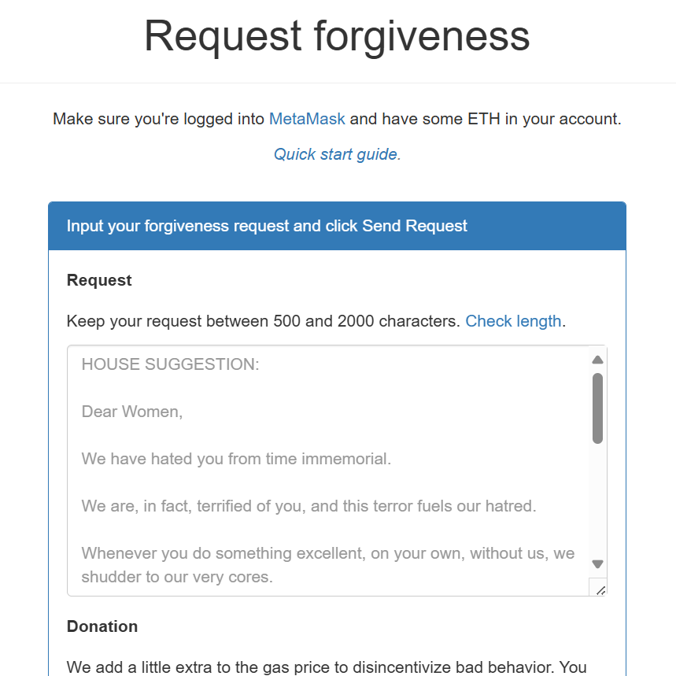

# 2019

## January 2019

- An old friend Willow comes round, I wonder what prompted her to visit, it was not a good time.
- I don't want to talk to her and I tell everyone at home that.
- My mother is very keen I talk to her and badgers me to do so.
- I go to talk to her.
- Seeing Willow who was around during the rape-gang times in 1989 is very triggering for me and I wish people would have listened to me when I told them I did not want to see her.
- Shortly after, no doubt with more online triggering, I take an overdose of valium and end up in A&E.
- The drug nurse meets me the next morning and puts me into the drug rehabilitation system.
- I quit valium and alcohol immediately.
- I find out valium isn't a drug you can die from later on. I'm much relieved about that.

## February to June 2019

### Online sleeping pills

- Is this how they administer hallucinogens to the general public via the postal service?
- If you took a sample of my mother's sleeping pills she gets online, would you find ketamine in them?
- wip.

### Drugs rehab in Finchley Central

- I'm working 3 days a week at a crypto firm [FetchAI](#fetchai) and going to outpatient rehab the other days in Finchley Central.
- A colleague exposes himself online on Zoom to me at FetchAI. I guess another female-tech-colleague-you-hate porn upload.
- Anyway.
- Rehab is an AMAZING experience and incredibly helpful. Lifesaving.
- I feel so safe there, like I have a whole new family.
- It's kind of inexplicable because, apart from me and a handful of others, the majority of service users are professional drug-addicted criminals.
- You'd think I'd be the least safe in an environment like this, but this is not what my body is telling me.
- In retrospect, I realize that none of these men could afford the kind of porn subscriptions my engineering tech colleagues have been paying for, so of course they won't have seen me regularly in porn, and for that reason, the energy they give me is cleaner and I feel safe with them.
- Perhaps they have suffered similarly too.
- Although, on a couple of occasions, in group therapy, one of the participants might make a comment which seems to suggest they know what I'm watching on Netflix at the time, or what I've read online recently.
- That could easily be a simple prompt from their drug dealer, I guess, and of course from the same criminal gangs that control the expensive subscriptions.
- I see a psychotherapist once a week at Barnet Hospital.
- I have no idea I've been continually sedated and raped for years in Spain, and this includes incest.
- I believe my mental and emotional state is entirely due to my experience of the rape gangs in Tottenham in 1989.
- I talk about that.
- And I'm healing.
- Something happens at home and I realize I have to get away from my family if I want to really heal.
- I make plans to move to Ireland.
- I'm choosing Ireland because I have connected with a trauma therapist who is going to be giving courses there from February 2020, Steve Terrell.
- I'm still feeling suicidally depressed and anxious, but less so, and I'm not using any medication or drinking alcohol.

### Fetch.AI

- The crypto firm I work with is Fetch.AI in Cambridge.
- One of the developers does something extremely weird while I'm there.
- We have an online meeting set up first thing.
- I turn up and put my zoom on.
- His camera is under his desk pointing to his crotch.
- He is sitting at his desk in his boxer shorts.
- I ask him what's going on.
- He fixes his camera.
- He doesn't apologize or explain.
- I laugh it off, as we women do knowing we can't really complain because it's just too much trouble and we need to work.
- Furthermore, I am a contractor so I cannot make an official complaint about sexual harassment anyway.
- Was this man connected up to online porn-addict communities and did he know who I was from the [porn fatwa](../2001-to-2010/2003.md#porn-fatwa) now getting out of control?
- Did he upload that morning meeting to the tech-bro porn-networks?
- James Dawes and his team [use the word "Fetch" over and over in their October 2024](../2024/october.md#bullying-ramps-up-at-polygon) meeting at Polygon in 2024, which I believe was specifically done to terrorize and persecute me, with management's awareness and complicity in the bigger story.

## September 2019

### Brother making sure I won't come back looking for help once they've got their claws into me

- I come back from Lourdes and Cauterets.
- My brother behaves in conservatory-like ways; upsetting me on purpose.
- I make green juice and leave it in the fridge.
- When I get home from work the next day I take some.
- After about an hour, I'm violently sick.
- I ate nothing else since morning.
- My brother hates me so much at that moment the idea of poisoning crosses my mind.
- I'm horrified to even think it.
- Nevertheless, I'm more determined than ever to leave, and it is my feeling I will never come back.
- You know, all this makes dad and Robert's very loud and drunken chats outside my door at 12.30am every night over this period about what a good bloke Hitler was, look a little different (I'm not sure I have a drop of loyalty left).

## October 2019

### Hanuman puja with guruji in Rishikesh

- I travel to Rishikesh with Guruji.
- We stay at an ashram on the Ganga. It is heaven and I feel like I could stay forever.
- We are visiting Kedarnath. It will be my second time there.
- I meet Yan on the journey and we have some extraordinary chats on an even more extraordinary bus ride.
- I'm unable to enter the temple at Kedarnath.
- My heart is breaking.
- Back in Rishikesh we do Hanuman puja.
- This is when Hanumanji truly entered the picture.
- The day I leave Rishikesh I find my Hanuman figure and I carry it with me everywhere I go until November 2024 when I lose it, I think, or I leave it at the jyotirlinga in Omkareshwar maybe.
- And then I get a tattoo of Hanumanji so that he will always be with this body protecting it, like he did anyway, but super-powered.
- And I put it on my somewhat broken calf-pump.. which has been healing since.
- And that's Hanuman.
- Always with me.
- Oh, and during Hanuman puja at the ashram in Rishikesh I felt like I was about to fall into total bliss, but I pulled back because I was scared I would never come back from it I was so sad about my family, and I may have been right.
- So I didn't go into bliss, but it was very close, and I felt it right there, and it was with Hanuman.
- I hope I get the chance again sometime, when things aren't so precipitous perhaps.
- In other news, my injuries and ailments appear to be healing (June 2026) I may have pulled a wart out of my nose!! hahaaa.
- These bits aren't interesting but I've no-one to talk to about this sort of thing, so y'all are getting it.

### Leaving 31 with a broken heart

- I leave London.
- The day I leave, my brother says some nasty sexist comment to me as I'm walking out of the door.
- I have limited communication with my parents until October 2021 when I go no contact, I have no contact at all with my brother.
- He made sure I would not return, and I went to live in the forest with the demons and everyone hacking me.

## The forgivenet®

- I build and deploy the [forgivenet® crypto app](https://1frgvn.com/).

