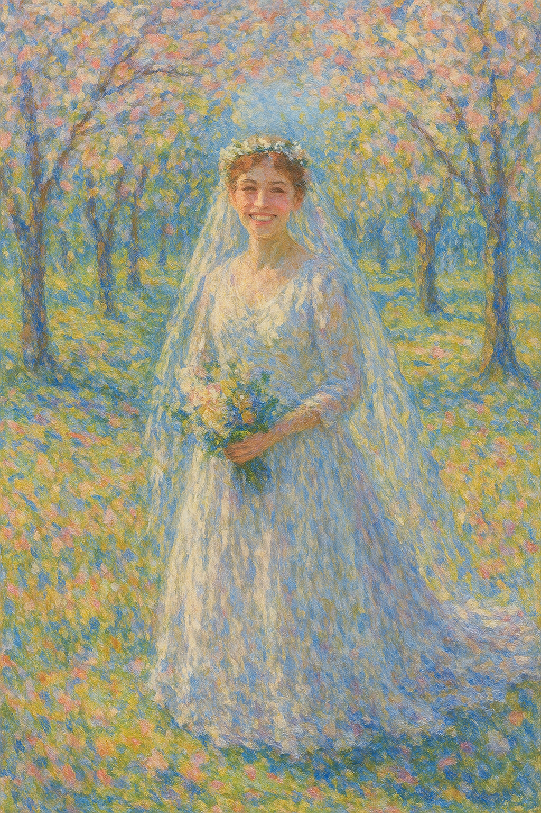
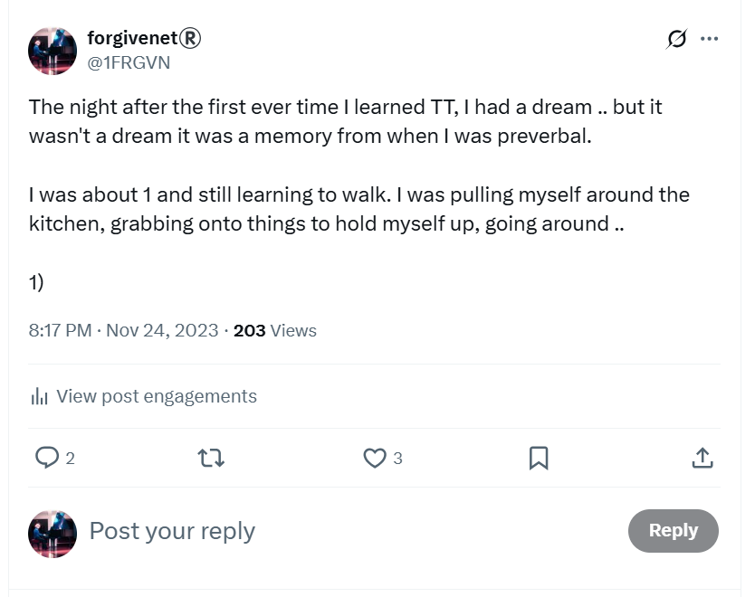

# 2020

- I live in Belfast City Centre in the Obel Tower.
- I have a lot of work, especially during Covid.
- I work to distract myself as I'm suffering from depression and anxiety.
- I work three jobs sometimes.
- I don’t like Belfast. It's a very harsh environment for me. 
- And, I was targeted by Belfast-based criminal gangs even before [the moment I arrived](#targeted-by-online-scammers), which set the tone for my whole time there.
- I realize I need to give back, to help others who have had similar childhood experiences to mine.
- I start volunteering with Childline and find out about trans ideology and the sterilization and mutilation of children.
- I am utterly horrified!
- I realize that if I had been born 30 years later, I would have sought comfort in trans ideology and the belief I didn’t have to be female anymore after serious and repeated sexual abuse.
- I'm only onsite at Childline in Belfast for a short while before we have another covid lock-down and the NSPCC set up their systems so we can all work from home.
- I end up volunteering for Childline online for about 2.5 years.
- *Criminal gangs of Belfast, Dénia, North London, and goodness knows elsewhere attend, via my hacked routers and laptops, every single counselling session I work!*
- Perhaps this is one of the ways they field for and subsequently harvest their self-harming, mostly female, minor-child porn-victims, ready for hacking and filming with their new online *friends*; subsequently streamed to millions of sick subscribers around the world.
- I tentatively join Twitter at one point in 2021 to keep up with the news around what's happening to children in the UK, but I get worried about being targeted by violent and aggressive men, and so I delete my account.

## Targeted by online scammers

- Before I even arrive in Belfast, I fall into the clutches of an extraordinarily unpleasant company [Key 1 Properties](https://www.keyoneproperty.co.uk/).
- The company is run by a wild man; Mark, and his family.
- The website has changed since 2020, and the street address for the business has also changed.
- No doubt online manipulation drew me into their clutches.
- I'm completely alone now, ripe for the pickings.
- I find them on Hotels.com, they're also advertising on AirBnB and similar.
- I book a flat to stay in for two weeks in December 2019 while I'm looking for permanent accommodation. 
- It's the only option coming up.
- I could find nothing else in the whole city.
- I end up having to pay them directly, i.e. outside the website, which is why their scam is successful.
- The property is an upstairs apartment on Ravenhill Court and may have been the scene of a horrific violent murder in the past.
- As I drive up, I see a black male coming out of the front door. I see him again on the street when I look out of the window later on.
- There is a bottle of whisky in the kitchen cupboard and the house stinks of smoke.
- I specifically requested non-smoking. 
- The apartment has security cameras all over the place; in the kitchen and bedroom, probably bathroom too.
- I didn't know what these items were at the time.
- I only realized what they were in retrospect when I bought some myself to use in the Obel Tower.
- I'm very uneasy; I have a terrible night in dread and fear, a living nightmare, without sleep, and I leave the following morning.
- I sleep next to an open window because of the stink of tobacco.
- My car was keyed while parked outside that night.
- The company insists they will not refund me; they are wild and rude; the sort of people that talk to you in a way that sounds like they only speak to people who are frightened of them.
- I do get some of my money back as I paid a chunk by credit card.
- I attempt to take them to small claims for the rest but they bully and threaten me so much I give up.
- They have a woman who apparently cleans for them lie - in writing - about the smell of smoke, and other things.
- It was overwhelming.
- It went on for months and I felt threatened and vulnerable.
- When I research them online, I find out that they are very likely a criminal gang; I read complaints just like mine; he's apparently driving around in a Ferrari; that sort of thing.
- I speak to my mother on the phone. I explain everything that has happened with these people. It's as if I had said nothing at all. She completely ignores everything I said, pauses briefly and changes the subject.
- I wonder about this now. Did she know what was going on in some sense? Had my brother told her enough for her to figure it out and choose to side with him?
- The gangs will have been listening, noting her lack of interesting, assuring themselves even further that I am a worthy target and no-one will ever help me.
- Did my mother do this intentionally?
- Did I see this [Mark at a property I viewed a week later](#finding-a-flat-in-belfast)?
- This is the first moment I feel like I have ants all over me and I cannot get them off.
- I will feel this way until August 14th 2025.
- I believe Noah Donohoe was targeted and murdered by the same honey-trap criminal-porn-production scammers giving me a hard time, those inextricably attached to North London's finest, British and Spanish criminal gangs and, thus, similarly untouchable.
- The current *inquest* into his death is pure BS.
- They'd have his hacked phone and would be able to easily tell how gangs had been mapping his movements; setting up a honey-trap up the road from where he lived; and other stuff.
- They literally enjoy it.
- They got away with Madeline, they get away with hundreds of women and children in Spain and North London, they were desperate to have another go and knew very well that the investigation would be fumbled by the porn-addicts in the police forces they own.
- God help me, he didn't end up in the [Obel Tower](#the-obel-tower) did he?

### Finding a flat in Belfast

- After the Key One drama, I stay for two weeks at the Marriott in Belfast.
- The experience with Key One was traumatizing, and I'm stressed and anxious.
- While I'm at the Marriott, I look for a rental property.
- Again, looking back, it seems I'm lured to places online.
- A curious incident occurs at the first apartment I look at.
- A man shows me around the upstairs flat.
- It's possible I see this man again towards the end of the year in the lift at [the Obel Tower](#the-obel-tower) putting on a bad southern Irish accent.
- As we're coming out of the apartment, a small black-haired wiry man who gives me a bad feeling is coming out of the opposite apartment.
- He is with a scantily clad woman and he seems to be controlling her somehow (does he have his hand around the back of her neck?).
- Is he Mark from Key One?
- I always thought something was weird about that; timed, staged.
- I eventually decide to rent an apartment at the Obel Tower.
- The man that showed me around was so desperate I rented the first it, he tells me his wife has decided to lower the rent, in a landlord's market.
- I decline. I've decided on the Obel Tower.
- Could the Key One Property drama be the *outrageous and traumatic event* they set up to explain an otherwise inexplicable fear and anxiety (just like the conservatory bullying) whereas the stress is actually instead coming regular sedation after going to sleep and men entering my apartment without my knowledge?
- Just like Dénia in 2013-2016 and likely before in Cami Llavador; Carrer Furs still to come?
- Are remote-control sedating mechanisms placed in my bedroom by the multiple dodgy men who manage the building, or gangs that pay those men handsomely for access to the keys?
- Is the whole building used to live-stream spy-cam sedated rape porn of single vulnerable women, or did it start after I'd moved in there?
- Was the Obel Tower targeted by the gangs after my arrival, and because I decided not to rent the apartment they'd lured me to, and given my sedated-porn-stardom history and the risks and resources multiple criminal gangs were willing to take and spend on me and no doubt others just like me?

## Queen's Sports

- Before COVID, I signed up to Queen's sports centre where I used to go when I was studying for my MSc in Computer Science.
- I took a water aerobics class - how about that.
- I had dreadful cramps in my feet at the time and kept having to get out of the water.
- There were a couple of weird blokes in the class one of whom looked [exactly like the recruiter who phoned me in August 2023](../2023/august.md#the-recruiter-calls-me-while-im-visiting-the-bees).
- I say weird because they notably couldn't look me in the eye.
- Eventually I thought they were just coming to the class to see the instructors boobs bounce up and down.
- One evening after class, I was going back to my car, and I bumped into a family member in (what seemed to be weird at the time and now I suspect was staged by criminal gangs with their pinpoint access to my whereabouts).
- He did not acknowledge me but it had been years since we saw each other.
- I told my mother I thought I'd seen him.

## The Obel Tower

- It turns out all the apartments in the Obel Tower are accessible by anyone and everyone. 
- My apartment in Lourdes in 2021 is exactly the same - it's a health and safety thing, apparently.
- I'm unable to bolt the door from the inside.
- The caretakers have a bunch of skeleton keys that open every single apartment in the building - perhaps not the bought properties where owners have changed the locks like [the woman I got to know a little](#a-woman-with-an-extraordinary-leak-from-upstairs) who ran the [Facebook group for tower occupants](#the-obel-tower-facebook-group-and-its-pornographer-members).
- The caretakers are mostly rough Belfast men and on the make constantly.
- For example, they rent out my parking space while I'm away to a visitor without asking me, and I've nowhere to park when I arrive home from holiday.
- I am very uneasy the whole year I live there, and this is what prompts me to ask about renting a flat in the place I've been staying at Lourdes for years when I visit there again in August.
- I have a strong feeling people are entering my flat without my knowledge.
- I even sleep with a knife close by because I'm so convinced I'm in danger.
- I kid you not. I even tweeted about that.

### I put some security cams up

- This was so late on, probably October/November of 2020, I don't know why it took me so long.
- I buy a security cam and set it up to point at the front door whenever I go out, the only access into the flat.
- I can't remember, but I may have put it on at night when I went to bed too.
- In any event, I feel immediately and palpably safer at home; as if I had not been imagining the threat.

### A woman with an extraordinary leak from upstairs

- During COVID one of the occupants, an owner who started a [Facebook group for the people living in the tower](#the-obel-tower-facebook-group-and-its-pornographer-members) had a major leak.
- I met her often in the lift or at the post room.
- I cannot remember her name. She had long brown hair, was about my height, a good decade younger, and owned a two-bedroom flat on a lower floor than me (I was on the 19th floor).
- Anyway.
- I met her one time and she was telling me about the leak in her apartment (and/or she may have published this on the Facebook group and we were chatting on there about it).
- It was around September time I guess, and the leak had come from an upstairs bathroom, someone left the shower running and it had been left running for days, literally, the flat right above hers... and of course the damage was extensive.
- I said, but they can access all the properties, how were they not able to get in to sort it?
- She said, because the locks had been changed.
- But this was a bit phoney in my view because... it was an AirB&B type apartment, apparently, so the health and safety would have had to kick in... and because these guys (the caretakers... ahem) wouldn't have let that go on for so long without some ulterior motive, in my view.
- Were they keen to get a spy-cam system/or sedation system set up in her apartment but couldn't get in cos she'd changed the locks?
- Was this their evil scheme to gain access to another single woman's apartment?

### The Obel Tower Facebook group and it's pornographer members

- The same resident with the leak I just mentioned, an apartment owner, set up a Facebook group for residents of the tower while we were in one of the lock-downs.
- I joined.
- I was a bit horrified to notice men in the group claiming they were making porn from the apartments.
- I wasn't sure if they were just being idiots, or telling the truth.
- I'm fairly sure it was truth telling, today.

#### Gang rape, incest, pedophilia, sedated sex-slave spy-cam

- Back in the day, the most lucrative porn-genre was gang rape, then gang rape of seriously young girls, then children..
- Then came incest - in fact, apparently normal men are prepared to openly tell you that their favorite porn genre is incest, as if it's completely normal, wholesome, OK.
- We are talking millions and millions of men here, all over the world, while no-one ever mentions the porn-problem never mind the sedating-for-porn problem.
- The gangs must have made soooo much money from [my dad's porn-stardom at Joan Fuster](../2011-to-2020/2015.md#inexplicable-anal-fissure), they were desperate for a sequel.
- And they have become steadily became more and more depraved, haven't they, as if it's a serious psychopathological addiction that they have no control over, en masse.
- Please God no, let them have it wrong this time please, but I know they're likely right, porn to prove it.
- God help us all.
- Are we done yet? Please say yes. I'm grateful we've got em at the Obel Tower.

### Familiar faces in the lift

- I saw a couple of familiar faces in the lift.
- The man who seemed to be the same guy that had shown me around the first floor apartment in Ravenhill Park area of Belfast after the horror show at Ravenhill Court putting a southern accent on... he looked a little like Brian Higgins too, they both did if they weren't the same man.
- David Hill, my classmate at Queen's, who I met in the lift one evening in November of that year probably.
- He didn't speak much - which was a bit weird - he told me he owned a property in the building after I inquired.
- I'm not sure if that was true though, I never saw him again.
- I'd put money on David Hill having a criminal porn subscription, possibly from even when I knew him back in 2003/4.
- There was a night we had gone out and gotten terribly drunk in 2003, and he had said to me: *you must have been hurt seriously badly* inexplicably, and I was furious with him and had as little to do with him as possible afterwards!
- Where did he get that from I do wonder?

### The Polish caretaker

- One of the caretaking team seemed to be a nice man; Polish, Catholic, but they put up with him..
- I was trying to get rid of my giant heater before I left for Lourdes and in the end I gave it to him.
- He was perhaps a little too nice... like, looking back, I think he probably knew what was going on very well, like all the men seem to, like it's all OK hunky-dory.

## Transforming Touch

- I begin my trauma therapy study and practice with Stephen Terrell from Austin Texas.
- When I was [on my knees in January 2019](2019.md#january-2019), I prayed to Mary for help, and *somehow* I came across [Steve's website](https://www.austinattach.com/).
- I watched a few videos and listened to some lectures.

<iframe width="672" height="378" src="https://www.youtube.com/embed/MGkLEPmdkcE" title="Transforming The Experience Based Brain | Stephen Terrell" frameborder="0" allow="accelerometer; autoplay; clipboard-write; encrypted-media; gyroscope; picture-in-picture; web-share" referrerpolicy="strict-origin-when-cross-origin" allowfullscreen></iframe>

- Something resonated strongly.
- I noticed the picture of Bernadette behind his desk in his office.
- My intuition was screaming at me that he could help me, and so I reached out to him.
- He said he wasn't able to take me on as a client as he was too busy, and in Texas, but instead he suggested I attend his courses and learn about the practice.
- I waited a year to attend the course and this is why, ostensibly, I moved to Ireland.
- I attend the first in-person course in Cork Ireland in February.

!!! tip "Healings, past and future"
    - About 75 people, professional therapists and others, turned up for that first course in Cork.
    - At the end of the first day, Steve told us we may dream about him that night.
    - I thought he was joking, but perhaps his little voice told him to say that.
    - I did dream of Steve that night. 
    - Well, I heard his voice commenting a few times in my dream.
    - I had two dreams, one of the past and one of the future.
    - In the first, I am pre-verbal, about one-year-old, and I'm practicing walking in the kitchen by hanging onto the cupboard doors and drawers and pulling myself around.
    - My aunt Patricia is looking after me and my cousin Leah.
    - I'm not sure where my mother is; she's not in the house.
    - Suddenly, from behind, hands grab my throat and start to squeeze.
    - I can't breathe or speak and I'm terrified.
    - I don't know who is behind me.
    - My aunt's voice says from behind, "Oh look, someone's throttling you Katie".
    - My cousin is going ballistic, screaming and crying.
    - Steve's voice says; "mom, mom"; and I took this to mean that my aunt was "getting my mother back" for some offense.
    - I wake a little, back in Cork, shocked and sweating. 
    - I take a few deep breaths and fall back to sleep again.
    - It is my wedding day, except, I'm looking at myself through the eyes of the groom. 
    - We are outside. It is spring time and we are among a semi-circle of trees.
    - It's a Mediterranean setting; a happy and joyous occasion.

    

    - I wake up.
    - God gave me a joyful and hopeful vision to ease the sudden realization that I had been silenced in the most appalling manner from nearly the beginning of my life. 
    - Whoever my husband to be *is* in the vision, I am in his head looking out at myself.
    - Does this signify a Holy Relationship as per A Course In Miracles.
    - I believe so.
    - Sometimes prophetic dreams do come true, and sometimes even in ways wondrously unimaginable by mere mortals.
    - I tweet about this dream in November 2023.

    

    - It's likely I'm being stalked online by my cousin Leah at that time, at the request of North London criminal-gangs connected to Spain who are panicking along with the Spanish at my refusal to stop attending classes at the conservatory.

### She reminds me of my mother

- wip

## Ongoing study

- I have been attending these courses around three times a year since 2020 and I am now a qualified practitioner.
- It is curious that I didn't see Steve in person again until just a few days after teachers and staff at the conservatory of Dénia set up [my 'funeral'](../2023/june.md#monday-12th-june-2023) in the attempt to give me a reason for intense anxiety after sedated sexual abuse at my home.
- At that training, in [June 2023](../2023/june.md#ireland), I was utterly traumatized, completely shattered; everyone noticed.
- Yet, again, Steve's work brought me back to a center of resilience and strength so I could go on.
- I didn't know at the time, but I had been being sedated and gang-raped repeatedly at my home for months on end, if not for over a year, and two days before seeing Steve that afternoon would have been one of those times.
- I even told Gerardine, one of the TT facilitators and practitioners, that [I had poo-ed myself while sleeping recently](../2023/may.md#teb-with-robin); the first time in my life.
- Sedated anal-rape never occurred to me at the time.
- [I told Robin too](../2023/may.md#teb-with-robin), another practitioner.
- The night this happened was a Monday night after chamber music classes; the night [the trumpet teacher](../../crimes/protagonists/vidal-sastre.md#a-man-called-bruno-with-at-least-one-son-called-bruno) had called to say there'd be a ***double session***.
- Perhaps [the whole switcheroo team](../../crimes/protagonists/vidal-sastre.md#six-distinct-men) turned up that night at Carrer Furs, live-streamed to the town, to my tech-colleagues, and to a world-of-perverts.
- Perhaps dad paid for a private viewing of it at the Red Lion in a back room.
- I give all my therapists full permission to divulge anything and everything I have told them that might help the women and children of the Marina Alta region and beyond.
- The [Transforming Touch](https://www.austinattach.com/transforming-the-experience-based-brain/) practice has given me the support and strength I needed to survive years, maybe decades, of criminally vicious attacks on my physical, psychological, emotional, and sexual wellbeing at the hands of the people of Dénia, including teachers and staff at the conservatory, and others.

#### Something Steve said online about relationships

- I remember him saying this a lot online in 2020 and 2021 when I was in Lourdes especially.
- He used to talk about the best place to find a partner being the funeral parlour.
- Whenever he started talking about relationships, I just switched off, sworn-celibate you know, not interested.
- But of course it was an unusual thing for a person to say so I listened more closely.
- He explained it as... a person who loses a partner through death is obviously a good person, easy to get along with, has fewer issues than most.
- They also stayed till the end, especially important if they lost their partner through sickness.
- So Steve's logic was that if you want to meet someone stable, go hang out at the funeral parlour.
- And he'd say that a lot.
- I wonder about that now... too... don't you?
- Yes, you do.
- Every last one of them.
- Was that precisely the nature of [Domingo's apartment containing a full set of very expensive British pottery](2014.md#i-visit-domingos-house) that he told me he was planning on taking with him when he left? 
<!-- oh my God, there's gonna be a stampede, no-one is gonna be happy about their families, parents, children, people who care about others being let alone with these people for decades so that they can be murdered and robbed, wow, they're utterly screwed, I mean the total and utter shame of it, there's thousands isn't there... I'll have to make a list right now -->

## End of December 2020

- I move to Lourdes in France.
- I am working as a contractor and full time technical writer for web3 software companies.
- I'm still working multiple jobs to distract myself from depression.
- My dad is supposed to visit me in Dublin for Christmas.
- Ireland locks-down again for covid the day he travels and he cannot come.
- I'm relieved about that for some reason.
- Did the people at the Red Lion tell him to visit me again?
- It was his idea to visit, like before.
