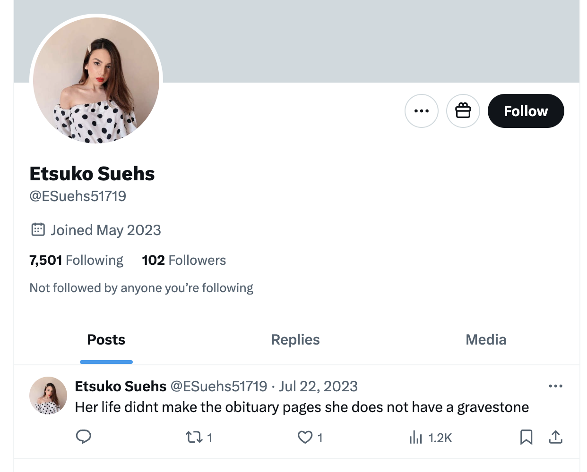

## Dénia

- I had planned a trip to Egypt in December for Christmas but my flat in Lourdes got serious bedbugs about three weeks before I was due to leave.
- I changed all my plans and spent most of December in Dénia instead.
- I stayed at two hotels and logged into their networks.
- I had been doing a lot of apartment searches since August and had found nothing at all.
- On December 8th, however, a very significant day for me spiritually, while I was in Dénia, an apartment came up for rent which was perfect; too good to be true even.
- Carrer Furs 15, Bloque 1 Escalera 2 Piso 3 Apartamento 17, Dénia 03700 Alicante.
- I contacted the landlady, Beatriz Garcia Morales, and signed the agreement.
- The landlady, Beatriz, was angry and disagreeable. Hackers have more recently mentioned her demeanor online to me over the summer in 2024.
- I signed the [rental contract](../../content/documents/contracto/rental-contract.pdf) and moved in on December 15th. A copy of the signed contract will be posted in due course.

!!! danger "Death clause"

    - There is a clause in the rental contract about what happens to my body and belongings if I were to die in the flat prior to the lease running out or after.
    - It appears to relieve the owner of all indemnity.
    - For a contract with an initial term of 1 year, this seems a little strange.
    - I have never seen a clause like that in a rental contract before and I have read a great many.
    - Click to read the [death clause](../../content/documents/contracto/death%20clause.jpeg) in my rental contract.

- She only gave me one key, of a set of four, and there was a bit of a drama about where the other keys were which seemed contrived.
- I didn't trust Beatriz Garcia Morales and, from her weird behavior and manner, I felt it likely she would enter my apartment without my knowledge.
- A few days later I suspected someone had been in without my knowledge.
- I got the locks changed soon after by locksmith Carl Barclay, +34-659-85-36-45.
- Nevertheless, I believe people have been entering my house whenever I'm not there on a regular basis the whole time I lived there. It's not clear how they got entry after I changed the locks. I guess that would be a simple matter for a criminal gang.

!!! info "Who has been receiving my rent payments?"
    - Beatriz has changed the account I pay rent to twice now.
    - I have paid rent to three different accounts in two-and-a-half year's of tenancy.
    - I don't believe all these accounts are hers and I suspect that finding out who in fact owns these accounts may be very enlightening.
        - ES7320950444909122412071
        - ES1201280601880100047345
        - ES6800865106190015755620

## Semen stains on the sofa

- When I moved in, the flat didn't seem to have been lived in properly for a while.
- The water ran brown in the bathtub. The boiler was so old it broke down a year later and had to be replaced.
- There was untold rubbish in the kitchen cupboards which I cleaned out.
- There were semen stains on the sofa. 
- At the time, I thought it was because the apartment had probably been used as an AirBNB type property and the visitors may have been on romantic weekends. It was disgusting though and I cleaned it off.
- The landlady, the caretaker at the time Pedro, and my neighbor Marie Carmen at number 16 talked about a woman renting the flat just before me, and running away shortly after without saying why. She was a nurse at the Dénia hospital.

!!! important
    - I believe the references to the nurse also relate to a woman the gang stalkers have more recently been posting on Twitter in poses which are clearly going to be pornographic - filmed with or without her knowledge. 
    - She is often dressed as a nurse.
    - The following fake account was posted sometime in the summer of 2024.

    

    - Note the threatening statement, a common characteristic of the cyber-stalking I have been enduring.

    

    - Fake accounts like these may have one or two posts, messages in the profile itself, or in the top posts below the profile.

- I wonder if she left hurriedly because she realized she was being drugged and related it to something in the apartment.
- The email address of the previous tenant may be `sonyaortyz@hotmail.com`, an unusual email address for the landlady which is written on the water bills and seems to be an oversight.

## Walking

- I met Christine BJ to go hiking on the mountain and she invited me to go walking with the English ladies on a regular basis once I returned in February 2022.
- At this point, a couple of the expat-Anglophones offer me available apartments they suggest I might like to buy. 

## Back to France

- I went back to France at the end of December to finalize the flat there.
