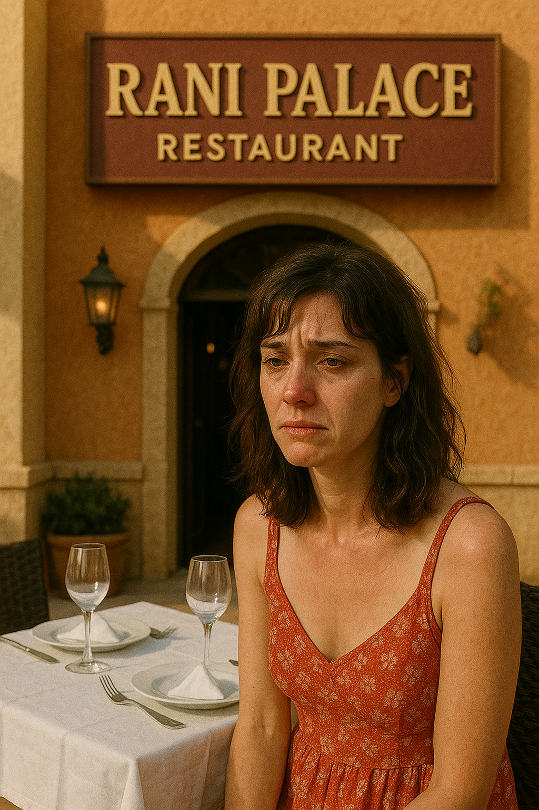
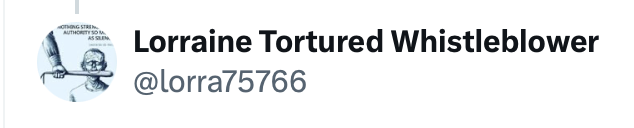
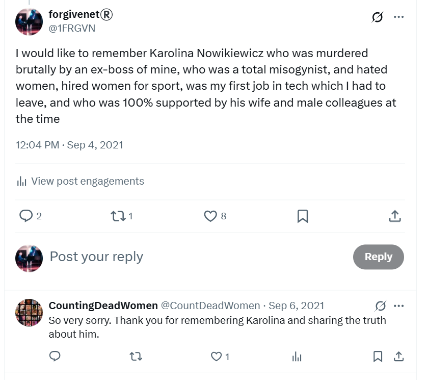

# July 2021

## Dénia holiday

- I go to Dénia for my summer holiday. I wonder now if that was "suggested" online to me.
- The day I leave I feel extremely unwell in a weird way, not sick exactly but nothing is working properly. I feel heavy, tired, and unwell. My eyesight is straining and I feel a little nauseous. Thinking back, it is rather like the poisoned feeling I often had in Dénia in my apartment.
- During my trip, I meet Christine BJ for lunch a couple of times. She tells me her views on trans ideology and I quietly agree. 
- I share with her that I am a child sexual abuse survivor of a grooming gang. I also tell her that I probably would be trans and removing my breasts, womb, and ovaries had I been born 30 years later.
- I tell Christine I have been suffering from a debilitating depression after reporting child sexual abuse to the Met Police in 2016.
- I also tell Christine BJ that Lorraine Blackbourn just committed suicide. 
- She pretends not to know about this.

### The tiny Ecuadorian woman

- At the hotel I'm staying at, the Daniya, there is a tiny Ecuadorian woman waiting tables in the restaurant.
- She's beautiful and young.
- I know her. 
- She was in Klara Sarkadi's choir when I was a member.
- A great sadness is coming from her.
- She knows who I am too. 
- She wants to tell me something.
- We never speak.
- I now believe she was targeted, like me, via the Orfeo de Denia choir, Klara Sarkadi, and maybe even Mercedes too.
- She wanted to tell me this; and somehow she did.
- Maybe she also wanted to tell me the truth about Lorraine; that probably everyone knows.

## Lorraine Blackbourn commits suicide

- [Lorraine Blackbourn](../early-years/2008.md#working-for-lorraine-blackbourn) killed herself the week I visited and her funeral was on or around the day I arrived. 
- A few days after that, I was coming back from the Las Marinas beach towards the Daniya hotel where I was staying.
- As I crossed the road in front of the [Katmandu Indian restaurant](https://www.google.com/maps/place/KATHMANDU+RESTAURANT./@38.8473292,0.0998328,17z/data=!4m14!1m7!3m6!1s0x129e1b1eab713bef:0xb942b79aaf5ee018!2sRestaurante+Rani+Palace!8m2!3d38.8463516!4d0.1075146!16s%2Fg%2F11cmfs1pyt!3m5!1s0x129e1b117d23e84d:0x99265dc6a93775f6!8m2!3d38.8489761!4d0.0971108!16s%2Fg%2F12cp73vx8?entry=ttu&g_ep=EgoyMDI1MDcwOS4wIKXMDSoASAFQAw%3D%3D), I saw an old friend, Caroline, sitting at a table-for-two on her own, right in front of the entrance.
- She looked devastated.

- I wonder who Caroline was with, and where that person was at the moment I saw her.
- Or was she eating alone?
- It was an odd place to sit if you were crying your eyes out.

!!! danger "Astonishing timing"
    - I now believe Lorraine was targeted online like I was, using NLP and sentiment manipulation and possibly drugs and poisons.
    - I believe she was driven to suicide.
    - Is something extremely sinister going on in Dénia?
    - Did criminal sex gangs simply walk in and take over a small town already gone very wrong?
    - Did the criminally insane realize they could do whatever the hell they liked to the good people of Dénia, and get away with it?

- Like all the choreographed moments-in-time to come, was this one also prearranged? 
- If so, by whom?
- Lorraine was a British woman I used to work for in Dénia. She ran the English Studio academy there. 
- I mention her in a [previous chapter](../early-years/2008.md#working-for-lorraine-blackbourn).
- Due to depression, I had disconnected from everyone I knew. It didn't seem fair to keep people close. I was also finding it extremely difficult to relate to people because of my experiences and the anxiety I was suffering from.
- For these reasons, I wasn't in touch with anyone in Dénia and I didn't know Lorraine had died by suicide until nearly a year later when I bumped into someone who told me. At the time, I had assumed Lorraine's death was due to illness.

!!! warning "Retrospective concerns about Lorraine's untimely death"
    - I'm concerned now that Lorraine may have been driven to suicide, in the same way gang stalkers clearly wanted my life to end.
    - Fake and stalker accounts on Twitter often mentioned Lorraine in relation to stalking and "whistle-blowing", a reference I didn't understand, and still don't. 
    - Maybe law enforcement will understand what this means better, or maybe they ignored her too.
    - The account below had been following me for some time around March 2024 when I finally left my studies at the conservatory due to being made afraid for my life.
    - This account ran gang-stalking harassment interactions with me, with the help of some of the other accounts. I found the name and content choices interesting.

    

    

    - The account is now deleted.

### Thinking about moving back

- While I'm there, I remember how lovely Dénia is, and how much I loved living there, and I start to harbour a strong desire to move back.
- I search for a flat repeatedly online but there is nothing available.
- I realize AirBNB type accommodation has taken over the rental market in this part of the world.

## Joining Twitter

- I join Twitter with my account [@1frgvn](https://x.com/1FRGVN) in August.
- I am anonymous and I use my account to support activists against the abuses to children and women's rights arising from trans ideology. 
- I also use Twitter extensively as therapy and post often about my child sexual abuse experiences and the suicidal depression I have been suffering since 2015.
- Anyone stalking or surveilling me at that time will have had a deep insight into my state of mind and could only assume that a three-year campaign of terror against me would likely drive me to suicide.
- As well as my state of mind, I mention old experiences which will be used later on to intimidate and terrorize me while I'm being stalked online.

