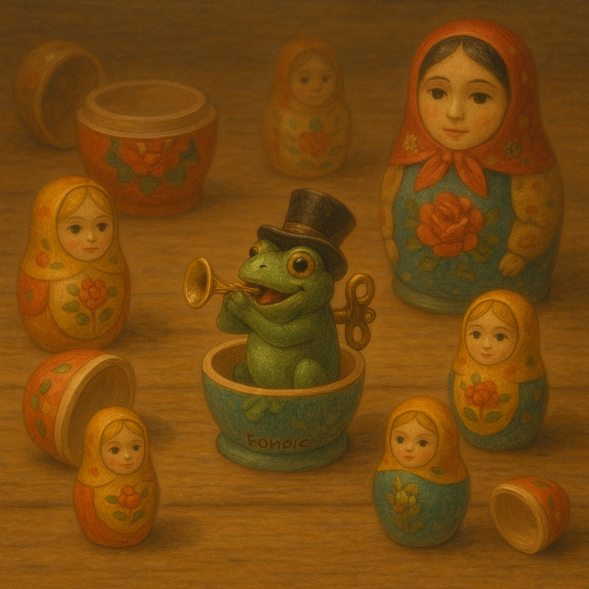
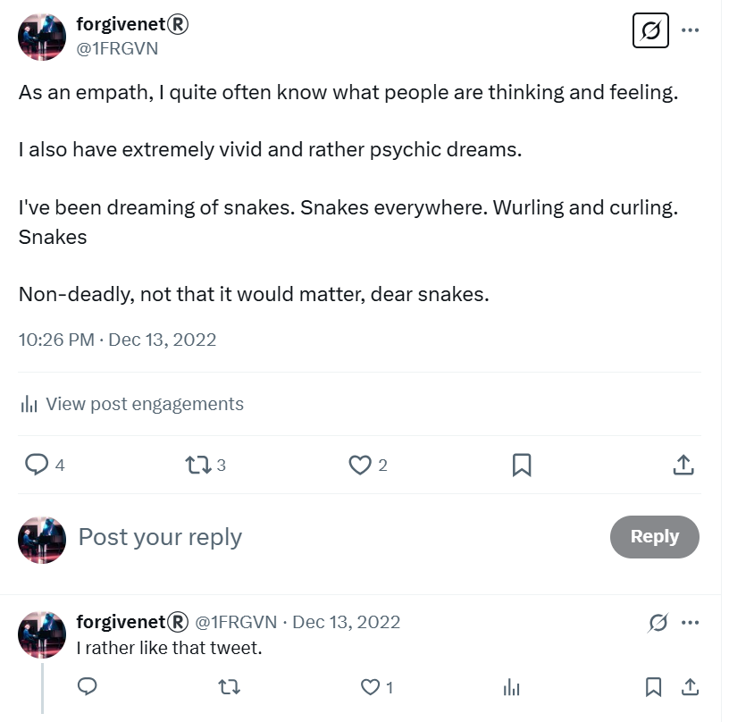
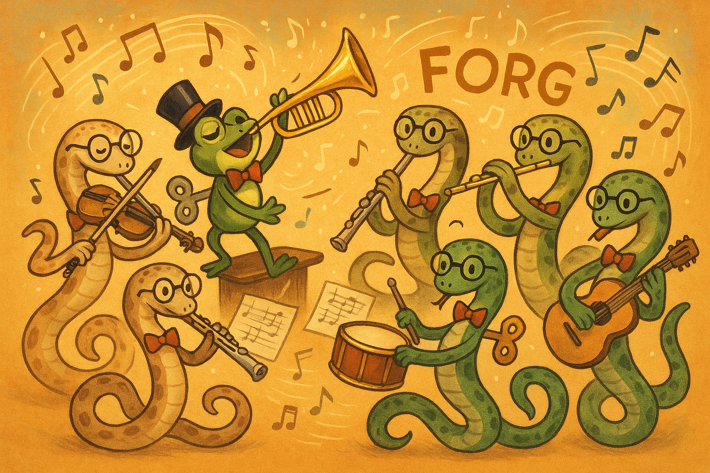
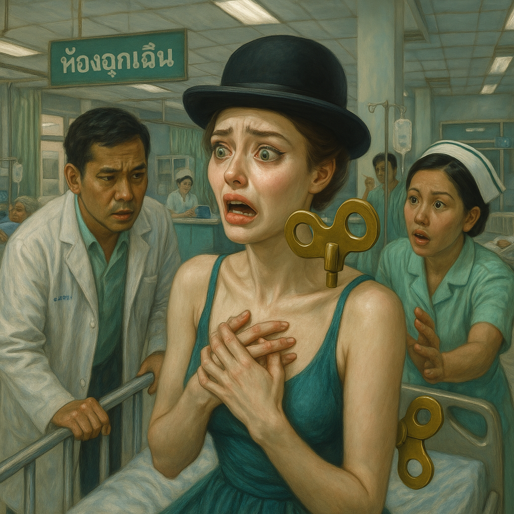
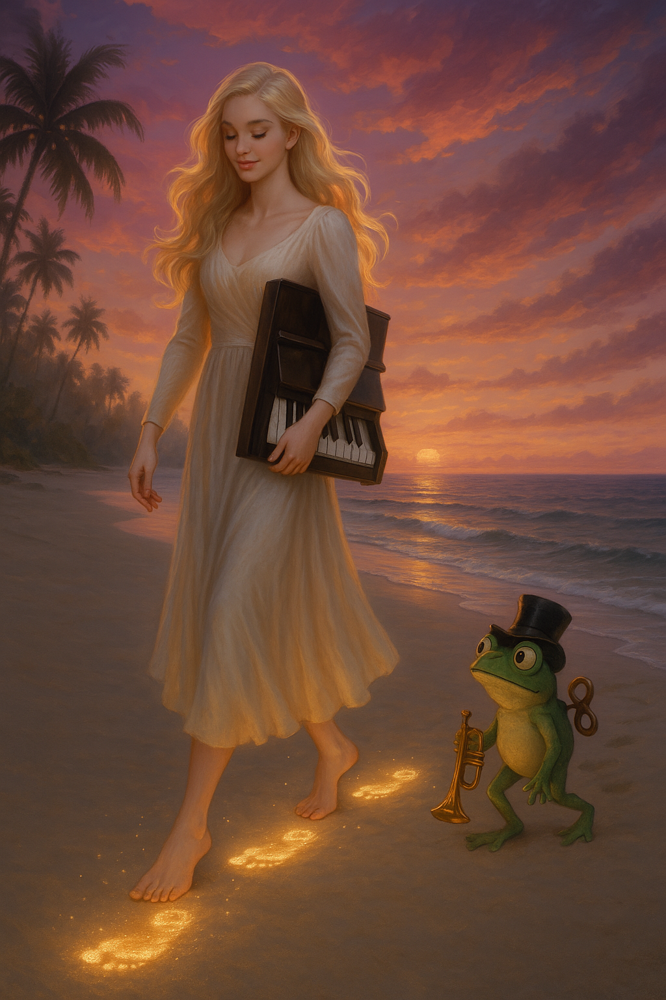
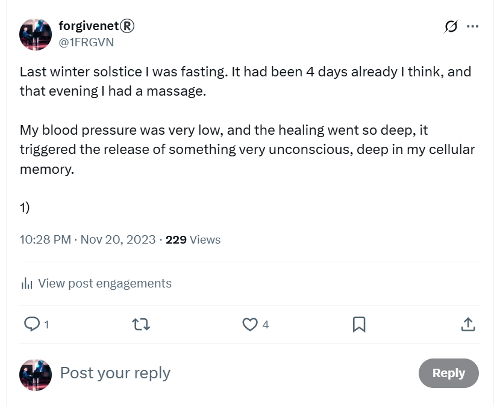
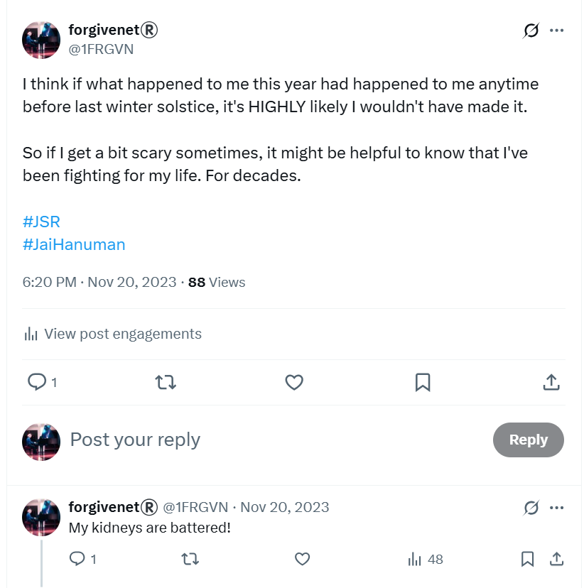

# December 2022

## Chamber music classes

- The trumpet teacher flirted with me at class.
- I fancied him.
- I hadn't liked a man in that way since 2003, and I was still depressed, so it was all a bit unsettling.
- He told me things that made me thing we shared life experiences; such as he lived in a small part of Valencia 7 kilometers from the centre. This is something Domingo noted when he visited me in London.
- I felt everything that was going on was all a conspiracy and that Domingo was behind it, for revenge.
- I know that this "pretending to like you game" is what Spanish men do to women who "turn them down" and it had bizarrely happened to me before so I knew what was going on, at least in that respect.
- However, it was impossible to know how to deal with it.
- I felt I was in a situation I could do nothing about at that time, except see what happened.
- At some point I looked the trumpet teacher up online and found his Facebook page.
- The Facebook account name was *Vidal Sastre Sanchez Hornero*.
- There was a picture of him in a dirty brown leather jacket rather like the one he wore to classes, and two young girls. The three of them looked embarrassed, as if they didn't want to be in the picture. 
- There were some messages from people on his Facebook saying "look how much they've grown" so I assumed they were his daughters.
- The man I saw on Facebook with the two young girls was, I think, [trumpet teacher two](../../crimes/protagonists/vidal-sastre.md#the-brother-or-mark-from-english-class-in-2013), but with longer hair.
- I heard him tell my classmate Pablo - and when I asked him later he also told me - he was a secondary school teacher teaching music in the outskirts of Valencia, some 8kms away from the center of the city. I can't remember the name of the town he said, but it began with B.
- I found no record of him teaching at any secondary school online.
- When I looked at his Facebook page again over Christmas it appeared that he had deleted it, or blocked me, I was not familiar with how Facebook works.
- The Facebook name was exactly the same as the name in the GV systems, *Vidal Sastre Sanchez Hornero*.
- I started to think about him a lot. I have a tendency to do this with men I like so there was nothing strange about it from my side. 
- It was a bit irritating though, and I knew there was a "plot" against me with regards to all this, so it was all a bit stressful.

## Dreams and premonitions

- I started having strange dreams around this time, after I had met the trumpet teacher.
- I dreamt of the trumpet teacher and Russian dolls. He was the tiny baby at the center of the Russian doll stack.

- "He's just a baby", I heard, a lot, in dreams. "You have to look after him," the dream said.
- I dreamt of snakes too, a lot.
- I dreamt the trumpet teacher had an evil brother who was a devil.
- A lot of these dreams did turn out to be related in some way to truth, and I now wonder if the symbols and content were coming from online manipulation, or psychoactive dosing, or did they start entering my flat while I was sedated from the moment the trumpet teacher turned up to class.

### Snakes

- I usually tweeted about these dreams.
- https://x.com/1FRGVN/status/1602792091238678528

## Choir concert

- During the month, there was a Christmas choir concert in which the whole conservatory participated.
- It took place in the events hall at the [Balearic Port](http://www.baleariaport.com/en/nuestros-servicios/espacios-socioculturales/).
- I was feeling nervous and anxious a lot around this time. 
- Samuel introduces me to his Venezuelan wife and she is obviously upset with me about something he's told her.
- I saw the trumpet teacher sitting close to where I was standing for a few minutes. 
- His back was to me and he was sitting in the front row watching the students of the orchestra play. 
- I did not see his face but it seemed to be him by the physique and clothing.
- To my left, I caught Domingo's eye. He was staring at me.
- At that moment, I knew the whole thing was a set up and Domingo was behind it.
- I was not at all surprised.

### The curious man

- At the concert, I saw someone else I thought I recognized.
- A man who looked exactly like [the running man I saw in Cauterets](september.md#a-curious-man).
- I did a double take from wondering if he was a film star he was so familiar, and then I realized where I thought I knew him from and thought nothing much of it again.
- I guess he was in Cauterets at the same time, or someone who looked very much like him was.
- A strange coincidence, maybe.
- I saw the same man again at the online [chamber music meeting in September 2023](../2023/september.md#chamber-music).
- He was sitting with Katia but he is not her husband, as far as I'm aware, who came to a concert instead and looked very different.

## Feeling unwell at home

- I felt unwell a lot at home; headaches, stressed and unsettled emotionally, and nauseated at times.
- I often drink wine at the weekend, not much, a couple of glasses usually.
- However, I usually became extremely unwell after drinking just two glasses of red wine and this was strange.
- It was as if my body didn't have the capacity to handle the alcohol for some reason.
- Also, I was feeling disordered and clumsy. I cut myself quite badly in the kitchen at some point over the Autumn and was rather over-traumatized by the incident.

## A seizure in Thailand

- Online and in-person bullying by criminal gangs, and teachers and staff at the conservatory of Dénia included using my own words and experiences that I had described in detail in my [2015 police statement I sent via email to the Metropolitan Police](../early-years/2015.md#statement-to-the-metropolitan-police), and repeating and replaying them back to me in order to cause me enormous distress and psychological injury.
- I did not know this was happening at this time. Indeed, it has only become clear to me in early 2025 after leaving Dénia, replacing all my bathroom products, and washing or throwing away most of my belongings which the criminals had doused in pesticides while I was away from my apartment, probably in mid-October 2024.
- In any case, constant triggering and reminders of my experience of being sexually abused by a North London rape-gang when I was a child was the backdrop to my psychological and emotional state while I was on holiday in Thailand over Christmas 2022.
- It is highly likely the bathroom products I brought from Spain contained some psychoactive substance, maybe even low level doses of methanol.
- I couldn't stop thinking about the trumpet teacher.
- Ironically, this environment was the backdrop for the most profound healing experience I have probably experienced in 25 years of attempting to heal my body, mind, and soul from the effects of being sedated and gang-raped repeatedly without my knowledge when I was 16.
- It was the 21st December, winter solstice.
- I was taking a massage with Polly at the healing centre in Samui.
- It was day 3 of the detox and my blood pressure was extremely low.
- As I was lying facedown on the bed, my blood pressure got even lower, and my heart started to race uncontrollably.
- Polly touched me in a certain way and my body started to convulse.
- It felt like something very violent was happening to me, but I didn't know what.
- It was like being surrounded by a gang of violent men kicking and hitting me while I tried to protect myself from them.
- My body convulsed into a protective state. It contracted smaller, and expanded again, convulsing, contracting, expanding, over and over, while I shouted, "No, NO, NO!"
- It was terrifying. 
- The whole center was alarmed.
- I thought I was having a heart attack and went directly to A&E in Samui.
- They checked everything over and I was completely fine.
- They told me I had had an anxiety attack but they didn't know I had spent 35 years in a state of panic and never had an anxiety attack quite like this one.

- The next morning, I woke up, and everything was different.
- It took me a few weeks to realize what was different, but when I did, I was awestruck.
- I realized that every step I had taken in my life since I was attacked in 1989 was in fear. Every single thing I did, every person I spoke to, every situation in my life was soaked in fear and dread.
- It was as if, at any moment, at any second, wherever I was and whatever I was doing, I was in extreme danger and I had to be continually aware of it in order to survive.
- I realized my whole physical system had been working overtime to support this for 35 years; flooding my organs with hormones, second-by-second, just so I could be ready to run or fight.
- And it was all over.
- Completely.
- Since my system's reenactment of sedated gang-rape on 21st December 2022, every step I take in the world is without fear.
- That was the difference I noticed.
- I believe that without the vile acts of Dénia criminals, teachers and staff at the conservatory, and whatever substances they were starting to micro or macro-dose me with, I'd still be walking in fear.
- It's highly likely that had I not had this healing experience, I would be very dead and gone now, to the delight of the people that terrorized me in Dénia.

- I tweet about this in November 2023 when I'm being stalked and terrorized by the whole town of Dénia; ostensibly because they weren't able to honey-trap me into a false relationship or into a one-way ticket into the sex "industry", although I was being live-streamed on porn networks masturbating without my knowledge, at a minimum.

- I tweet about it a few times. Sometimes I mention how I believe these experiences have been detrimental to my kidneys due mostly to the timing of symptoms.

- It is highly likely many people knew *exactly* what was going on, and did attempt to warn me in December 2022.
- Unfortunately, or fortunately, my mind was not able to comprehend in any way the evil I was about to experience in Dénia so the warnings went by unheeded.
- Still, others *were* looking too, and enjoying the view. For later. And that is somewhat comforting to me now in June 2025.

## Madrid

- I stay in Madrid for a few days on the way home as my Thai flight lands there.
- I meet an old, old friend I haven't seen for nearly 10-years.
- I think the last time I saw her was in Madrid at Christmas 2014.
- I remember telling her about Domingo the piano teacher and how awful it all was at that time.
- I ask her does she remember me telling her about all that? She says no.
- We met on a healing retreat in 2005 which was ostensibly about accessing hidden memories of sexual trauma and male violence against women and children.
- The leader of the retreat was a man called Sat Santokh. 
- He had been the roadie for the Grateful Dead at one stage and took the boys to Woodstock.
- Since then, he had turned into a Sikh by following a guru from India we won't talk about.
- He was quite a character.
- Anyway, at that time I had no recollection about serial and sedated sexual assaults and certainly no idea I had been gang raped multiple times.
- I remembered one instance of rape, with one person, but I knew something more had happened and I was trying to find out what it was.
- That's why I was on the retreat at that time.
- It didn't work but I didn't give up and tried something else instead until I accessed one memory of gang rape.
- Anyway, back to Madrid in 2022.
- My friend starts telling me about how her sister has been stalked online by flying monkeys.
- I don't really know what she's talking about.
- I tell her about the trumpet teacher.
