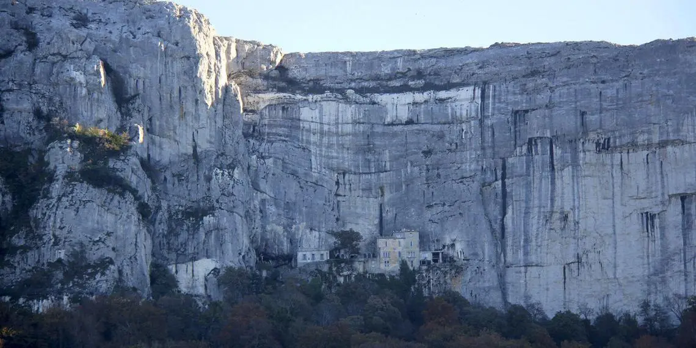

## Mary Magdalene’s Cave the Sainte Baume Grotto

- I do a [TEB intensive](https://www.austinattach.com/transforming-the-experience-based-brain/online-training/) trauma therapy course before leaving Lourdes.
- I then drive to the [Sainte Baume](https://perfectlyprovence.co/mary-magdalenes-cave-the-sainte-baume-grotto/) grotto and stay with the Dominicans and hang out with the spirit of Mary Magdalene who spent her later life in meditation there.

## Moving back to Dénia

- I move to my new flat in Dénia: Carrer Furs 15, B1 Escalera 2 Piso 3 Apartamento 17, Dénia 03700 Alicante Spain.

## My life

- I'm working online. I work a lot.
- I am on Twitter constantly.
- I do yoga 3 times a week online in my flat.
- I go walking with the English ladies every Saturday in the local area.
- I might take a walk on my own along the beach or Las Rotas from time to time.
- I go shopping for food.
- Apart from this, I have no social life, I see no one, I'm very isolated.

!!! info "Even more isolated today"
    - This remains the case even today when I am in Dénia. 
    - Even more so as I am afraid to go out as I am usually followed and terrorized in some manner by local people who always seem to know exactly where I am or where I'm going to be as they have prepared themselves in some way to ambush me and terrorize me. It's extraordinary.
    - You only have to take a walk with me into town to see the reactions of people and understand that many people I've never met know exactly who I am, and not in a good way.
