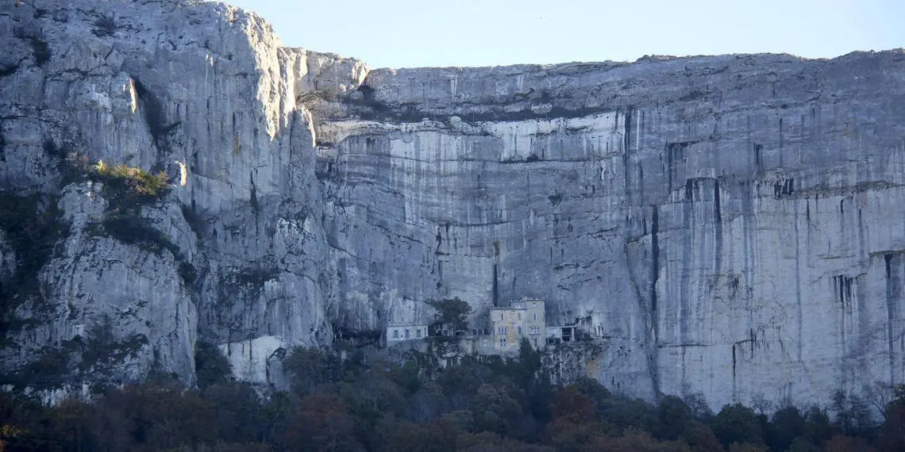
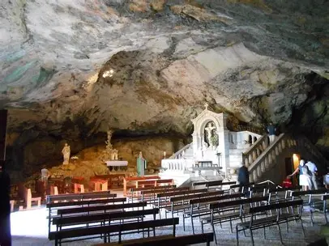

# February 2022

## Mary Magdalene’s Cave; the Sainte Baume Grotto

- I do a [Transforming Touch intensive](https://www.austinattach.com/transforming-the-experience-based-brain/online-training/) course online before leaving Lourdes.
- I then pack up the car and drive to the [Sainte Baume](https://perfectlyprovence.co/mary-magdalenes-cave-the-sainte-baume-grotto/) grotto near Marseille.
- I hang out with the Dominicans, and some pilgrims, and the spirit of Mary Magdalene who spent her later life in meditation in a cave close to the retreat centre.
- It's really beautiful; a special place.

- The area around Sainte Baume reminds me of India.
- Before I leave, I write a long prayer asking Mary Magdalene to get justice for Noah Donohoe and I leave it at one of her altars in the cave.

### Isabel pilgrim

- A woman is staying there, she calls herself Isabel.
- She's in her 60s, speaks a bunch of languages fluently, and looks gypsy.
- We speak a little but I don't remember details just friendliness.
- In 2026, I meet her again at [Sainte Baume](../2026/february.md#sainte-baume).
- We are at the dinner table and she is being terribly rude to me. She's angry with me actually, furious.
- I notice she doesn't pay for dinner, she just walks straight in and when the man with the dinner list questions her she fires off a barrage of words and he looks exhausted and tells her to go in.
- I don't remember her from 2022 until later.
- I see the priests telling her off, telling her she can't do... whatever, get free meals I expect.
- Was this the woman tasked with adding substances to my toiletries at Sainte Baume so that the drugging can begin?
- I am terribly high on the road to Spain and I play my music very loudly (I rarely play music in the car, and not like I'm at a rave).
- This woman is so angry with me at dinner in 2026, raging in fact, she actually loses her mind so significantly she threatens to murder me.
- *I'll take you for a walk and show you paradise*, she says.
- She's been told to leave me alone, and she's furious about it. Guilty.

#### The abomination of desolation in the holy place

- Could Isabel have set up something in this holy place, therefore mentioned in Daniel and Matthew?
- I don't believe that happened, but you never know.

## Moving back to Dénia

- I drive through France and down into Spain playing this song loud enough for the villages I pass to hear.

<iframe width="504" height="378" src="https://www.youtube.com/embed/Hr1HpYkoJ5A" title="GANGA MAYIA ME JAB TAK KE PANI RAHE MERE SAJNA...." frameborder="0" allow="accelerometer; autoplay; clipboard-write; encrypted-media; gyroscope; picture-in-picture; web-share" referrerpolicy="strict-origin-when-cross-origin" allowfullscreen></iframe>

- I'm also speeding (way more than normal) and get told off by the French traffic control signs.
- I move to my new flat in Dénia: Carrer Furs 15, B1 Escalera 2 Piso 3 Apartamento 17, Dénia 03700 Alicante Spain.

### One night in Barcelona

- Could this night, the stopover night before I take up permanent residence in Carrer Furs, have been a first "date"?
- If anyone cares to check where I stayed, it'll be on my credit card or in my Hotels.com archived info.
- Wherever it was, there was a massive rave going on next door to the hotel and people coming and going and slamming doors at all hours.

## My life in Dénia

- I'm working online. I work a lot.
- I am on Twitter constantly.
- I do yoga 3 times a week online in my flat.
- I go walking with the English ladies every Saturday in the local area.
- I might take a walk on my own along the beach or Las Rotas from time to time.
- I go shopping for food.
- Apart from this, I have no social life, I see no one, I'm very isolated.

!!! info "Even more isolated today (written in late 2024)"
    - This remains the case even today when I am in Dénia. 
    - Even more so now as I am afraid to go out as I am usually followed and terrorized in some manner by local people who always seem to know exactly where I am or where I'm going to be as they have prepared themselves in some way to ambush me and terrorize me. It's extraordinary.
    - You would only have to take a walk with me into town to see the reactions of people and understand that many people I've never met know exactly who I am, and not in a good way.

- I often feel unwell in my apartment, nauseated and tired.
- My regular eye tests start to show high eye pressure, something I - or anyone in my family - have never suffered from before and I'm asked to go in regularly to the opticians to have it checked out as it's apparently dangerous.

### Aqualia

- To set myself up as the bill-payer for the water at Carrer Furs, I go along to the Aqualia office in person.
- I'm dealt with by a man who is [Vicente's male friend he introduced me to in 2009](../2001-to-2010/2009.md#vicentes-male-friend).
- I'm sure he recognizes me but he doesn't acknowledge me.
- I have forgotten his name and my Spanish hasn't cranked up sufficiently to launch into a conversation with him so I also do not acknowledge him. 

#### One of my thousands of letters asking for help

- In late 2024 when [I was obviously being poisoned at my home and it looked very much like through the mains water connections](../2024/november.md#poisoning-in-my-apartment-and-terror-outside), I wrote to Aqualia to inform them of this, and to ask them to come and check the mains water connection as I believed it had been tampered with.
- This was one of the emails I have since lost after my gmail account was [inexplicably shut down in January 2026](../2026/january.md#my-gmail-account-is-shutdown-permanently) when I was back in North London - I assume by criminal gangs with full admin access to my devices from the home network at 31.
- Furthermore, I made multiple backups of all these emails on hard disk, and these have become inaccessible too!
- Most likely, law enforcement will have kept copies of everything, so I'm not that worried.
- If I come across this in the meantime, I will add it and let you know.
