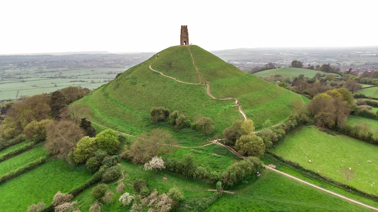
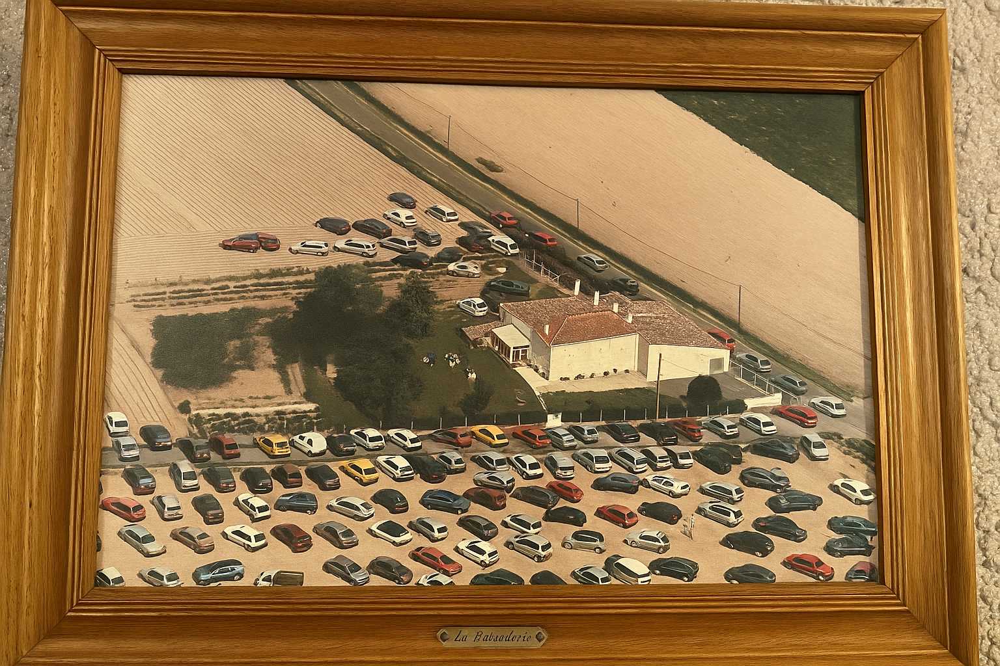

# July 2022

## Summer holidays

- I set off in the car to spend the whole summer in the UK and in France. I'm working remotely so I only take a couple of weeks off for proper vacation.
- Google maps starts sending me on bizarre journeys which often include driving down miles of what are nearly dirt tracks. I'm unable to fix this in settings.

!!! important "The tormenting has begun"
    - It appears that, at this time, the hackers had already breached my mobile phone and were tracking my movements and changing the Google maps settings.
    - It is highly likely that I was seriously hacked from the moment the Yoigo router was set up in my house, February 2022.
    - It is also likely that I had been hacked and monitored continually by criminal gangs since 2014, but perhaps not to the same extent as when living in Spain.
    - However, having said that, at the time of writing I'm in Bangkok Thailand (November 2024), and it is clear they still have full access to my whereabouts, Twitter activity, emails, and they are listening to my conversations too; as usual.

## Lindisfarne jet

- I spend a month in Lindisfarne in the same house I built the [forgivenet®](https://1frgvn.com/) in November 2019.
- I'm curiously unwell here, thinking back.
- I put on a lot of weight. I'm extremely tired all the time. I have a lot of nightmares and I can't sleep at night. My hands are always swollen.
- I'm struggling with work relationships. I'm feeling quite paranoid.
- One hot Saturday, I spend the whole day walking around the island. 
- On one of the northern beaches, I notice a small piece of jet on the sand. I pick it up.
- I try to snap it. It snaps into two.
- I discard the pieces back onto the sand, and walk off.
- I take a few steps down the beach and something stops me as I realize I just broke a stone into two with my bare hands. I decide to go back and look for the pieces.
- I find them.

## Glastonbury

- A stone expert in Glastonbury High Street tells me that jet stone is related to Archangel Michael and puts the pieces in a silver holder which I wear around my neck.
- I start a detox program at a healing centre on Wearyall Hill.

### Crystal dreaming

- Glastonbury is a magical place, full of mystery and strange goings on.
- During the war, a group led by renowned occultist [Dion Fortune](https://catherineauman.com/dion-fortune/) led country-wide prayers to rid the world of Nazism.
- Ms Fortune lived on the slopes of Glastonbury Tor in what is now an excellent B&B called Berachah.

- More curiously, perhaps, at least for me, is the fact that this was the B&B I stayed at when I studied shamanism in 2005, just after I got some money out of the blue, and my visit there may have marked one of the [first times I was very obviously monitored by British criminal gangs for the purposes of ... everything this statement is about](../early-years/2005.md#warrior-in-the-heart). 
- Richard stayed at the same B&B!
- In July 2022, I visited again and stayed in another healing centre close by where they run colonic fasting retreats.
- On the third night of my stay, the retreat leader asked me if I wanted to sleep with a powerful crystal in my room for the night.
- I saw no reason why not to experiment, and agreed.
- I had the scariest dream EVER.
- It was lucid, as if everything I was dreaming was actually happening at the time. 
- It was a Wednesday, or thereabouts, in late July.
- In the dream, there was a meeting, downstairs, in the living room of the house.
- Countless people had been invited and were arriving. The room was packed.
- They were double parking in the road and on the drive outside.

- I looked out of the window of my bedroom and saw them walking up the garden path to the front door, to enter and assemble.
- The purpose of the meeting was to discuss, and plan, how they were going to murder me.
- It was horrifying and I was extremely troubled by it.
- A loud voice kept entering the dream to tell me to remove the crystal: "Get it OUT!", the voice shouted.
- Eventually I took the crystal downstairs and managed to get to sleep.
- I didn't mention the dream to anyone in the house, obviously, as it was very distressing and it had too much to do with my present surroundings.
- It's clear to me now that I saw something that was actually happening, or had very recently happened, 2000 kilometers away in Las Marinas.

### Tarot

- The next day, I agree to have my tarot cards read.
- I wasn't keen but everyone else did and said it was great, so I went ahead. It was a free reading and it felt rude to refuse it.
- I have always understood these sorts of things to be a little bit unhealthy, for various reasons we could go into at another time.
- Anyway, it's an interesting draw, fairly positive, but the most curious thing about it was the card that landed in the hopes and fears position of the Celtic cross spread.
- The Knight of Wands.

- I wasn't sure of the significance, nor did I care much, but the card reader insisted a man would be coming into my life and I would have to be careful of him.
- I thought it was preposterous. I was a sworn celibate for life.
- I promptly forgot all about it until probably around July 2023 when the gender-violence and terrorizing in Dénia and online was becoming fever-pitched; mainly because I stubbornly refused to be terrorized out of my home and out of the conservatory where I was enjoying playing the piano so much.
- The card was a little imprecise too because there is no *rape-gang of wands* in the tarot, currently; although perhaps eight of wands suffices, and curiously that did come up the following year when I repeated the session with the same card reader in Glastonbury over the phone.
- At that time, the card reader said the eight of wands in the environment position signified marriage.

## The landlady changes the bank account for the rent

- At the beginning of August, Bea instructs me to change the bank account I pay my rent into.
- I get notification of this while I'm on the boat from Portsmouth to Bilbao.
- This was the [second of three accounts](../2021/december.md#too-good-to-be-true-on-the-8th-december) I would pay rent to during my stay at Carrer Furs, Dénia; spy-cam and baby-porn capital of the world.
- Some day soon, the owners of these accounts will be revealed. 
- These are my suspicions:
    
    - Money into the first account was probably going directly to the landlady: December 2021-August 2022.
    - After the meeting in Las Marinas in which [my demise was carefully planned and agreed](#crystal-dreaming), the recipient probably changed to the persons taking the most risk, i.e. the trumpet teacher and Domingo's gang, along with [local criminal organizations](../early-years/2007.md#hazel-smith) who were certain to trigger a mental breakdown, or worse, by their online actions; just as had happened to [Lorraine Blackbourn](../2021/july.md#lorraine-blackbourn) and others no doubt: August 2022-August 2024.
    - The third account, changed in August 2024 after even brave Paqui (unpaid) Fornet's plot failed, was probably that of Carmen Cano and/or associates tasked with finally finishing me off by poison, likely pesticides doused all over my belongings and hazardous levels of methanol added to the mains water which made me very unwell and included extraordinary hallucinations over the last two weeks I stayed there in October 2024.
