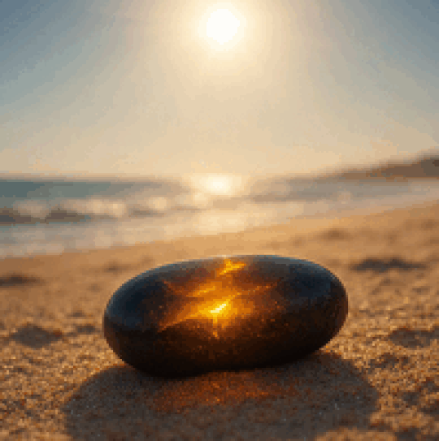

## Summer

- I set off in the car to spend the whole summer in the UK and in France. I'm working remotely so I only take a couple of weeks off for proper vacation.
- Google maps starts sending me on bizarre journeys which often include driving down miles of what are nearly dirt tracks. I'm unable to fix this in settings.

!!! important "The tormenting has begun"
    - It appears that, at this time, the hackers had already breached my mobile phone and were tracking my movements and changing the Google maps settings.
    - It is highly likely that I was seriously hacked from the moment the Yoigo router was set up in my house, February 2022.
    - It is also likely that I had been hacked and monitored continually by criminal gangs since 2014, but perhaps not to the same extent as when living in Spain.
    - However, having said that, at the time of writing I'm in Bangkok Thailand (November 2024), and it is clear they still have full access to my whereabouts, Twitter activity, emails, and they are listening to my conversations too; as usual.

## Lindisfarne jet

- I spend a month in Lindisfarne in the same house I built the [forgivenet®](https://1frgvn.com/) in November 2019.
- I'm curiously unwell here, thinking back.
- I put on a lot of weight. I'm extremely tired all the time. I have a lot of nightmares and I can't sleep at night. My hands are always swollen.
- I'm struggling with work relationships and feeling quite paranoid about work.
- One hot Saturday, I spend the whole day walking around the island. 
- On one of the northern beaches, I notice a small piece of jet on the sand. I pick it up.
- I try to snap it. It snaps into two.
- I discard the pieces back into the sand and walk off.
- I take a few steps down the beach and something stops me as I realize I just broke a stone into two with my bare hands. I decide to go back and look for the pieces.
- I find them.

## Glastonbury

- A stone expert in Glastonbury High Street tells me that jet stone is related to Archangel Michael and puts it in a silver holder which I wear around my neck.
- I start a detox program at a healing centre on Wearyall Hill.

### Crystal dreaming

### Tarot

