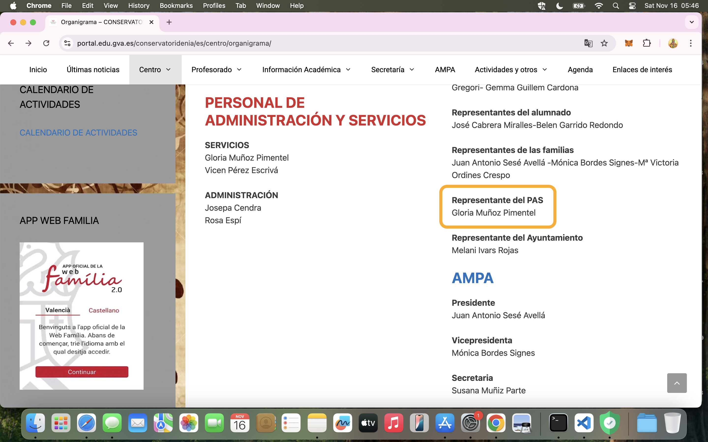

# June 2022

## Walking and health

- I go walking every weekend; with the English ladies on Saturdays and then on Sundays I might go for a walk on my own.
- Whenever I walk, I notice my fingers swell up. 
- I know this is kidney-health related.
- I'm nauseated often in my apartment. I don't know why but I have experienced substantial vomiting fits which are a bit inexplicable.
- I wonder if maybe the refrigerator is so old it is leaking bacteria onto my food.
- My eyes are tired and my sight is often blurry.

### Meeting Zoe and Marie while walking

- One Saturday afternoon, I bump into an old friend I haven't seen in years while walking along Las Rotas, [Zoe Braganza Jones](../early-years/2008.md#zoe-bj).
- She is with her Liverpudlian friend Marie (Henderson maybe).
- Zoe tells me that Lorraine Blackbourn committed suicide.
- I'm devastated. 
- I thought Lorraine had died from illness.
- "Her daughter found her", Zoe kept mentioning.
- I had no idea my every move was being tracked at that time, but now it seems sensible to assume that meeting, like every meeting I had, was set up by Hazel Smith and the Cano-Lopez family.
- I recall seeing Zoe BJ, in another finely-tuned choreographic moment, in 2014 while I'm [waiting for Domingo in the car outside my apartment in Joan Fuster](../early-years/2014.md#trip-to-london).
- When things go really bad for me, and the Cano-Lopez's make no attempt to hide the fact they are trying to murder me, I reach out to Zoe and Marie online repeatedly.
- They ignore me.
- As time goes by, I realize every tiny interaction I have had with these people should be under scrutiny.
- I write a detailed and non-exhaustive [list of curious events](../early-years/2008.md#zoe-bj) I remember about Zoe and her mother.
- This particular meeting is also extremely interesting.
- Firstly, I failed to recognize Marie initially even though I knew her well and had seen her often.
- And Marie was with a man who I initially mistook for Luke, Zoe's brother.
- This is very curious because the man looked nothing like Luke - I found out a little later while walking with them - but he was holding the same type of dog Luke used to always have with him, and he was the same build and height... so contextually I mistook him for Luke.
- I even asked Zoe, is that man your brother Luke?
- I take all this to be firm proof that I had already been successfully brain damaged to the extent that my function of recognizing objects in-and-out-of-context was severely impaired; the [conservatory switcheroo porn requirement](../../crimes/protagonists/vidal-sastre.md#vidal-sastre-sanchez-hornero).
- I'm guessing Zoe and Marie will have reported a positive on the brain damage to their porn-gang bosses immediately.
- I say goodbye and they walk off, but I catch up with them as I walk back.
- Zoe tells me about her cousin being beheaded and how she wrote a book about it; Alessandra [confirms this in a somewhat exhausted manner](../2023/september.md#alex-and-paul) when I meet her and Paul in late 2023.
- I then catch up with Marie and the white man she's with who is from Northern Ireland; the man I mistook for Luke, a brown man.
- I realize who Marie is because of her Liverpool accent and I apologize for not recognizing her previously.
- We chat a while.
- She tells me her older daughter is now working at the English Studio, Lorraine's business, for Lorraine's trans-identified daughter (she says son) Jayden, and that she has an official contract.
- I congratulate her.

## Preparing for the conservatory audition

- The head of studies, Jaume Signes, a trumpet teacher, allows me to use his room, the trumpet teaching room, room 6, every day to practice my pieces for the audition.
- One day Gloria, one of the receptionists, tells me I cannot use the trumpet teaching room I've been using as it's busy, but there is a room free upstairs instead.

### Maria and Domingo

- I go upstairs. 
- [Maria Hontanilla](../2023/april.md#maria-hontanilla), my piano teacher from [2015-16](../early-years/2015.md#maria-hontanilla), is standing outside a piano room and we meet and say hello.
- While Maria and I are talking, Domingo comes up the stairs. Two young female students are with him; minors of about 12 or 13 years old.
- It's all very contrived and set up.
- Domingo goes to talk to Maria and leaves the students to talk to me. They are behaving oddly.
- They are flushed and nervous, giggly and excited when I speak to them.
- This is not the only time I see girls behaving like this.
- I call it 'whipped up into a frenzy' when I'm chatting with the hackers online in 2024.
- It was always weird and, now, it is extremely concerning.

!!! tip "Excited and nervous females"
    - In 2024, as I am having a [close and intimate chat with the criminal gangs online](../2024/august.md#interview-with-the-hacker) I realize this is *exactly* how I used to feel in class at the conservatory with the trumpet teacher, and at other times too.
    - Nervous, anxious, flushed, heart-racing, confused, sexually aroused.
    - It's around this time I start to realize the full extent of the clandestine drugging I was a victim of.

    

- Domingo leaves without speaking to me.
- Maria offers to help me with the audition and at some point suggests she is my teacher.
- It's all a bit contrived but I agree.
- We chat a short while and she says we must go out for coffee sometime.
- I say yes of course.
- She says, "or two, or three, or four", and laughs.
- I have no idea why she is saying this.
- We never go out for coffee.

### Gloria and the effects of poisoning

!!! tip "Gloria the receptionist"
    - Gloria was instrumental in tormenting me throughout the stalking while I was going to classes at the conservatory. 
    - She was always angry with me for reasons I could only guess at.
    - I strongly suspected that Domingo had told her some lie about me, perhaps that I had said something derogatory about her. Her attitude towards me had always been inexplicably hateful.
    - Unsurprisingly, she seemed to be absolutely delighted at some of the nastier things I experienced.
    - As the cyber-stalking progressed, and I came in to the conservatory for classes or to practice, she was always making some reaction to me; often related to something I had posted on Twitter, or she was reading some "significant" book, or leaving something "significant" open on her desk for me to see whenever I picked up a piano room key or brought it back after practicing.
    - It was boring and unimaginative. However, given I was also being drugged and poisoned without my knowledge, and given that the effects of continuous bullying became psychologically overwhelming, everything teachers and staff did to upset me had a sort of negatively exaggerated effect, as you might imagine it would.
    - At the original time of writing this particular admonition - November 2024 in Bangkok - Gloria was listed as the representative of highly sensitive people on the conservatory website: *Representante del PAS*: https://portal.edu.gva.es/conservatoridenia/es/centro/organigrama/
    - Well, I looked this up at the time and the definition of 'PAS' came up, specifically, as the "representative of highly sensitive people". 
    - I was horrified, of course.

    

    - However, I believe now that being led to this particular erroneous definition was due to constant online interference which was rather intense at that time.
    - I was also still being adversely affected by the toxicity in my apartment that I absorbed during the last couple of weeks of October 2024 when I got back from Portugal.
    - The security camera had malfunctioned for 6 days while I was away during which time, I believe, criminals entered my apartment and sprayed pesticides on all my belongings.
    - When I returned, I immediately became extremely unwell. 
    - My kidneys ached. I had migraines. I had shooting nerve pains all over my face. My sight started to seriously deteriorate.
    -  I had even been hallucinating during those two weeks. I only realized this, with a shock, in February 2025.
    - The toiletries that I had taken with me to Bangkok from Spain were also full of the same toxic substances.
    - I hadn't yet realized any of this at the time of writing.
    - Much of the first draft of this statement I wrote under those circumstances, and for this reason, I could have easily been misled by anyone controlling my online activity.

## Conservatory audition

- I go to the audition and pass it.
- I'm scheduled to join the conservatory again for the third year professional piano studies in September.
- At the audition, Domingo's female students are hanging around helping everyone. 
- I see the Romanian beautiful boy there. His parents are with him.
- The girls are all dressed in the same way; hot pants and skimpy tops. 
- The girls are 14 or 15 years old.
- He tells the girls to go and talk to people, and they mill around talking to parents.
- His control over them is embarrassing and cringeworthy.
