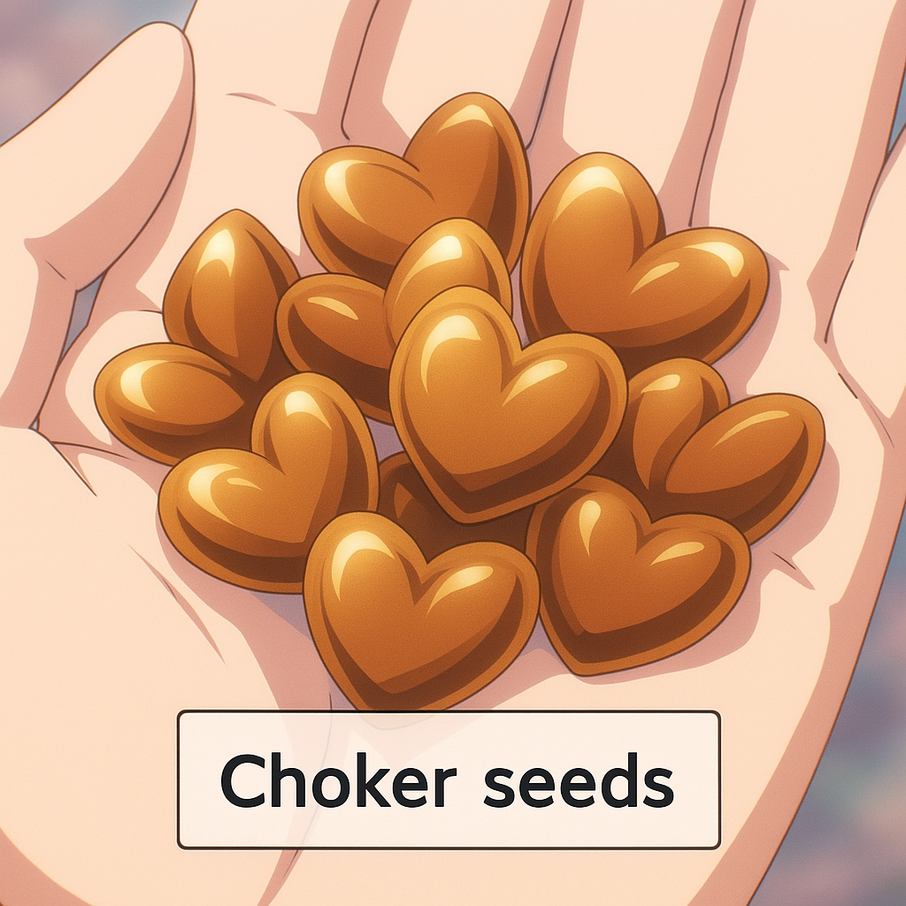

## Conservatory open day

- It's a Saturday afternoon after walking with the English ladies.
- We spoke a lot about music and my piano studies.
- I check the conservatory website when I get home and find there's an open day for new students.
- I go to the open day at the conservatory and meet Joan Carles Poquet and Paqui Fornet Pastor.
- They seem angry with me. They give me dirty looks and are brusque with me.
- Even so, I apply for year 3 of professional piano studies and start preparing for the exam.

!!! note "I love playing the piano"
    - It's an absolute joy and people's ridiculous attitudes cannot stop me.
    - I don't care if people don't like me. Most people don't.
    - I don't expect people to try to murder me (or anyone else) just because they don't like me, however. Especially when they are civil servants working in a government-funded school setting, and taking care of hundreds of children. 
    - That would be insane, wouldn't it?

## Upstairs neighbor at Carrer Furs

- I occasionally bump into a man in the lift in my building who grins at me, slightly lasciviously, whenever he sees me, as if he knows something about me.
- I think he's a bit pervy, but I'm a little flattered too.
- He lives on one of the floors above me on my stairwell.
- Sometimes he is with, what I assume to be, his teenage daughter.
- They are both fair haired. He is perhaps 45 and reasonably good looking.
- He always grins at me in a sort of flirtatious way, but not quite flirtatious as he's not at all communicating with me.
- I now believe he was involved from the start and perhaps was already watching me in my apartment. His grin, therefore, may have been rather more sinister.
- Is it possible this man was involved in poisoning or drugging the mains water that goes to my house, and/or managing a LAN network of hidden cameras? Or does he perhaps know who is involved in this?
- It seems reasonable to assume that everyone at Carrer Furs knows what's going on.

!!! info
    - More recently, in October 2024, I bumped into him again in the building's gardens and he was unable to look me in the eye. He seemed embarrassed. He was with his wife.

## Planting the choker seeds

- Over this period I'm occasionally shown violent rape porn on Twitter which shocks me to the core.
- It's not something I would ever look at and some of it looks very, very real.
- I now believe this sort of thing was posted by teachers and staff at the conservatory and their criminal associates who had already hacked into my network and had root access to my laptop.

- Cyber-stalkers and honey-trappers call this "planting seeds" as preliminary activity on the run up to a serious crime.
- The "choker seeds" are the seeds which when sprout, and you notice, take the breath from your lungs the shock is so great.
- One wonders if any targets might have suffered heart attacks, or similar, from the "choker seeds".
