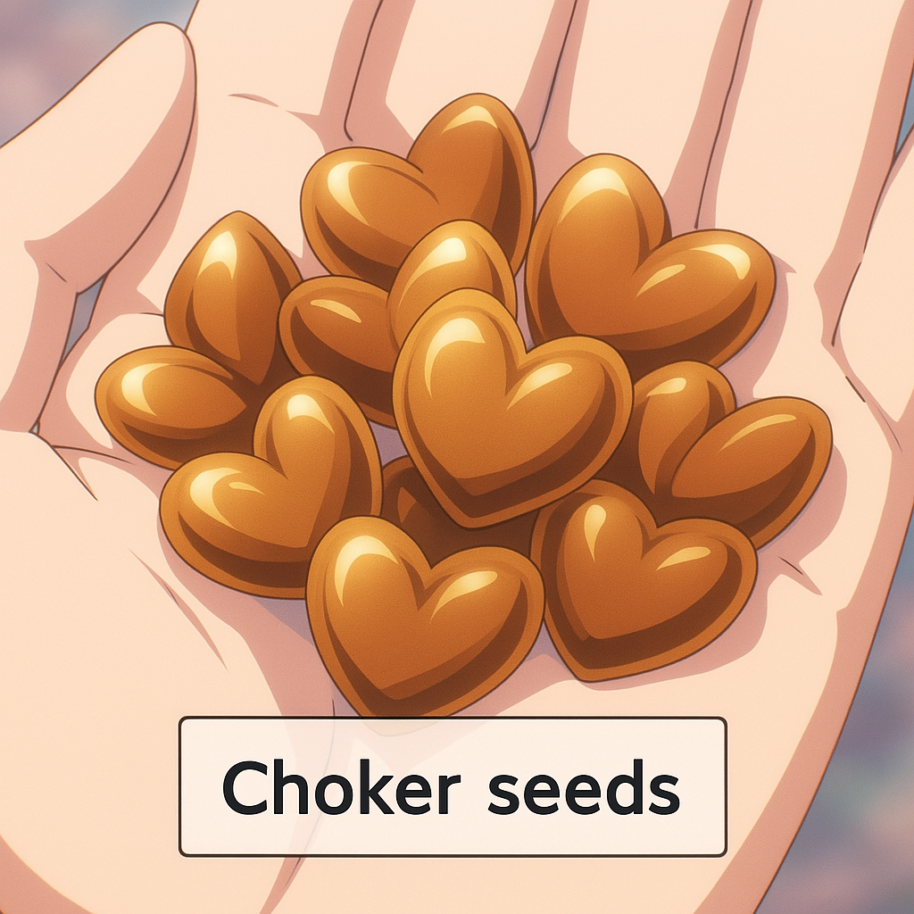

# March 2022

## Conservatory open day

- It's a Saturday afternoon after walking with the English ladies.
- We spoke a lot about music and my piano studies.
- I check the conservatory website when I get home and find there's an open day for new students.
- I go to the open day at the conservatory and meet Joan Carles Poquet and Paqui Fornet Pastor.
- They seem angry with me. They give me dirty looks and are brusque with me.
- Even so, I apply for year 3 of professional piano studies and start preparing for the exam.

!!! note "I love playing the piano"
    - It's an absolute joy and people's ridiculous attitudes cannot stop me.
    - I don't care if people don't like me. Most people don't.
    - I don't expect people to try to murder me (or anyone else) just because they don't like me, however. Especially when they are civil servants working in a government-funded school setting, and taking care of hundreds of children. 
    - That would be insane, wouldn't it?

- I meet a lovely Romanian couple with their young son who is auditioning for year 1 of piano studies.
- He's a energetic and optimistic youngster, and an excellent player.
- He's beautiful, really lovely looking.
- Paqui Fornet takes us - and no others - up to her room to discuss the audition in more detail. 
- She barely grunts at me and spends all of her energy dealing with the Romanian family.
- I leave them with her and go home.

## Upstairs neighbor at Carrer Furs

- I occasionally bump into a man in the lift in my building who grins at me, slightly lasciviously, whenever he sees me, as if he knows something about me.
- I think he's a bit pervy, but I'm a little flattered too.
- He lives on one of the floors above me on my stairwell.
- Sometimes he is with, what I assume to be, his later-years teenage daughter.
- They are both fair haired. He is perhaps 45 and reasonably good looking.
- She has exceedingly long blond hair and actually reminds me a little of [the woman on Dénia TV porn](../2001-to-2010/2008.md#denia-tv) in, what did you call it, standing spit? 🤮
- She doesn't acknowledge me and has her head down looking at her phone.
- The man grins at me again in a flirtatious way, but not quite flirtatious as he's not at all communicating with me.
- I now believe he was involved from the start and perhaps was already watching me in my apartment. His grin, therefore, may have been rather more sinister.
- Is it possible this man was involved in poisoning or drugging the mains water that goes to my house, and/or managing a LAN network of hidden cameras? Or does he perhaps know who is involved in this?
- It seems reasonable to assume that everyone at Carrer Furs knows what's going on.

!!! info
    - More recently, in October 2024, I bumped into him again in the building's gardens and he was unable to look me in the eye. He seemed embarrassed. He was with his wife.

### Small children and a baby

- From November 2022 to June 2023, there was always a lot of noise on a Monday night after a chamber music class ([switcheroo-porn session at the conservatory](../../crimes/protagonists/vidal-sastre.md#at-least-six)) in the upstairs apartment above mine; people talking, tables and chairs scraping the floor, loud voices, babies crying sometimes, way into the early hours.
- The building's walls are like paper. You can hear someone fart loudly in the next block. They must have loved me!
- The noise from upstairs continued after [12th June 2023](../2023/june.md#monday-12th-june-2023) and I heard it at other times of the day too.
- Nothing strange here, I just assumed a family lived up there.
- I often heard a small child's footsteps running back and forth as if they were playing.
- I heard this child a lot in the daytime.
- I assumed the people upstairs must have a small child and I had also assumed the occupant upstairs was this blond guy I just mentioned, but I could be wrong, and it doesn't seem to fit either him having so many children old and young, but you'll figure it out.
- One afternoon, and I don't know what prompted this, I became anxious and suspicious about the people upstairs.
- This event took place sometime between November 2023-March 2024 as it was a wintry day and the battle was in full swing.
- I decided to go up and take a look at their front door, I can't remember how doing this might have related to the anxiety I'm having about the people upstairs.
- So I go up in the lift (they'll have seen me of course) and when I get to the floor above I step out and I can hear people inside the apartment, and they've left their baby car seat outside the door.
- It's a small baby size, as far as I can remember, and I believe I heard the/a baby crying inside the apartment.
- So, one has to wonder...
- Well, of course they did.
- It's unbearably revolting.
- However, there is one very good thing about this, which is, those participants yet to come will not be able to deny they knew about, saw, enjoyed, and did nothing to stop the baby rape, bestiality, and pedophilia broadcast live from Carrer Furs, Las Marinas, Dénia, Spain. 

## Planting the choker seeds

- Over this period I'm occasionally shown violent rape porn on Twitter which shocks me to the core.
- It's not something I would ever look at and some of it looks very, very real.
- I now believe this sort of thing was posted by teachers and staff at the conservatory and their criminal associates who had already hacked into my network and had root access to my laptop.

- Cyber-stalkers and honey-trappers call these "choker seeds" meaning psychological-breakdown preparatory activity.
- This was told to me on X via fake accounts.
- In fact, what I was seeing was likely happening to me three or four times a week in my bed while I was sedated.
- The "choker seeds" are the seeds which when eventually sprout - as in criminals remind you of them later on by posting them on your social media timelines - and you notice, may take the breath from your lungs the shock is so great.
- I'm talking about things like [seeing my 16-year old self in porn on X](../2023/december.md#seeing-child-rape-gang-porn-from-1989-again) as a 50 year old woman who did not know that had happened to her.
- My guess is they usually show a target like me snippets of switcheroo or whatever they've done but they weren't able to get me to that stage of the game.
- But it's things like that. Tips over the edge. Porn with your child in, maybe. Pure evil.
- One wonders if any targets might have suffered heart attacks, or similar, from the "choker seeds".
