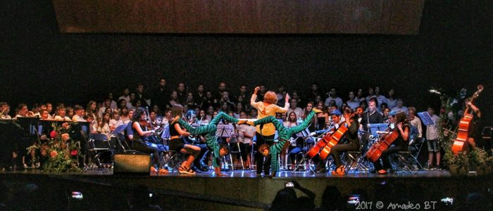

# May 2022

## Asked to be a demo at the conservatory

- Concha contacts me out of the blue and asks if I can do the conservatory a favor.
- She tells me a man from the Generalitat is coming in to give a talk and demonstration of filming technology, i.e. how to film instrumentalists, and they need a volunteer instrumentalist to be a demo for the camera.
- I don't think anything unusual is going on and agree.
- I'm conscious, also, that I have not yet sat the audition to get back in to study in September, so I can't really say no.
- I go along and there are about 25 male teachers and 5 female teachers in the concert room at the conservatory.
- Domingo is notably absent and I believe Concha informed me prior in case I didn't want to be in the same room as him.
- Paqui Fornet is there, as is Joan Carles.
- The women are unusually frosty with me.
- I'm asked to play while the video cameraman films my playing and talks about filming techniques, etc.
- I'm there for no more than fifteen minutes.
- There was no need for me to come in to do this, but I didn't question it at the time.
- However, given what happens over the next couple of years, I have to wonder if this was an early advertisement for the newest switcheroo victim - currently being brain-damaged - and due to start her studies in the Autumn when she will be unable to distinguish between different men?
- Was it also a way to make sure all the teachers were tied into the music-school's porn conspiracy if anything went wrong?

!!! tip
    - I don't have a copy of it, but a photo of two naked women on a sofa doing exactly the same thing as these children was posted to me on an X profile probably sometime in late October 2024.
    