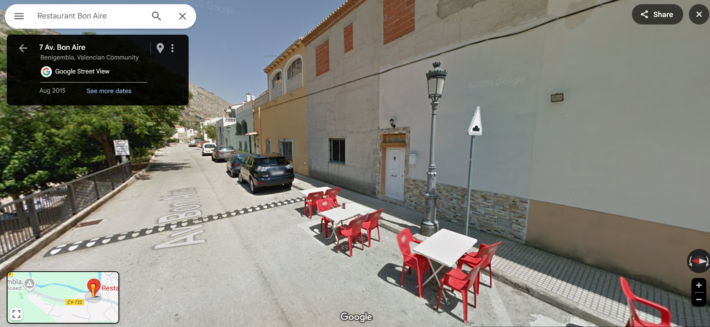
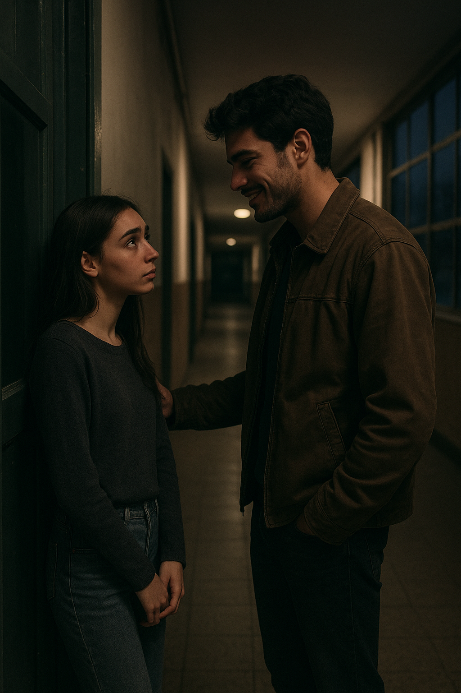
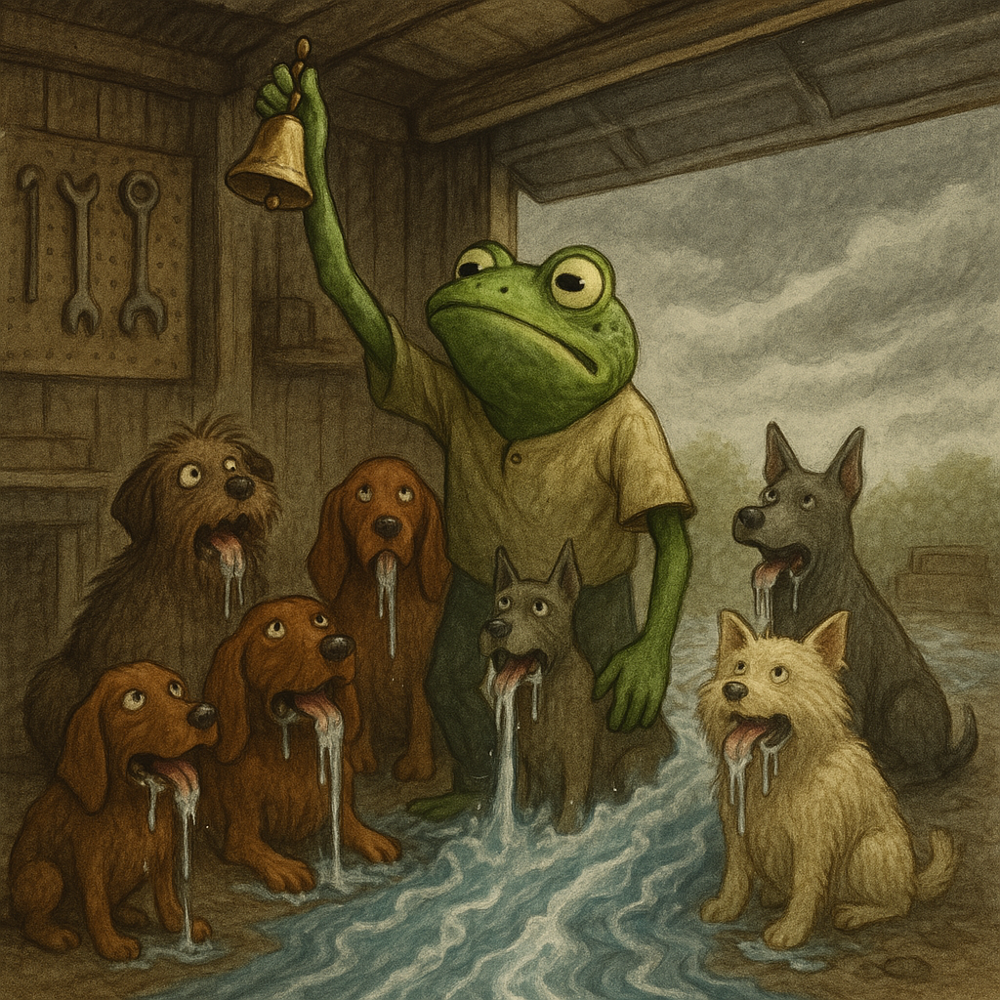
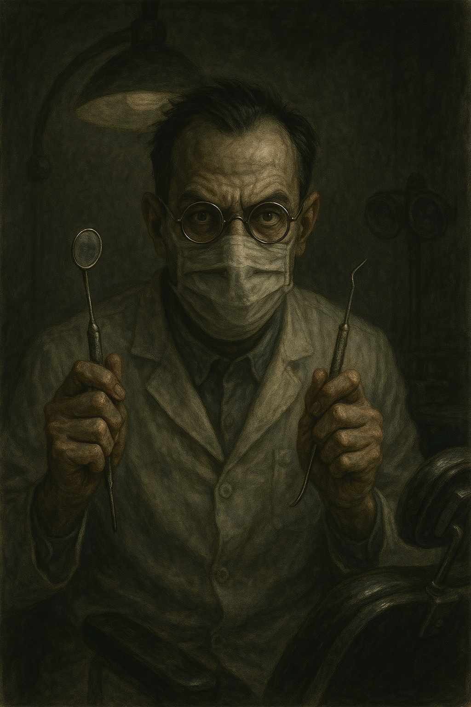

# November 2022

## The boiler breaks down

- The landlady tells me she is putting the rent up 8% from December 15th.
- The boiler breaks down, it is leaking. The water has run brown on turning the taps on since the day I moved in.
- I ask Bea to replace the boiler and the oven, which has never worked properly.
- She replaces them.
- Pedro, the caretaker, is amazed that she has spent some money on the flat.
- Later, I remember I had [just told the English ladies about her meanness](october.md#i-complain-about-how-mean-my-landlady-is-to-the-english-ladies) not long before.

## Hanuman enters the picture

- I carry [Hindu deity Hanuman](https://en.wikipedia.org/wiki/Hanuman) with me wherever I go, for protection.
- On one walk with the English ladies, I have a leak in my bag and Hanuman pops out onto the ground as I sort out my stuff.
- The ladies laugh at my silliness and one of them asks me who Hanuman is.
- I explain.
- The ladies very much enjoy the story of Hanuman; except, as I am informing them that Hanuman protects women and children from evil men, I notice Patricia is standing a little bit away and looking downwards. She doesn't join in the conversation.

<iframe width="857" height="228" src="https://www.youtube.com/embed/xAEbrieJsOU" title="Hanuman Ashtottara Namavalli | 108 Names of Lord Hanuman – Must Listen to Remove Negative Energy" frameborder="0" allow="accelerometer; autoplay; clipboard-write; encrypted-media; gyroscope; picture-in-picture; web-share" referrerpolicy="strict-origin-when-cross-origin" allowfullscreen></iframe>

## Walking in Benijembla with the English ladies

- I was hiking with the English ladies every Saturday at that time.
- One of the last Saturdays in November, the 19th probably, we meet at Benijembla, for a walk along the many trails around the village.
- Christine, Patricia, and some of the others were there. 
- This is the same Saturday morning that I serendipitously introduce everyone to Hanuman, and the same day that we see some amazing cloud formations and I remark that God did a very good job with clouds.
- As we were climbing up towards the forest fire helipad, we "bumped" into a small group of Spanish walkers.  
- Patricia stayed back for a while to talk to them. There were two men and a woman.
- I was shepherded off by Christine.
- Eventually, we all noticed Patricia wasn't with us. Christine said she was talking with the Spanish people as she knew them.
- Patricia reappeared at some point and we continued on.
- At the end of the walk we went for coffee in Benijembla. I am shepherded next to Patricia at the table.
- Patricia and I then get up together to walk back to the cars, and she noticed the same group that she had seen up on the trail sitting at a table in a cafe.
- She told me she wanted to speak to one of them. As we walked towards them, one of the men in the group got up and, as if she didn't know him at all, even though he was the part of the same group we had met earlier, she asked him about something to do with the landscape and paths on a map that she had in her hand.
- It was the man pictured below with what looks to be his father.

.

- Except, it was probably not this man and instead the younger brother of this man, although they do look alike (and I believe the photo is quite old and closer to the age of the actual man I saw in Benijembla).
- The man in Benijembla that afternoon was [man two of the switcheroo set](../../crimes/protagonists/vidal-sastre.md#the-brother-or-mark-from-english-class-in-2013), the same man that had lived next door to me from time to time in [Lourdes in 2021](../2021/march.md#the-portuguese-man-next-door).
- I wasn't included in the discussion between them and, while I was standing there, I noticed a woman sitting on the bench outside the Bon Aire restaurant, just where this guy had got up from.

- The woman looked sad and worried.

!!! note "Who was she?"
    - I assumed this woman was the man's wife or girlfriend and I wondered why she looked so unhappy.
    - Curiously, she looked a bit like the [girl in the video](../2023/june.md#another-young-girls-funeral) I saw the following June 2023, but not as young.
    - I don't think these are the same women though, but perhaps they go for a certain *type*.
    - Certainly, I believe the woman outside the cafe in Benijembla to be this woman:

    
    
    - I write about this [here](../../evidence/maybes.md#benijembla-lady).

- Patricia had her back to me, and she was showing this guy the map and asking questions about it but it was as if, outside of my view, she was pointing to me, because he kept looking up at me and grinning. 
- He made sure I saw his face very clearly.
- His look reminded me of a look on one of the grooming gangs faces when I was 16. A man who had looked at me with delight before he raped me. A look of evil.
- You don't forget looks like that.
- This was something I had mentioned very clearly in my [police statement from 2016](../early-years/2015.md#statement-to-the-metropolitan-police).
- The following week the same guy turns up to teach chamber music class. He is the missing trumpet teacher.

!!! warning "Intentionally triggering memories of child sexual abuse"
    - I believe that the look the trumpet teacher gave me that day in Benijembla was a look of recognition, but also a look that was meant to (perhaps by God, and by him unintentionally) remind me of something I had said in my [police statement](../early-years/2015.md#statement-to-the-metropolitan-police).
    - This look, another [choker seed](march.md#planting-the-choker-seeds), was something criminal gangs believed would trigger PTSD related to the child rape-gang abuse I had experienced in 1989.
    - Online triggering of memories of the same crimes, including the music of the time, violent rape images on Twitter, and rave scene connections, was taking place in parallel.
    - The man continued to give me *that look* in the first few classes.
    - His behavior certainly did trigger memories of pedophile rape-gang members Winston May and his associates for many months, and I even related all this to a friend verbatim in September 2023, Alessandra, but curiously and ironically this triggering activity would end up being extraordinarily healing for me, a gift from God even.
    - I believe it is highly likely that this man, teachers and staff at the conservatory, and all their criminal associates, perhaps even the English ladies, had seen me starring, sedated, in pedophile rape porn from 1989. 
    - Of course, after reading my police statement they will have found the clips on the dark net, maybe even reached out to the perpetrators. Perhaps they had all this information back [in 2007](../early-years/2007.md#hazel-smith). 
    - This malicious psychological triggering activity using words, phrases, and behaviors I had described in my statement went on throughout the terror in Dénia and was even meted out to me by teachers and staff at the conservatory sometimes while I was in class.
    - They certainly had enough detailed information about my personal experience of child sexual abuse by North London rape gangs for terrorizing me, and I can only assume their goal was my total destruction by nervous breakdown or suicide.
    - For the regular people of Dénia, perhaps that would be enough. Maybe they had bets on how things would end for me.
    - For the porn gangs, I believe my situation was in an even more perilous state, if there could be one, whereby my eventual destruction would include me being raped repeatedly by men who had seen the porn and were rather keen to meet me in person, if you will.
    - I had no idea I was being drugged, and possibly sedated, in my own home at this stage or how that would get worse and worse for me over time.
    - I wonder how much in subscription fees a repeat rape-porn clip would earn on the porn networks?
    - I wonder if it's possible to claim such moneys back in litigation? Both from the original perpetrators and then again from the Dénia porn gangs.
    - It's interesting to trace the emerging clarity through commits, isn't it.

- I'm reliably informed by rock-solid sources that the porn-gangs had started to enter my flat while I was sedated in November 2022. 
- Let's hope all footage is released as soon as possible for the safety and well-being of Dénia's children, young people, elderly, and vulnerable women.

### Passing the switcheroo porn-ready test

- I believe today that this event functioned as a *test* to see how well the constant drugging in my apartment had worked.
- Would I remember this man as being the same man that [showed me his face at Lourdes the year before](../2021/march.md#the-portuguese-man-next-door)?
- If I remembered him, I might have said something and they would have delayed possibly.
- Is this why there was such a long delay in getting started at the conservatory? I hadn't yet passed the test?
- Had they run numerous tests over recent months and were simply waiting for the time my brain was damaged enough to not remember people's faces if they switched in the same context, like a stroke patient might.
- Was bumping into [Lucia on the beach](october.md#lucia-lorraines-friend-and-colleague) another test they mistakenly believed I had passed?
- I did not remember the man from Lourdes in Benijembla on that day because whatever drugs and poisons I had been ingesting without my knowledge since moving into my apartment - and possibly before in Lourdes too - had successfully battered my memory and cognition.
- It was an irony that the whole of Benijembla was celebrating a domestic violence movement that month.
- Anyway, I passed the test, hence the grinning, which meant [the *switcheroo* porn could go ahead](../../crimes/protagonists/vidal-sastre.md#four-distinct-men), and so he turned up the following week at the conservatory, with the others, to start the Denia TV special, I expect, live-streamed on criminal and non-criminal porn networks across the world, perhaps even on Pornhub if the [Pakistani Yorkshire-man at Bali](../2024/may.md#the-pakistani-yorkshire-man) is to be believed.

## A sexualized 4-year-old at the Chinese bazaar

- One Saturday morning I head to the Chinese bazaar.
- A rough looking man is there with his tiny (I assumed) daughters, aged 4 and 2 probably.
- The 4-year-old is dressed like a cheap prostitute: platform stilettos, glittery mini-dress, garish make up, hair done up. It was horrifying.
- Given I now know that criminal gangs were tracking my every move via my mobile phone, I'm pretty sure this was another set up for me to see.

## The trumpet teacher

- At the end of November, on the 28th, all of a sudden, a trumpet teacher is found for the chamber music classes scheduled every Monday at 8-9pm.
- Gloria, the receptionist at the conservatory, leaves a message on my phone earlier in the day to say class is starting. It's a weird message where I hear the word guapo (handsome) and someone says something in the background, Paqui Fornet probably, then they both laugh weirdly.
- I go to class that evening and the same guy who Patricia was talking to in Benijembla is there, in Jaume's room where I had been allowed to practice for my audition.
- He says his name is Vidal.
- He has a big black old-looking case with him, apparently for his trumpet, although he could have brought it to look like the [VHS video recorder case](../early-years/2015.md#statement-to-the-metropolitan-police) I had reported to the Met in 2015 and in 2006.
- In the Generalitat Valenciana systems, his name was/is Vidal Sastre Sanchez Hornero, although I was told by a government official that this person doesn't exist! 

!!! tip "The cover up continues in late 2024"
    - In October 2024, a Spanish government official approaches me, [Paloma](../2024/october.md#madrid-and-paloma), and wants to know what's going on.
    - She can hardly hide her disgust with me, I assume it's because I told her about the sexual abuse I suffered as a child.
    - And, even though she tells me she is going to help me, it is very clear she is not on my side.
    - A few weeks later, she tells us there's no record of [Vidal Sastre Sanchez Hornero](../../crimes/protagonists/vidal-sastre.md) in the Generalitat systems.
    - Ironically, she also tells me I must have a written timeline of data as my story is just a chaos.
    - It is on her advice I start writing this statement in November 2024.

- I have believed for some time now that this is a false name, but there was no reason to think so then, other than when I asked him his name, and he answered Vidal, it didn't ring true somehow. He didn't seem to believe it as he was saying it.
- After I entered the class, there was some immediate confusion about him needing the toilet, but he kept looking at his phone, and not really going anywhere except up and down the room a bit, and then he was moving to the door, and he kept saying he was going to the toilet. 
- It was weird and contrived.
- The toilet is just next door to room 6 at the conservatory. 
- He went out and I heard him "bump" into a woman and start talking to her.
- I started to feel a bit light headed and smiley, flushed. 
- I heard someone say my name, Katharine, and so I looked out of the door.
- The trumpet teacher was standing over Ana Requena Marín, the violin teacher, and talking to her softly.

- It sounds like he's explaining why he's only just arrived at class at the end of November and missed two months of the year already. I don't understand what he is saying.
- I'm sort of amazed by him but I'm not quite sure why.

!!! tip "Incidentally"
    - In a future class I actually asked him directly where he had been for September, October, and most of November.
    - He answered in a bizarre and incomprehensible babble of Spanish and Valenciano, obviously so that I didn't understand.

- Ana was sort of slouching and looking embarrassed and answering him sheepishly. 
- He came back into class and I was feeling very light-headed and a little high actually, smiley.
- My heart was racing.
- I thought it was because I fancied him. 
- Then the other student, Pablo Sesé Savall, a 14 year old boy, turned up to class. 
- The trumpet teacher kept looking at me with that same grin I'd seen on him in Benijembla. 
- It was disturbing.

### TT always finished early

- TT turned up for about half of the classes scheduled throughout the year and never finished the class on time.
- He apparently had a rehearsal on a Monday night.
- He never said the "rehearsal" was in Valencia, I just assumed that.
- It seemed strange to me that band rehearsals might start at around 10pm, but it's Spain so I thought OK.
- However, I now wonder if Monday night was the sedated-porn special time, taking place at my spy-cam-fitted apartment, and broadcast on Denia TV and elsewhere.
- And that's why everyone knows me in Denia.
- Did TT have to finish early to make sure we were all back at mine and ready for action by 9:05pm?
- Could something so outrageous, grotesque, and evil be true?
- Given 80+ men were happy to rape a man's sedated wife in France, and only got caught by accident, it seems more than likely something so similar in content could be true, with everyone complicit and keeping quiet.
- Do we have to wait for it to happen again, and again, and again ...
- Does anyone care they've been doing it so long they got bored and went for the kids and the babies?

### His other classes

- The trumpet teacher had two other classes; one was with the autistic girl, Candela Morales Lucas, 14 or so. She played the flute and a boy (could he be a trans boy?) who played the guitar to accompany.
- Incidentally, they wheeled Candela out to "bump" into me one evening in the tunnel when I was on my way home, sometime in the Autumn of 2024.
- The other student he had was an adult learner. A doctor from the Dénia hospital, Joan, and his class was just before ours, 7-8pm.
- Incidentally, I believe I had already seen this guy hiking with the trumpet teacher as [just mentioned](#walking-in-benijembla-with-the-english-ladies). 
- AFAIK the trumpet teacher had no other classes and he only came to the conservatory on Monday evenings.

### Attendance

- The trumpet teacher skipped many, many classes.
- All in all he probably turned up to teach about a third to half of the classes we had scheduled.
- He (apparently) had the flu 3 times and numerous other more important things to do. 
- It was all very weird at the time and especially for someone who would never expect a murderous rape-porn conspiracy of civil servants in a Spanish music school.
- One must ask the question. Is this sort of thing very common in Spain?

### Skills and experience

- He appeared to have never been a teacher before, or was completely lazy and didn't care about what he was doing.
- I took over the classes a little bit.

### Deafness

- He seemed to have a hearing issue, and a bit of a speech impediment arising from it.
- I found this faultiness strangely endearing and I even told Sandra how much more I liked him because of it.

### Flirting

- He started to flirt with me immediately; in a garish ignorant manner which seemed totally phoney.
- He mentioned *coffee* a lot, but never invited me out for coffee.
- I liked him and had only positive thoughts about him although I could smell Domingo all over everything that was going on.
- It is hard to reconcile what was happening to me at the conservatory with my generous feelings about this person.
- I wonder now if my excruciating ambivalence was due to constant online manipulation while drugged, just like a Pavlov dog; something else I mentioned in my [police statement written in 2015](../early-years/2015.md#statement-to-the-metropolitan-police).

- But even to this day, I can't believe I had such genuinely loving feelings for a monster.
- Is it possible there were two trumpet teachers, and only one of them was monstrous?

## Death of a teacher

- There was an untimely death of a young male teacher around this time at the conservatory. 
- I wonder now if it was suicide.

## Dentist

- Along with all the other health problems such as vomiting and sore eyes, I also experienced an extremely painful gum inflammation at this time. My gums were painful and raw.
- It seemed to be focused on the wisdom tooth area of my right jaw but was sore and painful all over my gums.
- I put it down to peri-menopause after Googling my symptoms but continued to be concerned about it and the wisdom teeth I still have.
- I started looking for a dentist.
- I looked a German dentist up in Javea and made an appointment. However, I was shocked to see porn all over their website, which I told them about by email. Concerned about the porn, I eventually decided to contact a dentist in Dénia instead.
- I went to https://www.adentaria.com/.
- I explained I was a nervous patient on arrival.
- The dentist came in, masked up and didn't even say hello to me.

- He immediately starts poking my teeth with his poker and listing off to the girl a whole bunch of fillings I apparently need.
- It was horrendous.
- I stopped the whole thing and left.
- I was never able to delete their WhatsApp contact from my phone. It was a weird glitch which I still have in evidence.
- I now believe this was all set up by cyber-stalkers. I was directed to go to this particular dentist.
- The dentist seemed to know who I was, and he did his best to terrify me by being brutish towards me.
- I now wonder if the plan was that I would meet this dentist again, and he would probably still be masked up.

