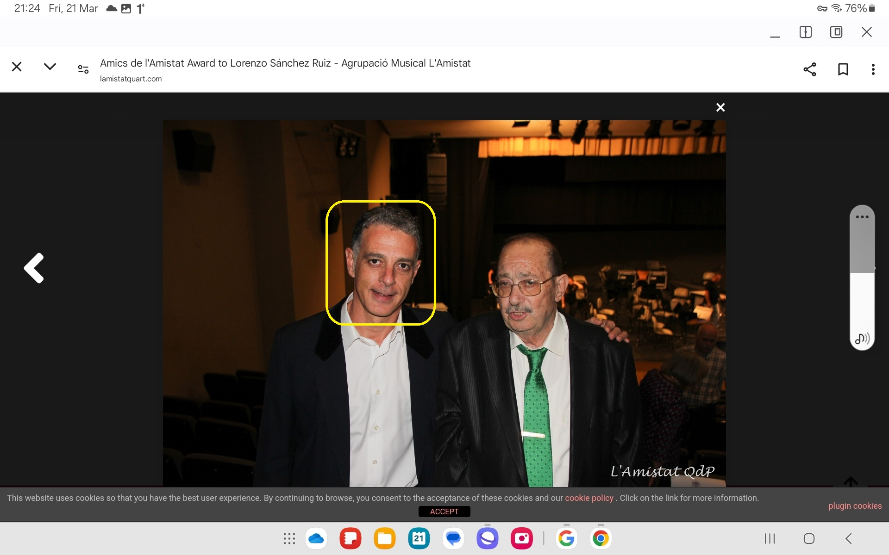

## The boiler breaks down

- The landlady, Bea, tells me she is putting the rent up 8% from December 15th.
- The boiler breaks down, it is leaking. The water has run brown on turning the taps on since the day I moved in.
- I ask Bea to replace the boiler and the oven, which has never worked properly.
- She replaces them.
- Pedro, the caretaker, is amazed that she has spent some money on the flat.

## Hanuman arrives

- I carry [Hindu diety Hanuman](https://en.wikipedia.org/wiki/Hanuman) with me wherever I go, for protection.
- On one walk with the English ladies, I have a leak in my bag and Hanuman pops out onto the ground as I sort out my stuff.
- The ladies laugh at my silliness and one of them asks me who Hanuman is.
- I explain.
- The ladies very much enjoy the story of Hanuman; except, as I am inform them that Hanuman protects women and children from evil men, I notice Patricia is standing a little bit away and looking downward. She doesn't join in the conversation.

<iframe width="857" height="228" src="https://www.youtube.com/embed/xAEbrieJsOU" title="Hanuman Ashtottara Namavalli | 108 Names of Lord Hanuman – Must Listen to Remove Negative Energy" frameborder="0" allow="accelerometer; autoplay; clipboard-write; encrypted-media; gyroscope; picture-in-picture; web-share" referrerpolicy="strict-origin-when-cross-origin" allowfullscreen></iframe>

## Walking in Benijembla with the English ladies

- I was hiking with the English ladies every Saturday at that time.
- One of the last Saturdays in November, the 19th probably, we met at Benijembla, for a walk along the many trails around the village.
- Christine, Patricia (Patricia) Penny, and some of the others were there. This is the same day that I introduce everyone to Hanuman, and the same day that we see some amazing cloud formations and I remark that God did a very good job with clouds.
- On this particular Saturday morning we "bumped" into a small group of Spanish walkers, and Patricia stayed back for a while to talk to them. There were two men and a woman.
- We all noticed Patricia wasn't with us at some point and Christine said she was talking with the Spanish people as she knew them.
- Patricia reappeared at some point and we continued on.
- At the end of the walk we went for coffee in Benijembla.
- Patricia and I were walking together back to the cars and she noticed the same group that she had seen up on the trail sitting at a table in a cafe.
- She told me she wanted to speak to one of them. As we walked towards them, one of the men in the group got up and, as if she didn't know him at all, even though he was the part of the same group we had met earlier, she asked him about something to do with the landscape and paths on a map that she had in her hand.
- It was this man pictured with what looks to be his father.

.

- I wasn't part of the chat between them and I saw a woman sitting on the seat beside where this guy had got up from. I noticed she looked really sad and worried.

!!! note
    - I assumed this woman was the man's wife or girlfriend and I wondered why she looked so unhappy.
    - Curiously, she looked a lot like the [girl in the video](../2023/june.md#youtube) I saw the following June.

- Patricia had her back to me, and she was showing this guy the map and asking questions about it but it was as if, outside of my view, she was pointing to me, because he kept looking up at me and grinning. 
- His look reminded me of a look on one of the grooming gangs faces when I was 16. A man who had looked at me with delight before he raped me. A look of evil.
- You don't forget looks like that.
- The following week the same guy turns up to chamber music class. He is the missing trumpet teacher.

!!! warning
    - I now believe that the look the trumpet teacher gave me was a look of recognition. 
    - He continued to give me that look in the first few classes.
    - I believe now he had seen me before; in pedophile rape porn from 1989. 
    - Of course, they had found the clips on the dark net, maybe even reached out to the perpetrators. They had detailed information from my statement that they were eavesdropping on when I wrote it in 2015.
    - I believe this is what made them obsessed with me and plan the worst; for either monetary gain or because they're very very mentally unwell people, but it's probably mostly the money I expect.
    - I wonder how much in subscription fees a repeat rape-porn clip would earn on the porn networks?
    - I wonder if it's possible to claim such moneys back in litigation? Both from the original perpetrators and then again from the Dénia porn gangs.

## A sexualized 4-year-old at the Chinese bazaar

- One Saturday morning I head to the Chinese bazaar.
- A rough looking man is there with his tiny (I assumed) daughters, aged 4 and 2 probably.
- The 4-year-old is dressed like a cheap prostitute: platform stilettos, glittery mini-dress, garish make up, hair done up. It was horrifying.
- Given I now know they were tracking me via my mobile phone, I'm pretty sure this was another set up for me to see.

## The trumpet teacher

- At the end of November, 28th, all of a sudden, a trumpet teacher is found for the chamber music classes, every Monday, 8-9pm.
- Gloria, the receptionist at the conservatory, leaves a message on my phone earlier in the day to say class is starting. It's a weird message where I hear the word guapo (handsome) and someone says something in the background, Paqui Fornet probably, then they both laugh weirdly.
- I go to class that evening and the same guy who Patricia was talking to in Benijembla is there, in Jaume's room where I had been allowed to practice for my audition.
- He says his name is Vidal.
- In the Generalitat Valenciana systems, his name was/is Vidal Sastre Sanchez Hornero, although I'm told he now can't be found in there. I have believed for some time now that this is a false name, but there was no reason to think so then, other than when I asked him his name, and he answered Vidal, it didn't ring true somehow.
- So I came to class and we met, there was some immediate confusion about him needing the toilet, but he kept looking at his phone, and not really going anywhere, and then he was moving to the door, and he kept saying he was going to the toilet. 
- It was weird and contrived.
- The toilet is just next door to room 6 at the conservatory. 
- I heard him bump into a woman and start talking to her.
- It was weird, they were talking, I was feeling a bit light headed and smiley. 
- I heard someone say my name, Katharine, and so I looked out of the door.
- He was standing over Ana Requena Marín, the violin teacher, talking to her softly.
- It sounds like he's telling her about why he's only just arrived at class at the end of November and missed two months of the year already. I don't understand what his reasons are.

!!! tip "Incidentally"
    - In a future class I actually asked him directly where he had been for September, October, and most of November.
    - He answered in a bizarre and incomprehensible babble of Spanish and Valenciano, which was obviously so that I didn't understand him.

- She was sort of slouching and looking embarrassed and answering him sheepishly. 
- He came back into class and I was feeling light-headed and a little high actually, smiley.
- I thought it was because I fancied him. He was an attractive man.
- Then the other student, Pablo Sesé Savall, a 14 year old boy, came to class. 
- The trumpet teacher kept looking at me with that same grin I'd seen on him in Benijembla. It was disturbing.

### His other classes

- The trumpet teacher had two other classes; one was with the autistic girl, Candela Morales Lucas, 14 or so. She played the flute and a boy (could he be a trans boy?) played the guitar to accompany.
- The other student he had was an adult learner. A doctor from the Dénia hospital, Joan, and his class was just before ours, 7-8pm.
- Incidentally, it was this guy who had been hiking with the trumpet teacher as [just mentioned](#walking-in-benijembla-with-the-english-ladies).
- AFAIK the trumpet teacher had no other classes and he only came to the conservatory on Monday evenings.

### Attendance

- The trumpet teacher skipped many many classes.
- All in all he probably turned up to teach about 50% of the classes we had scheduled.
- He (apparently) had the flu 3 times and numerous other more important things. It was very weird.

### Skills and experience

- He appeared to have never been a teacher before, or was completely lazy and didn't care about what he was doing.
- I took over the classes a little bit.

### Deafness

- He seemed to have a hearing issue and a little bit of a speech impediment arising from this.
- I found this faultiness very endearing.

### Flirting

- He started to flirt with me immediately; in a kind of garish ignorant way which seemed totally phoney to me.
- I liked him and had only positive thoughts about him. It was hard to reconcile what was happening to me at the conservatory with my generous feelings about this person.

## Death of a teacher

- There was an untimely death of a young male teacher around this time. I wonder now if it was suicide.

## Dentist

- At some point, I tried to find a dentist.
- I looked up a dentist in Javea to go to but there was porn all over their website so I decided to contact a dentist in Dénia instead.
- I went to https://www.adentaria.com/.
- I was having some inflammation around my wisdom tooth on the top right side, and it was painful and raw, and I was a bit concerned.
- The dentist came in, masked up and didn't even say hello to me.
- He immediately starts poking my teeth with his poker and saying I needed a whole bunch of fillings.
- It was horrendous. I stopped the whole thing and left.
- I was never able to delete their WhatsApp contact from my phone. It was a weird glitch.
- Now I believe this was all set up by hackers. I was directed to go to this particular dentist, he knew I was coming, and was pretty brutish towards me.
- I now believe the plan was I would meet this dentist again at some point, and he would probably still be masked up.
